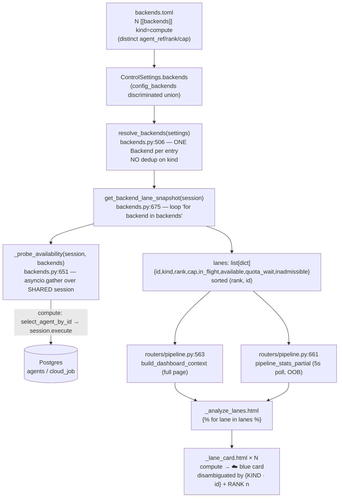

# Phase 74: Docs, Runbook & N-Lane Compute UI Verification - Research

**Researched:** 2026-07-06
**Domain:** Operator documentation + a UI verification/regression test (docs + verify phase; NO new routing/dispatch behavior)
**Confidence:** HIGH (all findings traced against live source, not training data)

## Summary

Phase 74 is the closing MCOMP-07 phase of the 2026.7.2 milestone. It has exactly two deliverables: (1) a new dedicated operator doc for adding a 2nd+ compute agent with mixed arm64/x86 rank/cap cost-tiering, and (2) verification that the Phase-71 BEUI N-lane UI renders each compute agent as its own lane, locked with a regression test, fixing code **only if a gap surfaces**.

Both research questions resolved against live source. **R-2 is confirmed at the happy-path level**: `resolve_backends` yields one `Backend` per registry entry and `get_backend_lane_snapshot` loops them with **no dedup on `kind`**, so N compute backends already produce N lane cards; the template loops `_lane_card.html` verbatim. **However, R-2 surfaces a plausible latent gap** the regression test must probe: `_probe_availability` fans the per-backend `is_available` probes out concurrently over one shared `AsyncSession`, and each `ComputeAgentBackend.is_available` touches that session (`select_agent_by_id → session.execute`). With N≥2 *online* compute backends this can violate SQLAlchemy's no-concurrent-session-ops rule and spuriously mark a compute lane offline. The service docstring still asserts the retired "≤1 compute" invariant. The regression test must exercise the **real** probe fan-out (not the monkeypatched shim the existing tests use) to catch this.

**R-1 is confirmed deployable but NOT a free env swap.** The standard x86 image carries essentia + ffmpeg + fpcalc and runs a media-less `kind=compute` agent at full parity with the arm64 agent. But `docker-compose.cloud-agent.yml` hardcodes **two** arm64-specific things — the `-arm64` image suffix and the `python3 -m saq` command (x86 needs `uv run saq`) — and a guard test asserts both against the raw YAML. D-05's "parametrize the tag swap" is therefore a real compose + guard-test edit, not documentation alone.

**Primary recommendation:** Write the new doc (`docs/multi-compute.md`); parametrize `docker-compose.cloud-agent.yml` image + command with arm64 defaults and update its guard test to assert the default renders arm64 while tolerating the override; add an N≥2-compute regression test to `tests/shared/services/test_lane_snapshot.py` using the **real** `_probe_availability` fan-out; if that test exposes the session-concurrency race, serialize the compute probes.

<user_constraints>
## User Constraints (from CONTEXT.md)

### Locked Decisions

- **D-01:** The "add a 2nd+ compute agent" recipe lives in a **new dedicated doc** (e.g. `docs/multi-compute.md`), not folded into `cloud-burst.md` or `runbook.md`. `cloud-burst.md` stays the single-A1-agent provisioning walkthrough; the new doc is the "now do it N times, cost-tiered" operator guide. Cross-link from `cloud-burst.md`, `runbook.md`, `configuration.md § Backend registry`, and the docs index/README.
- **D-02:** Document a **real x86 compute agent as a deployable tier** — not illustrative, not the Kueue path. The worked example declares **two `compute` backends**: free arm64 (A1) at a **low rank** (preferred) and paid x86 at a **higher rank** (spill target), each with its own `agent_ref`, `scratch_dir`, and `cap`. Show the resulting rank-tiered drain (free arm64 fills first, spills to paid x86, then local rank 99 as final catch).
- **D-03:** Include a **worked `backends.toml`** for the mixed arm64/x86 registry plus a short **cost-tier rationale table**. Keep the canonical field reference in `configuration.md`; the new doc shows the *scenario*, not a re-stated field table.
- **D-04:** **Verify + add a regression test.** Confirm `get_backend_lane_snapshot` already emits one lane per `compute` backend, then add a test asserting **each of N compute backends renders its own lane card** — parity with the Phase 70 MKUE test discipline and the ≥90% per-module coverage floor. Change UI/service code **only if verification surfaces an actual gap**.
- **D-05:** **Parametrize the existing `docker-compose.cloud-agent.yml`** — document running it **once per compute agent** with distinct `PHAZE_AGENT_ID` / `PHAZE_AGENT_QUEUE` (`phaze-agent-<id>`) / scratch volume / SSH host / compose project-name per agent. **No new compose file.** The arm64 agent pulls the `-arm64` tag; a real x86 agent must pull the **standard x86 tag** — the parametrization must cover the tag swap, not just env (see R-1).

### Claude's Discretion

- Exact new-doc filename/slug, section order, and mermaid diagram choices — follow existing docs style (`generated-by: gsd-doc-writer` header, mermaid over ASCII, rank/cap read-outs consistent with `runbook.md`).
- Precise wording of the cost-tier rationale table.
- Where the regression test file lives (candidate: `tests/analyze/services/test_backends.py` — **corrected by research: the real home is `tests/shared/services/test_lane_snapshot.py`**, see Architecture Patterns).

### Deferred Ideas (OUT OF SCOPE)

- **Milestone close + release** — `/gsd:complete-milestone 2026.7.2` + the CalVer release tag are a **separate step after this phase's PR merges**, not part of Phase 74.
- **PROV-02 (capability-aware routing)** and **PROV-03 (on-demand provisioning)** — explicitly v2-deferred at milestone scoping.
- Any change to dispatch/routing/reconcile behavior (delivered in 72/73).
</user_constraints>

<phase_requirements>
## Phase Requirements

| ID | Description | Research Support |
|----|-------------|------------------|
| MCOMP-07 | The operator runbook + config docs cover **adding a 2nd+ compute agent** and the mixed arm64/x86 rank/cap cost-tiering; each compute agent renders as its own lane in the N-lane UI (verify the Phase-71 BEUI generalization already covers compute lanes; fix if a gap surfaces). | New `docs/multi-compute.md` (D-01/02/03), the parametrized compose (D-05, R-1), the N≥2-compute lane regression test (D-04, R-2), and the docs-drift traceability bookkeeping. |

**Traceability state (from `.planning/REQUIREMENTS.md`):** MCOMP-07 is `- [ ]` / Traceability Status `Pending`, mapped to Phase 74. It flips to `[x]` / `Complete` **only at phase closeout** (after `74-VERIFICATION.md` reports `status: passed`). The `just docs-drift` guard (`tests/shared/core/test_requirements_traceability.py`) tolerates the in-flight `[ ]`+Pending state during execution (D-05 in-flight tolerance) and only *requires* the flip once the phase passes. See Common Pitfalls → Pitfall 4.
</phase_requirements>

## Architectural Responsibility Map

| Capability | Primary Tier | Secondary Tier | Rationale |
|------------|-------------|----------------|-----------|
| Operator "add 2nd+ compute agent" recipe | Docs (`docs/multi-compute.md`) | — | Pure documentation; consumed by a human operator, no runtime component. |
| Worked mixed arm64/x86 `backends.toml` + cost-tier table | Docs | Control config (`config_backends.py` schema) | Doc shows the scenario; the canonical field table stays in `configuration.md`. |
| Per-compute-agent compose (image tag + command swap) | Deployment artifact (`docker-compose.cloud-agent.yml`) | Test guard (`tests/agents/deployment/test_cloud_agent_compose.py`) | The x86 tag/command swap is a compose file + guard-test edit, not docs-only (R-1). |
| N-lane compute UI rendering | Frontend server (Jinja `_analyze_lanes.html` → `_lane_card.html`) | Control service (`get_backend_lane_snapshot`) | Registry-derived lanes already loop one card per backend; verification target only. |
| Per-backend availability probe | Control service (`services/backends._probe_availability`) | DB (`select_agent_by_id`) | The concurrency seam N-compute exercises; the regression-test's real gap surface (R-2). |
| MCOMP-07 traceability bookkeeping | Docs (`.planning/REQUIREMENTS.md` + `ROADMAP.md`) | Test guard (`test_requirements_traceability.py`) | Flip checkbox+table at closeout; keep the docs-drift gate green. |

## Standard Stack

**No new dependencies.** The 2026.7.2 milestone is explicitly *zero-new-deps* (parity refactor + docs). This phase adds documentation, one compose parametrization, and one-to-few regression tests over existing machinery. `[VERIFIED: ROADMAP.md §2026.7.2 "zero new dependencies"]`

### Existing tools this phase uses

| Tool | Version | Purpose | Source |
|------|---------|---------|--------|
| pytest | (installed) | The lane regression test + compose guard test | `[VERIFIED: justfile docs-drift/test targets]` |
| PyYAML (`yaml.safe_load`) | (installed) | Compose guard test parses raw YAML | `[VERIFIED: tests/agents/deployment/test_cloud_agent_compose.py]` |
| uv | (project constraint) | `uv run pytest`, `uv run ruff`, `uv run mypy` | `[CITED: CLAUDE.md]` |
| mermaid | (docs convention) | Diagrams in the new doc | `[VERIFIED: docs/*.md use mermaid]` |

## Package Legitimacy Audit

**Not applicable — this phase installs no external packages** (zero-new-deps milestone; docs + tests + a compose edit over existing code). No registry lookups, no `slopcheck` run required.

## Architecture Patterns

### System Architecture Diagram — N-lane compute UI render path (R-2 verification target)



**The chain has no kind-collapse anywhere:** `resolve_backends` (backends.py:520) appends one impl per entry; `get_backend_lane_snapshot` (backends.py:699) iterates `for backend in backends`; `_analyze_lanes.html` iterates ``. N compute backends → N `☁️` cards, each titled `COMPUTE · <id>` with a `RANK {n}` caption. `[VERIFIED: src/phaze/services/backends.py:506-529,675-719; src/phaze/templates/pipeline/partials/_analyze_lanes.html; _lane_card.html]`

### Pattern 1: The lane-snapshot regression test (D-04)

**What:** Assert an N≥2-compute registry yields one lane card per compute backend.
**Where:** `tests/shared/services/test_lane_snapshot.py` — **NOT** the CONTEXT candidate `tests/analyze/services/test_backends.py` (which does not exist). This file already owns all `get_backend_lane_snapshot` coverage. `[VERIFIED: grep -rln get_backend_lane_snapshot tests/]`

**How the existing tests are structured** (`test_snapshot_shape_and_rank_order`, line 268): they build real `LocalBackend`/`ComputeAgentBackend`/`KueueBackend` instances, `monkeypatch.setattr(backends_mod, "resolve_backends", lambda _s: [...])`, seed `CloudJob` rows via the `session` fixture, and assert the composed lane dicts. Crucially they **monkeypatch `_probe_availability`** with a `_fake_probe` shim, so the current suite never exercises the real concurrent probe fan-out over the shared session.

```python
# Source: pattern mirrors tests/shared/services/test_lane_snapshot.py:268 (test_snapshot_shape_and_rank_order)
# Two compute backends + one local; assert each compute renders its OWN lane (D-04).
@pytest.mark.asyncio
async def test_snapshot_renders_one_lane_per_compute_backend(session, monkeypatch):
    arm64 = ComputeAgentBackend(id="a1-arm64", rank=10, cap=2)
    x86 = ComputeAgentBackend(id="x86-spill", rank=20, cap=1)
    local = LocalBackend(id="local", rank=99, cap=1)
    monkeypatch.setattr(backends_mod, "resolve_backends", lambda _s: [arm64, x86, local])
    # NOTE: do NOT monkeypatch _probe_availability here — see Pitfall 1. Exercise the REAL fan-out.
    lanes = await get_backend_lane_snapshot(session)
    compute_lanes = [ln for ln in lanes if ln["kind"] == "compute"]
    assert [ln["id"] for ln in compute_lanes] == ["a1-arm64", "x86-spill"]  # each its own lane, rank order
    assert len(compute_lanes) == 2  # no dedup/collapse on kind
```

**Two-variant recommendation:** keep one variant that monkeypatches `_probe_availability` (deterministic snapshot shape, mirrors existing tests) AND one variant that exercises the real fan-out with both compute agents registered ONLINE in the DB (catches the R-2 concurrency race). The real-fan-out variant needs two `Agent` rows (`kind="compute"`, fresh `last_seen_at`) whose ids match the two `agent_ref`s so `select_agent_by_id` returns online — check `tests/` for an existing compute-agent fixture before hand-rolling one.

### Pattern 2: Parametrize the compose with arm64 defaults (D-05, R-1)

**What:** Make `docker-compose.cloud-agent.yml` serve BOTH the arm64 A1 agent and a real x86 spill agent from one file, defaulting to arm64.

```yaml
# Source: proposed generalization of docker-compose.cloud-agent.yml:45,51
services:
  worker:
    # arm64 default; x86 operator sets PHAZE_CLOUD_AGENT_TAG=2026.7.2 (standard tag, NO -arm64 suffix)
    image: ghcr.io/simplicityguy/phaze:${PHAZE_CLOUD_AGENT_TAG:-latest-arm64}
    # arm64 default (py3.13/--system); x86 operator sets PHAZE_CLOUD_AGENT_CMD="uv run saq phaze.tasks.agent_worker.settings"
    command: ${PHAZE_CLOUD_AGENT_CMD:-python3 -m saq phaze.tasks.agent_worker.settings}
```

The guard test parses the **raw** (un-interpolated) YAML, so it must be updated to accept the `${VAR:-default}` form and assert the *default* still renders arm64 (`latest-arm64` / `python3 -m saq`). See Don't Hand-Roll + Pitfall 2.

### Anti-Patterns to Avoid

- **Adding a new `docker-compose.cloud-agent-x86.yml`:** violates D-05 ("No new compose file"). Parametrize the existing file.
- **Copying `uv run saq …` into the arm64 default:** the arm64 image is Python 3.13 with `--system` installs; `uv run` re-validates `requires-python >=3.14` and the container fails to boot. This is guarded and documented. `[VERIFIED: docs/arm64-agent-image.md L44-54; test_cloud_agent_compose.py:121]`
- **Restating the `[[backends]]` field table in the new doc:** D-03 says link to `configuration.md § Backend registry` (`#backend-registry-backendstoml`), show only the *scenario*.
- **Folding the recipe into `cloud-burst.md`/`runbook.md`:** D-01 requires a dedicated doc.
- **Monkeypatching `_probe_availability` in the compute-parity regression test:** it hides the exact concurrency seam the test exists to prove (Pitfall 1).

## Don't Hand-Roll

| Problem | Don't Build | Use Instead | Why |
|---------|-------------|-------------|-----|
| Prove N compute lanes render | A new headless-browser/UI harness | Extend `tests/shared/services/test_lane_snapshot.py` with a service-level assertion | The lanes list is server-rendered; a service test on `get_backend_lane_snapshot` + a template-loop assertion is the established Phase-71 discipline. |
| Compose x86/arm64 selection | Duplicate compose files / `sed` scripting | Docker Compose `${VAR:-default}` substitution on `image:` + `command:` | Compose has first-class variable substitution; one file, arm64 default, x86 override. |
| Canonical `backends.toml` field docs | Re-author the schema table | Link to `configuration.md § Backend registry` | Single source of truth (D-03); the new doc is scenario-only. |
| MCOMP-07 traceability check | A bespoke doc-sync script | The existing `just docs-drift` guard | Phase 66 already ships `test_requirements_traceability.py`; just keep checkbox↔table↔ROADMAP in agreement. |
| Compute agent id/queue wiring | New identity plumbing | Existing `PHAZE_AGENT_QUEUE=phaze-agent-<id>` + `PHAZE_AGENT_KIND=compute` | Per-agent queue naming already established; agent asserts `identity.agent_id` == `PHAZE_AGENT_QUEUE`. |

**Key insight:** This phase is documentation over already-shipped 72/73 machinery. The only genuine *code* deltas are (a) the compose+guard-test parametrization (mandated by D-05) and (b) — *conditionally* — a `_probe_availability` fix if the regression test exposes the session race. Everything else is prose, a mermaid diagram, and a table.

## Runtime State Inventory

> This is primarily a docs phase, but D-05 edits a deployment artifact and D-04 may edit a probe. Categories assessed for completeness:

| Category | Items Found | Action Required |
|----------|-------------|------------------|
| Stored data | None — no schema/migration/data changes. `cloud_job`/`agent` tables untouched. | None (verified: no migration in scope; 72/73 shipped all schema). |
| Live service config | The **operator's real x86 host** must run the parametrized compose with `PHAZE_CLOUD_AGENT_TAG` (standard tag) + `PHAZE_CLOUD_AGENT_CMD="uv run saq …"` + distinct `PHAZE_AGENT_QUEUE`. This is deployment-time operator action the new doc documents — not a repo edit. | Document in `docs/multi-compute.md` (D-05). No live config change lands in this PR. |
| OS-registered state | None — no OS services/cron/scheduler registrations. | None. |
| Secrets/env vars | New **doc-referenced** env vars: `PHAZE_CLOUD_AGENT_TAG`, `PHAZE_CLOUD_AGENT_CMD` (compose substitution, defaults preserve arm64). Existing `*_FILE` secret machinery unchanged. No secret values in the compose. | Add the two vars to the compose + document them; no secret rotation. |
| Build artifacts | None — no package rename/reinstall. The x86 image already exists (the standard `ghcr.io/simplicityguy/phaze:<tag>` api/agent image). | None (verified: R-1 confirms the x86 image is prebuilt with essentia+ffmpeg+fpcalc). |

## Common Pitfalls

### Pitfall 1: The N-compute lane regression test passes while a real N-compute deployment shows a lane offline
**What goes wrong:** A regression test that monkeypatches `_probe_availability` (as every existing lane-snapshot test does) will report all N compute lanes present, even if the *real* concurrent probe fan-out would spuriously mark one offline.
**Why it happens:** `_probe_availability` (backends.py:651) runs `asyncio.gather(*(_probe_one(session, b) for b in backends))`. `ComputeAgentBackend.is_available` (backends.py:295) calls `select_agent_by_id(session, ...)` which does `await session.execute(stmt)` (enqueue_router.py:155). With N≥2 *online* compute backends, N `session.execute` calls race on **one** `AsyncSession` — SQLAlchemy forbids concurrent operations on a session and raises; `_probe_one` catches it and degrades **that** lane to `available=False`. The service docstring (backends.py:656-657) still claims *"the D-05 invariant caps compute at ≤1, so at most ONE probe ever uses the session concurrently"* — that invariant was **retired by Phase 72** (MCOMP-01). Local probes are short-circuited (no I/O) and Kueue probes use kr8s (no session), so this race is *specific to N≥2 compute backends* — the exact new scenario this phase certifies. `[VERIFIED: backends.py:651-661,295-308,656-657; enqueue_router.py:131-155]`
**How to avoid:** The regression test's real-fan-out variant must register **two** online compute agents in the DB and assert **both** compute lanes come back `available=True`. If they don't, the fix (in scope per D-04 "fix if a gap surfaces") is to stop gathering the session-touching probes concurrently: run local+kueue probes concurrently but **sequence** the compute (`select_agent_by_id`) probes, or give each compute probe its own short-lived session. Also update the stale docstring.
**Warning signs:** A compute lane flickers `opacity-60` "offline" on the 5s poll despite a healthy agent; intermittent because it's timing-dependent. Note the existing `_PoisonRecoverSession` test + the post-fan-out `await session.rollback()` (backends.py:697) only handle a *single* poisoning probe — they do NOT address two probes racing *before* the rollback.
**Confidence:** MEDIUM — the code path is verified; whether the race deterministically manifests depends on asyncpg/SQLAlchemy await interleaving. The real-session test is the arbiter. Report honestly to the planner as a *verify-then-fix*, not a certain bug.

### Pitfall 2: Parametrizing the compose breaks the guard test
**What goes wrong:** Adding `${VAR:-default}` to `image:`/`command:` makes `tests/agents/deployment/test_cloud_agent_compose.py` fail. It parses the **raw** YAML (`yaml.safe_load`, no interpolation) and asserts `image.startswith("ghcr.io/simplicityguy/phaze:")` (line 116), `image.endswith("-arm64")` (line 118) and `command.split()[:3] == ["python3","-m","saq"]` (line 144).
**Why it happens:** The raw parametrized string is `${PHAZE_CLOUD_AGENT_IMAGE:-ghcr.io/…:${PHAZE_IMAGE_TAG:-latest}-arm64}` — it **starts** with `${PHAZE_CLOUD_AGENT_IMAGE:-` (not `ghcr.io/…`) and **ends** with `}` (not `-arm64`); and the raw command's first token is `${PHAZE_CLOUD_AGENT_CMD:-python3`, not `python3`.
**How to avoid:** Update the guard-test assertions to recognize the `${VAR:-default}` form and assert the **default** still renders arm64: relax the `startswith` prefix check to a substring check (`"ghcr.io/simplicityguy/phaze:" in image`), relax `endswith("-arm64")` to a default-marker check (`"-arm64}" in image` / `"latest-arm64" in image`), and relax the command `tokens[:3]` check to recognize the `${PHAZE_CLOUD_AGENT_CMD:-python3 -m saq …}` default. This test edit is *in scope* — D-05 mandates the parametrization. `[VERIFIED: tests/agents/deployment/test_cloud_agent_compose.py:106-147]`
**Warning signs:** `just test-bucket agents` (or the deployment test file) red after the compose edit.

### Pitfall 3: Two compute agents co-located collide on scratch volume + compose project
**What goes wrong:** Running the same compose file twice on one host reuses the `cloud_scratch` named volume and the default compose project name → the second agent shares/steals the first's scratch.
**Why it happens:** `cloud_scratch` is a top-level named volume (docker-compose.cloud-agent.yml:63-64); the project name defaults to the directory.
**How to avoid:** The new doc must tell the operator to give each co-located agent a distinct `-p <project>` (compose project name) and distinct `PHAZE_AGENT_QUEUE`/`PHAZE_CLOUD_SCRATCH_DIR`. In the *documented* cost-tier scenario the arm64 and x86 agents live on **different hosts** (A1 vs a paid x86 box), so host isolation makes this a non-issue for the worked example — but call it out for the co-located case. `[VERIFIED: docker-compose.cloud-agent.yml:57-64; agent_worker.py:37,163-172]`

### Pitfall 4: MCOMP-07 left half-marked trips docs-drift at closeout
**What goes wrong:** At phase closeout, marking the ROADMAP `[x]` + `VERIFICATION status: passed` but forgetting to flip MCOMP-07's checkbox `[x]` AND its Traceability Status to `Complete` (or flipping only one) fails `test_requirements_traceability.py`.
**Why it happens:** The guard requires, for a *passed* phase, that every mapped requirement has checkbox `[x]` AND table `Complete`, and that the two encodings agree (D-01/D-02/D-03). Phase 66 caught exactly this class of stale checkbox on its first run. `[VERIFIED: tests/shared/core/test_requirements_traceability.py:181-281; MEMORY project_2026_7_0]`
**How to avoid:** As part of closeout (not the implementation plans), flip `.planning/REQUIREMENTS.md` MCOMP-07 checkbox `- [ ]`→`- [x]` and its Traceability row `Pending`→`Complete`, and ROADMAP Phase 74 `- [ ]`→`- [x]`. Run `just docs-drift` before merge. During execution the in-flight `[ ]`+Pending state is *tolerated* (test skips/passes), so this only bites at the end.

## Code Examples

### Confirming N-compute lanes at the service layer
```python
# Source: src/phaze/services/backends.py:699-711 (get_backend_lane_snapshot loop body)
lanes: list[dict[str, Any]] = []
for backend in backends:                      # one dict per registry backend — NO kind dedup
    lanes.append({
        "id": backend.id,
        "kind": _kind_of(backend),            # "compute" for every ComputeAgentBackend
        "rank": backend.rank,
        "cap": backend.cap,
        "in_flight": await backend.in_flight_count(session),
        "available": availability.get(backend.id, False),
        **admission.get(backend.id, _ZERO_ADMISSION),
    })
lanes.sort(key=lambda lane: (lane["rank"], lane["id"]))   # rank-ascending, id tie-break
```

### The worked mixed arm64/x86 registry (D-02/D-03) — schema-verified shape
```toml
# Source: field names verified against src/phaze/config_backends.py:79-115 (ComputeBackend)
# Free arm64 A1 — preferred (low rank)
[[backends]]
kind        = "compute"
id          = "a1-arm64"
rank        = 10          # lower = dispatched first
cap         = 2           # 2 OCPU / 12 GB Ampere A1
agent_ref   = "a1-arm64"  # REQUIRED — must name a distinct registered compute Agent.id (dup agent_ref fails at boot, config.py:437-450)
push_host   = "a1-arm64"  # REQUIRED — rsync/ssh destination host (Phase 73 D-01)
scratch_dir = "/var/lib/phaze/scratch"  # REQUIRED — ephemeral push landing dir
ssh_user    = "phaze"     # optional

# Paid x86 — spill target (higher rank)
[[backends]]
kind        = "compute"
id          = "x86-spill"
rank        = 20          # only fills after a1-arm64 is at cap or offline
cap         = 4
agent_ref   = "x86-spill" # distinct agent_ref (NOT the same as a1-arm64)
push_host   = "x86-spill"
scratch_dir = "/var/lib/phaze/scratch"
ssh_user    = "phaze"

# Local — final catch
[[backends]]
kind = "local"
id   = "local"
rank = 99
cap  = 1
```
`[VERIFIED: src/phaze/config_backends.py:79-115 — required fields agent_ref/push_host/scratch_dir; optional ssh_user; rank ge=0 lt=1000; cap gt=0 lt=1000]`
`[VERIFIED: src/phaze/config.py:437-450 — duplicate compute agent_ref fails fast at boot]`

## State of the Art

| Old Approach | Current Approach | When Changed | Impact |
|--------------|------------------|--------------|--------|
| `select_active_agent(kind="compute")` "the single active compute agent" | Per-entry `agent_ref` → `select_agent_by_id` binding | Phase 72 (MCOMP-01) | Each compute backend gates on ITS bound agent; N compute backends legal. |
| `≤1-compute` fail-fasts (`active_compute_scratch_dir`, `resolved_non_local_kind` `>1`-compute raise) | Retired/generalized for `local + N-Kueue + N-compute` | Phase 72 | The lane-snapshot docstring's "caps compute at ≤1" claim is now STALE (Pitfall 1). |
| Single global compute scratch/push destination | Per-agent `push_host`/`scratch_dir`/`ssh_user` on each `ComputeBackend` | Phase 73 (MCOMP-03, D-01) | The worked `backends.toml` carries per-agent destinations. |
| Fixed 3-lane UI (local/A1/k8s) | Registry-derived N-lane grid (`get_backend_lane_snapshot`) | Phase 71 (BEUI-01) | N compute backends already render N cards; this phase certifies it. |

**Deprecated/outdated:**
- `docs/configuration.md`'s `cloud_target`/flat `s3_*`/`kube_*` rows are *removed* (Phase 67, no shim) — retained only as historical field reference. Don't reference them as live in the new doc.
- The `_probe_availability` docstring's "≤1 compute" claim (backends.py:656-657) — outdated post-Phase-72; update it when touching the file.

## Assumptions Log

| # | Claim | Section | Risk if Wrong |
|---|-------|---------|---------------|
| A1 | The concurrent `_probe_availability` fan-out over one shared session *deterministically* races with N≥2 online compute backends. | Pitfall 1 / R-2 | LOW–MEDIUM: if it does NOT race (e.g. asyncpg serializes cleanly or the gather awaits don't interleave at the execute), then no code fix is needed and D-04 stays verification-only. The real-session test settles it — that's why the test is prescribed, not the fix. |
| A2 | Docker Compose `command: ${VAR:-default}` substitution works for the exec/shell command form as written. | Pattern 2 / R-1 | LOW: compose variable substitution in `command:` is standard; if the shell-form split matters, use the list form with substitution or verify with `docker compose config`. Plan should verify with `docker compose config` on the parametrized file. |
| A3 | The standard x86 `ghcr.io/simplicityguy/phaze:<tag>` image (the api/agent image) is what an x86 compute agent runs — there is no separate x86 *compute* image to build. | R-1 | LOW: verified the x86 Dockerfile installs essentia+ffmpeg+fpcalc+libsndfile and agent_worker runs the same module for any kind. No new image build in scope. |

## Open Questions (RESOLVED)

1. **Does the N≥2-compute probe race actually manifest at runtime?** — RESOLVED: settled at execution time by the 74-03 plan's Variant B (real-fan-out, two-online-compute-agents arbiter); the conditional serialize-the-compute-probes fix lands in 74-04 only if Variant B fails (74-04 `depends_on: 74-03`), exactly D-04's "fix if a gap surfaces."
   - What we know: the code path (concurrent `session.execute` over one `AsyncSession`) is verified; SQLAlchemy forbids concurrent session ops.
   - What's unclear: whether the `asyncio.gather` awaits interleave at the execute point often enough to trip it, and whether asyncpg surfaces it as a caught exception (lane offline) vs. something benign.
   - Recommendation: the D-04 regression test includes a **real-fan-out, two-online-compute-agents** variant. Treat a fix as conditional on that test failing (exactly D-04's "fix if a gap surfaces"). If it fails, serialize the compute probes; if it passes, the phase stays verification-only and only the stale docstring needs a comment fix.

2. **Is there an existing test fixture that registers an online compute `Agent`?** — RESOLVED: yes — `tests/analyze/services/test_backends.py:70` `_compute(...)` factory (binds a real `ComputeBackend` config whose `agent_ref` resolves against `Agent.id`) combined with `tests/_queue_fakes.py:331` `seed_active_agent(session, <id>, kind="compute")` (commits a non-revoked, fresh-`last_seen_at` compute agent). The real-fan-out variant seeds two such agents whose ids match the two backends' `agent_ref`s.
   - What we know: `test_lane_snapshot.py` uses a `session` fixture and seeds `CloudJob`/`FileRecord` directly; it does not currently seed `Agent` rows (it monkeypatches `_probe_availability` instead).
   - Recommendation: grep `tests/` (e.g. `tests/agents/` or a conftest) for a compute-`Agent` factory before hand-rolling one; `select_agent_by_id(session, id, kind="compute")` needs a non-revoked, fresh-`last_seen_at` agent row to return online.

## Environment Availability

| Dependency | Required By | Available | Version | Fallback |
|------------|------------|-----------|---------|----------|
| uv | all `uv run` commands | ✓ (project constraint) | — | none (mandatory per CLAUDE.md) |
| pytest | regression + guard tests | ✓ | installed | none |
| docker compose | verifying `docker compose config` on the parametrized file (optional local check) | likely (colima on dev host) | — | Skip local `config` check; rely on the YAML guard test |
| x86 host + paid compute agent | LIVE deployment of the worked example | ✗ (deployment-gated) | — | Documented recipe only; live E2E is a rollout-time operator action, not a phase gate (mirrors prior cloud phases' deployment-gated UATs) |

**Missing dependencies with no fallback:** none block the phase — all deliverables (docs, compose edit, tests) are verifiable in-repo without a live x86 agent.

## Validation Architecture

### Test Framework
| Property | Value |
|----------|-------|
| Framework | pytest (+ pytest-asyncio) |
| Config file | `pyproject.toml` (project convention) |
| Quick run command | `uv run pytest tests/shared/services/test_lane_snapshot.py -x` |
| Full suite command | `uv run pytest` (or bucketed: `just test-bucket shared`, `just test-bucket agents`) |

### Phase Requirements → Test Map
| Req ID | Behavior | Test Type | Automated Command | File Exists? |
|--------|----------|-----------|-------------------|-------------|
| MCOMP-07 | Each of N compute backends renders its own lane card (no kind dedup) | unit (service) | `uv run pytest tests/shared/services/test_lane_snapshot.py -k one_lane_per_compute -x` | ❌ Wave 0 (add test) |
| MCOMP-07 | Real probe fan-out keeps both online compute lanes available (race guard) | unit (service, real session) | `uv run pytest tests/shared/services/test_lane_snapshot.py -k compute_probe_real -x` | ❌ Wave 0 (add test) |
| MCOMP-07 | Parametrized compose still defaults to arm64 (image + command) | structural (YAML) | `uv run pytest tests/agents/deployment/test_cloud_agent_compose.py -x` | ✅ exists — update assertions (D-05) |
| MCOMP-07 | Docs-drift traceability green (checkbox↔table↔ROADMAP) | structural | `just docs-drift` | ✅ `test_requirements_traceability.py` |
| MCOMP-07 | New doc exists + cross-linked; docs IA current | structural | `uv run pytest -k docs_ia` (if `test_docs_ia_current.py` gates the README index) | ✅ likely — verify the docs-IA guard covers the new file |

### Sampling Rate
- **Per task commit:** `uv run pytest tests/shared/services/test_lane_snapshot.py -x`
- **Per wave merge:** `just test-bucket shared && just test-bucket agents`
- **Phase gate:** full suite green + `just docs-drift` green before `/gsd:verify-work`; ≥90% per-module coverage floor on `services/backends.py` if it is edited (D-04 fix path).

### Wave 0 Gaps
- [ ] Add compute-parity test(s) to `tests/shared/services/test_lane_snapshot.py` — covers MCOMP-07 lane rendering + the real-probe race.
- [ ] Confirm/locate an online-compute-`Agent` fixture for the real-fan-out variant (Open Question 2).
- [ ] Update `tests/agents/deployment/test_cloud_agent_compose.py` assertions for the `${VAR:-default}` compose form (D-05).
- [ ] Verify the docs-IA guard (`test_docs_ia_current.py`, if present) includes the new `docs/multi-compute.md` in the README index expectation.

*(No new framework install needed — pytest + pytest-asyncio already present.)*

## Security Domain

> `security_enforcement` default (enabled). This phase adds **no new attack surface** — docs, one compose parametrization, and tests. The relevant controls are pre-existing invariants the phase must not regress.

### Applicable ASVS Categories

| ASVS Category | Applies | Standard Control |
|---------------|---------|-----------------|
| V2 Authentication | no | No new auth paths (agent bearer auth unchanged from v4.0). |
| V5 Input Validation | yes (light) | The worked `backends.toml` must validate through the existing pydantic discriminated union (`config_backends.py`); rank/cap bounds + required `agent_ref`/`push_host`/`scratch_dir` enforced at boot. Documented values only — no runtime input. |
| V6 Cryptography | no | No crypto; `*_FILE` secret pointers unchanged. |
| V7 Error Handling & Logging | yes | Lane snapshot logs only `{id,kind,rank,cap}`-level fields — the doc/examples must NOT print `SecretStr`/tokens/SSH keys. `[VERIFIED: backends.py module docstring L34-36 secret-hygiene rule]` |
| V9 Data Protection | yes | The new doc must keep the "no plaintext secrets in compose" convention (D-06 of Phase 51) — reference `*_FILE` env, never inline creds. `[VERIFIED: docker-compose.cloud-agent.yml:39-41]` |

### Known Threat Patterns for docs + compose

| Pattern | STRIDE | Standard Mitigation |
|---------|--------|---------------------|
| Operator pastes a real SSH key / token into the doc's worked compose | Information Disclosure | Show `*_FILE` secret-pointer pattern only; the compose guard test already forbids `DATABASE_URL`/`POSTGRES_*` on the worker. |
| A doc example that reads `PHAZE_CLOUD_AGENT_CMD` as a shell-injected string | Tampering | It's a compose `command:` default, operator-controlled at their own host; no external input path. No mitigation beyond documenting the exact two accepted values. |
| Compute agent reaches the app ORM directly | Elevation | Unchanged invariant: compute agent reaches Postgres only via `PHAZE_QUEUE_URL` (saq_jobs) + HTTP API; guard test enforces no `DATABASE_URL`. |

## Sources

### Primary (HIGH confidence)
- `src/phaze/services/backends.py` — `resolve_backends` (506), `get_backend_lane_snapshot` (675), `_probe_availability`/`_probe_one` (651/632), `ComputeAgentBackend.is_available` (295), stale ≤1-compute docstring (656-657).
- `src/phaze/services/enqueue_router.py` — `select_agent_by_id` (131) does `session.execute` (155).
- `src/phaze/routers/pipeline.py` — lane seeding at :563 (full page) and :661 (5s poll).
- `src/phaze/templates/pipeline/partials/_analyze_lanes.html` + `_lane_card.html` — the verbatim N-lane loop, compute=☁️/blue disambiguated by `{KIND · id}` + `RANK n`.
- `src/phaze/config_backends.py` — `ComputeBackend` required fields (79-115).
- `src/phaze/config.py` — duplicate compute `agent_ref` fail-fast (437-450); compute relaxes scan_roots (885-886).
- `src/phaze/tasks/agent_worker.py` — same module for all kinds; `PHAZE_AGENT_QUEUE` (37,163-172); compute-only scratch janitor (99-103).
- `Dockerfile` (x86) — installs `libatomic1 ffmpeg libsndfile1 libchromaprint-tools libpq5` (59); Python 3.14 base.
- `docker-compose.cloud-agent.yml` — hardcoded `-arm64` suffix (45) + `python3 -m saq` command (51).
- `docs/arm64-agent-image.md` — arm64=py3.13/`--system`/`python3`, x86=uv/3.14/.venv; no multi-arch manifest.
- `tests/agents/deployment/test_cloud_agent_compose.py` — raw-YAML guard asserting `-arm64` (118) + `python3 -m saq` (144).
- `tests/shared/services/test_lane_snapshot.py` — the real regression-test home + existing structure.
- `tests/shared/core/test_requirements_traceability.py` — the `just docs-drift` guard mechanics.
- `.planning/REQUIREMENTS.md` (MCOMP-07 Pending), `.planning/ROADMAP.md` (§2026.7.2, zero-new-deps).

### Secondary (MEDIUM confidence)
- `docs/configuration.md § Backend registry` — cross-link target + removed-flat-knob history.
- `docs/cloud-burst.md`, `docs/runbook.md`, `docs/README.md` — `generated-by: gsd-doc-writer` header + cross-link surfaces.

### Tertiary (LOW confidence)
- Whether the probe race deterministically manifests (Assumptions A1) — settled by the prescribed real-session test, not by static reading.

## Metadata

**Confidence breakdown:**
- Standard stack (no new deps): HIGH — verified against ROADMAP + justfile + CLAUDE.md.
- R-2 happy-path (N compute → N lanes): HIGH — traced resolve→snapshot→template with no dedup.
- R-2 probe-race gap: MEDIUM — code path verified; manifestation is timing-dependent, resolved by the prescribed test.
- R-1 x86 deployability: HIGH — x86 image has essentia/ffmpeg/fpcalc; agent_worker kind-agnostic; compose+guard-test blockers precisely located.
- Docs structure/cross-links + docs-drift bookkeeping: HIGH — verified doc conventions + the traceability guard.

**Research date:** 2026-07-06
**Valid until:** 2026-08-05 (stable in-repo domain; re-verify if 72/73 machinery or the lane-snapshot service is touched before planning).
