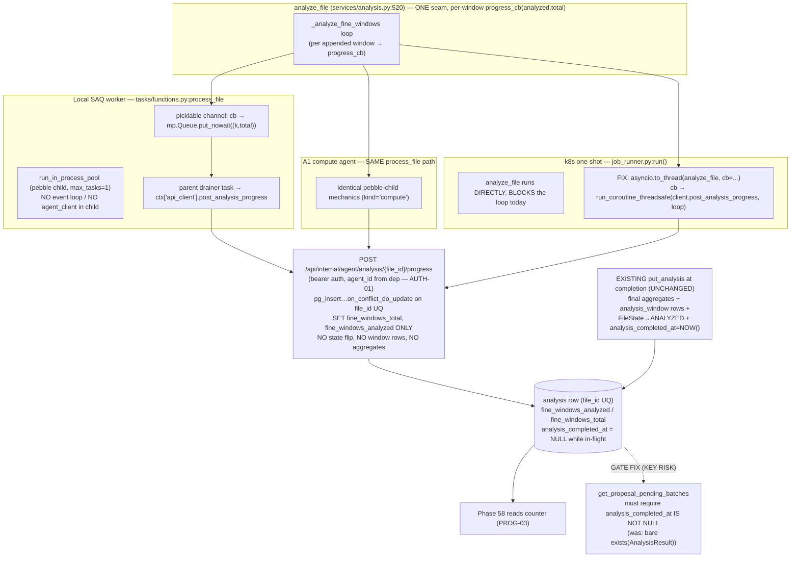

# Phase 57.1: Incremental window persistence & live analyze progress signal - Research

**Researched:** 2026-06-29
**Domain:** In-repo wiring — async FastAPI internal endpoint + per-window progress callback threaded through one `analyze_file` seam across three execution lanes (local SAQ / A1 compute / k8s one-shot), under Phase 31 windowed analysis + Phase 32 reboot re-enqueue.
**Confidence:** HIGH (every claim verified by reading the actual source; no external library behavior is load-bearing).

## Summary

This phase has **one** code seam (`analyze_file`'s per-window loop) and **one** new internal endpoint, but **two structurally different execution contexts** for that seam that the planner must wire separately. Both the **local SAQ worker** and the **A1 compute agent** run `analyze_file` in a **pebble child process** (`tasks/functions.py::process_file` → `run_in_process_pool`, `max_tasks=1`); the child has no event loop, no `agent_client`, and is fed picklable args. The **k8s one-shot job** (`job_runner.py`) runs `analyze_file` **directly and synchronously inside the main asyncio process** (no pool), which **blocks the event loop** for the whole analysis. A per-window callback that wants to POST progress therefore cannot uniformly "just call `agent_client`" — the pebble child can't reach it, and the k8s loop is blocked. Resolving this cleanly is the heart of the design and what the spike must prove. `[VERIFIED: src/phaze/tasks/pool.py, src/phaze/job_runner.py:218-221, src/phaze/tasks/functions.py:166-174]`

The **KEY RISK is real and concrete, not hypothetical.** The proposal convergence gate (`services/pipeline.py::get_proposal_pending_batches`) selects files where `FileRecord.state IN {ANALYZED, METADATA_EXTRACTED}` **AND** `exists(AnalysisResult row)`. Today an `analysis` row only exists *after* completion, so `exists(analysis)` is a valid proxy for "analysis complete." Under **D-03** an `analysis` row is upserted at analysis **START** while the file is still `METADATA_EXTRACTED` — which makes that file immediately satisfy **both** gate conditions and **leak into proposal generation with NULL aggregates.** Closing this leak is a mandatory must-have and is the one place D-03 regresses existing behavior. `[VERIFIED: src/phaze/services/pipeline.py:~1115-1130]`

**PROG-02 idempotency is structurally safe at the recovery layer** and only needs the counter overwrite to be safe. Phase 32 re-enqueue's "done" predicate for `process_file` is **`FileRecord.state IN {ANALYZED, ANALYSIS_FAILED}`** (`tasks/reenqueue.py`) — pure state, independent of the analysis row's existence. A file killed mid-analysis is in a non-terminal state, so it re-enqueues correctly; the leftover partial row does **not** affect the re-enqueue decision, and the re-run's `put_analysis` (file_id UQ, full replace) overwrites it. The counter is "just overwritten on re-run" exactly as D-01 claims. `[VERIFIED: src/phaze/tasks/reenqueue.py:108-115,177]`

**Primary recommendation:** Add a plain sync `progress_cb(analyzed:int, total:int)` parameter to `analyze_file` (keeping `analysis.py` HTTP/pickle-free), add one async `post_analysis_progress` method to `agent_client` + one `POST /api/internal/agent/analysis/{file_id}/progress` endpoint that upserts the counter via `put_analysis`'s exact `pg_insert…on_conflict_do_update` mechanism, and wire the callback-to-client bridge per-lane (pebble: picklable channel drained parent-side; k8s: run `analyze_file` in `asyncio.to_thread` + `run_coroutine_threadsafe`). **Add a completion discriminator** (recommended: a `analysis_completed_at` column, migration 028) so the convergence gate stops treating row-existence as completion. Spike proves incremental persistence + crash-mid-run idempotency on a real multi-hour file before the production write path is locked.

## Architectural Responsibility Map

| Capability | Primary Tier | Secondary Tier | Rationale |
|------------|-------------|----------------|-----------|
| Per-window progress emission | Compute (`analyze_file`, `services/analysis.py`) | — | The single shared seam all 3 lanes call; emit a count, never HTTP. |
| Callback → control transport | Worker/runner per lane (`tasks/functions.py`, `job_runner.py`) | `agent_client` | The lane owns the event loop + auth context; `analyze_file` stays pure. |
| Counter persistence (START + bump) | API / control (`routers/agent_analysis.py`) | DB (`analysis` row) | Reuses `put_analysis` upsert; Postgres `file_id` UQ is the natural key. |
| Completion / `ANALYZED` flip | API / control (existing `put_analysis`) | — | UNCHANGED — must stay the sole completion + state-flip path (scope fence). |
| In-flight read signal (PROG-03) | DB row read (Phase 58, no backend work) | — | Phase 58 reads `fine_windows_analyzed/total` off the one analysis row. |

<user_constraints>
## User Constraints (from CONTEXT.md)

### Locked Decisions
- **D-01 Counter-only mid-flight — window detail rows stay atomic.** During analysis only a lightweight count advances (`fine_windows_analyzed`/`fine_windows_total`; coarse optional). The heavy `analysis_window` **detail** rows continue to land atomically at completion via the existing `put_analysis` replace path. PROG-02 is trivial: the counter is overwritten on re-run; there are no partial detail rows to reconcile.
  - **Reconciliation note:** PROG-01's wording ("incremental window **persistence**") must be re-described as incremental **progress-counter** persistence when planning (detail rows are NOT written incrementally). Update PROG-01 wording / ROADMAP clause or add a one-line note; do **not** implement incremental detail-row writes.
- **D-02 One new lightweight internal progress-POST endpoint, used by all lanes, fed by an `analyze_file` per-window callback.** Add a progress callback to `analyze_file`'s per-window loop (`_analyze_fine_windows`/`_analyze_coarse_windows`). All lanes report through ONE new internal endpoint (e.g. `POST /api/internal/agent/files/{file_id}/analysis-progress`) that upserts the count, reusing the agent→control incremental-POST pattern (`post_exec_batch_progress`/`heartbeat`). Local lane also goes through this HTTP path — one lane-agnostic code path. Do NOT piggyback on heartbeat; do NOT special-case the local lane with a direct DB write.
- **D-03 Upsert a partial `analysis` row at analysis START; Phase 58 reads the count off that row.** Endpoint upserts the row when analysis begins (`fine_windows_total` set, `fine_windows_analyzed`=0, bumped mid-flight), reusing the `analysis.file_id` UQ + `put_analysis`'s field-level last-write-wins replace. Completion overwrites the SAME row. Phase 58 reads the counts off the one analysis row.
- **D-04 Per-window callback, time-throttled to ~once / 5s, always flush the final count.** Fire per window but skip the POST if the previous one was <~5s ago; always send the final count at completion. Phase 31 caps (≤~60 fine + ≤~30 coarse windows/file) make this naturally cheap; the throttle only avoids bursts on short/fast files. Interval is a tunable default (planner may pick 3–5s).

### Claude's Discretion
- Whether to also surface a **coarse** progress count (`coarse_windows_analyzed`/`total`) or fine-only — fine-only is sufficient for WORK-04; coarse is a cheap add if it falls out naturally.
- Exact endpoint name/path + payload schema (follow `agent_*` internal-endpoint + bearer-auth conventions; `agent_id` from the auth dep, never the body — AUTH-01).
- Throttle interval (3–5s) and whether throttling lives in the callback, the worker, or the client.
- Migration: the counter columns already exist (`models/analysis.py:28-29`) — confirm no new migration for the counter (only possibly for a "started_at"/in-progress marker if one is chosen).

### KEY RISK to engineer around (carry into plan must_haves)
- **A partial `analysis` row (NULL aggregates, analyzed < total) must NOT be treated as a completed analysis** by proposals / search / sort / the `ANALYZED` gate. Those must stay gated on the `FileState` `ANALYZED` flip (still only at completion), not on mere analysis-row existence. Add a regression test asserting an in-progress analysis row does not leak into proposals/search.

### Deferred Ideas (OUT OF SCOPE)
- Incremental **detail-row** streaming (live per-window sparkline mid-flight) — not needed; Phase 61's rich record reads completed data.
- Coarse-pass live progress, if not trivially included — fine-only satisfies WORK-04.
</user_constraints>

<phase_requirements>
## Phase Requirements

| ID | Description | Research Support |
|----|-------------|------------------|
| PROG-01 | `analyze_file` bumps `fine_windows_analyzed`/`fine_windows_total` incrementally during the run so an in-flight file exposes a real per-window progress count. (Re-described per D-01: **counter** persistence, not detail-row persistence.) | The per-window seam is `_analyze_fine_windows`/`_analyze_coarse_windows` (`analysis.py:444-504`); callback fires per appended window. Transport per lane (§Q1). Endpoint upserts counter (§Q2). |
| PROG-02 | Incremental persistence is idempotent + safe under Phase 32 reboot/re-enqueue: an interrupted file re-runs cleanly, no duplicate/orphaned state, no change to final aggregates or the `ANALYZED` flip. | Re-enqueue done-predicate is state-only (`ANALYZED`/`ANALYSIS_FAILED`), independent of the partial row (§Q3). `put_analysis` upsert overwrites on re-run. Spike proves it on a real kill. |
| PROG-03 | The progress is readable as a per-file, read-only mid-flight signal (`fine_windows_analyzed`/`fine_windows_total` on the in-progress analysis row) that Phase 58 surfaces with no further backend change. | D-03 puts the counter on the one `analysis` row keyed by `file_id` UQ; Phase 58 reads it directly. Completion discriminator (§Q4) lets Phase 58 distinguish in-flight from complete. |
</phase_requirements>

## Standard Stack

No new packages. Every mechanism this phase needs is already a load-bearing in-repo dependency, used exactly as the new code will use it. `[VERIFIED: pyproject + source reads]`

| Library | Role here | Existing usage to mirror |
|---------|-----------|--------------------------|
| FastAPI | New internal `POST …/progress` route | `routers/agent_analysis.py` (`put_analysis`, `report_analysis_failed`) |
| SQLAlchemy 2.0 async + `pg_insert` | Counter upsert (`on_conflict_do_update`, `file_id` UQ) | `agent_analysis.py:183-196` — copy the exact INSERT-on-conflict shape |
| Pydantic v2 | Progress payload (`extra="forbid"`, `ge=0`) | `schemas/agent_analysis.py::AnalysisWritePayload` |
| httpx + tenacity (`agent_client._request`) | Async progress POST with bounded retry | `agent_client.post_exec_batch_progress` / `heartbeat` (:520, :542) |
| pebble `ProcessPool` | Already runs `analyze_file` in local/A1 lanes | `tasks/pool.py` — the callback-transport constraint comes from here |
| `asyncio.to_thread` / `run_coroutine_threadsafe` | k8s-lane bridge so the cb can reach the loop | stdlib; `compute_sha256` is already offloaded via `asyncio.to_thread` in `job_runner.py:203` |

**No external version verification required:** no package is added or upgraded. **No Context7 lookup performed** — the research question is internal seam wiring, not library API surface; all four libraries above are already used in the exact pattern the new code copies.

## Package Legitimacy Audit

Not applicable — **this phase installs zero external packages.** All mechanisms reuse already-installed, already-load-bearing dependencies (FastAPI, SQLAlchemy, Pydantic, httpx, pebble, stdlib asyncio). No `slopcheck`/registry verification needed because no new dependency is introduced.

## Architecture Patterns

### System Architecture Diagram



### Pattern 1: Counter-upsert endpoint reuses `put_analysis`'s upsert mechanism
**What:** The new `POST …/progress` handler copies the `pg_insert(AnalysisResult).values([{…,"file_id":file_id,"id":uuid4()}]).on_conflict_do_update(index_elements=["file_id"], set_={…})` shape verbatim from `agent_analysis.py:183-196`, but the SET clause covers **only** `fine_windows_total` + `fine_windows_analyzed` (+ optional coarse). It does **NOT** touch aggregates, does **NOT** replace `analysis_window` rows, and does **NOT** flip `FileState`. `[VERIFIED: agent_analysis.py:180-220]`
**When to use:** Every progress POST (START call carries `analyzed=0,total=N`; bumps carry `analyzed=k,total=N`).
**Example:**
```python
# Source: pattern lifted from src/phaze/routers/agent_analysis.py:180-196 (put_analysis)
payload = {"fine_windows_total": body.fine_windows_total,
           "fine_windows_analyzed": body.fine_windows_analyzed,
           "file_id": file_id, "id": uuid.uuid4()}
stmt = pg_insert(AnalysisResult).values([payload]).on_conflict_do_update(
    index_elements=["file_id"],
    set_={"fine_windows_total": stmt.excluded.fine_windows_total,
          "fine_windows_analyzed": stmt.excluded.fine_windows_analyzed},
)
await session.execute(stmt)
await session.commit()   # NO FileRecord update, NO AnalysisWindow delete/insert
```
**Decision for planner:** This is a **sibling handler**, not a reuse of `put_analysis` itself — `put_analysis` always tries to flip `FileState.ANALYZED` when `dumped` is non-empty (`agent_analysis.py:219-220`) and clears the scheduling ledger + deletes the staged S3 object. The progress endpoint must do **none** of those. So "reuse `put_analysis`'s upsert *mechanism*" (D-03) = copy the `pg_insert` idiom into a new minimal handler; do **not** route progress through the existing `put_analysis` function.

### Pattern 2: `analyze_file` stays pure — emit a count, never HTTP
**What:** Add `progress_cb: Callable[[int, int], None] | None = None` to `analyze_file` and to `_analyze_fine_windows`. After each successful `fine_windows.append(...)`, call `progress_cb(len(fine_windows), target_total)` (and fire once before the loop with `(0, total)` as the START signal). `analysis.py` imports no httpx, builds no client, and never pickles a closure. `[VERIFIED: analysis.py:444-473 is the loop; it currently has no callback]`
**Why:** Keeps the pebble-child picklability boundary clean (only primitives cross), keeps `analyze_file` unit-testable without a control plane, and keeps the essentia import boundary intact (`tests/test_task_split.py`).

### Pattern 3: Throttle in the callback bridge, not in `analyze_file`
**What:** D-04's ~5s throttle lives in the **per-lane bridge** (the parent drainer for pebble; the `run_coroutine_threadsafe` cb for k8s), keyed on a `monotonic()` last-post timestamp, with an unconditional final flush. Because the pebble child is `max_tasks=1` (one file per process, worker recycled after), a child-local throttle would also be leak-free — but the bridge is the cleaner home since it owns the actual POST. `[VERIFIED: pool.py:26 max_tasks=1]`
**Note:** The "always flush final" half of D-04 is **partly satisfied for free** — the existing completion `put_analysis` already writes the final `fine_windows_analyzed/total` to the same row. The progress path's final flush is therefore belt-and-suspenders for the window between the last throttled bump and completion; the spike should confirm the bar reaches 100% from the completion PUT even if the final progress POST is dropped.

### Anti-Patterns to Avoid
- **Calling `agent_client` from inside the pebble child.** It does not exist there (the child gets picklable args only; `ctx["api_client"]` lives in the parent). `[VERIFIED: pool.py + functions.py]`
- **`await`/`run_coroutine_threadsafe` from a cb while `analyze_file` blocks the k8s loop.** Today `job_runner.py` calls `analyze_file` directly inside `async def run` (`:221`), blocking the loop — a coroutine scheduled onto it cannot run until analysis returns (deadlock / all-progress-at-end). Fix by moving the call into `asyncio.to_thread` so the loop stays free for the cb's POSTs.
- **Routing progress through `put_analysis`.** It flips `FileState.ANALYZED`, clears the ledger, and deletes the staged S3 object — a mid-flight call would prematurely "complete" the file. Use a dedicated minimal handler.
- **Treating `exists(AnalysisResult)` as "analysis complete" anywhere.** That equivalence is exactly what D-03 breaks (see KEY RISK).

## Don't Hand-Roll

| Problem | Don't build | Use instead | Why |
|---------|-------------|-------------|-----|
| Idempotent counter upsert | A read-modify-write SELECT-then-UPDATE | `pg_insert…on_conflict_do_update` on `file_id` UQ (copy `put_analysis`) | Race-free, single statement, already the house pattern. |
| Bearer auth on the new route | A new token check | `Depends(get_authenticated_agent)` + `agent_id` from dep (AUTH-01) | Identical to every `/api/internal/agent/*` route. |
| Bounded retry on the progress POST | A bespoke retry loop | `agent_client._request` funnel (tenacity, D-11) | `post_exec_batch_progress`/`heartbeat` already do exactly this. |
| Re-enqueue idempotency under crash | New reconciliation logic | Existing deterministic key `process_file:<file_id>` + state-only done-predicate | Phase 32/45 already guarantee no-double-run; the partial row doesn't change it. |
| Final 100% on the bar | A guaranteed-delivery final progress POST | The existing completion `put_analysis` already writes final counts | The row is overwritten at completion regardless of throttle. |

**Key insight:** This phase adds **one** new statement-shape (a stripped-down `put_analysis` upsert) and **one** new client method. Everything else is reuse. The genuine engineering is the callback→client bridge across the pebble boundary and the k8s blocked-loop, plus the convergence-gate fix.

## Runtime State Inventory

This is a code + (one) schema change, not a rename/migration of stored identifiers. The relevant "state" questions:

| Category | Items found | Action required |
|----------|-------------|------------------|
| Stored data | `analysis` rows already carry `fine_windows_analyzed/total` (migration 021, populated only at completion today). | No data backfill. New behavior writes the same columns earlier in the lifecycle. |
| Live service config | None — no service config embeds analysis progress. | None. |
| OS-registered state | None. | None. |
| Secrets/env vars | New route reuses the existing agent bearer token; new throttle interval is a config knob (`AgentSettings`/`ControlSettings`) — no secret. | Add one optional numeric setting (default 5s) if throttle is configurable. |
| Build artifacts | None. | None. |

**Schema:** counter columns **exist** (no migration for the counter — D-03 discretion confirmed, `models/analysis.py:25-32`). **However**, the KEY-RISK fix likely needs **one new column** (`analysis_completed_at`, migration 028 — latest is 027) — see §Q4. `[VERIFIED: alembic/versions ends at 027_add_cloud_job_cloud_phase.py]`

## Common Pitfalls

### Pitfall 1: The proposal convergence gate leaks partial rows (THE KEY RISK — verified real)
**What goes wrong:** `get_proposal_pending_batches` selects `FileRecord.state IN {ANALYZED, METADATA_EXTRACTED}` **AND** `exists(AnalysisResult.id …)`. A file that is `METADATA_EXTRACTED` and has just had its **partial** analysis row written at START satisfies both clauses → it is batched into `generate_proposals` with NULL bpm/key/mood, which then flow into `proposal.py:159-165`'s context dict and the LLM prompt. `[VERIFIED: services/pipeline.py:~1115-1130; services/proposal.py:140-165]`
**Why it happens:** Pre-57.1, an `analysis` row exists **only** after completion, so `exists(analysis)` was a sound completion proxy. D-03 invalidates that proxy.
**How to avoid:** Add a completion discriminator (§Q4) and require it in the convergence subquery. Recommended: `exists(select(AnalysisResult.id).where(AnalysisResult.file_id==FileRecord.id, AnalysisResult.analysis_completed_at.isnot(None)))`.
**Warning signs:** A regression test that creates a `METADATA_EXTRACTED` file + a partial analysis row (analyzed<total, NULL bpm) and asserts `get_proposal_pending_batches` returns it in **zero** batches. Add this to the plan must-haves.

### Pitfall 2: Search/sort surfacing partial rows (LOW risk, confirm it stays low)
**What goes wrong:** `search_queries.py` `outerjoin(AnalysisResult)` then `where(AnalysisResult.bpm >= bpm_min)`. A partial row has `bpm IS NULL`, so a bpm-filtered search **excludes** it (NULL comparison is unknown→false) — same as an unanalyzed file. With no bpm filter the file appears regardless (outer join), exactly as today. **Search does not harmfully leak**, but a regression assertion that a bpm-filtered search ignores partial-row files documents the invariant. `[VERIFIED: services/search_queries.py:71-86]`
**How to avoid:** No code change needed; add the assertion to lock it.

### Pitfall 3: k8s lane reports all progress at the end (or deadlocks)
**What goes wrong:** `job_runner.py:221` calls `analyze_file(...)` directly inside `async def run`, blocking the loop. Any progress coroutine cannot execute until analysis finishes → the bar jumps 0→100 with no mid-flight signal (or a naive `run_coroutine_threadsafe(...).result()` deadlocks). `[VERIFIED: job_runner.py:212-221]`
**How to avoid:** Wrap the analyze call in `asyncio.to_thread(analyze_file, str(tmp_path), models_dir, fine_cap=…, coarse_cap=…, progress_cb=cb)` so the loop stays free; the cb does fire-and-forget `run_coroutine_threadsafe(client.post_analysis_progress(...), loop)` with errors swallowed (progress is best-effort; a dropped POST must never fail the job — mirror the `post_exec_batch_progress` swallow-after-retries discipline, D-16).
**Warning sign:** Spike on the k8s lane must show ≥2 distinct counter values landing during a single long file, not just the final.

### Pitfall 4: Picklable callback across the pebble boundary
**What goes wrong:** Passing a closure/`agent_client`/httpx client as `progress_cb` into `pool.schedule(analyze_file, …)` raises a pickling error (pebble pickles schedule args to the child). `[VERIFIED: pool.py:50 pool.schedule(func, args=…, kwargs=…)]`
**How to avoid:** Pass a **picklable channel** (e.g. a `multiprocessing.Manager().Queue()` proxy) — the child cb does `q.put_nowait((analyzed,total))`; a parent-side drainer task (`asyncio.to_thread(q.get, …)` loop, or a periodic poll) calls `ctx["api_client"].post_analysis_progress(...)`. Throttle + final-flush live parent-side. The drainer must be **kill-safe**: when the child is SIGKILLed (timeout/crash), the drainer must terminate (sentinel on the future's completion) and never hang. This is the #1 spike unknown.
**Alternative (simpler, less aligned with D-02's "via agent_client"):** child builds a **sync** `httpx.Client` from picklable primitives (base_url, bearer token, file_id, interval) and POSTs directly. One extra POST implementation (no tenacity reuse, couples the child to auth) but avoids the Queue+drainer. The planner should pick one in the spike; the Queue-drainer keeps a single HTTP surface and is recommended if the kill-safety proves clean.

### Pitfall 5: Coarse-pass counter semantics (discretion)
**What goes wrong:** If coarse progress is added, the bar denominator (`fine_total`) and the coarse pass (which runs **after** the fine pass — `analysis.py:569-570`) can make the bar appear to "stall at 100% then keep working." `[VERIFIED: analysis.py:569-570 fine then coarse, sequential]`
**How to avoid:** Per CONTEXT discretion, ship **fine-only** for WORK-04 unless coarse falls out trivially; if coarse is added, Phase 58 must present it as a second segment, not the same denominator.

## Code Examples

### The single seam to instrument (fine pass)
```python
# Source: src/phaze/services/analysis.py:444-473 (_analyze_fine_windows) — add progress_cb
def _analyze_fine_windows(file_path, total_sec, win_sec, min_sec, cap, progress_cb=None):
    natural = _iter_windows(total_sec, win_sec, min_sec, drop_short_trailing=True)
    kept, sampled = _stride_to_cap(natural, cap)
    target = len(kept)                      # post-stride count actually attempted
    if progress_cb is not None:
        progress_cb(0, len(natural))        # START signal: analyzed=0, total=natural pre-stride
    fine_windows = []
    for idx, start, end in kept:
        try:
            ...                              # existing essentia per-window work (unchanged)
            fine_windows.append(FineWindow(...))
        except Exception:
            log.warning(...); continue
        if progress_cb is not None:
            progress_cb(len(fine_windows), len(natural))   # bump (throttled downstream)
    return fine_windows, len(natural), sampled
```
**Note on `total`:** the completion PUT reports `fine_windows_total = len(natural)` (natural pre-stride count) and `fine_windows_analyzed = len(fine_windows)` (`analysis.py:583-584`). Use the **same** `len(natural)` as the progress denominator so the in-flight bar and the completed coverage agree. `[VERIFIED: analysis.py:472-473, 583-584]`

### New agent_client method (mirror post_exec_batch_progress)
```python
# Source: pattern from src/phaze/services/agent_client.py:520-540 (post_exec_batch_progress)
async def post_analysis_progress(self, file_id, payload) -> None:
    await self._request("POST", f"/api/internal/agent/analysis/{file_id}/progress",
                        json=payload.model_dump(mode="json"))
    return None   # 200/204 empty body; swallow AgentApiError after retries (best-effort, D-16)
```

### Phase 32 re-enqueue done-predicate (why PROG-02 is safe)
```python
# Source: src/phaze/tasks/reenqueue.py:177 (_select_done_analyze_ids)
select(FileRecord.id).where(FileRecord.state.in_([FileState.ANALYZED, FileState.ANALYSIS_FAILED]))
# Pure STATE — the partial analysis row's existence is irrelevant to re-enqueue.
# A killed mid-analysis file is non-terminal → correctly re-enqueued; its leftover
# partial row is overwritten by the re-run's put_analysis (file_id UQ replace).
```

## State of the Art

| Old (pre-57.1) | New (57.1) | Impact |
|----------------|------------|--------|
| `analysis` row exists ⇔ analysis complete | `analysis` row can exist mid-flight (partial) | Every "row exists ⇒ analyzed" assumption must be re-examined; convergence gate fixed. |
| `analyze_file` is pure compute, returns once | `analyze_file` emits per-window counts via `progress_cb` | One new param; transport handled per-lane outside `analysis.py`. |
| Completion is the only `analysis` write | START + bumps + completion all write the row | Completion path UNCHANGED; new writes are counter-only. |

**Deprecated/outdated:** none — this is purely additive.

## Assumptions Log

| # | Claim | Section | Risk if wrong |
|---|-------|---------|---------------|
| A1 | A new `analysis_completed_at` column (migration 028) is the cleanest KEY-RISK discriminator; the zero-migration alternative is gating the convergence analysis-half on `FileState.ANALYZED`. The spike/planner must choose. | §Q4, Pitfall 1 | If `METADATA_EXTRACTED`-with-complete-analysis is a real reachable state, the zero-migration tighten would drop legitimate files from proposals. The column approach is risk-free; verify reachability before choosing zero-migration. |
| A2 | The Queue-drainer (parent-side POST) is kill-safe under pebble SIGKILL. | Pitfall 4 | If the drainer can hang when the child is killed, the local/A1 lane could stall a worker slot. The spike must prove drainer teardown on child death. This is the primary spike risk. |
| A3 | `asyncio.to_thread(analyze_file, …)` in `job_runner.py` has no adverse interaction with the essentia process-global state (k8s runs analyze in-process, not a pool). | Pitfall 3 | essentia/TF is generally not thread-safe; running it in a worker thread (vs the main thread) could surface a TF threading issue. Spike must run the k8s lane end-to-end on a real file. |

## Open Questions (RESOLVED — see resolution markers; all four addressed in the 57.1 plans)

> **Q1 RESOLVED:** deferred to the Plan 01 SPIKE — Queue-drainer vs child-side httpx chosen empirically; recorded in `57.1-01-SPIKE-FINDINGS.md`, consumed by Plan 04 (`depends_on: 57.1-01`).
> **Q2 RESOLVED:** `POST /api/internal/agent/analysis/{file_id}/progress` on the existing `agent_analysis.py` router — implemented in Plan 03.
> **Q3 RESOLVED:** Plan 01-T2 idempotency integration test + Plan 01-T3 human-verify checkpoint (real kill-9 long-file run).
> **Q4 RESOLVED:** `analysis_completed_at` column via migration 028 — implemented in Plan 02 (lands Wave 2, before any partial row is written in Wave 3+).

### Q1 — Callback→client transport per lane (the core design fork)
- **What we know:** local + A1 run `analyze_file` in a pebble child (no loop/client); k8s runs it directly and blocks the loop. `[VERIFIED]`
- **What's unclear:** Queue-drainer (single HTTP surface via `agent_client`, recommended) vs child-side sync httpx POST (simpler, duplicate POST path). And whether the k8s `to_thread` move is acceptable.
- **Recommendation:** Spike both pebble options on a real multi-hour file; pick the Queue-drainer if SIGKILL teardown is clean (A2). Move the k8s analyze call to `asyncio.to_thread` + `run_coroutine_threadsafe`.

### Q2 — Endpoint home and shape
- **Recommendation:** `POST /api/internal/agent/analysis/{file_id}/progress` registered on the **existing** `agent_analysis.py` router (prefix `/api/internal/agent/analysis`), body `{fine_windows_analyzed:int>=0, fine_windows_total:int>=0}` (+ optional coarse), `extra="forbid"`, `agent_id` from `Depends(get_authenticated_agent)` (AUTH-01), 200 empty body. Counter-only upsert; no state flip, no window rows. CONTEXT's example path (`…/files/{file_id}/analysis-progress`) is equally valid — co-locating on the analysis router keeps it next to `put_analysis`/`report_analysis_failed`. `[VERIFIED: agent_analysis.py:56 prefix; agent_auth.py auth dep]`

### Q3 — PROG-02 idempotency proof (the spike)
- **What we know:** re-enqueue is state-only; deterministic key prevents double-run; `put_analysis` replaces the row. `[VERIFIED]`
- **What's unclear:** Empirical confirmation on a real kill-mid-window — that the leftover partial row + leftover `analysis_window` rows from the *previous* completed analysis (if any) are cleanly replaced and the final row is byte-identical to an uninterrupted run.
- **Recommendation:** Spike: start a multi-hour analysis, `kill -9` the worker/pod mid-fine-pass, let Phase 32 re-enqueue, assert (a) one re-run, (b) final `analysis` row aggregates + `analysis_window` row set identical to an uninterrupted control run, (c) no orphaned/duplicate windows, (d) `FileState` reaches `ANALYZED` exactly once.

### Q4 — Completion discriminator (migration or not)
- **What we know:** the only existing signal set **only** at completion is the `FileState.ANALYZED` flip (in the same txn as `put_analysis`); aggregates like `bpm` can legitimately be NULL on a completed file (all windows failed), so they are **not** reliable completion proxies. Latest migration is 027. `[VERIFIED: agent_analysis.py:219-220; alembic/versions]`
- **What's unclear:** column (`analysis_completed_at timestamptz NULL`, set in completion `put_analysis`, migration 028) vs zero-migration (convergence requires `FileState.ANALYZED`).
- **Recommendation:** Prefer the **column** — it is intention-revealing, gives Phase 58 a crisp in-flight flag (row exists + `completed_at IS NULL` = in-flight), and is a 1-line predicate change in the convergence query. Set it in the existing completion branch of `put_analysis` (where it already flips `ANALYZED`). If a migration is undesirable, verify `METADATA_EXTRACTED`+complete-analysis is unreachable, then tighten the convergence analysis-half to `FileState.ANALYZED`.

## Environment Availability

| Dependency | Required by | Available | Version | Fallback |
|------------|------------|-----------|---------|----------|
| essentia-tensorflow | Real spike on a multi-hour file | ✓ (x86_64 / cp314) | per pyproject marker | Local arm64 dev host can run the x86 lane only via the existing colima/arm64 image; the spike's "real long file" run should target the lane that actually runs essentia in CI/homelab. |
| PostgreSQL 16+ | Counter upsert + convergence query tests | ✓ | project standard | — |
| pebble | local/A1 lane callback boundary | ✓ (installed) | in lockfile | — |
| Kueue / k8s cluster | k8s-lane end-to-end progress proof | partial (homelab) | — | Unit-test the `to_thread`+cb wiring; full k8s proof deferred to a live run (mirrors v6.0 deployment-deferred E2E pattern). |

**Missing with no fallback:** none blocks planning. **Missing with fallback:** full k8s-lane live progress is best proven on the homelab cluster; the unit-level cb wiring + the local/A1 spike cover the mechanics.

## Validation Architecture

### Test Framework
| Property | Value |
|----------|-------|
| Framework | pytest + pytest-asyncio + httpx AsyncClient (project standard) `[VERIFIED: CLAUDE.md, tests/ layout]` |
| Config | `pyproject.toml` (`uv run pytest`); 85% coverage min, Codecov flags |
| Quick run | `uv run pytest tests/test_routers/test_agent_analysis.py tests/test_services/test_analysis.py -x` |
| Full suite | `uv run pytest --cov --cov-report=term-missing` |

### Phase Requirements → Test Map
| Req | Behavior | Type | Command | Exists? |
|-----|----------|------|---------|---------|
| PROG-01 | Progress endpoint upserts counter-only (no state flip, no window rows, no aggregate overwrite) | router unit | `uv run pytest tests/test_routers/test_agent_analysis.py -k progress -x` | ❌ Wave 0 (extend existing `test_agent_analysis.py`) |
| PROG-01 | `analyze_file` calls `progress_cb` per window incl. START(0,total) | service unit | `uv run pytest tests/test_services/test_analysis.py -k progress -x` | ❌ Wave 0 (extend `test_analysis.py`/`test_analysis_long_file.py`) |
| PROG-01 | local/A1 bridge: pebble-child cb reaches `post_analysis_progress` | task unit | `uv run pytest tests/test_tasks/test_functions* -k progress -x` | ❌ Wave 0 |
| PROG-01 | k8s bridge: `to_thread`+cb posts ≥2 mid-flight counts | runner unit | `uv run pytest tests/test_job_runner.py -k progress -x` | ❌ Wave 0 (extend `test_job_runner.py`) |
| PROG-02 | kill-mid-analysis → re-enqueue → re-run; final row identical to uninterrupted; no dup/orphan windows; `ANALYZED` once | integration / **spike** | `uv run pytest tests/test_reenqueue.py tests/test_tasks/test_controller_reenqueue.py -k analyze -x` + manual long-file spike | ❌ Wave 0 + spike task |
| PROG-02 | counter overwrite is idempotent (repeat progress POST + completion PUT → same row) | router unit | `uv run pytest tests/test_routers/test_agent_analysis.py -k idempotent -x` | partial (extend) |
| PROG-03 | counter readable off the in-progress `analysis` row per file | router/service unit | covered by the PROG-01 upsert test (read-back assertion) | ❌ Wave 0 |
| KEY RISK | `METADATA_EXTRACTED` file + partial analysis row ⇒ 0 proposal batches | service unit | `uv run pytest tests/test_services/test_proposal_queries.py -k partial -x` | ❌ Wave 0 (extend `test_proposal_queries.py`) |
| KEY RISK | bpm-filtered search ignores partial-row file | service unit | `uv run pytest -k "search and bpm" -x` | ❌ Wave 0 |

### Sampling Rate
- **Per task commit:** the quick run command above for the touched module.
- **Per wave merge:** `uv run pytest --cov` for the analysis + proposals + reenqueue + job_runner test dirs.
- **Phase gate:** full suite green + the long-file spike result recorded before `/gsd:verify-work`.

### Wave 0 Gaps
- [ ] `tests/test_routers/test_agent_analysis.py` — progress endpoint: counter-only upsert, no `FileState` flip, no `analysis_window` delete, no ledger clear, no S3 delete (covers PROG-01/03).
- [ ] `tests/test_services/test_analysis.py` — `progress_cb` fires START + per-window with correct `(analyzed, total=len(natural))`.
- [ ] `tests/test_services/test_proposal_queries.py` — **KEY RISK** regression: partial row not batched.
- [ ] `tests/test_tasks/` — pebble-child bridge + throttle + final-flush; drainer kill-safety.
- [ ] `tests/test_job_runner.py` — k8s `to_thread`+cb mid-flight posts; analysis still maps to correct exit codes.
- [ ] Existing infra (`tests/test_reenqueue.py`, `tests/test_routers/test_agent_analysis.py`, `tests/conftest.py` DB/session fixtures, `tests/integration/conftest.py` real-queue `stage_env`) is reused — no new framework install.

## Security Domain

New surface = one authenticated internal endpoint. `security_enforcement` not disabled in config → included.

### Applicable ASVS Categories
| Category | Applies | Control |
|----------|---------|---------|
| V2 Authentication | yes | `Depends(get_authenticated_agent)` bearer (sha256 token hash, partial-index lookup) — identical to all `/api/internal/agent/*`. `[VERIFIED: agent_auth.py]` |
| V4 Access Control | yes | `agent_id` from the auth dep, **never** the body; `file_id` rides the **path** only (AUTH-01) — a forged body cannot redirect the counter to another file. Mirror `report_analysis_failed`'s path-only scoping. `[VERIFIED: agent_analysis.py:237-256]` |
| V5 Input Validation | yes | Pydantic `extra="forbid"`, `int >= 0` on both counts; reject negative/oversized values at the wire boundary. |
| V6 Cryptography | no | No new crypto. |

### Known Threat Patterns
| Pattern | STRIDE | Mitigation |
|---------|--------|------------|
| Forged body `agent_id`/`file_id` redirecting the counter | Spoofing/Tampering | `agent_id` from dep, `file_id` from path, `extra="forbid"` → 422. |
| Progress POST flood (DoS) | DoS | D-04 ~5s throttle + Phase 31 ≤~60+30 window cap bound POST volume per file; counter-only upsert is O(1). |
| Premature completion via the progress path | Tampering | Endpoint never flips `FileState`/writes aggregates/window rows; completion stays solely on `put_analysis`. |

## Sources

### Primary (HIGH — read directly this session)
- `src/phaze/services/analysis.py:444-588` — `_analyze_fine_windows`/`_analyze_coarse_windows`/`analyze_file` (the seam, the count semantics).
- `src/phaze/routers/agent_analysis.py:1-273` — `put_analysis` upsert + `ANALYZED` flip + ledger clear + S3 delete; `report_analysis_failed`; `_ANALYSIS_COLUMN_FIELDS`.
- `src/phaze/models/analysis.py:1-70` — `AnalysisResult` (counter columns 28-32, `file_id` UQ) + `AnalysisWindow`.
- `src/phaze/schemas/agent_analysis.py:1-129` — payload shapes, `extra="forbid"`, coverage fields.
- `src/phaze/tasks/functions.py:40-241` — `process_file`, `run_in_process_pool` call, pebble caps, `api.put_analysis`/`report_analysis_failed`.
- `src/phaze/tasks/pool.py:1-52` — pebble `ProcessPool`, `max_tasks=1`, `pool.schedule` pickling boundary.
- `src/phaze/job_runner.py:1-271` — k8s one-shot: direct synchronous `analyze_file`, exit-code contract, Postgres-free boundary.
- `src/phaze/services/agent_client.py:274-549` — `put_analysis`, `post_exec_batch_progress`, `heartbeat` (the POST patterns to mirror).
- `src/phaze/services/pipeline.py:~1115-1130` — `get_proposal_pending_batches` convergence gate (**KEY RISK**).
- `src/phaze/services/proposal.py:140-184` — analysis→proposal context (NULL-aggregate leak target).
- `src/phaze/services/search_queries.py:60-90` — outer-join + bpm filter (LOW-risk leak check).
- `src/phaze/tasks/reenqueue.py:100-190` — `process_file` done-predicate = state-only (PROG-02 safety).
- `src/phaze/routers/agent_auth.py` — bearer auth dep (AUTH-01).
- `alembic/versions/` — latest migration is `027_add_cloud_job_cloud_phase.py` (next = 028).
- `.planning/phases/57.1-…/57.1-CONTEXT.md`; `.planning/REQUIREMENTS.md` (PROG-01..03); `.planning/config.json` (nyquist + security enabled).

### Secondary / Tertiary
- None. No external/web source was needed or used — the entire phase is internal seam wiring over already-installed dependencies.

## Metadata

**Confidence breakdown:**
- Standard stack / "no new deps": HIGH — verified against pyproject + source; everything is reuse.
- Architecture / seams: HIGH — read every call site for all three lanes.
- KEY RISK: HIGH — the leak is a verified property of the actual convergence query, not a guess.
- PROG-02 safety: HIGH — re-enqueue predicate read directly; spike will confirm empirically.
- Callback-transport design fork (Q1) + completion-marker choice (Q4): MEDIUM — two viable options each; the spike/planner must select. Flagged in Assumptions Log.

**Research date:** 2026-06-29
**Valid until:** code-coupled — re-verify line numbers if `analysis.py`, `agent_analysis.py`, `pipeline.py`, `functions.py`, or `job_runner.py` change before planning.
