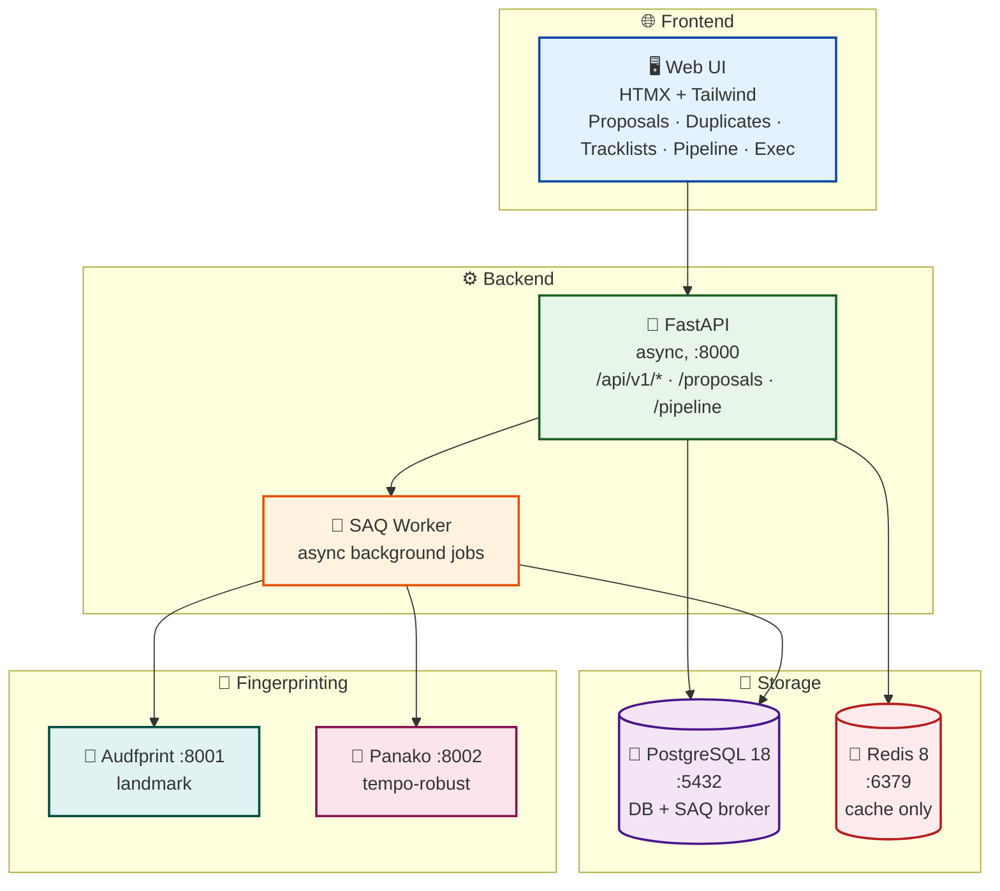
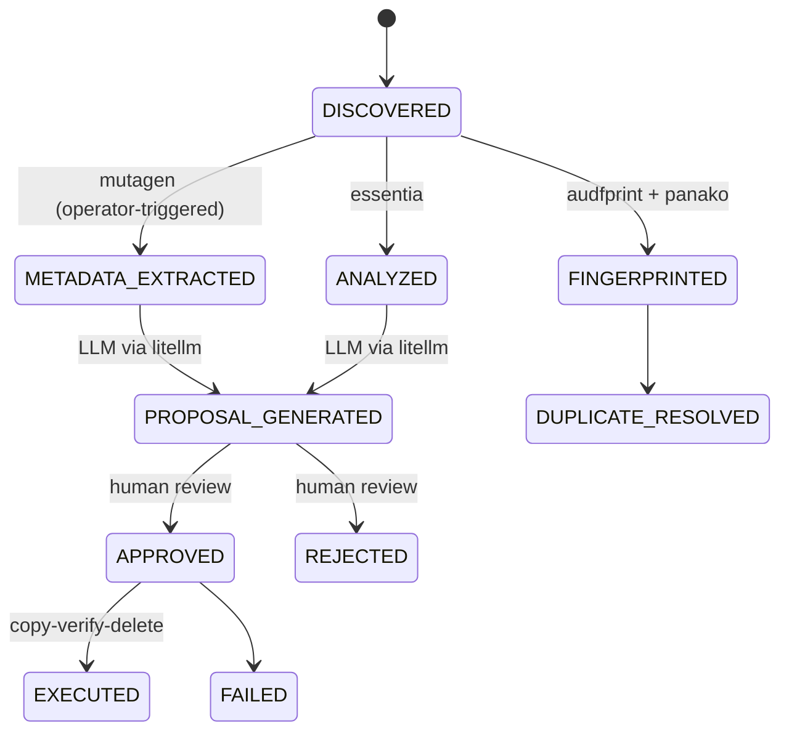

<!-- generated-by: gsd-doc-writer -->
<div align="center">

<picture>
  <source media="(prefers-color-scheme: dark)" srcset="design/assets/banner_dark.png">
  <source media="(prefers-color-scheme: light)" srcset="design/assets/banner_light.png">
  
</picture>

<br><br>

[](https://github.com/SimplicityGuy/phaze/actions/workflows/ci.yml) [](https://codecov.io/gh/SimplicityGuy/phaze)  

**A music collection organizer that ingests music and concert files, fingerprints and analyzes them, uses AI to propose better filenames and destination paths, and provides a web UI to review and approve renames. All file operations use a safe copy-verify-delete protocol with full audit trails.**

</div>

<p align="center">

[🚀 Quick Start](#-quick-start) | [📖 Documentation](#-documentation) | [🌟 Features](#-key-features) | [💬 Community](#-support--community)

</p>

## 🎯 What is Phaze?

Phaze is a music collection organizer for managing a large personal archive of music and live concert recordings. It provides:

- **🎵 Audio Analysis**: BPM, key, mood, and style detection via essentia-tensorflow
- **🔍 Audio Fingerprinting**: Dual-engine deduplication with audfprint (landmark) and Panako (tempo-robust)
- **🤖 AI-Powered Renaming**: LLM-generated filename and path proposals via litellm
- **🎧 Tracklist Matching**: Concert set identification from 1001Tracklists
- **👀 Human-in-the-Loop**: Web UI to review, approve, or reject every proposed change
- **🔒 Safe File Operations**: Copy-verify-delete protocol with full audit trails -- nothing moves without review

Perfect for DJs, music collectors, and live recording enthusiasts who want their messy archives properly named, organized, and deduplicated.

## 🏛️ Architecture Overview

### ⚙️ Services

| Service      | Port | Purpose                            | Key Technologies                         |
| ------------ | ---- | ---------------------------------- | ---------------------------------------- |
| **API**      | 8000 | FastAPI application server         | `FastAPI`, `SQLAlchemy`, `asyncpg`       |
| **Worker**   | --   | SAQ async background task processor| `SAQ`, `PostgreSQL`, `essentia`, `mutagen`|
| **Postgres** | 5432 | Primary database + SAQ queue broker| `PostgreSQL 18`, `Alembic`, `psycopg`    |
| **Redis**    | 6379 | Cache, rate-limit, counters        | `Redis 8`                                |
| **Audfprint**| 8001 | Landmark-based audio fingerprinting| `audfprint`                              |
| **Panako**   | 8002 | Tempo-robust audio fingerprinting  | `Panako`                                 |

### 📐 System Architecture



See [Architecture Overview](docs/architecture.md) for detailed diagrams covering data flow, service communication, and the approval pipeline.

### 🔄 File Processing Pipeline

After discovery, metadata extraction, fingerprinting, and analysis run as independent
per-file stages (each reads only the file on disk). Metadata extraction is
**operator-triggered** from the pipeline dashboard — it is no longer auto-enqueued at
discovery. Proposal generation joins on analysis **and** metadata only.



The pipeline dashboard renders this topology as a single live **SVG DAG canvas**: each
stage is a node with a per-job-type progress bar, a live count, and a trigger button gated
by its upstream dependencies (and by agent/controller availability). DB-truth stage counts
drive every rendered `done` value; the canvas is seeded once and kept live by a 5s poll.
The three agent nodes (**Metadata**, **Analyze**, **Fingerprint**) additionally carry a
**Pause/Resume toggle** and a **priority stepper** (▲ Higher / ▼ Lower, "lower number runs
first") wired to the per-stage control endpoints below; their live pause/priority state
rides the same 5s poll. The Discovery node is display-only — scanning is initiated solely
from the Trigger Scan card (the redundant "Rescan Files" anchor was removed in Phase 38).

### 📬 Task Queue Routing

Every control-plane enqueue (API endpoint or admin-UI action) routes to a **named** SAQ queue that a worker actually consumes — the control plane never produces onto an unnamed `default` queue (which has no consumer). A single chokepoint, `resolve_queue_for_task` in `src/phaze/services/enqueue_router.py`, maps each task name to its destination:

- **Controller-bound tasks** — `generate_proposals`, `search_tracklist`, `scrape_and_store_tracklist`, `match_tracklist_to_discogs`, `refresh_tracklists` — route to the `controller` queue, consumed by the application-server `phaze-worker`.
- **Per-agent tasks** — `process_file`, `extract_file_metadata`, `fingerprint_file`, `scan_live_set`, `scan_directory`, `execute_approved_batch` — route via the `AgentTaskRouter` to a `phaze-agent-<id>` queue, consumed by the file-server `phaze-agent-worker`. The target agent is chosen by **active-agent selection** (the most-recently-seen, non-revoked agent). When **no active agent** is available, the operation surfaces a clear error / empty-state instead of silently enqueuing nothing.

Unknown task names fail loud (`ValueError`) — they are never silently sent to any queue. A static guard test (`tests/test_no_default_queue_producers.py`) scans the router and service trees on every CI run and fails if anyone reintroduces a default-queue producer (a `*.state.queue` reference or an unnamed `Queue.from_url(...)`), so this bug class cannot regress unnoticed.

**Schedule-safe by construction:** every routable task is keyed deterministically as `<task>:<natural_id>` at a single central SAQ `before_enqueue` hook (`apply_deterministic_key`), so a re-enqueue dedups against an in-flight job instead of doubling the queue — no call site can drift back to a random-uuid key. Task DB writes upsert (`ON CONFLICT DO UPDATE`); proposals in particular are idempotent via a partial unique index (`uq_proposals_file_id_pending`) so re-runs never duplicate rows.

> **Operational note:** Jobs stranded on the legacy `default` queue from before this routing fix (e.g. the `saq:job:default:*` keys from the v4.0.6 incident) are cleared as a one-time **deploy step** after redeploy — re-triggering analysis re-enqueues them correctly onto their named queues. This is an operations task, not application code.

### 🎚️ Per-Stage Pause & Priority

Each of the three agent pipeline stages — **metadata** (`extract_file_metadata`), **analyze** (`process_file`), and **fingerprint** (`fingerprint_file`) — can be paused, resumed, and reprioritized at runtime. The durable operator intent lives in the `pipeline_stage_control` table; a `before_enqueue` hook stamps every NEW stage job from that table, while the control endpoints additionally mutate the EXISTING queued backlog (raw `saq_jobs` UPDATEs) so an action takes effect immediately. The control-table read is cached for **5s** (TTL), so a just-changed priority reaches newly-enqueued jobs within that bounded window.

Each endpoint mutates the control row and the live backlog in a **single transaction** and returns `{stage, priority, paused}` sourced from the control row (the durable intent — a raw `saq_jobs` priority UPDATE reorders the dequeue column but does not rewrite a job's serialized priority, so the control row is the source of truth for the response):

| Endpoint | Action |
| --- | --- |
| `POST /pipeline/stages/{stage}/priority` | Apply a signed `{ "delta": int }` to the stage priority. The UI steps by ±10 (10 discrete levels across 0–100); the result is clamped to `[0, 100]` and the new absolute value is returned. Reorders the queued backlog. |
| `POST /pipeline/stages/{stage}/pause` | **Drain-pause:** in-flight (active) jobs finish; the queued backlog is parked (`scheduled = SENTINEL`, far-future) so it fails the dequeue's `now >= scheduled` gate. Sets `paused = true`. |
| `POST /pipeline/stages/{stage}/resume` | Un-park **only** the pause-parked rows (sentinel-guarded, so genuine retry backoffs are preserved). Sets `paused = false`. Restores schedulability but **not** priority. |

**Priority semantics:** `priority` maps **directly** onto SAQ's `saq_jobs.priority` — **lower number = higher priority = dequeues sooner** (no inversion). The default is 50; a DB CHECK keeps every stage inside `[0, 100]`, well within SAQ's `0–32767` dequeue window.

**Adopted defaults (locked):** control-state cache TTL = **5s**; **pause persists across reboots** and re-applies to re-enqueued jobs (the hook stamps the parked state onto restarts — Phase 32 resilience); **resume un-parks only** (it never restores a pre-pause priority); priority is a **delta** op with a default UI step of **±10**.

An unknown stage returns **422** (validated against the metadata/analyze/fingerprint allowlist before any backlog filter is built). These endpoints add **no app-layer auth** — like the rest of `/pipeline/*` and the `/saq` UI, they sit behind the reverse proxy's internal-realm auth on the private LAN.

**DAG controls (Phase 38):** each of the three agent nodes carries a Pause/Resume toggle (amber "Pause" ↔ green "Resume") and a ▲ Higher / ▼ Lower priority stepper (the UI steps by ±10; ▲ decrements the number — lower runs sooner). The controls POST to the endpoints above with `hx-swap="none"`; an Alpine `@htmx:after-request` handler writes the authoritative `{priority, paused}` from the JSON response into `$store.pipeline`, and the 5s `/pipeline/stats` poll re-pushes the live per-stage state so every refresh reconciles. The control read is degrade-safe: if `pipeline_stage_control` is unreadable, the dashboard renders the defaults (running, priority 50) and the poll still returns 200 — it never 500s. The former duplicate "Rescan Files" anchor on the Discovery node was removed (scanning lives in the Trigger Scan card).

## 🌟 Key Features

- **🎵 Broad Format Support**: mp3, m4a, ogg, flac, wav, aiff, wma, aac, opus, plus video (mp4, mkv, avi, webm, mov) and companion files (cue, nfo, m3u)
- **🔄 Dual Fingerprinting**: Landmark-based (audfprint) and tempo-robust (Panako) engines for comprehensive deduplication
- **🤖 AI Rename Proposals**: LLM-generated filenames and paths with structured validation via Pydantic
- **🎧 Tracklist Integration**: Automatic concert set identification from 1001Tracklists with fuzzy matching
- **👀 Approval Workflow**: Every rename requires human review through the web UI
- **🔒 Safe Operations**: Copy-verify-delete protocol ensures no data loss
- **📊 Full Audit Trail**: Every file operation is tracked in PostgreSQL
- **🗺️ Pipeline Observability**: A single SVG DAG canvas dashboard with per-job-type progress bars and dependency-gated stage triggers
- **⚡ Async Processing**: SAQ task queue on PostgreSQL for parallel file analysis — deterministic per-task keys and idempotent re-runs (Redis backs caching/rate-limiting only)
- **📝 Type Safety**: Full type hints with strict mypy validation and Bandit security scanning

## 🚀 Quick Start

### Prerequisites

- [Docker](https://docs.docker.com/get-docker/) and Docker Compose v2
- [uv](https://docs.astral.sh/uv/) (Python package manager)
- [just](https://just.systems/) (command runner)
- Python 3.14

### Setup

```bash
git clone https://github.com/SimplicityGuy/phaze.git
cd phaze
uv sync
cp .env.example .env          # Edit to configure paths and API keys
just download-models           # Required for audio analysis
just up-all                    # Start all services (core + agent stacks)
just db-upgrade                # Run database migrations
curl http://localhost:8000/health   # Verify: {"status": "ok"}
```

| Service          | URL                     | Default Credentials         |
| ---------------- | ----------------------- | --------------------------- |
| 🌐 **Web UI**    | http://localhost:8000   | None                        |
| 🐘 **PostgreSQL**| `localhost:5432`        | `phaze` / `phaze`           |
| 🔴 **Redis**     | `localhost:6379`        | None                        |
| 🎵 **Audfprint** | `audfprint:8001` (agent stack) | None                   |
| 🎧 **Panako**    | `panako:8002` (agent stack)    | None                   |

> **Fingerprint sidecars:** `audfprint` and `panako` run in the agent stack (`docker-compose.agent.yml`) with no published host ports. Reach them on the Docker network at `audfprint:8001` / `panako:8002`; start them with `just up-agent` (agent stack only) or `just up-all` (both stacks on one host).

> **Logging:** all processes log through one structlog pipeline (JSON when not a TTY, console otherwise). Tune with `PHAZE_LOG_LEVEL` (`DEBUG`\|`INFO`\|`WARNING`\|`ERROR`, default `INFO`) and `PHAZE_LOG_JSON` (`true`\|`false`, default auto); set `PHAZE_LOG_LEVEL=DEBUG` to watch a running scan or model download in detail. See [Configuration → Logging / observability](docs/configuration.md#logging--observability-all-roles).

> **Scan activity & stall reaping:** RUNNING scans show a live activity indicator (a green pulsing dot + "·Ns ago" in the Recent Scans table and the in-progress card) and flip to an amber "stalled?" warning when quiet. A control-side cron auto-fails scans that make no progress for `PHAZE_SCAN_STALL_SECONDS` (default `600`). See the [`PHAZE_SCAN_STALL_SECONDS` configuration row](docs/configuration.md#worker--task-queue-settings-all-roles).
>
> **Deleting a scan:** terminal scans (`completed` / `failed`) carry a delete control in the Recent Scans table that removes the scan batch and every row associated with its files in one transaction (scoped strictly to that batch — no other scan's data is touched). Running scans and the live watcher sentinel cannot be deleted.

See the [Quick Start Guide](docs/quick-start.md) for prerequisites, local development setup, and environment configuration.

## 📖 Documentation

### 🏁 Getting Started

| Document                                   | Purpose                                           |
| ------------------------------------------ | ------------------------------------------------- |
| **[Quick Start Guide](docs/quick-start.md)** | 🚀 Get Phaze running in minutes                  |
| **[Configuration](docs/configuration.md)** | ⚙️ Environment variables and settings reference   |

### 📐 Reference

| Document                                             | Purpose                                     |
| ---------------------------------------------------- | ------------------------------------------- |
| **[API Reference](docs/api.md)**                     | 🔌 REST API endpoints and usage             |
| **[Database Schema & Migrations](docs/database.md)** | 🗄️ PostgreSQL schema and Alembic migrations |
| **[Project Structure](docs/project-structure.md)**   | 📁 Codebase layout and module organization  |

See [docs/README.md](docs/README.md) for the full documentation index.

## 👨‍💻 Development

```bash
just install          # Install dependencies
just up / just down   # Start / stop services
just test             # Run tests
just test-cov         # Tests with coverage (85% min)
just check            # Lint + typecheck + test
just pre-commit       # Run all pre-commit hooks
```

See `just --list` for the full command reference.

#### 🧪 Running integration tests locally

The full suite needs a real PostgreSQL and Redis. `just integration-test` spins up self-contained,
disposable containers, runs the entire suite (including `tests/test_migrations/`), and tears them
down automatically:

```bash
just integration-test   # one-shot: start ephemeral Postgres + Redis, run full suite, clean up
just test-db            # start the ephemeral services and leave them running (iterative work)
just test-db-down       # stop and remove the ephemeral services
```

The ephemeral services listen on **5433** (Postgres) and **6380** (Redis) to avoid colliding with a
dev database/cache on the default 5432/6379. Override the ports with `PHAZE_TEST_DB_PORT` and
`PHAZE_TEST_REDIS_PORT`. The test database URLs honor the `TEST_DATABASE_URL` and
`MIGRATIONS_TEST_DATABASE_URL` env vars (Redis via `PHAZE_REDIS_URL`); with nothing set they default
to `localhost:5432`, matching CI.

### 🔍 Code Quality

- **Linter/Formatter:** [Ruff](https://docs.astral.sh/ruff/) (150-char line length, double quotes)
- **Type checker:** [mypy](https://mypy-lang.org/) (strict mode, excludes tests)
- **Pre-commit hooks:** ruff, bandit, mypy, shellcheck, yamllint, actionlint, jsonschema validation
- All hooks use frozen SHAs for reproducibility

### 🚀 CI/CD

GitHub Actions runs on every push and PR:

| Job          | Description                                              |
|--------------|----------------------------------------------------------|
| **Quality**  | Pre-commit hooks (ruff, mypy, yamllint, etc.)            |
| **Test**     | pytest with PostgreSQL, coverage upload to Codecov       |
| **Security** | pip-audit, bandit, Semgrep, TruffleHog, Trivy            |

## 🛠️ Technology Stack

| Category       | Technology                              | Purpose                              |
|----------------|-----------------------------------------|--------------------------------------|
| **Runtime**    | Python 3.14                             | Application runtime                  |
| **Web**        | FastAPI + Uvicorn                       | Async API server                     |
| **Database**   | PostgreSQL 18 + SQLAlchemy + asyncpg    | Primary data store (async ORM)       |
| **Migrations** | Alembic (async template)                | Database schema management           |
| **Task Queue** | SAQ on PostgreSQL (psycopg3)            | Async background job processing       |
| **Cache**      | Redis                                   | LLM rate-limiting + pipeline counters |
| **Audio Tags** | mutagen                                 | Read/write audio metadata            |
| **Analysis**   | essentia-tensorflow                     | BPM, key, mood, style detection      |
| **Fingerprint**| audfprint + Panako                      | Audio deduplication + identification |
| **AI/LLM**     | litellm (pinned <1.82.7)               | Unified LLM API for rename proposals |
| **Scraping**   | BeautifulSoup4 + lxml                   | 1001Tracklists integration           |
| **Matching**   | rapidfuzz                               | Fuzzy string matching                |
| **UI**         | Jinja2 + HTMX + Tailwind CSS + Alpine.js| Server-rendered interactive UI       |
| **Deploy**     | Docker Compose                          | Container orchestration              |

## 💬 Support & Community

- 🐛 **Bug Reports**: [GitHub Issues](https://github.com/SimplicityGuy/phaze/issues)
- 💡 **Feature Requests**: [GitHub Discussions](https://github.com/SimplicityGuy/phaze/discussions)
- ❓ **Questions**: [Discussions Q&A](https://github.com/SimplicityGuy/phaze/discussions/categories/q-a)
- 📖 **Full Documentation**: [docs/README.md](docs/README.md)

## 📄 License

This project is licensed under the MIT License -- see the [LICENSE](LICENSE) file for details.

## 🙏 Acknowledgments

- 🎼 [discogsography](https://github.com/SimplicityGuy/discogsography) for the CI/CD patterns, project conventions, and HTTP API integration target that shaped this project
- 🎵 [Discogs](https://www.discogs.com/) and [AcoustID](https://acoustid.org/) for music identification services
- 🎧 [1001Tracklists](https://www.1001tracklists.com/) for concert tracklist data
- 🚀 [uv](https://github.com/astral-sh/uv) for blazing-fast package management
- 🔥 [Ruff](https://github.com/astral-sh/ruff) for lightning-fast linting
- 🐍 The Python community for excellent libraries and tools

______________________________________________________________________

<div align="center">
Made with ❤️ in the Pacific Northwest
</div>
