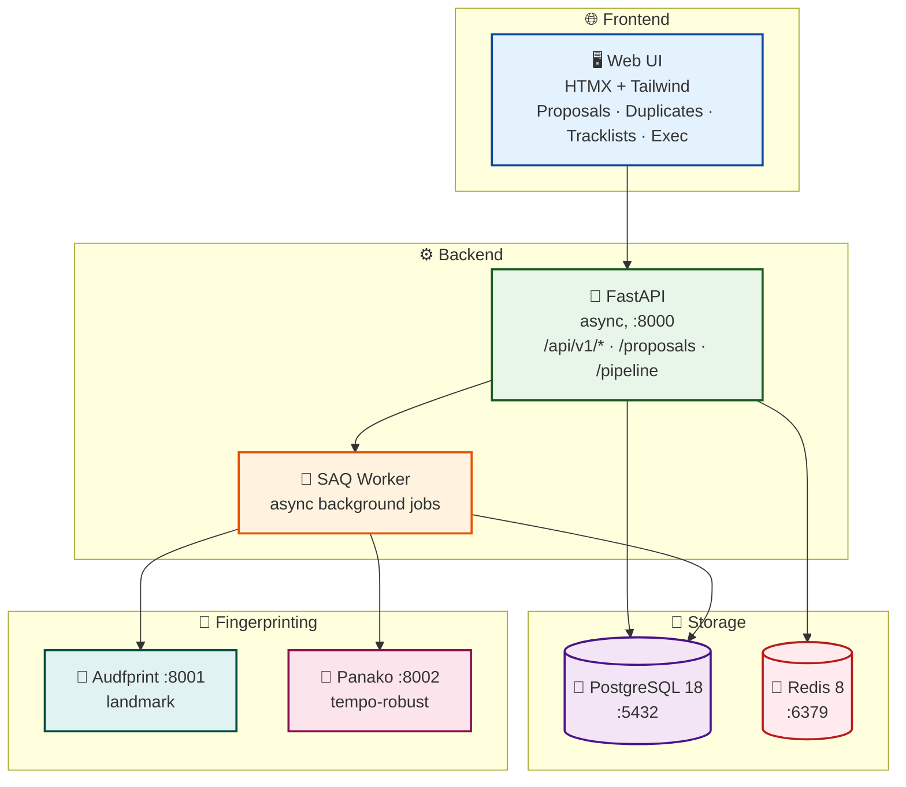
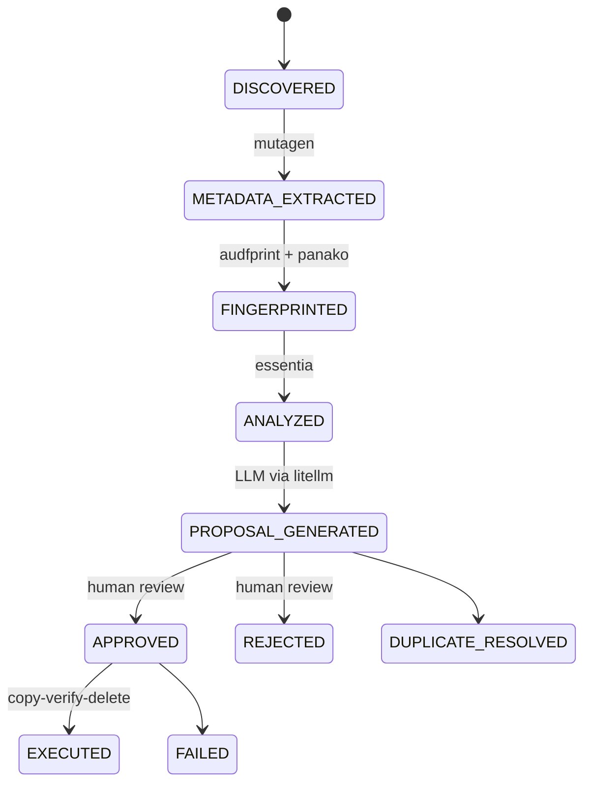

<div align="center">

<picture>
  <source media="(prefers-color-scheme: dark)" srcset="design/assets/banner_dark.png">
  <source media="(prefers-color-scheme: light)" srcset="design/assets/banner_light.png">
  
</picture>

<br><br>

[](https://github.com/SimplicityGuy/phaze/actions/workflows/ci.yml)
[](https://codecov.io/gh/SimplicityGuy/phaze)


[](https://github.com/astral-sh/uv)
[](https://just.systems)
[](https://github.com/astral-sh/ruff)
[](http://mypy-lang.org/)
[](https://github.com/pre-commit/pre-commit)
[](https://github.com/PyCQA/bandit)
[](https://www.docker.com/)
[](https://claude.ai/code)

**A music collection organizer that ingests music and concert files, fingerprints and analyzes them, uses AI to propose better filenames and destination paths, and provides a web UI to review and approve renames. All file operations use a safe copy-verify-delete protocol with full audit trails.**

</div>

<p align="center">

[🚀 Quick Start](#-quick-start) | [📖 Documentation](#-documentation) | [🌟 Features](#-key-features) | [💬 Community](#-support--community)

</p>

## 🎯 What is Phaze?

Phaze is a music collection organizer for managing a large personal archive of music and live concert recordings. It provides:

- **🎵 Audio Analysis**: BPM, key, mood, and style detection via essentia-tensorflow
- **🔍 Audio Fingerprinting**: Dual-engine deduplication with audfprint (landmark) and Panako (tempo-robust)
- **🤖 AI-Powered Renaming**: LLM-generated filename and path proposals via litellm
- **🎧 Tracklist Matching**: Concert set identification from 1001Tracklists
- **👀 Human-in-the-Loop**: Web UI to review, approve, or reject every proposed change
- **🔒 Safe File Operations**: Copy-verify-delete protocol with full audit trails -- nothing moves without review

Perfect for DJs, music collectors, and live recording enthusiasts who want their messy archives properly named, organized, and deduplicated.

## 🏛️ Architecture Overview

### ⚙️ Services

| Service      | Port | Purpose                            | Key Technologies                         |
| ------------ | ---- | ---------------------------------- | ---------------------------------------- |
| **API**      | 8000 | FastAPI application server         | `FastAPI`, `SQLAlchemy`, `asyncpg`       |
| **Worker**   | --   | SAQ async background task processor| `SAQ`, `Redis`, `essentia`, `mutagen`    |
| **Postgres** | 5432 | Primary database                   | `PostgreSQL 18`, `Alembic`               |
| **Redis**    | 6379 | Task queue broker and cache        | `Redis 8`                                |
| **Audfprint**| 8001 | Landmark-based audio fingerprinting| `audfprint`                              |
| **Panako**   | 8002 | Tempo-robust audio fingerprinting  | `Panako`                                 |

### 📐 System Architecture



See [Architecture Overview](docs/architecture.md) for detailed diagrams covering data flow, service communication, and the approval pipeline.

### 🔄 File Processing Pipeline



## 🌟 Key Features

- **🎵 Broad Format Support**: mp3, m4a, ogg, flac, wav, aiff, wma, aac, opus, plus video (mp4, mkv, avi, webm, mov) and companion files (cue, nfo, m3u)
- **🔄 Dual Fingerprinting**: Landmark-based (audfprint) and tempo-robust (Panako) engines for comprehensive deduplication
- **🤖 AI Rename Proposals**: LLM-generated filenames and paths with structured validation via Pydantic
- **🎧 Tracklist Integration**: Automatic concert set identification from 1001Tracklists with fuzzy matching
- **👀 Approval Workflow**: Every rename requires human review through the web UI
- **🔒 Safe Operations**: Copy-verify-delete protocol ensures no data loss
- **📊 Full Audit Trail**: Every file operation is tracked in PostgreSQL
- **⚡ Async Processing**: SAQ task queue with Redis for parallel file analysis
- **📝 Type Safety**: Full type hints with strict mypy validation and Bandit security scanning

## 🚀 Quick Start

### Prerequisites

- [Docker](https://docs.docker.com/get-docker/) and Docker Compose v2
- [uv](https://docs.astral.sh/uv/) (Python package manager)
- [just](https://just.systems/) (command runner)
- Python 3.13

### Setup

```bash
git clone https://github.com/SimplicityGuy/phaze.git
cd phaze
uv sync
cp .env.example .env          # Edit to configure paths and API keys
just download-models           # Required for audio analysis
just up                        # Start all services
just db-upgrade                # Run database migrations
curl http://localhost:8000/health   # Verify: {"status": "ok"}
```

| Service          | URL                     | Default Credentials         |
| ---------------- | ----------------------- | --------------------------- |
| 🌐 **Web UI**    | http://localhost:8000   | None                        |
| 🐘 **PostgreSQL**| `localhost:5432`        | `phaze` / `phaze`           |
| 🔴 **Redis**     | `localhost:6379`        | None                        |
| 🎵 **Audfprint** | http://localhost:8001   | None                        |
| 🎧 **Panako**    | http://localhost:8002   | None                        |

See the [Quick Start Guide](docs/quick-start.md) for prerequisites, local development setup, and environment configuration.

## 📖 Documentation

### 🏁 Getting Started

| Document                                   | Purpose                                           |
| ------------------------------------------ | ------------------------------------------------- |
| **[Quick Start Guide](docs/quick-start.md)** | 🚀 Get Phaze running in minutes                  |
| **[Configuration](docs/configuration.md)** | ⚙️ Environment variables and settings reference   |

### 📐 Reference

| Document                                             | Purpose                                     |
| ---------------------------------------------------- | ------------------------------------------- |
| **[API Reference](docs/api.md)**                     | 🔌 REST API endpoints and usage             |
| **[Database Schema & Migrations](docs/database.md)** | 🗄️ PostgreSQL schema and Alembic migrations |
| **[Project Structure](docs/project-structure.md)**   | 📁 Codebase layout and module organization  |

See [docs/README.md](docs/README.md) for the full documentation index.

## 👨‍💻 Development

```bash
just install          # Install dependencies
just up / just down   # Start / stop services
just test             # Run tests
just test-cov         # Tests with coverage (85% min)
just check            # Lint + typecheck + test
just pre-commit       # Run all pre-commit hooks
```

See `just --list` for the full command reference.

### 🔍 Code Quality

- **Linter/Formatter:** [Ruff](https://docs.astral.sh/ruff/) (150-char line length, double quotes)
- **Type checker:** [mypy](https://mypy-lang.org/) (strict mode, excludes tests)
- **Pre-commit hooks:** ruff, bandit, mypy, shellcheck, yamllint, actionlint, jsonschema validation
- All hooks use frozen SHAs for reproducibility

### 🚀 CI/CD

GitHub Actions runs on every push and PR:

| Job          | Description                                              |
|--------------|----------------------------------------------------------|
| **Quality**  | Pre-commit hooks (ruff, mypy, yamllint, etc.)            |
| **Test**     | pytest with PostgreSQL, coverage upload to Codecov       |
| **Security** | pip-audit, bandit, Semgrep, TruffleHog, Trivy            |

## 🛠️ Technology Stack

| Category       | Technology                              | Purpose                              |
|----------------|-----------------------------------------|--------------------------------------|
| **Runtime**    | Python 3.13                             | Application runtime                  |
| **Web**        | FastAPI + Uvicorn                       | Async API server                     |
| **Database**   | PostgreSQL 18 + SQLAlchemy + asyncpg    | Primary data store (async ORM)       |
| **Migrations** | Alembic (async template)                | Database schema management           |
| **Task Queue** | SAQ + Redis                             | Async background job processing      |
| **Audio Tags** | mutagen                                 | Read/write audio metadata            |
| **Analysis**   | essentia-tensorflow                     | BPM, key, mood, style detection      |
| **Fingerprint**| audfprint + Panako                      | Audio deduplication + identification |
| **AI/LLM**     | litellm (pinned <1.82.7)               | Unified LLM API for rename proposals |
| **Scraping**   | BeautifulSoup4 + lxml                   | 1001Tracklists integration           |
| **Matching**   | rapidfuzz                               | Fuzzy string matching                |
| **UI**         | Jinja2 + HTMX + Tailwind CSS + Alpine.js| Server-rendered interactive UI       |
| **Deploy**     | Docker Compose                          | Container orchestration              |

## 💬 Support & Community

- 🐛 **Bug Reports**: [GitHub Issues](https://github.com/SimplicityGuy/phaze/issues)
- 💡 **Feature Requests**: [GitHub Discussions](https://github.com/SimplicityGuy/phaze/discussions)
- ❓ **Questions**: [Discussions Q&A](https://github.com/SimplicityGuy/phaze/discussions/categories/q-a)
- 📖 **Full Documentation**: [docs/README.md](docs/README.md)

## 📄 License

This project is licensed under the MIT License -- see the [LICENSE](LICENSE) file for details.

## 🙏 Acknowledgments

- 🎼 [discogsography](https://github.com/SimplicityGuy/discogsography) for the CI/CD patterns, project conventions, and HTTP API integration target that shaped this project
- 🎵 [Discogs](https://www.discogs.com/) and [AcoustID](https://acoustid.org/) for music identification services
- 🎧 [1001Tracklists](https://www.1001tracklists.com/) for concert tracklist data
- 🚀 [uv](https://github.com/astral-sh/uv) for blazing-fast package management
- 🔥 [Ruff](https://github.com/astral-sh/ruff) for lightning-fast linting
- 🐍 The Python community for excellent libraries and tools

______________________________________________________________________

<div align="center">
Made with ❤️ in the Pacific Northwest
</div>
