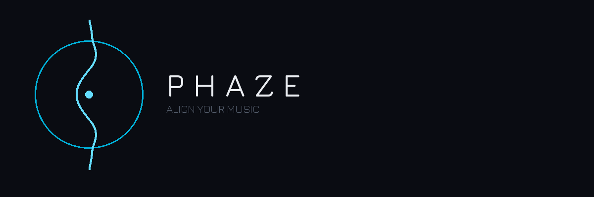
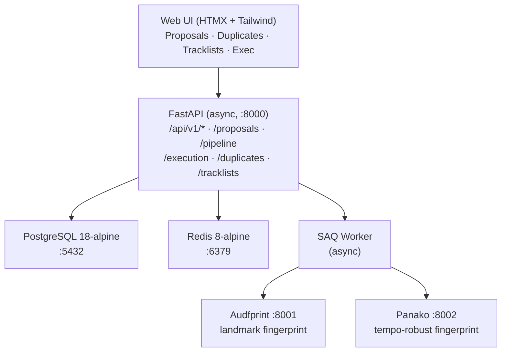
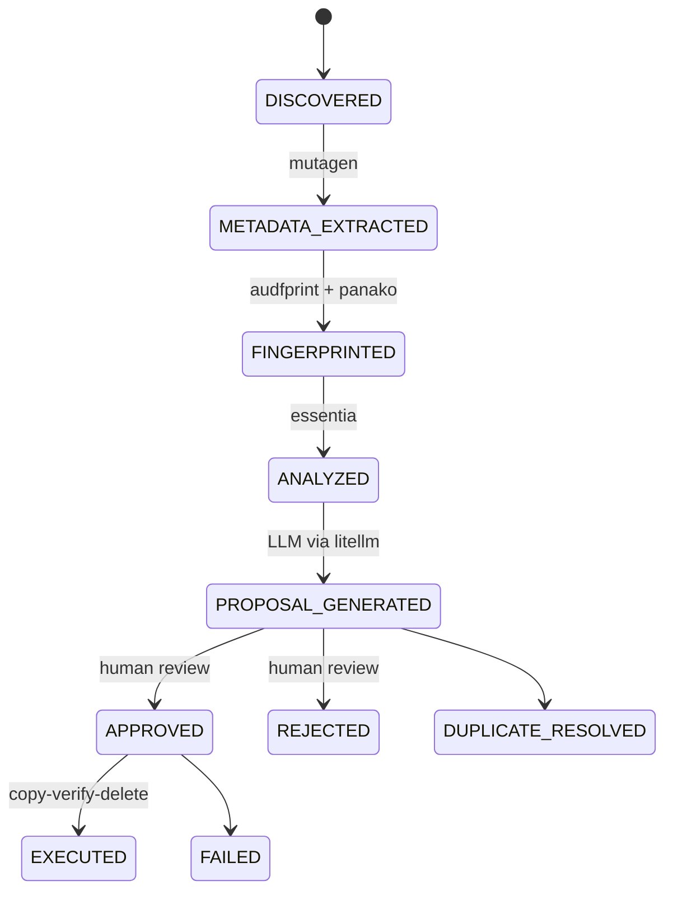

# Phaze

<div align="center">

<picture>
  <source media="(prefers-color-scheme: dark)" srcset="design/assets/banner_dark.png">
  <source media="(prefers-color-scheme: light)" srcset="design/assets/banner_light.png">
  
</picture>

<br><br>

[](https://github.com/SimplicityGuy/phaze/actions/workflows/ci.yml)
[](https://codecov.io/gh/SimplicityGuy/phaze)


[](https://github.com/astral-sh/uv)
[](https://just.systems)
[](https://github.com/astral-sh/ruff)
[](http://mypy-lang.org/)
[](https://github.com/pre-commit/pre-commit)
[](https://github.com/PyCQA/bandit)
[](https://www.docker.com/)
[](https://claude.ai/code)

**A music collection organizer that ingests music and concert files, fingerprints and analyzes them, uses AI to propose better filenames and destination paths, and provides a web UI to review and approve renames. All file operations use a safe copy-verify-delete protocol with full audit trails.**

</div>

## Architecture



## File Processing Pipeline



## Getting Started

### Prerequisites

- [Docker](https://docs.docker.com/get-docker/) and Docker Compose v2
- [uv](https://docs.astral.sh/uv/) (Python package manager)
- [just](https://just.systems/) (command runner)
- Python 3.13

### Setup

```bash
git clone https://github.com/SimplicityGuy/phaze.git
cd phaze
uv sync
cp .env.example .env          # Edit to configure paths and API keys
just download-models           # Required for audio analysis
just up                        # Start all services
just db-upgrade                # Run database migrations
curl http://localhost:8000/health   # Verify: {"status": "ok"}
```

## Services

| Service      | Port | Description                        |
|--------------|------|------------------------------------|
| **api**      | 8000 | FastAPI application server         |
| **worker**   | --   | SAQ async background task processor|
| **postgres** | 5432 | Primary database                   |
| **redis**    | 6379 | Task queue broker and cache        |
| **audfprint**| 8001 | Landmark-based audio fingerprinting|
| **panako**   | 8002 | Tempo-robust audio fingerprinting  |

## Supported File Types

| Category   | Extensions                                                       |
|------------|------------------------------------------------------------------|
| Music      | mp3, m4a, ogg, flac, wav, aiff, wma, aac, opus                  |
| Video      | mp4, mkv, avi, webm, mov, wmv, flv                              |
| Companion  | cue, nfo, txt, jpg, jpeg, png, gif, m3u, m3u8, pls, sfv, md5    |

## Development

```bash
just install          # Install dependencies
just up / just down   # Start / stop services
just test             # Run tests
just test-cov         # Tests with coverage (85% min)
just check            # Lint + typecheck + test
just pre-commit       # Run all pre-commit hooks
```

See `just --list` for the full command reference.

### Code Quality

- **Linter/Formatter:** [Ruff](https://docs.astral.sh/ruff/) (150-char line length, double quotes)
- **Type checker:** [mypy](https://mypy-lang.org/) (strict mode, excludes tests)
- **Pre-commit hooks:** ruff, bandit, mypy, shellcheck, yamllint, actionlint, jsonschema validation
- All hooks use frozen SHAs for reproducibility

### CI/CD

GitHub Actions runs on every push and PR:

| Job          | Description                                              |
|--------------|----------------------------------------------------------|
| **Quality**  | Pre-commit hooks (ruff, mypy, yamllint, etc.)            |
| **Test**     | pytest with PostgreSQL, coverage upload to Codecov       |
| **Security** | pip-audit, bandit, Semgrep, TruffleHog, Trivy            |

## Technology Stack

| Category       | Technology                              | Purpose                              |
|----------------|-----------------------------------------|--------------------------------------|
| **Runtime**    | Python 3.13                             | Application runtime                  |
| **Web**        | FastAPI + Uvicorn                       | Async API server                     |
| **Database**   | PostgreSQL 18 + SQLAlchemy + asyncpg    | Primary data store (async ORM)       |
| **Migrations** | Alembic (async template)                | Database schema management           |
| **Task Queue** | SAQ + Redis                             | Async background job processing      |
| **Audio Tags** | mutagen                                 | Read/write audio metadata            |
| **Analysis**   | essentia-tensorflow                     | BPM, key, mood, style detection      |
| **Fingerprint**| audfprint + Panako                      | Audio deduplication + identification |
| **AI/LLM**     | litellm (pinned <1.82.7)               | Unified LLM API for rename proposals |
| **Scraping**   | BeautifulSoup4 + lxml                   | 1001Tracklists integration           |
| **Matching**   | rapidfuzz                               | Fuzzy string matching                |
| **UI**         | Jinja2 + HTMX + Tailwind CSS + Alpine.js| Server-rendered interactive UI       |
| **Deploy**     | Docker Compose                          | Container orchestration              |

## Documentation

- [API Reference](docs/api.md)
- [Configuration](docs/configuration.md)
- [Database Schema & Migrations](docs/database.md)
- [Project Structure](docs/project-structure.md)

## License

[MIT](LICENSE)
