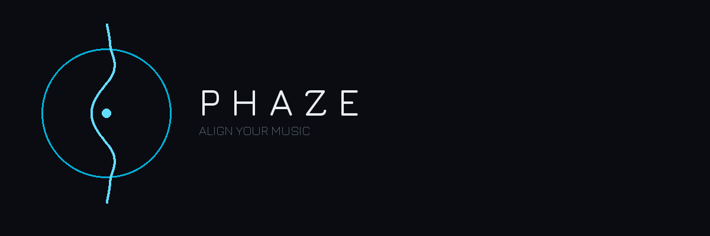
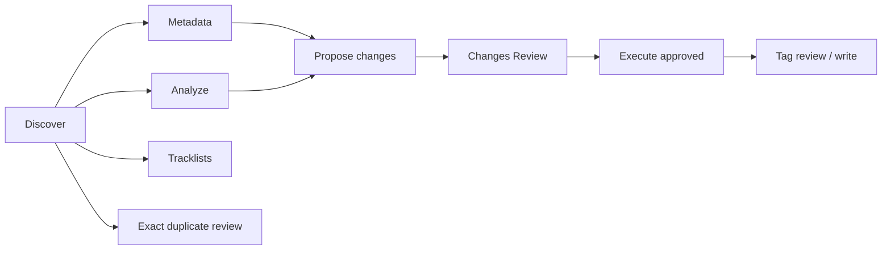
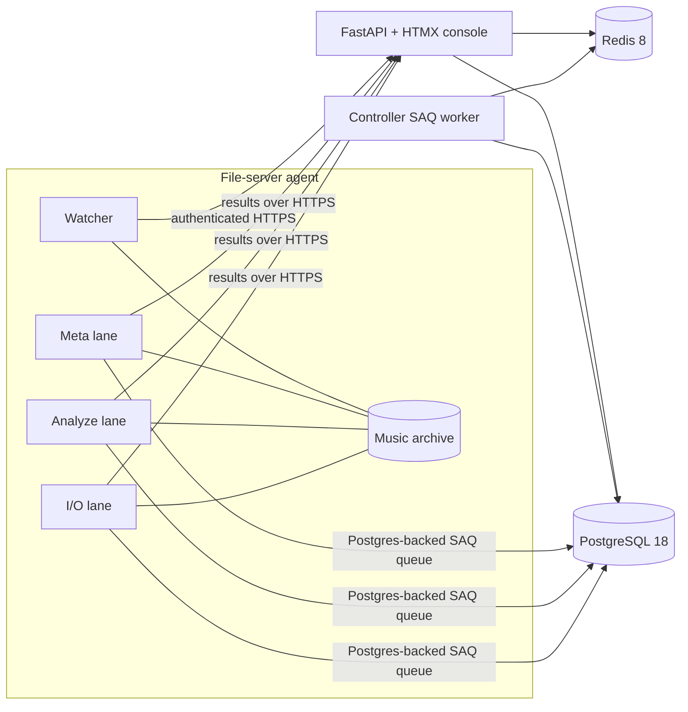

<div align="center">

<picture>
  <source media="(prefers-color-scheme: dark)" srcset="design/assets/banner_dark.png">
  <source media="(prefers-color-scheme: light)" srcset="design/assets/banner_light.png">
  
</picture>

<br><br>

[](https://github.com/SimplicityGuy/phaze/actions/workflows/ci.yml)
[](https://codecov.io/gh/SimplicityGuy/phaze)


**Organize a large music and concert archive without surrendering control of the files.**

</div>

Phaze discovers music and concert recordings, extracts metadata, performs exhaustive audio
analysis, finds tracklists, and asks an LLM to propose better filenames and destinations. Its
private admin console keeps those proposals behind a human review boundary: generation does not
authorize a change, approval does not move a file, and only an explicitly started apply batch
executes approved work.

Phaze is a single-operator application intended for a private network. It is not a hosted music
service, player, or unattended library mutator.

## What Phaze does

- Discovers audio, video, playlist, CUE, and companion files through registered file-server
  agents.
- Reads tags with Mutagen and analyzes BPM, key, mood, style, and related features with
  `essentia-tensorflow`.
- Analyzes every natural fine and coarse window. There is no sampling cap or deepen mode; live
  PCM and process peak RSS are bounded at the chunk/process boundary, and long-running work stays
  live through progress heartbeats rather than a wall-clock timeout.
- Searches and renders 1001Tracklists through a paced, resumable drain, then matches tracklists
  to Discogs data.
- Generates structured rename and destination proposals through LiteLLM.
- Presents filename and destination decisions together in **Changes Review**. Tags remain a
  separate, reversible authorization after execution.
- Applies only approved work through an agent-owned copy/verify/delete path and records the
  outcome in the audit log.
- Detects exact duplicates from discovery-time SHA-256 hashes. Audio fingerprinting was removed;
  there are no audfprint, Panako, AcoustID, or fingerprint pipeline stages.

## The operator workflow

The responsive console is one persistent shell with a labeled DAG rail organized into four
navigation groups:

| Group | Workspaces |
| --- | --- |
| Overview | Summary, Files |
| Pipeline | Discover, Metadata, Analyze, Tracklists, Propose changes |
| Review | Changes Review, Duplicates, Cue sheets, Execute approved |
| Operations | Routing, Audit log, Agents & compute lanes |

`GET /` opens the actionable Summary. Native links work normally; HTMX enhances `/s/<stage>`
navigation into in-place workspace swaps. The command palette and record drawer provide global
search and per-file context without creating alternate approval paths.

The usual flow is:


```mermaid
flowchart LR
    D[Discover] --> M[Metadata]
    D --> A[Analyze]
    M --> P[Propose changes]
    A --> P
    D --> T[Tracklists]
    P --> R[Changes Review]
    R --> E[Execute approved]
    E --> G[Tag review / write]
    D --> X[Exact duplicate review]
```

Metadata and analysis are independent enrichment stages. Steady-state advancement is
operator-triggered; startup and the Recover action only reconcile genuine queue loss and use
deterministic keys so repeated requests do not duplicate work.

## Architecture

Phaze separates decisions from file custody.


```mermaid
flowchart LR
    UI[FastAPI + HTMX console] --> PG[(PostgreSQL 18)]
    CW[Controller SAQ worker] --> PG
    UI --> R[(Redis 8)]
    CW --> R

    subgraph FS[File-server agent]
      W[Watcher]
      AM[Meta lane]
      AA[Analyze lane]
      AI[I/O lane]
      F[(Music archive)]
      W --- F
      AM --- F
      AA --- F
      AI --- F
    end

    W -->|authenticated HTTPS| UI
    AM -->|Postgres-backed SAQ queue| PG
    AA -->|Postgres-backed SAQ queue| PG
    AI -->|Postgres-backed SAQ queue| PG
    AM -->|results over HTTPS| UI
    AA -->|results over HTTPS| UI
    AI -->|results over HTTPS| UI
```

- **PostgreSQL** is the system of record and the durable SAQ broker (`saq_jobs`). Agents use a
  raw libpq `PHAZE_QUEUE_URL` for their queue pool; application ORM access remains control-side.
- **Redis** is not the task broker. It provides caches, rate limiting, execution progress, and
  operational counters.
- **The application server** runs the API/UI and controller worker without an archive mount.
- **Each file server** runs a watcher plus `analyze`, `meta`, and `io` lane workers. Archive
  mutation stays on the owning agent.
- **Optional compute backends** are declared in `backends.toml`: local, rsync/Tailscale compute
  agents, and one or more Kueue clusters with S3 staging. Ranks and caps drive tiered dispatch;
  an absent registry is local-only.

See [Architecture](docs/architecture.md), [Agent queue lanes](docs/agent-queue-lanes.md), and the
[Operator runbook](docs/runbook.md) for the detailed contracts.

## Quick start

Prerequisites are Docker with Compose v2, `uv`, `just`, and a Python 3.14-capable host. Python
support is deliberately `>=3.14,<3.15`, and `uv` is the only supported package manager.

```bash
git clone https://github.com/SimplicityGuy/phaze.git
cd phaze
cp .env.example .env
just install
just download-models
just up
```

`just install` synchronizes the Python environment and builds the Tailwind CSS bundle with the
pinned standalone binary; no Node toolchain is required. `just up` starts the application-server
stack: API, controller worker, PostgreSQL, and Redis. The API auto-migrates by default and serves
HTTPS on <https://localhost:8000>; trust `certs/phaze-ca.crt` or verify it explicitly:

```bash
curl --cacert ./certs/phaze-ca.crt https://localhost:8000/health
```

This brings up the control plane, not a production file-server agent. Follow the
[Quick Start](docs/quick-start.md) for a local walkthrough and the
[Deployment Guide](docs/deployment.md) to register agents, distribute the internal CA, pin images,
and deploy the split stacks.

## Development and validation

Always run project tools through `uv run` or a `just` recipe:

```bash
uv sync
uv run ruff check .
uv run mypy .
uv run pytest tests/shared/core/test_shell_routes.py
uv run pre-commit run --all-files
```

The full suite needs the shared PostgreSQL/Redis test harness:

```bash
just test-db
just check
```

`just check` runs lint, type checking, and the full pytest suite. A trustworthy pytest header names
a database on port 5433 and says the session holds the exclusive lock. An unreachable harness or
`PHAZE_TEST_DB_ALLOW_SHARED=1` produces an unlocked run whose failures are not concurrency-safe.

For concurrent worktrees, never share PostgreSQL or Redis. Allocate a seat and copy all three
exports printed by the recipe:

```bash
just test-db-for my-seat
```

The seat name is normalized and hashed, and Redis receives a dedicated logical database. Do not
hand-construct these values. One database also supports only one pytest process; the session lock
refuses a competing process before collection.

Browser contracts are a separate real-application Playwright suite:

```bash
just test-browser-install  # once per machine
just test-browser
```

The suite is excluded from default pytest, boots the real app against PostgreSQL and Redis, and
requires the compiled Tailwind bundle. CI runs it as a blocking job (promoted 2026-08-21,
`phaze-8p1uq`) and uploads traces, screenshots, and logs on failure.

To refresh Repowise with both line coverage and per-test coverage contexts:

```bash
just repowise-coverage my-seat
```

## Deployment

Production uses separate Compose files:

| File | Placement | Services |
| --- | --- | --- |
| `docker-compose.yml` | Application server | `api`, controller `worker`, `postgres`, `redis` |
| `docker-compose.agent.yml` | Each file server | `worker-analyze`, `worker-meta`, `worker-io`, `watcher` |
| `docker-compose.cloud-agent.yml` | Optional compute host | One analysis-only compute worker |
| `docker-compose.dev.yml` | Local development overlay | Reloading API/worker overrides |

Production image tags use CalVer `YYYY.M.REVISION` and should be pinned rather than left at
`latest`. The complete rollout, rollback, TLS, secrets, release, and image-publish procedures live
in [Deployment](docs/deployment.md). Kueue and compute-agent setup live in
[Kubernetes burst](docs/k8s-burst.md), [Cloud burst](docs/cloud-burst.md), and
[Multi-compute](docs/multi-compute.md).

## Documentation map

- [Documentation index](docs/README.md)
- [Configuration reference](docs/configuration.md)
- [Database and migrations](docs/database.md)
- [API and HTMX endpoints](docs/api.md)
- [Project structure](docs/project-structure.md)
- [Essentia analysis constraints](docs/essentia-analysis.md)
- [UI compatibility reference](docs/ui-design-reference.md)
- [Architecture decisions](docs/design/)
- [Documentation audit inventory](docs/documentation-audit-2026-08-19.md)

The dated spike, design-specification, incident, and `.planning/` trees are retained evidence, not
the current operator manual. Their measurements and historical decisions remain exact; use the
canonical pages above for current behavior.

## License

Phaze is released under the [MIT License](LICENSE).
