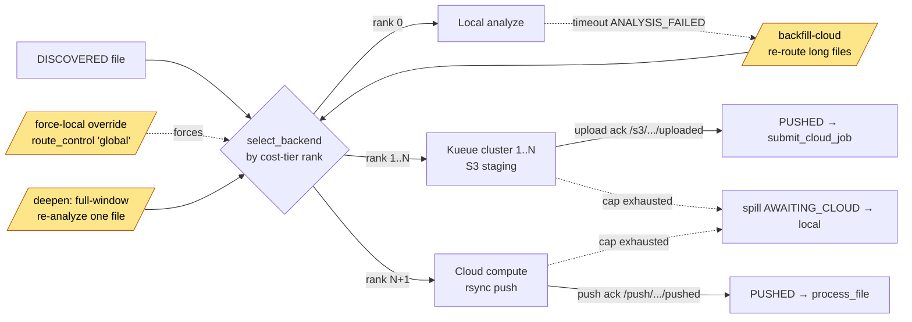

<!-- generated-by: gsd-doc-writer -->
# API Reference

## v7.0 Console (shell)

The v7.0 "Hybrid Console" three-column shell. `shell.py` owns the application root (`GET /`) and the per-stage rail-node workspaces; `record.py` serves the per-file full-record fragment.

| Method | Path              | Description                                                              |
|--------|-------------------|-------------------------------------------------------------------------|
| GET    | `/`               | DAG console shell root (Analyze node selected by default)               |
| GET    | `/s/{stage}`      | Single rail-node stage workspace (`stage` whitelisted via `STAGE_PARTIALS`; unknown stage 404s) |
| GET    | `/record/{file_id}` | Per-file full-record read-only detail fragment (typed `uuid.UUID`, strictly `file_id`-scoped) |

A direct/bookmark navigation to `/` or `/s/{stage}` renders the full shell chrome; an `HX-Request` rail swap returns a bare content fragment. `stage` is never interpolated into a template path — the partial name always comes from the static `STAGE_PARTIALS` dict (template-path-injection mitigation, T-57-01).

## Health

| Method | Path      | Description     |
|--------|-----------|-----------------|
| GET    | `/health` | Health check (verifies DB connectivity) |

## Scan (`/api/v1`)

| Method | Path                     | Description                          |
|--------|--------------------------|--------------------------------------|
| POST   | `/api/v1/scan`           | Start file discovery scan            |
| GET    | `/api/v1/scan/{batch_id}`| Get scan progress and status         |

## Pipeline (`/api/v1`, `/pipeline`)

| Method | Path                           | Description                              |
|--------|--------------------------------|------------------------------------------|
| POST   | `/api/v1/extract-metadata`     | Enqueue metadata extraction jobs (operator-triggered only) |
| POST   | `/api/v1/fingerprint`          | Enqueue fingerprint jobs                 |
| GET    | `/api/v1/fingerprint/progress` | Fingerprint processing progress          |
| POST   | `/api/v1/analyze`              | Enqueue audio analysis jobs              |
| POST   | `/api/v1/proposals/generate`   | Enqueue LLM proposal generation          |
| GET    | `/pipeline/`                   | Pipeline dashboard (HTML)                |
| GET    | `/pipeline/stats`              | Pipeline stats bar + per-job-type DAG node counts (HTMX partial) |
| POST   | `/pipeline/extract-metadata`   | HTMX trigger for metadata extraction     |
| POST   | `/pipeline/fingerprint`        | HTMX trigger for fingerprinting          |
| POST   | `/pipeline/analyze`            | HTMX trigger for audio analysis          |
| POST   | `/pipeline/proposals`          | HTMX trigger for proposal generation     |
| POST   | `/pipeline/search-tracklists`  | HTMX trigger for bulk name-based tracklist search (Phase 39) |
| POST   | `/pipeline/scan-live-sets`     | HTMX trigger for bulk per-agent fingerprint scan (Phase 40) |
| POST   | `/pipeline/scrape-tracklists`  | HTMX trigger for bulk tracklist scraping over the pending set (Phase 41) |
| POST   | `/pipeline/match-tracklists`   | HTMX trigger for bulk Discogs matching over the pending set (Phase 41) |
| POST   | `/pipeline/recover`            | HTMX trigger for manual restart/queue-loss recovery across all stages (Phase 42) |

Each stage has a JSON trigger (`/api/v1/*`) and an HTMX twin (`/pipeline/*`) that wraps the same enqueue logic and returns a `trigger_response.html` fragment. Both forms enqueue work in a fire-and-forget background task and return immediately with the expected job count, so a large backlog never blocks the HTTP response.

**Complete payloads (Phase 30 / 35).** The three agent-task triggers build and enqueue the *full* validated payload, never a bare `file_id`:

- `analyze` → `process_file` enqueues a 5-field `ProcessFilePayload` (`file_id`, `original_path`, `file_type`, `agent_id`, models path) via the shared `services.analysis_enqueue.enqueue_process_file` producer.
- `extract-metadata` → `extract_file_metadata` enqueues `ExtractMetadataPayload` (`file_id`, `original_path`, `file_type`, `agent_id`).
- `fingerprint` → `fingerprint_file` enqueues `FingerprintFilePayload` (`file_id`, `original_path`, `agent_id`).

The agent worker validates each payload with `extra="forbid"`, so a `file_id`-only enqueue would dead-letter every job. The per-file deterministic SAQ key (e.g. `process_file:<file_id>`) is applied centrally by the `before_enqueue` hook (35-01), letting a repeat enqueue of an in-flight file collapse to a no-op.

**Routing & agent availability.** All three agent-task triggers resolve a target queue through `services.enqueue_router.resolve_queue_for_task`. When no non-revoked agent is active, the JSON triggers return `{"enqueued": 0, "message": "No active agent available — start an agent worker and retry"}` and the HTMX triggers render a `no_active_agent` fragment instead of enqueuing.

**Metadata extraction is operator-triggered only (Phase 35, D-06).** The `POST /api/internal/agent/files` discovery upsert no longer auto-enqueues metadata extraction — discovery only persists file rows. `extract-metadata` (JSON or HTMX) is now the sole producer of `extract_file_metadata` jobs, and it queues every music/video file regardless of state (backfill/re-extraction).

**`proposals` convergence gate.** `proposals/generate` (and the HTMX `/pipeline/proposals`) only enqueues files that have *both* a `FileMetadata` and an `AnalysisResult` row, chunked into batches of `settings.llm_batch_size` (default 10). `generate_proposals` is a batch task (one job per batch), routed through the same `enqueue_router`.

**Bulk tracklist search (Phase 39).** The DAG's Scan / Search node is a manual trigger: `POST /pipeline/search-tracklists` enqueues one `search_tracklist` job per eligible file (music/video files that do **not** already have a linked tracklist), routed through `enqueue_router` to the **controller** queue (`search_tracklist` is a controller task — Phase-30 rule, never the default queue). The button is gated disabled until Metadata has produced tags (`metadataDone > 0`, reason `Needs metadata`) and while a search batch is in flight (`searchBusy > 0`, reason `Search busy`). The deterministic key `search_tracklist:<file_id>` dedups in-flight re-runs, so a double-click/refresh cannot multiply the backlog. Manual only — no auto-trigger (automatic enqueue is reserved for the recovery pass).

**Bulk fingerprint scan (Phase 40).** The DAG's Fingerprint-Scan node ("Identify Set") is the sibling tracklist head — a manual trigger: `POST /pipeline/scan-live-sets` enqueues one `scan_live_set` job per eligible file (the same eligible set as Search: music/video files that do **not** already have a linked tracklist), routed through `enqueue_router` to the **per-agent** queue (`phaze-agent-<id>`). `scan_live_set` is a *per-agent* task (it reads the audio on the file-server agent and POSTs back a resolved tracklist), so when no agent is online `resolve_queue_for_task` raises `NoActiveAgentError`; the endpoint catches it, enqueues nothing, and renders a visible no-active-agent empty-state (status 200, never 500) — never the consumer-less default queue. Every enqueued job carries the **complete** `ScanLiveSetPayload` (`file_id`, `original_path`, `agent_id`); a `file_id`-only enqueue would dead-letter every job against its `extra="forbid"` validation (the v4.0.8 payload-incident class), so the correct full-payload producer is used (not the single-file `tracklists.trigger_scan`). The button is gated disabled until there are discovered files **and** an online agent (`discovered === 0` → `No files discovered`; `agentOnline === 0` → `Needs agent`) and while a scan batch is in flight (`scanBusy > 0` → `Scan busy`). The deterministic key `scan_live_set:<file_id>` dedups in-flight re-runs, so a double-click/refresh cannot multiply the backlog. Manual only — no auto-trigger (automatic enqueue is reserved for the recovery pass). Both Search and Fingerprint-Scan run independently over all files with **no fallback**; either producer satisfies the downstream Scrape "tracklist exists" gate.

**Bulk scrape + match (Phase 41).** The DAG's two downstream tracklist nodes are now manual triggers, each "bulk over pending". `POST /pipeline/scrape-tracklists` enqueues one `scrape_and_store_tracklist` job per **pending scrape** tracklist (every tracklist with **no** scraped version yet — the exact complement of `get_stage_progress`'s `scrape.done`, computed server-side as `select(Tracklist).where(~exists(version))`). `POST /pipeline/match-tracklists` enqueues one `match_tracklist_to_discogs` job per **pending match** tracklist (every tracklist **not** reachable from `discogs_links` via the `version → track → link` walk — the complement of `match.done`). Both tasks are **controller** tasks (Phase-30 rule), routed through `enqueue_router.resolve_queue_for_task` to the **controller** queue — never the consumer-less default queue, and they never raise `NoActiveAgentError` (no agent empty-state). Already-complete tracklists are skipped from each pending set, and the deterministic keys `scrape_and_store_tracklist:<tracklist_id>` / `match_tracklist_to_discogs:<tracklist_id>` dedup in-flight replays, so a double-click/refresh cannot multiply the backlog. Both buttons are gated disabled: **"Needs tracklist"** until at least one tracklist exists (`scrapeTotal`/`matchTotal === 0`); **"Scraping…"/"Matching…"** while a batch is in flight (`scrapeBusy`/`matchBusy > 0`, checked **before** the nothing-pending state so a running batch is always visible); and **"All scraped"/"All matched"** once the pending set is empty (`(total − done) <= 0`). The endpoints enqueue nothing and return 200 (rendering the tracklist-unit empty-state `No tracklists ready for scraping`/`matching`) when the pending set is empty. Manual only — no auto-trigger (automatic enqueue is reserved for the recovery pass).

**Recovery-only automation model (Phase 42).** Steady state produces **zero** automatic enqueues — every stage advances only when the operator clicks its trigger. The **only** automatic enqueue is a single gated recovery pass on controller startup: `recover_orphaned_work(ctx)` runs a `count_inflight_jobs` queue-loss detector and **no-ops** when any `saq_jobs` row is queued/active. Since Phase 36 the SAQ broker is **Postgres** (durable across restarts — SAQ re-dequeues the surviving `saq_jobs` rows itself), so a normal reboot loses nothing and recovery is a no-op; it reconciles all eight stages only on a genuine queue-loss (truncate / restore-from-backup / fresh migration). The every-5-min `reenqueue_discovered` auto-advance cron (and the producer itself) were **removed** — `reap_stalled_scans` (every minute) and `refresh_tracklists` (monthly) are unchanged. The DAG's global **Recover** button (`POST /pipeline/recover`) calls the **same** idempotent producer with `force=True` as the cold-boot safety net (D-05): `force` bypasses **only** the no-op detect gate, never the per-item dedup, so a forced reconcile over a live queue collapses every still-in-flight item to a skipped no-op. Every re-enqueue flows through the identical deterministic-key producers the manual triggers use (`<task>:<natural_id>`), so recovery and manual paths cannot drift and recovery can never double the backlog (the Phase-32 doubling class is closed). The endpoint schedules the producer fire-and-forget in a background task and returns a "recovery started" fragment immediately, so it never blocks or 500s the HTTP response.

**DAG node counts on the 5s poll.** `GET /pipeline/stats` is polled every 5s by the dashboard. Alongside the stats bar it emits `hx-swap-oob` seed paragraphs with the id contract `dag-seed-<storeKey>` (one per DAG node sub-key: `metadataDone`/`metadataTotal`, `fingerprintDone`/`fingerprintTotal`, `analyzeDone`/`analyzeTotal`, `tracklistDone`, `searchBusy` (Phase 39, the Search-node in-flight gate), `scanBusy` + `agentOnline` (Phase 40, the Fingerprint-Scan node's in-flight gate + online-agent signal), `scrapeDone`/`scrapeTotal`, `scrapeBusy` (Phase 41, the Scrape-node in-flight gate), `matchDone`/`matchTotal`, `matchBusy` (Phase 41, the Match-node in-flight gate), `proposalsDone`/`proposalsTotal`, `approved`, `executedDone`/`executedTotal`). Each per-node `done`/`total` is reconciled from `get_stage_progress` (DB-truth, the authority) with the maintained Redis `completed` counters as a degrade backstop, so the poll never 500s on a Redis hiccup. The `scanBusy` (in-flight `scan_live_set` count) and `agentOnline` (online-agent count) reads each run inside a degrade-safe SAVEPOINT and fall back to `0` on any DB error — `agentOnline === 0` fails closed (the node stays blocked "Needs agent"), so a liveness-read outage can never enable a scan with no agent. The 35-05 DAG canvas mirrors these store keys.

### Multi-cloud backend lanes (2026.7.1)

Operator overrides and control-side agent callbacks for the pluggable multi-backend routing lanes (local → Kueue(N) → cloud-compute, cost-tier ranks). These extend the pipeline dashboard with cloud-lane controls and back the S3-staging / rsync-push transports.

| Method | Path                                   | Description                                                                 |
|--------|----------------------------------------|-----------------------------------------------------------------------------|
| POST   | `/pipeline/backfill-cloud`             | Backfill timed-out long files (`ANALYSIS_FAILED ∧ duration ≥ threshold`) to the cloud lane (HTMX) |
| POST   | `/pipeline/files/{file_id}/deepen`     | Re-analyze one file at the full/unbounded window budget (`fine_cap=0`/`coarse_cap=0`) (HTMX) |
| POST   | `/pipeline/routing/force-local`        | Flip the global force-local routing override (durable `route_control` `'global'` row) (HTMX) |

`force-local` engages/reverts an all-local routing override in one click with no redeploy; it is the write surface for the `route_control` mechanism and returns the re-rendered header pill plus an OOB toast. `backfill-cloud` and `deepen` route through the same duration router / `enqueue_router` seams as "Run Analysis" (never the consumer-less default queue), and both honor the force-local / cloud-enabled gates.

**Control-side agent callbacks (`/api/internal/agent`).** The Postgres-free file-server / compute / pod agents cannot touch the ORM, so the S3-staging and rsync-push transports report outcomes through these token-authed internal callbacks (same bearer-token contract as the Distributed Agent API below; `file_id` always on the URL path, never the body).

| Method | Path                                                | Description                                                                 |
|--------|-----------------------------------------------------|-----------------------------------------------------------------------------|
| POST   | `/api/internal/agent/s3/{file_id}/uploaded`         | S3-staging multipart-upload success ack (control completes the multipart, flips `cloud_job` `UPLOADING → UPLOADED`) |
| POST   | `/api/internal/agent/s3/{file_id}/failed`           | S3-staging upload failure (bounded re-drive, or terminal cleanup + spill to `AWAITING_CLOUD` at the cap) |
| POST   | `/api/internal/agent/push/{file_id}/pushed`         | rsync push success (`PUSHING → PUSHED` + ledger clear + `process_file` enqueue on the compute queue) |
| POST   | `/api/internal/agent/push/{file_id}/mismatch`       | rsync post-transfer sha256 mismatch (capped re-drive, or spill to `AWAITING_CLOUD` at the cap) |
| POST   | `/api/internal/agent/files/{file_id}/presign-download` | Mint a fresh short-TTL presigned GET URL for a file's staged bytes (409 unless `cloud_job` is `UPLOADED`) |



### Per-stage pause / priority controls (drain scheduler)

Operator controls that steer the three agent pipeline stages (`metadata` / `analyze` / `fingerprint`) at runtime. Each endpoint mutates the durable `PipelineStageControl` intent row **and** the live `saq_jobs` backlog in one transaction, then returns `{stage, priority, paused}` from the control row. `stage` is validated against the `STAGE_TO_FUNCTION` allowlist (unknown stage → 422).

| Method | Path                                  | Description                                                              |
|--------|---------------------------------------|-------------------------------------------------------------------------|
| POST   | `/pipeline/stages/{stage}/priority`   | Apply a signed priority delta (clamped `[0,100]`, lower dequeues sooner) and reorder the queued backlog |
| POST   | `/pipeline/stages/{stage}/pause`      | Drain-pause: active jobs finish, the queued backlog is parked           |
| POST   | `/pipeline/stages/{stage}/resume`     | Un-park ONLY the pause-parked backlog rows                              |

## Pipeline Scans (`/pipeline/scans`)

Admin-UI endpoints that drive the user-initiated scan flow on the pipeline dashboard. Separate from the `pipeline` router (which serves the dashboard page and pipeline-stage triggers).

| Method | Path                           | Description                                        |
|--------|--------------------------------|----------------------------------------------------|
| GET    | `/pipeline/scans/agent-roots`  | Agent scan-root selector (HTMX partial)            |
| GET    | `/pipeline/scans/recent`       | Recent Scans mini-table (HTMX 5s poll partial)     |
| POST   | `/pipeline/scans`              | Create a scan batch and dispatch it to an agent    |
| GET    | `/pipeline/scans/{batch_id}`   | Scan-batch progress (HTMX poll partial)            |
| DELETE | `/pipeline/scans/{batch_id}`   | Delete a terminal scan + all associated DB data (HTMX) |

Only **terminal** scans (`completed` / `failed`) are deletable; the delete runs an ordered transactional cascade that removes the `ScanBatch` and every row that hangs off its files (metadata, analysis, fingerprints, proposals + execution log, tracklists → versions → tracks → discogs links, tag-write log, file companions, files), scoped strictly to that batch. A `running` scan or the `live` watcher sentinel returns **409** and is never deleted. On success the endpoint returns the re-rendered Recent Scans table for an HTMX `outerHTML` swap into `#recent-scans`.

## Proposals (`/proposals`)

| Method | Path                          | Description                        |
|--------|-------------------------------|------------------------------------|
| GET    | `/proposals/`                 | List proposals (HTML, filterable)  |
| PATCH  | `/proposals/{id}/approve`     | Approve a proposal                 |
| PATCH  | `/proposals/{id}/reject`      | Reject a proposal                  |
| PATCH  | `/proposals/{id}/undo`        | Revert to pending                  |
| GET    | `/proposals/{id}/detail`      | Expanded detail panel              |
| GET    | `/proposals/{id}/timeline`    | Windowed multi-lane analysis timeline |
| PATCH  | `/proposals/{id}/edit`        | Inline-edit a pending proposal's filename/path |
| PATCH  | `/proposals/bulk-approve-high-confidence` | Server-predicate bulk approve (confidence ≥ 0.9) |
| PATCH  | `/proposals/bulk`             | Bulk approve/reject                |

## Execution (`/execution`, `/audit`)

| Method | Path                              | Description                          |
|--------|-----------------------------------|--------------------------------------|
| POST   | `/execution/start`                | Start batch execution (copy-verify-delete) |
| GET    | `/execution/progress/{batch_id}`  | SSE stream with real-time progress   |
| GET    | `/audit/`                         | Audit log (HTML, filterable)         |

## Duplicates (`/duplicates`)

| Method | Path                          | Description                        |
|--------|-------------------------------|------------------------------------|
| GET    | `/duplicates/`                | List duplicate groups (HTML)       |
| GET    | `/duplicates/{hash}/compare`  | Comparison table for a group       |
| POST   | `/duplicates/{hash}/resolve`  | Mark non-canonical as duplicates   |
| POST   | `/duplicates/{hash}/undo`     | Undo resolution                    |
| POST   | `/duplicates/resolve-all`     | Bulk resolve all groups            |
| POST   | `/duplicates/undo-all`        | Undo bulk resolution               |

## Tracklists (`/tracklists`)

| Method | Path                                    | Description                          |
|--------|-----------------------------------------|--------------------------------------|
| GET    | `/tracklists/`                          | List tracklists (HTML, filterable)   |
| GET    | `/tracklists/scan`                      | Show unscanned files                 |
| POST   | `/tracklists/scan`                      | Trigger fingerprint scan             |
| GET    | `/tracklists/scan/status`               | Scan progress                        |
| GET    | `/tracklists/{id}/tracks`               | View tracks in tracklist             |
| POST   | `/tracklists/{id}/link`                 | Manually link to file                |
| POST   | `/tracklists/{id}/unlink`               | Remove link                          |
| POST   | `/tracklists/{id}/rescrape`             | Re-scrape from 1001Tracklists        |
| POST   | `/tracklists/{id}/approve`              | Approve tracklist                    |
| POST   | `/tracklists/{id}/reject`               | Reject tracklist                     |
| GET    | `/tracklists/{id}/search`               | Search for better match              |
| POST   | `/tracklists/search`                    | Manual tracklist search              |
| POST   | `/tracklists/{id}/reject-low`           | Bulk reject low-confidence tracks    |
| POST   | `/tracklists/{id}/match-discogs`        | Match tracklist to Discogs           |
| POST   | `/tracklists/{id}/bulk-link`            | Bulk link tracks to Discogs          |
| POST   | `/tracklists/{id}/undo-link`            | Undo auto-link                       |
| GET    | `/tracklists/{id}/tracks/{tid}/discogs` | Get Discogs match candidates         |
| POST   | `/tracklists/discogs-links/{id}/accept` | Accept Discogs link                  |
| DELETE | `/tracklists/discogs-links/{id}`        | Dismiss Discogs link                 |
| GET    | `/tracklists/tracks/{id}/edit/{field}`  | Inline edit UI                       |
| PUT    | `/tracklists/tracks/{id}/edit/{field}`  | Save inline edit                     |
| DELETE | `/tracklists/tracks/{id}`               | Delete track                         |

## Tags (`/tags`)

| Method | Path                          | Description                        |
|--------|-------------------------------|------------------------------------|
| GET    | `/tags/`                      | List files with tag metadata (HTML)|
| GET    | `/tags/{file_id}/compare`     | Tag comparison panel               |
| GET    | `/tags/{file_id}/edit/{field}`| Inline edit input                  |
| PUT    | `/tags/{file_id}/edit/{field}`| Save inline edit                   |
| POST   | `/tags/{file_id}/write`       | Execute tag write to file          |
| POST   | `/tags/bulk-write-no-discrepancies` | Server-predicate bulk tag-write over files with no discrepancies |
| POST   | `/tags/{file_id}/undo`        | Undo a tag write (restore prior tags) |

## CUE Sheets (`/cue`)

| Method | Path                          | Description                        |
|--------|-------------------------------|------------------------------------|
| GET    | `/cue/`                       | CUE sheet management page (HTML)   |
| POST   | `/cue/{tracklist_id}/generate`| Generate CUE file for a tracklist  |
| POST   | `/cue/generate-batch`         | Batch generate CUE files           |

## Search (`/search`)

| Method | Path        | Description                              |
|--------|-------------|------------------------------------------|
| GET    | `/search/`  | Global search page (HTML)                |

## Companion Files (`/api/v1`)

| Method | Path                    | Description                              |
|--------|-------------------------|------------------------------------------|
| POST   | `/api/v1/associate`     | Link companion files to media files      |
| GET    | `/api/v1/duplicates`    | List duplicate groups by SHA256          |

## Preview (`/preview`)

| Method | Path        | Description                              |
|--------|-------------|------------------------------------------|
| GET    | `/preview/` | Directory tree of approved proposals     |

## Agents Admin (`/admin/agents`)

Operator-facing liveness page for registered worker agents. Read-only; these endpoints serve HTML and HTMX partials and are not part of the authenticated agent contract below.

| Method | Path                   | Description                                    |
|--------|------------------------|------------------------------------------------|
| GET    | `/admin/agents`        | Agent liveness page (HTML)                     |
| GET    | `/admin/agents/_table` | Agent liveness table (HTMX poll partial, ~5s)  |

## SAQ Monitoring UI (`/saq`)

SAQ's built-in queue-monitoring dashboard, mounted into the `phaze-api` app at the `/saq` subpath (not the standalone `saq --web` server, no extra bound port). It is wired up during app startup and reuses the lifespan-created SAQ queue instances — the named **controller** queue plus one queue per non-revoked agent — so it opens no second Redis connection pool. The Pipeline Dashboard links to it via a **Queue Monitor ↗** link in the page header.

The mount is gated by `PHAZE_ENABLE_SAQ_UI` (default on; see [configuration.md](configuration.md)). When disabled, no `/saq` route is registered.

**Authentication:** intentionally none at the app layer. Like `/admin/agents`, `/saq` is only reachable behind the reverse proxy that terminates TLS and enforces internal-realm auth.

| Method | Path    | Description                                       |
|--------|---------|---------------------------------------------------|
| GET    | `/saq/` | SAQ monitoring dashboard (queues, workers, jobs)  |

## Distributed Agent API (`/api/internal/agent`)

These endpoints form the HTTP contract used by remote worker agents. They back the distributed-execution work added in Phases 26-29 (HTTP-backed agent worker, watcher service, and distributed execution dispatch): a remote agent walks the filesystem, fingerprints and analyzes audio, and reports results back to the central server over this API rather than touching the database directly.

**Authentication:** Every endpoint in this section requires a per-agent bearer token. Send it in the `Authorization` header:

```http
Authorization: Bearer phaze_agent_<32 urlsafe-base64 bytes>
```

The server stores only `sha256(token)` (in `agents.token_hash`) and verifies each request with a single indexed lookup that excludes revoked agents. A missing or malformed header returns `401 Unauthorized` (with `WWW-Authenticate: Bearer`); a well-formed token whose hash is unknown or whose agent row has been revoked returns `403 Forbidden`. The two 403 cases are intentionally indistinguishable. Revocation takes effect on the next request with no server restart.

| Method | Path                                                  | Description                                                                 |
|--------|-------------------------------------------------------|----------------------------------------------------------------------------|
| GET    | `/api/internal/agent/whoami`                          | Agent identity probe (returns the calling agent's identity)                 |
| POST   | `/api/internal/agent/heartbeat`                       | Liveness signal; updates `last_seen_at` and `last_status` (204 No Content)  |
| POST   | `/api/internal/agent/files`                           | Idempotent chunked upsert of discovered file records (persists rows only; no auto-enqueue, `enqueued` is always 0 per Phase 35 D-06) |
| PUT    | `/api/internal/agent/metadata/{file_id}`              | Idempotent tag-metadata write for a file                                    |
| POST   | `/api/internal/agent/metadata/{file_id}/failed`       | Terminal-ack for a retries-exhausted `extract_file_metadata` run (clears the ledger row) |
| PUT    | `/api/internal/agent/fingerprints/{file_id}/{engine}` | Idempotent fingerprint write keyed on `(file_id, engine)`                   |
| POST   | `/api/internal/agent/fingerprints/{file_id}/failed`   | Terminal-ack for a retries-exhausted `fingerprint_file` run (clears the ledger row) |
| PUT    | `/api/internal/agent/analysis/{file_id}`              | Idempotent audio-analysis upsert for a file                                 |
| POST   | `/api/internal/agent/analysis/{file_id}/progress`     | Counter-only mid-flight progress upsert (fine-window counts; no completion side effects) |
| POST   | `/api/internal/agent/analysis/{file_id}/failed`       | Mark a file's analysis terminally failed (`ANALYSIS_FAILED`)                |
| POST   | `/api/internal/agent/tracklists`                       | Idempotent atomic create of a tracklist + version + tracks (keyed on `request_id`) |
| POST   | `/api/internal/agent/tracklists/{file_id}/scanned`     | Terminal-ack for a no-match / failed `scan_live_set` run (clears the ledger row) |
| PATCH  | `/api/internal/agent/proposals/{proposal_id}/state`   | Joint Proposal + FileRecord state transition in one transaction            |
| POST   | `/api/internal/agent/execution-log`                   | Create an execution-log (audit-trail) row; agent supplies the row `id`      |
| PATCH  | `/api/internal/agent/execution-log/{execution_log_id}`| Update an existing execution-log row                                        |
| POST   | `/api/internal/agent/exec-batches/{batch_id}/progress`| Report a per-proposal terminal-state event for an execution batch           |
| PATCH  | `/api/internal/agent/scan-batches/{batch_id}`         | Advance a scan-batch state-machine (with cross-tenant guard)               |
