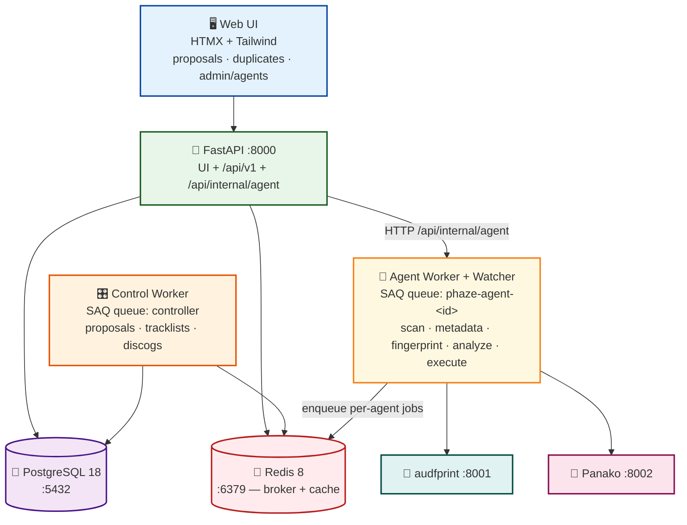
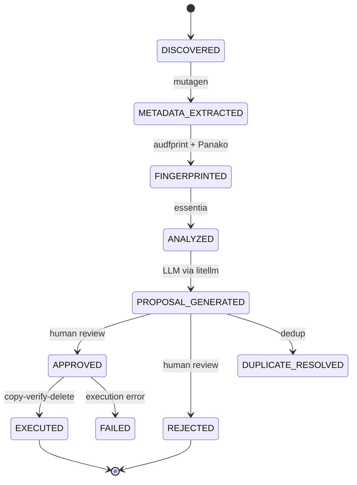
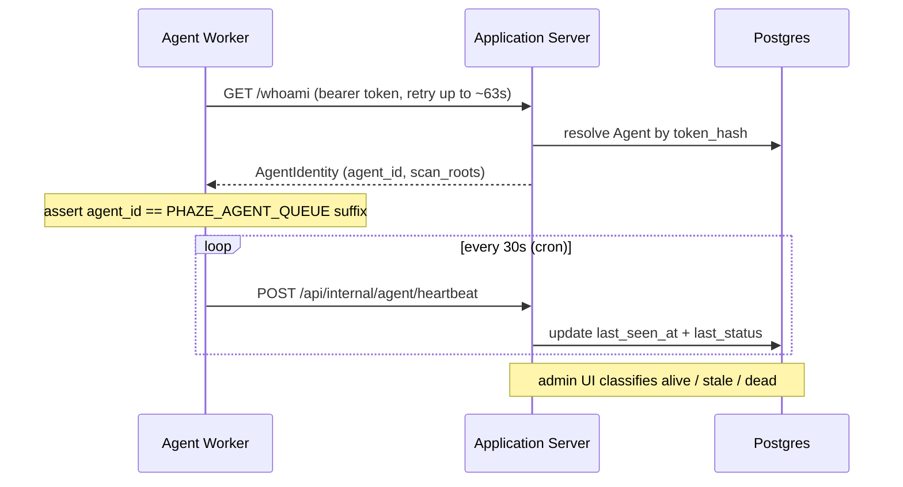

<!-- generated-by: gsd-doc-writer -->
# 🏛️ Architecture Overview

This document covers Phaze's internals in depth: the full processing pipeline, how
services communicate, the human-in-the-loop approval gate, and the v4.0 distributed
file-server agent subsystem. For the high-level summary and service port table, see the
[README](../README.md). For the codebase layout, see
[Project Structure](project-structure.md); for the schema, see [Database](database.md);
for endpoints, see [API Reference](api.md); for env vars, see
[Configuration](configuration.md).

## 🎯 System Overview

Phaze turns a messy archive of music and live-concert recordings into a properly named,
organized, deduplicated collection — and never moves a file without human approval. The
end-to-end flow is:

1. **Ingest** — a directory scan (or the always-on watcher) discovers files, SHA-256
   hashes them, classifies them by extension, and upserts `FileRecord` rows.
2. **Metadata** — `mutagen` extracts audio tags into a `FileMetadata` row.
3. **Fingerprint** — two engines (audfprint landmark + Panako tempo-robust) compute
   fingerprints for identification and deduplication.
4. **Analyze** — `essentia-tensorflow` derives BPM, key, mood, and style.
5. **Propose** — an LLM (via `litellm`) generates a structured filename + destination-path
   proposal, validated by Pydantic and stored as a `RenameProposal`.
6. **Review** — every proposal is queued for human review in the web UI; nothing proceeds
   without an explicit approve/reject.
7. **Execute** — approved proposals run through a **copy → verify (SHA-256) → delete**
   protocol with a write-ahead audit log.

Each per-file stage after ingest is **operator-triggered** from the pipeline dashboard
(Phase 35 removed the implicit auto-chaining), and every stage is idempotent by
construction (see [Pipeline Determinism & Observability](#-pipeline-determinism--observability-phase-35)).

The system is layered and asynchronous: a FastAPI application server owns the database and
the UI, while CPU- and disk-bound work runs in SAQ workers backed by Redis. As of v4.0,
that worker tier can be **distributed** across remote file-server hosts that reach the
application server only over an authenticated HTTP boundary.

## 📐 Service Architecture

Two deployment shapes share one container image. The **application server** stack
(`docker-compose.yml`) runs the API, the control-role worker, Postgres, and Redis. Each
remote **file-server agent** stack (`docker-compose.agent.yml`) runs an agent-role worker,
a filesystem watcher, and the two fingerprint sidecars — with **no database of its own**.

| Service | Port | Role | Reaches DB? | Entry point |
| ------- | ---- | ---- | ----------- | ----------- |
| **API** | 8000 | FastAPI app + UI + internal-agent API | Yes (direct) | `phaze.main:app` |
| **Control Worker** | -- | Fileless SAQ jobs (LLM, tracklists, Discogs) | Yes (direct) | `saq phaze.tasks.controller.settings` |
| **Agent Worker** | -- | File-bound SAQ jobs (scan, fingerprint, analyze, execute) | No (HTTP only) | `saq phaze.tasks.agent_worker.settings` |
| **Watcher** | -- | Filesystem observer that POSTs settled files | No (HTTP only) | `python -m phaze.agent_watcher` |
| **Postgres** | 5432 | Primary database | -- | `docker-compose.yml` |
| **Redis** | 6379 | SAQ broker, LLM rate-limit cache, exec-progress hash, pipeline counters | -- | `docker-compose.yml` |
| **audfprint** | 8001 | Landmark fingerprint sidecar | No | `services/audfprint/` |
| **Panako** | 8002 | Tempo-robust fingerprint sidecar | No | `services/panako/` |

The **control / agent split is a hard import boundary**: `phaze.tasks.agent_worker`,
`phaze.tasks.heartbeat`, and `phaze.agent_watcher` must not transitively import
`phaze.database` or `sqlalchemy.ext.asyncio`. This is enforced by subprocess import-boundary
tests (`tests/test_task_split.py`) so an agent role can run on a host with no Postgres
reachability (DIST-04).

## 🔄 File-Processing Pipeline

Each `FileRecord` advances through a state machine defined by the `FileState` enum in
`src/phaze/models/file.py`. The states below match the enum exactly.

`FileState` also defines `MOVED` and `UNCHANGED` (added in Phase 26). Conceptually `MOVED`
records a successful copy-verify-delete and `UNCHANGED` records a failed/cancelled execution
where the file stayed at its original path; these are set jointly with the matching
`ProposalStatus` via the internal `PATCH .../proposals/{id}/state` endpoint as batch
execution adopts them. `EXECUTED` / `FAILED` are the original Phase 25 names retained for
compatibility with the existing execution-log emit paths. The full enum list, plus the
`ProposalStatus` and `ScanStatus` enums, is documented in [Database](database.md).

## 🌊 Data Flow

Tracing one music file from disk to a finished move:

1. **Scan trigger.** `POST /api/v1/scan` (`routers/scan.py`) validates the path (rejecting
   `..` traversal), resolves the active agent's queue (returning `503` if no agent is
   available), spawns `run_scan` (`services/ingestion.py`) as a background task, and
   returns a `batch_id` immediately.
2. **Discover + hash.** `discover_and_hash_files` walks the tree (`os.walk`,
   `followlinks=False`), skips unknown extensions via `EXTENSION_MAP`, NFC-normalizes paths,
   computes SHA-256, and `bulk_upsert_files` writes `FileRecord` rows with
   `INSERT ... ON CONFLICT DO UPDATE` (idempotent and resumable) at state `DISCOVERED`.
   Discovery persists rows **only** — Phase 35 (D-06) removed the per-discovery
   auto-enqueue of metadata extraction.
3. **Operator-triggered stages.** Metadata, fingerprint, and analyze are each enqueued
   independently by the operator from the dashboard DAG (no auto-chaining). The SAQ tasks
   in `src/phaze/tasks/` are: `extract_file_metadata` (mutagen, `metadata_extraction.py`),
   `fingerprint_file` (audfprint + Panako via the `FingerprintOrchestrator`), and
   `process_file` (essentia in a `ProcessPoolExecutor`, `functions.py`). On a distributed
   agent, `process_file` reads the local file and **PUTs** results back via
   `PUT /api/internal/agent/analysis/{file_id}` rather than touching the database directly.
4. **Proposal generation.** `generate_proposals` (control role) calls `ProposalService`
   (`services/proposal.py`), which assembles per-file context (tags, analysis, companion
   files), enforces a Redis-backed LLM rate limit (`check_rate_limit`,
   `INCR`/`EXPIRE` over a 60s window), calls the LLM with a Pydantic
   `BatchProposalResponse` schema, clamps confidence to `[0,1]`, and `store_proposals`
   **upserts** the one active `RenameProposal` per file (idempotent partial-index upsert;
   see [Pipeline Determinism & Observability](#-pipeline-determinism--observability-phase-35))
   while transitioning each file to `PROPOSAL_GENERATED`.
5. **Human review.** Proposals appear at `GET /proposals/` (`routers/proposals.py`) for
   approve/reject — see the [Approval Pipeline](#-approval-pipeline) below.
6. **Execution.** Approved proposals run copy-verify-delete on the owning agent
   (`tasks/execution.py::execute_approved_batch`), writing a write-ahead `ExecutionLog`
   entry before each operation.

## ✅ Approval Pipeline

Human review is the mandatory gate between a proposal and any file movement. No code path
copies, renames, or deletes a file while a proposal is `PENDING` or `REJECTED`.

- **Review UI.** `routers/proposals.py` serves `/proposals/` with HTMX fragments for
  filtering (defaults to `pending`), search, sorting, and pagination. Approve / reject are
  `PATCH /proposals/{id}/approve` and the reject counterpart, returning OOB-swapped rows,
  stats, and a toast.
- **Status transitions.** A proposal moves `PENDING → APPROVED` or `PENDING → REJECTED`
  (`ProposalStatus` in `models/proposal.py`). Only `APPROVED` proposals are picked up by
  execution; `get_approved_proposals_grouped_by_agent` (`services/execution_dispatch.py`)
  selects and groups them per owning agent for dispatch.
- **Safe execution.** The per-agent batch executor `execute_approved_batch`
  (`tasks/execution.py`) resolves each path through `_resolve_and_check_containment`
  (containment guard against `..`/symlink escape) and performs three logged steps:
  1. **COPY** — write the bytes to the destination (parent dirs created on demand); aborts
     if the destination already exists.
  2. **VERIFY** — recompute SHA-256 of the source and compare to the supplied hash. On
     mismatch the operation aborts before the original is touched, and the file is marked
     `FAILED`.
  3. **DELETE** — remove the original only after the copy + verification pass; the
     `FileRecord` then advances (proposal `executed` / file `moved`) with `current_path`
     updated.
- **Audit trail.** Every step writes an `ExecutionLog` row **before** running (write-ahead),
  so a crash leaves a durable `IN_PROGRESS` record. The append-only log is browsable in the
  execution dashboard.

## 🧮 Pipeline Determinism & Observability (Phase 35)

Every pipeline stage is **operator-triggered** from the dashboard DAG and made
**idempotent by construction**, so a repeat click or a reboot re-enqueue collapses to a
no-op instead of doubling work (the lesson of the 2026-06-11 queue-doubling incident).

### Deterministic enqueue keys

A single `before_enqueue` chokepoint, `apply_deterministic_key`
(`tasks/_shared/deterministic_key.py`), assigns `job.key = "<function>:<natural_id>"` for
every registered pipeline task — overriding any caller-supplied key so no call site can
drift back to a random UUID (anti-drift, threat T-35-01). The registry (`_KEY_BUILDERS`,
8 functions) maps each task's payload to its natural id: `process_file`,
`extract_file_metadata`, `fingerprint_file`, `scan_live_set`, and `search_tracklist` key
on `<file_id>`; `scrape_and_store_tracklist` and `match_tracklist_to_discogs` key on
`<tracklist_id>`; and the batch task `generate_proposals` keys on an order-independent
SHA-256 of its sorted `file_ids` set. The hook is registered on **every** enqueue seam —
both worker queues (`tasks/controller.py`, `tasks/agent_worker.py`) and the per-agent
`AgentTaskRouter` queues (`services/agent_task_router.py`) — alongside
`apply_project_job_defaults`. SAQ's per-queue `incomplete`-set dedup then collapses a
repeat enqueue of the same logical work to a no-op. The `process_file` builder computes the
identical string as `services/analysis_enqueue.process_file_job_key`, so the already-keyed
analyze path stays no-op-equivalent.

### Maintained counters

`services/pipeline_counters.py` keeps two durable Redis counters per function in a bounded,
8-name namespace: `phaze:pipeline:enqueued:<fn>` (bumped best-effort inside the same
`before_enqueue` hook, one INCR per enqueue attempt) and `phaze:pipeline:completed:<fn>`
(bumped by the `increment_completed` `after_process` hook — registered as a Worker
constructor kwarg in both settings dicts — only on a `Status.COMPLETE` outcome). These are
a **non-authoritative cache**: the DB reconcile always owns the rendered `done` value
(D-03). Counter writes are strictly best-effort — a Redis hiccup is logged, never raised,
so it can never block an enqueue or job teardown.

### Proposal idempotency

`store_proposals` (`services/proposal.py`) upserts the one active proposal per file with
`INSERT ... ON CONFLICT DO UPDATE` against the partial unique index
`uq_proposals_file_id_pending` (`ON (file_id) WHERE status = 'pending'`, alembic 019,
declared in `models/proposal.py`). Because the index covers only PENDING rows, a re-run of
`generate_proposals` overwrites an existing pending proposal in place instead of appending a
second one, while an APPROVED / EXECUTED / REJECTED proposal is never a conflict target —
human approvals survive any number of re-runs. A companion guard refuses to drag a file in
a terminal state (`APPROVED` / `REJECTED` / `EXECUTED` / `DUPLICATE_RESOLVED`) back to
`PROPOSAL_GENERATED`.

### Per-stage DB-truth progress

`get_stage_progress` (`services/pipeline.py`) is the authoritative per-DAG-node source. It
counts `COUNT(DISTINCT file_id / tracklist_id)` against each stage's OUTPUT table
(`metadata`, `fingerprint_results` with `status='completed'`, `analysis`, `tracklists`,
`tracklist_versions`, `discogs_links`, `proposals`, and completed `execution_log`), so a
file that is BOTH fingerprinted and analyzed contributes to both node counts — impossible
to express through the single-valued `FileRecord.state` enum that `get_pipeline_stats`
groups on. Each stage is wrapped in `_safe_count` (degrade-to-0 + session rollback) so one
failing stage never 500s the 5-second poll. The Scan/Search node is counter-only
(`total=None`, rendered `done / —`): no table defines "should get a tracklist", so no
denominator is fabricated.

`get_global_reconciliation` / `get_agent_reconciliations` (`services/pipeline.py`) explain the
Discovery `COUNT(files)` vs agent scan-total (`SUM(scan_batches.total_files)`) gap as dedup, not
lost work: `scanned` sums each agent's LATEST completed batch (re-scan-safe via `row_number()`) and
`deduped = max(0, scanned − discovery_done)`. The Discovery node renders a `scanned · deduped`
subtitle and each Recent Scans row a per-agent `→ N unique · M deduped` annotation, both shown only
when `deduped > 0` and degrade-safe (None / `{}` → hidden).

### Dashboard DAG canvas

`_build_dag_context` (`routers/pipeline.py`) reconciles three sources per node (D-03):
`get_stage_progress` DB-truth `done`/`total` (the authority), the maintained `completed`
counters (a degrade backstop via `_reconciled_done`, capped at the node total), and
`get_queue_activity` (the per-node ACTIVE state). It feeds the 5-second `/pipeline/stats`
OOB poll. The UI is a single 9-node SVG DAG canvas
(`templates/pipeline/partials/dag_canvas.html`) — rendered once on full-page load and kept
live only by the poll's store-bound OOB seeds — which **replaced** the Phase-34 stage cards
+ processing card. Only Metadata and Analyze converge into Proposals; fingerprint and the
tracklist subgraph have no edge into Proposals.

## 🤖 Distributed Execution Architecture (Phases 26-29)

v4.0 lets file-bound work run on remote file-server hosts that never connect to Postgres.
Each host is modeled as an `Agent` (`models/agent.py`): a kebab-case `id`, an `scan_roots`
list, a hashed bearer token, and `last_seen_at` / `revoked_at` liveness fields. Every
`FileRecord` and `ScanBatch` carries a non-null `agent_id` FK (defaulting to the seeded
`legacy-application-server`).

### Per-agent task routing

The application server owns one SAQ queue per agent, named exactly
`phaze-agent-<agent_id>`. `AgentTaskRouter` (`services/agent_task_router.py`) lazily caches
a `Queue` per agent and enqueues tasks via `enqueue_for_agent` /
`enqueue_for_file` (which reads `file_record.agent_id`). It is constructed once in the API
lifespan as `app.state.task_router`.

### Worker roles

- **Control role** (`tasks/controller.py`) runs the fileless queue `controller`:
  `generate_proposals`, the 1001Tracklists scrape/search/refresh jobs, and Discogs
  matching. It connects to Postgres directly.
- **Agent role** (`tasks/agent_worker.py`) runs the per-agent queue and registers the
  file-bound functions: `process_file`, `extract_file_metadata`, `fingerprint_file`,
  `scan_live_set`, `scan_directory`, `execute_approved_batch`, and `heartbeat_tick`. Its
  startup hook authenticates against the application server, downloads essentia weights if
  missing, builds the `FingerprintOrchestrator` (audfprint + Panako adapters), and creates
  the essentia process pool.

### Registration, heartbeat, and liveness

- **Bootstrap.** `tasks/agent_worker.startup` calls `whoami_with_retry` with bounded
  exponential backoff and refuses to start if the token-derived `agent_id` does not match
  the operator-supplied `PHAZE_AGENT_QUEUE` suffix (anti-misconfiguration guard). For fresh
  dev stacks, `services/agent_bootstrap.ensure_dev_agent` idempotently seeds a `dev-agent`
  row at API startup (gated by `dev_seed_agent`).
- **HTTP client.** `services/agent_client.py` (`PhazeAgentClient`) wraps a single
  `httpx.AsyncClient` and funnels every call through a tenacity retry loop: 5xx and
  transient network errors retry three times with exponential jitter, while **4xx is never
  retried** (auth/validation failures surface immediately). It exposes a 4-class exception
  hierarchy (`AgentApiError` base, plus auth / client / server subclasses).
- **Heartbeat.** `tasks/heartbeat.heartbeat_tick` is a 30-second SAQ cron handler that POSTs
  agent version, worker PID, and queue depth; failures log a warning and retry on the next
  tick.
- **Liveness.** `services/agent_liveness.py` (pure functions) classifies each agent as
  `alive` (< 90s since last seen), `stale` (90-300s), `dead` (>= 300s), `revoked`, or
  `never`, and provides the sort key for the read-only admin page at `/admin/agents`
  (`routers/admin_agents.py`).

### Watcher service

`src/phaze/agent_watcher/` is an always-on filesystem observer (not a SAQ worker; entry
point `python -m phaze.agent_watcher`). It watches the agent's `scan_roots` with `watchdog`,
debounces events by mtime stability (default 10s settle window), and POSTs each settled file
to `POST /api/internal/agent/files`. Files bind to the agent's sentinel `LIVE` `ScanBatch`.
Like the agent worker, it reaches the database only through the HTTP boundary.

### Batch execution dispatch

When the operator clicks "Execute" (`routers/execution.py` → `start_execution`), the
controller fans out approved proposals across agents:

1. `get_approved_proposals_grouped_by_agent` (`services/execution_dispatch.py`) joins
   `RenameProposal → FileRecord → Agent`, filters out any agent with `revoked_at` set, and
   groups the survivors by `agent_id` (deterministically ordered by `created_at`).
2. `count_revoked_skipped_proposals` supplies the "Agent X revoked; N proposals skipped"
   banner count.
3. `chunk_proposals` slices each group into sub-lists of <= 500 (matching the
   `ExecuteApprovedBatchPayload.proposals` cap).
4. Each (agent, chunk) is enqueued as one `execute_approved_batch` job via
   `AgentTaskRouter.enqueue_for_agent`, and the `exec:{batch_id}` Redis hash is seeded for
   progress tracking.
5. Agents report per-proposal terminal state to
   `POST /api/internal/agent/exec-batches/{batch_id}/progress`, the sole writer of the
   progress hash's `HINCRBY` counters; the UI streams `progress`, `agents_table`, and a
   one-shot `dispatch_summary` over Server-Sent Events.

### Internal-agent HTTP API

All agent → server communication funnels through routers under
`/api/internal/agent/*` (registered in `main.py`): `auth`, `identity`, `heartbeat`,
`files`, `metadata`, `fingerprint`, `analysis`, `proposals`, `execution`, `exec-batches`,
`scan-batches`, and `tracklists`. The `agent_id` is always taken from the authenticated
bearer token (`get_authenticated_agent`), never from the request body, so a forged body
field returns `422`. Full endpoint reference: [API Reference](api.md).

## 🪵 Observability / logging

Every process configures logging through one entry point —
`phaze.logging_config.configure_logging()` — called exactly once per OS process: the FastAPI
lifespan (before migrations), each SAQ worker `startup` hook (control + agent), the watcher
`main()`, and the CLI / `download_models` scripts. Because each SAQ worker and the watcher run
as their own OS process, they do **not** inherit the api's configuration; configuring inside
each startup is what keeps worker and watcher logs visible in `docker logs`.

`configure_logging()` builds a single [structlog](https://www.structlog.org/) `ProcessorFormatter`
bridge that renders BOTH structlog-native events and foreign stdlib records — uvicorn's
`uvicorn.error` / `uvicorn.access` and SAQ's loggers are re-routed through the same root
handler — so one pipeline produces consistent output: JSON (one object per line) when stdout is
not a TTY, and a human-friendly console renderer otherwise. A shared processor chain includes
`PositionalArgumentsFormatter` so legacy `logger.info("text %s", value)` calls still interpolate,
and noisy libraries (`httpx`, `httpcore`, `asyncio`) are pinned to `WARNING` unless the level is
`DEBUG`. `logging_config.py` imports only stdlib + structlog (never `phaze.database` / SQLAlchemy)
so it stays inside the agent's Postgres-free import boundary.

The watcher calls `configure_logging()` bare (env-driven) **before** `get_settings()`, so a
pydantic `ValidationError` for a missing `PHAZE_AGENT_*` var is still logged through the pipeline
rather than crashing on settings construction. Verbose output for triaging a running scan or
model download: set `PHAZE_LOG_LEVEL=DEBUG` (see
[Configuration → Logging / observability](configuration.md#logging--observability-all-roles)).

## 🧱 Key Abstractions

### Models (`src/phaze/models/`)

| Abstraction | File | Role |
| ----------- | ---- | ---- |
| `FileRecord` + `FileState` | `file.py` | Central record + 12-state pipeline machine |
| `RenameProposal` + `ProposalStatus` | `proposal.py` | AI rename proposal (one active PENDING row, upserted in place) + approval status; partial unique index `uq_proposals_file_id_pending` |
| `ExecutionLog` | `execution.py` | Append-only copy-verify-delete audit trail |
| `Agent` | `agent.py` | File-server identity (token, scan roots, liveness) |
| `ScanBatch` + `ScanStatus` | `scan_batch.py` | Scan progress; sentinel `LIVE` batch per agent |

### Services (`src/phaze/services/`)

| Abstraction | File | Role |
| ----------- | ---- | ---- |
| `run_scan` / `discover_and_hash_files` | `ingestion.py` | Directory walk, hash, bulk upsert (rows only; no auto-enqueue) |
| `ProposalService` / `store_proposals` | `proposal.py` | LLM calling, context build, confidence clamp, idempotent partial-index proposal upsert |
| `get_pipeline_stats` / `get_stage_progress` | `pipeline.py` | Linear state counts + per-DAG-node DB-truth `COUNT(DISTINCT)` reconcile (the rendering authority) |
| `get_global_reconciliation` / `get_agent_reconciliations` | `pipeline.py` | Scanned-vs-file-row dedup reconciliation (latest completed batch per agent); degrade-safe, hidden when `deduped == 0` |
| `incr_*` / `read_counters` | `pipeline_counters.py` | Durable Redis per-function enqueued/completed counters (non-authoritative cache) |
| `execute_approved_batch` | `tasks/execution.py` | Per-agent copy → verify → delete with write-ahead log + containment guard |
| `AgentTaskRouter` | `agent_task_router.py` | Per-agent SAQ enqueuer (`phaze-agent-<id>`) |
| `execution_dispatch` helpers | `execution_dispatch.py` | Group / revoked-filter / chunk approved proposals |
| `PhazeAgentClient` | `agent_client.py` | Agent → server HTTP wrapper (tenacity, no-4xx-retry) |
| `classify` / `sort_key` | `agent_liveness.py` | Agent liveness classification for admin UI |
| `FingerprintOrchestrator` | `fingerprint.py` | Multi-engine fingerprint coordination |
| `enqueue_process_file` / `process_file_job_key` | `analysis_enqueue.py` | FastAPI-free shared seam: builds the complete `ProcessFilePayload` + job policy (`timeout=7200` / `retries=2`); the central `before_enqueue` hook stamps the deterministic key `process_file:<file_id>` and records the effective `timeout`/`retries` in the scheduling ledger so recovery replays the same policy. Used by both the dashboard analyze path and the reboot re-enqueue task so in-flight files dedup |

### Tasks (`src/phaze/tasks/`)

| Abstraction | File | Role |
| ----------- | ---- | ---- |
| `apply_deterministic_key` / `increment_completed` | `_shared/deterministic_key.py` | Central `before_enqueue` deterministic-key hook (8-task registry) + `after_process` completed-counter hook |
| Control settings | `controller.py` | SAQ entry for fileless jobs; on boot runs the gated `recover_orphaned_work` (queue-loss recovery, no-op on a durable restart) — no steady-state auto-advance cron (Phase 42) |
| Agent-worker settings | `agent_worker.py` | SAQ entry for file-bound jobs + cron |
| `process_file` | `functions.py` | essentia analysis → PUT via HTTP |
| `extract_file_metadata` | `metadata_extraction.py` | mutagen tag extraction → PUT via HTTP (operator-triggered) |
| `recover_orphaned_work` | `reenqueue.py` | Gated, all-stages restart/queue-loss recovery (Phase 42/45): no-ops on a durable Postgres-broker restart; on genuine queue-loss (or manual `force`) replays each orphaned scheduling-ledger row — payload **and** stored `timeout`/`retries` policy — through the identical keyed producers, so in-flight items dedup (no doubling) and a recovered long `process_file` keeps its 7200s bound instead of the 600s default. Startup + the manual `/pipeline/recover` button call the same producer |
| `execute_approved_batch` | `execution.py` | Per-chunk batch execution on the agent (`_resolve_and_check_containment` guard) |
| `heartbeat_tick` | `heartbeat.py` | 30s cron heartbeat POST |

## 🗂️ Directory Rationale

The package is organized by responsibility so the control/agent import boundary stays clean.
See [Project Structure](project-structure.md) for the full tree; the load-bearing
top-level directories under `src/phaze/` are:

- `models/` — SQLAlchemy ORM models and their enums (the schema source of truth).
- `enums/` — DB-free enums importable without SQLAlchemy, so agent-side schemas can use them
  without dragging in the ORM.
- `schemas/` — Pydantic request/response contracts; `agent_*.py` schemas are DB-free and
  load inside the agent worker.
- `routers/` — FastAPI endpoints: UI routers, the `/api/v1` public API, and the
  `/api/internal/agent/*` internal API plus `/admin/agents`.
- `services/` — business logic, kept free of FastAPI/request concerns so tasks and routers
  can both call it.
- `tasks/` — SAQ jobs split by role into `controller.py` (fileless) and `agent_worker.py`
  (file-bound), with `_shared/` holding the DB-free startup helpers and the central
  deterministic-key `before_enqueue` / counter hooks.
- `agent_watcher/` — the standalone watchdog-based file watcher (agent role, not a SAQ
  worker).
- `templates/` + `static/` — server-rendered HTMX/Tailwind UI assets.

______________________________________________________________________

**Related docs:** [Project Structure](project-structure.md) ·
[Database](database.md) · [API Reference](api.md) · [Configuration](configuration.md) ·
[Deployment](deployment.md)
