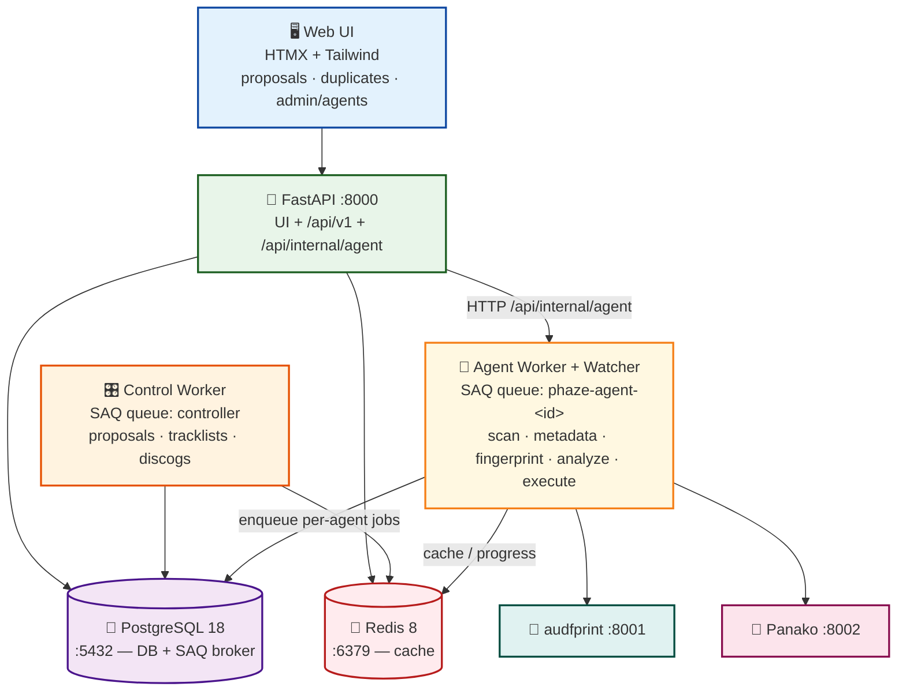
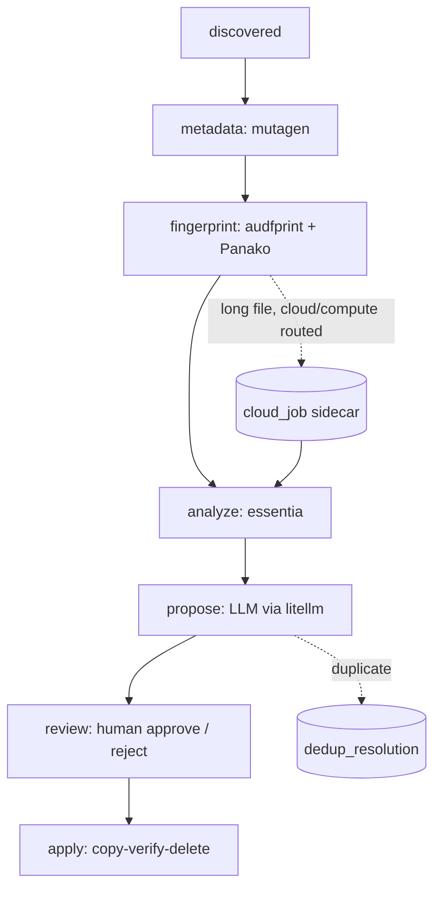
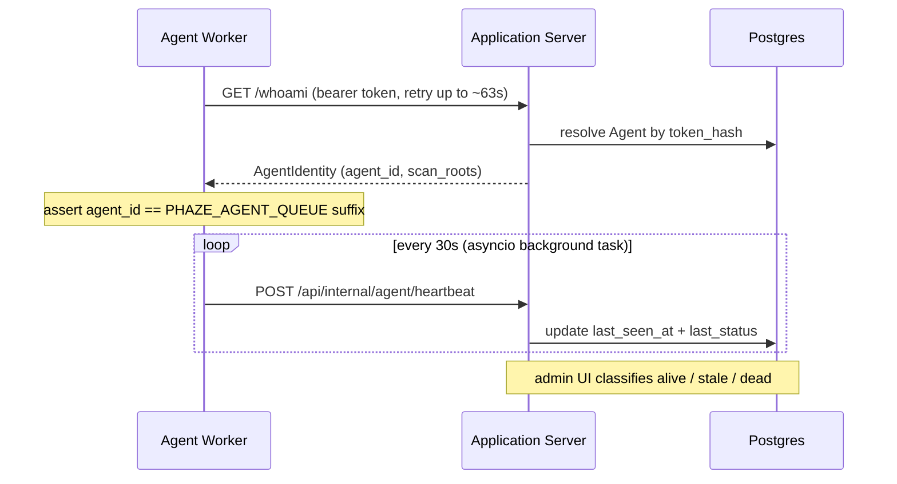
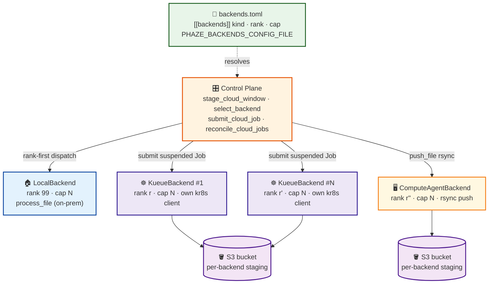
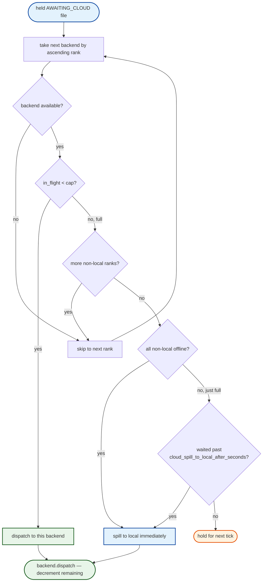

<!-- generated-by: gsd-doc-writer -->
# 🏛️ Architecture Overview

This document covers Phaze's internals in depth: the full processing pipeline, how
services communicate, the human-in-the-loop approval gate, the v4.0 distributed
file-server agent subsystem, and the cloud-burst / Kueue / pluggable-backend subsystem
(Phases 47–71, headlined by [Multi-Cloud Backends](#-multi-cloud-backends-202671)). For
the high-level summary and service port table, see the
[README](../README.md). For the codebase layout, see
[Project Structure](project-structure.md); for the schema, see [Database](database.md);
for endpoints, see [API Reference](api.md); for env vars, see
[Configuration](configuration.md).

## 🎯 System Overview

Phaze turns a messy archive of music and live-concert recordings into a properly named,
organized, deduplicated collection — and never moves a file without human approval. The
end-to-end flow is:

1. **Ingest** — a directory scan (or the always-on watcher) discovers files, SHA-256
   hashes them, classifies them by extension, and upserts `FileRecord` rows.
2. **Metadata** — `mutagen` extracts audio tags into a `FileMetadata` row.
3. **Fingerprint** — two engines (audfprint landmark + Panako tempo-robust) compute
   fingerprints for identification and deduplication.
4. **Analyze** — `essentia-tensorflow` derives BPM, key, mood, and style.
5. **Propose** — an LLM (via `litellm`) generates a structured filename + destination-path
   proposal, validated by Pydantic and stored as a `RenameProposal`.
6. **Review** — every proposal is queued for human review in the web UI; nothing proceeds
   without an explicit approve/reject.
7. **Execute** — approved proposals run through a **copy → verify (SHA-256) → delete**
   protocol with a write-ahead audit log.

Each per-file stage after ingest is **operator-triggered** from its stage workspace in the
DAG-centric shell (Phase 35 removed the implicit auto-chaining), and every stage is idempotent by
construction (see [Pipeline Determinism & Observability](#-pipeline-determinism--observability-phase-35)).

The system is layered and asynchronous: a FastAPI application server owns the database and
the UI, while CPU- and disk-bound work runs in SAQ workers backed by a **Postgres-broker
queue** (`PostgresQueue`, since Phase 36 — Redis is cache/rate-limit/exec-progress only). As
of v4.0, that worker tier can be **distributed** across remote file-server hosts that reach
the application server only over an authenticated HTTP boundary.

## 📐 Service Architecture

Two deployment shapes share one container image. The **application server** stack
(`docker-compose.yml`) runs the API, the control-role worker, Postgres, and Redis. Each
remote **file-server agent** stack (`docker-compose.agent.yml`) runs an agent-role worker,
a filesystem watcher, and the two fingerprint sidecars — with **no database of its own**.



| Service | Port | Role | Reaches DB? | Entry point |
| ------- | ---- | ---- | ----------- | ----------- |
| **API** | 8000 | FastAPI app + UI + internal-agent API | Yes (direct) | `phaze.main:app` |
| **Control Worker** | -- | Fileless SAQ jobs (LLM, tracklists, Discogs) | Yes (direct) | `saq phaze.tasks.controller.settings` |
| **Agent Worker** | -- | File-bound SAQ jobs (scan, fingerprint, analyze, execute) | No (HTTP only) | `saq phaze.tasks.agent_worker.settings` |
| **Watcher** | -- | Filesystem observer that POSTs settled files | No (HTTP only) | `python -m phaze.agent_watcher` |
| **Postgres** | 5432 | Primary database + SAQ `PostgresQueue` broker (Phase 36) | -- | `docker-compose.yml` |
| **Redis** | 6379 | LLM rate-limit cache, exec-progress hash, pipeline counters | -- | `docker-compose.yml` |
| **audfprint** | 8001 | Landmark fingerprint sidecar | No | `services/audfprint/` |
| **Panako** | 8002 | Tempo-robust fingerprint sidecar | No | `services/panako/` |

The **control / agent split is a hard import boundary**: `phaze.tasks.agent_worker`,
`phaze.tasks.heartbeat`, and `phaze.agent_watcher` must not transitively import
`phaze.database` or `sqlalchemy.ext.asyncio`. This is enforced by subprocess import-boundary
tests (`tests/shared/core/test_task_split.py`) so an agent role can run on a host with no Postgres
reachability (DIST-04).

## 🔄 File-Processing Pipeline

There is **no single `state` column** on `files` and **no file-level state enum** — both were
dropped in Phase 90 (migration `039_drop_files_state_column` in the pre-flatten chain, now
folded into the single `039` baseline schema, [Database → Migrations](database.md#migrations)).
Instead a file's per-stage
status is **DERIVED on read** from its output tables (`metadata`, `fingerprint_results`,
`analysis`, `proposals`, `execution_log`), the `cloud_job` sidecar, and the
`dedup_resolution` marker. Two twin resolvers own that derivation and are locked 1:1 by an
equivalence test so they can never drift: the DB-free `phaze.enums.stage.resolve_status`
(`Stage` × output-table scalars → `Status`) and its SQL `ColumnElement` counterpart
`services/stage_status.py` (`stage_status_case`), the single place every later reader drops a
per-stage predicate into a `.where(...)`.

A file moves conceptually through seven **stages** (`Stage` StrEnum): `metadata`,
`fingerprint`, `analyze`, `tracklist`, `propose`, `review`, `apply`. Each stage resolves to
one of five **statuses** (`Status` StrEnum) under the precedence ladder
`in_flight ≻ done ≻ skipped ≻ failed ≻ not_started` — the durable `SchedulingLedger` is the
authoritative `in_flight` source (guarding the 2026-06-18 over-enqueue class). Because status
is derived **per stage**, a file that is BOTH fingerprinted and analyzed reads `done` for
both stages at once — something the retired single-valued state column could never express.



The long-file cloud-burst / tiered-drain detour off `analyze` is **not** a set of file-state
members anymore — it is tracked by the standalone `cloud_job` sidecar row, whose
`CloudJobStatus` progresses `awaiting → uploading → uploaded → submitted → running →
succeeded` (or `failed`), while a `dedup_resolution` row records a duplicate-resolved
outcome. The `Stage` / `Status` vocabulary, the `cloud_job` sidecar, and the `ProposalStatus`
and `ScanStatus` enums are documented in [Database](database.md).

## 🌊 Data Flow

Tracing one music file from disk to a finished move:

1. **Scan trigger.** `POST /pipeline/scans` (`routers/pipeline_scans.py::trigger_scan`)
   takes an `agent_id` + `scan_root` (+ optional `subpath`) form submit from the Discover
   workspace, NFC-normalizes and rejects `..` traversal, validates the agent + its
   `scan_roots` prefix, creates a RUNNING `ScanBatch`, and dispatches the file-discovery
   walk as a `scan_directory` SAQ job on that agent's own queue (Phase 27, D-11..D-14) — the
   walk always runs on the owning file-server agent, never in-process on the api server.
2. **Discover + hash.** `scan_directory` (`tasks/scan.py`, agent role, HTTP-only — it never
   imports `phaze.database`) walks the tree (`os.walk`, `followlinks=False`), skips unknown
   extensions via `EXTENSION_MAP`, NFC-normalizes paths, computes SHA-256
   (`asyncio.to_thread`), and POSTs chunks of discovered files to
   `POST /api/internal/agent/files`, which idempotently upserts `FileRecord` rows via
   `INSERT ... ON CONFLICT DO UPDATE` (resumable). The agent PATCHes the `ScanBatch`'s
   `processed_files` after each chunk and a terminal status at the end. Discovery persists
   rows **only** — Phase 35 (D-06) removed the per-discovery auto-enqueue of metadata
   extraction.
3. **Operator-triggered stages.** Metadata, fingerprint, and analyze are each enqueued
   independently by the operator from their DAG-rail stage workspaces (no auto-chaining). The SAQ tasks
   in `src/phaze/tasks/` are: `extract_file_metadata` (mutagen, `metadata_extraction.py`),
   `fingerprint_file` (audfprint + Panako via the `FingerprintOrchestrator`), and
   `process_file` (essentia analysis run in a real per-file child process via
   `services/analysis_exec.py` + `phaze.analysis_child`, bounded by an `asyncio.Semaphore`
   sized from `worker_process_pool_size` — Phase 101 retired the earlier pebble
   `ProcessPoolExecutor`, `functions.py`). On a distributed agent, `process_file` reads the
   local file and **PUTs** results back via
   `PUT /api/internal/agent/analysis/{file_id}` rather than touching the database directly.
4. **Proposal generation.** `generate_proposals` (control role) calls `ProposalService`
   (`services/proposal.py`), which assembles per-file context (tags, analysis, companion
   files), enforces a Redis-backed LLM rate limit (`check_rate_limit`,
   `INCR`/`EXPIRE` over a 60s window), calls the LLM with a Pydantic
   `BatchProposalResponse` schema, clamps confidence to `[0,1]`, and `store_proposals`
   **upserts** the one active `RenameProposal` per file (idempotent partial-index upsert;
   see [Pipeline Determinism & Observability](#-pipeline-determinism--observability-phase-35)).
   It writes **no file-level state** — Phase 90 dropped that enum, so the propose stage's
   `done` is derived on read from the existence of the `proposals` row itself.
5. **Human review.** Proposals appear at `GET /proposals/` (`routers/proposals.py`) for
   approve/reject — see the [Approval Pipeline](#-approval-pipeline) below.
6. **Execution.** Approved proposals run copy-verify-delete on the owning agent
   (`tasks/execution.py::execute_approved_batch`), writing a write-ahead `ExecutionLog`
   entry before each operation.

## ✅ Approval Pipeline

Human review is the mandatory gate between a proposal and any file movement. No code path
copies, renames, or deletes a file while a proposal is `PENDING` or `REJECTED`.

- **Review UI.** `routers/proposals.py` serves `/proposals/` with HTMX fragments for
  filtering (defaults to `pending`), search, sorting, and pagination. Approve / reject are
  `PATCH /proposals/{id}/approve` and the reject counterpart, returning OOB-swapped rows,
  stats, and a toast.
- **Status transitions.** A proposal moves `PENDING → APPROVED` or `PENDING → REJECTED`
  (`ProposalStatus` in `models/proposal.py`). Only `APPROVED` proposals are picked up by
  execution; `get_approved_proposals_grouped_by_agent` (`services/execution_dispatch.py`)
  selects and groups them per owning agent for dispatch.
- **Safe execution.** The per-agent batch executor `execute_approved_batch`
  (`tasks/execution.py`) resolves each path through `_resolve_and_check_containment`
  (containment guard against `..`/symlink escape) and performs three logged steps:
  1. **COPY** — write the bytes to the destination (parent dirs created on demand); aborts
     if the destination already exists.
  2. **VERIFY** — recompute SHA-256 of the source and compare to the supplied hash. On
     mismatch the operation aborts before the original is touched, and the file is marked
     `FAILED`.
  3. **DELETE** — remove the original only after the copy + verification pass; the
     `FileRecord` then advances (proposal `executed` / file `moved`) with `current_path`
     updated.
- **Audit trail.** Every step writes an `ExecutionLog` row **before** running (write-ahead),
  so a crash leaves a durable `IN_PROGRESS` record. The append-only log is browsable in the
  execution dashboard.

## 🧮 Pipeline Determinism & Observability (Phase 35)

Every pipeline stage is **operator-triggered** from its DAG-rail stage workspace and made
**idempotent by construction**, so a repeat click or a reboot re-enqueue collapses to a
no-op instead of doubling work (the lesson of the 2026-06-11 queue-doubling incident).

### Deterministic enqueue keys

A single `before_enqueue` chokepoint, `apply_deterministic_key`
(`tasks/_shared/deterministic_key.py`), assigns `job.key = "<function>:<natural_id>"` for
every registered pipeline task — overriding any caller-supplied key so no call site can
drift back to a random UUID (anti-drift, threat T-35-01). The registry (`_KEY_BUILDERS`,
11 functions) maps each task's payload to its natural id: `process_file`,
`extract_file_metadata`, `fingerprint_file`, `scan_live_set`, `search_tracklist`, `push_file`,
`s3_upload`, and `submit_cloud_job` key on `<file_id>`; `scrape_and_store_tracklist` and
`match_tracklist_to_discogs` key on `<tracklist_id>`; and the batch task
`generate_proposals` keys on an order-independent
SHA-256 of its sorted `file_ids` set. The hook is registered on **every** enqueue seam —
both worker queues (`tasks/controller.py`, `tasks/agent_worker.py`) and the per-agent
`AgentTaskRouter` queues (`services/agent_task_router.py`) — alongside
`apply_project_job_defaults`. SAQ's per-queue `incomplete`-set dedup then collapses a
repeat enqueue of the same logical work to a no-op. The `process_file` builder computes the
identical string as `services/analysis_enqueue.process_file_job_key`, so the already-keyed
analyze path stays no-op-equivalent.

### Maintained counters

`services/pipeline_counters.py` keeps two durable Redis counters per function in a bounded,
9-name namespace (`PIPELINE_FUNCTIONS`): `phaze:pipeline:enqueued:<fn>` (bumped best-effort inside the same
`before_enqueue` hook, one INCR per enqueue attempt) and `phaze:pipeline:completed:<fn>`
(bumped by the `increment_completed` `after_process` hook — registered as a Worker
constructor kwarg in both settings dicts — only on a `Status.COMPLETE` outcome). These are
a **non-authoritative cache**: the DB reconcile always owns the rendered `done` value
(D-03). Counter writes are strictly best-effort — a Redis hiccup is logged, never raised,
so it can never block an enqueue or job teardown.

### Proposal idempotency

`store_proposals` (`services/proposal.py`) upserts the one active proposal per file with
`INSERT ... ON CONFLICT DO UPDATE` against the partial unique index
`uq_proposals_file_id_pending` (`ON (file_id) WHERE status = 'pending'`, alembic 019,
declared in `models/proposal.py`). Because the index covers only PENDING rows, a re-run of
`generate_proposals` overwrites an existing pending proposal in place instead of appending a
second one, while an APPROVED / EXECUTED / REJECTED / FAILED proposal is never a conflict target —
human approvals survive any number of re-runs. That index predicate **is** the whole guard: since
Phase 90 there is no file-level state to drag backwards, and a duplicate resolution is recorded on
the standalone `dedup_resolution` sidecar row (Phase 90, D-09) rather than as a file state, so
neither is reachable from a proposal re-run. `store_proposals` also rejects an out-of-range LLM
`file_index` (WR-01) rather than wrapping onto the wrong file.

### Per-stage DB-truth progress

`get_stage_progress` (`services/pipeline.py`) is the authoritative per-DAG-node source. It
counts `COUNT(DISTINCT file_id / tracklist_id)` against each stage's OUTPUT table
(`metadata`, `fingerprint_results` with `status='completed'`, `analysis`, `tracklists`,
`tracklist_versions`, `discogs_links`, `proposals`, and completed `execution_log`), so a
file that is BOTH fingerprinted and analyzed contributes to both node counts — impossible
to express through a single-valued per-file state column (the retired `state` column /
file-state enum, dropped in Phase 90) that only one status could occupy at a time. Each stage
is wrapped in `_safe_count` (degrade-to-0 + session rollback) so one
failing stage never 500s the 5-second poll. The Scan/Search node is counter-only
(`total=None`, rendered `done / —`): no table defines "should get a tracklist", so no
denominator is fabricated.

`get_global_reconciliation` / `get_agent_reconciliations` (`services/pipeline.py`) explain the
Discovery `COUNT(files)` vs agent scan-total (`SUM(scan_batches.total_files)`) gap as dedup, not
lost work: `scanned` sums each agent's LATEST completed batch (re-scan-safe via `row_number()`) and
`deduped = max(0, scanned − discovery_done)`. The Discovery node renders a `scanned · deduped`
subtitle and each Recent Scans row a per-agent `→ N unique · M deduped` annotation, both shown only
when `deduped > 0` and degrade-safe (None / `{}` → hidden).

### DAG rail & stage workspaces

`_build_dag_context` (`routers/pipeline.py`) reconciles three sources per node (D-03):
`get_stage_progress` DB-truth `done`/`total` (the authority), the maintained `completed`
counters (a degrade backstop via `_reconciled_done`, capped at the node total), and
`get_queue_activity` (the per-node ACTIVE state). It is assembled by
`build_dashboard_context` and feeds both the v7.0 Analyze workspace and the 5-second
`/pipeline/stats` OOB poll that keeps every count live. In the v7.0 shell the pipeline DAG
is the **left rail** (`templates/shell/partials/rail.html`) — the navigation spine — where
each node shows its live count (bound to `$store.pipeline`) and clicking a node swaps its
workspace into `#stage-workspace` over HTMX (`GET /s/<stage>`). The standalone pipeline
dashboard page and its single-partial DAG canvas were removed in CUT-02 (Phase 62); the
underlying stage-progress services (`get_stage_progress`, `get_queue_activity`,
`build_dashboard_context`) are unchanged and now back the Analyze workspace instead, and
`/pipeline/` is a pure 302 redirect into the shell root `/` — which since SQ3-02
(quick-260707-sq3) lands on the static, DB-free **Summary** placeholder, with Analyze one rail
click away at `/s/analyze`. The stage graph itself is
unchanged: only Metadata and Analyze converge into Proposals; fingerprint and the tracklist
subgraph have no edge into Proposals.

## 🤖 Distributed Execution Architecture (Phases 26-29)

v4.0 lets file-bound work run on remote file-server hosts that never connect to Postgres.
Each host is modeled as an `Agent` (`models/agent.py`): a kebab-case `id`, an `scan_roots`
list, a hashed bearer token, and `last_seen_at` / `revoked_at` liveness fields. Every
`FileRecord` and `ScanBatch` carries a non-null `agent_id` FK (defaulting to the seeded
`legacy-application-server`).

### Per-agent task routing

The application server owns one SAQ queue per agent, named exactly
`phaze-agent-<agent_id>`. `AgentTaskRouter` (`services/agent_task_router.py`) lazily caches
a `Queue` per agent and enqueues tasks via `enqueue_for_agent` /
`enqueue_for_file` (which reads `file_record.agent_id`). It is constructed once in the API
lifespan as `app.state.task_router`.

### Worker roles

- **Control role** (`tasks/controller.py`) runs the fileless queue `controller`:
  `generate_proposals`, the 1001Tracklists scrape/search/refresh jobs, and Discogs
  matching. It also owns the **cloud/backend control plane**: `stage_cloud_window` (the
  tiered-drain top-up cron, `tasks/release_awaiting_cloud.py`), `submit_cloud_job`
  (Kueue Job submission), and `reconcile_cloud_jobs` (the `*/5` in-flight cloud-job
  reconcile cron). It further registers the control-only reapers and recovery producer:
  `reap_stalled_scans` (every-minute no-progress scan reaper), `reap_stuck_aborting_jobs`
  (every-minute reaper for SAQ rows stuck in `status='aborting'`, `tasks/aborting_reaper.py`,
  phaze-e57w — deleting them releases the deterministic key so the blocked file is
  re-queueable), and `recover_orphaned_work` (the gated boot-time queue-loss recovery pass).
  It connects to Postgres directly.
- **Agent role** (`tasks/agent_worker.py`) runs the per-agent queue and registers the **8**
  file-bound functions: `process_file`, `extract_file_metadata`, `fingerprint_file`,
  `scan_live_set`, `scan_directory`, `execute_approved_batch`, `push_file` (Phase 50 —
  the fileserver rsync-over-SSH push of a long file to the compute agent's scratch dir), and
  `s3_upload` (Phase 53 — the multipart-PUT upload to presigned S3 URLs; registered under an
  explicit `(name, func)` tuple so its SAQ name stays `s3_upload`). With `PHAZE_AGENT_LANE`
  set, the worker registers **only that lane's subset** — `analyze` / `fingerprint` / `meta` /
  `io` per `LANE_TASKS` (`services/enqueue_router.py`, the single source of truth for
  task→lane membership); all-mode registers all 8, and the union of the four lanes equals
  `AGENT_TASKS` (quick-260707-dh1, asserted in `tests/shared/core/test_task_split.py`).
  Its startup hook
  authenticates against the application server, downloads essentia weights if missing, builds
  the `FingerprintOrchestrator` (audfprint + Panako adapters), sizes the per-file analysis
  concurrency semaphore (`analysis_semaphore`, from `worker_process_pool_size` — Phase 101
  retired the earlier pebble process pool), and launches the liveness heartbeat as an
  asyncio background task (Phase 46).

### Registration, heartbeat, and liveness



- **Bootstrap.** `tasks/agent_worker.startup` calls `whoami_with_retry` with bounded
  exponential backoff and refuses to start if the token-derived `agent_id` does not match
  the operator-supplied `PHAZE_AGENT_QUEUE` suffix (anti-misconfiguration guard). For fresh
  dev stacks, `services/agent_bootstrap.ensure_dev_agent` idempotently seeds a `dev-agent`
  row at API startup (gated by `dev_seed_agent`).
- **HTTP client.** `services/agent_client.py` (`PhazeAgentClient`) wraps a single
  `httpx.AsyncClient` and funnels every call through a tenacity retry loop: 5xx and
  transient network errors retry three times with exponential jitter, while **4xx is never
  retried** (auth/validation failures surface immediately). It exposes a 4-class exception
  hierarchy (`AgentApiError` base, plus auth / client / server subclasses).
- **Heartbeat.** `tasks/heartbeat._heartbeat_loop` is an in-process asyncio background task
  (launched in the agent worker `startup` hook, cancelled on `shutdown`) that calls
  `send_heartbeat` every 30 seconds (`AGENT_HEARTBEAT_INTERVAL_SECONDS`) to POST agent
  version, worker PID, and queue depth; failures log a warning and the loop ticks again on
  the next interval. It is deliberately **not** a SAQ cron job: a CronJob competes for the
  `worker_max_jobs` dispatch slots and gets starved by multi-hour `process_file` jobs,
  marking a healthy busy agent DEAD (Phase 46 incident). Because `process_file` runs essentia
  in a real per-file child process (the Phase 101 `analysis_exec`/`analysis_child` subprocess
  driver, which retired the earlier pebble ProcessPool from Phase 43), the parent's event
  loop is free for the background task to tick on cadence regardless of dispatch saturation.
- **Liveness.** `services/agent_liveness.py` (pure functions) classifies each agent as
  `alive` (< 90s since last seen), `stale` (90-300s), `dead` (>= 300s), `revoked`, or
  `never`, and provides the sort key for the read-only admin page at `/admin/agents`
  (`routers/admin_agents.py`).

### Watcher service

`src/phaze/agent_watcher/` is an always-on filesystem observer (not a SAQ worker; entry
point `python -m phaze.agent_watcher`). It watches the agent's `scan_roots` with `watchdog`,
debounces events by mtime stability (default 10s settle window), and POSTs each settled file
to `POST /api/internal/agent/files`. Files bind to the agent's sentinel `LIVE` `ScanBatch`.
Like the agent worker, it reaches the database only through the HTTP boundary.

### Batch execution dispatch

When the operator clicks "Execute" (`routers/execution.py` → `start_execution`), the
controller fans out approved proposals across agents:

1. `get_approved_proposals_grouped_by_agent` (`services/execution_dispatch.py`) joins
   `RenameProposal → FileRecord → Agent`, filters out any agent with `revoked_at` set, and
   groups the survivors by `agent_id` (deterministically ordered by `created_at`).
2. `count_revoked_skipped_proposals` supplies the "Agent X revoked; N proposals skipped"
   banner count.
3. `chunk_proposals` slices each group into sub-lists of <= 500 (matching the
   `ExecuteApprovedBatchPayload.proposals` cap).
4. Each (agent, chunk) is enqueued as one `execute_approved_batch` job via
   `AgentTaskRouter.enqueue_for_agent`, and the `exec:{batch_id}` Redis hash is seeded for
   progress tracking.
5. Agents report per-proposal terminal state to
   `POST /api/internal/agent/exec-batches/{batch_id}/progress`, the sole writer of the
   progress hash's `HINCRBY` counters; the UI streams `progress`, `agents_table`, and a
   one-shot `dispatch_summary` over Server-Sent Events.

### Internal-agent HTTP API

All agent → server communication funnels through **13** routers under
`/api/internal/agent/*` (registered in `main.py`): `files`, `metadata`, `fingerprint`,
`execution`, `heartbeat`, `identity`, `analysis`, `push`, `s3`, `tracklists`, `proposals`,
`scan-batches`, and `exec-batches`. (`routers/agent_auth.py` is **not** a router — it exports
the `get_authenticated_agent` dependency the handlers depend on.) The `agent_id` is always
taken from the authenticated
bearer token (`get_authenticated_agent`), never from the request body, so a forged body
field returns `422`. Full endpoint reference: [API Reference](api.md).

## ☁️ Multi-Cloud Backends (2026.7.1)

Phases 47–71 grew the single on-prem worker tier into a **pluggable, cost-tiered backend
registry**: one control plane dispatches long (slow-to-analyze) files across the **local**
file-server, **one-or-more Kueue clusters**, and **one-or-more cloud compute agents**
simultaneously — statically configured, no runtime provisioning. Short files still analyze
in-place on their owning file-server agent as before; only the long-file lane is routed.

### Backend registry

Backends are declared in a **`backends.toml`** file (pointed at by `PHAZE_BACKENDS_CONFIG_FILE`,
default `/etc/phaze/backends.toml`). An absent file means an **implicit local-only** registry
(one `kind=local` backend, `id=local`, `rank=99`, `cap=1`). The file is a typed `[[backends]]`
list discriminated by `kind` — `local | compute | kueue` — each carrying a cost-tier `rank`
(ascending = preferred first; local sits last at rank 99) and a concurrency `cap`. The registry
schema (pydantic v2 discriminated union + `[kube]` / `[[buckets]]` tables) lives in
`src/phaze/config_backends.py`; the runtime dispatch objects — `LocalBackend`,
`ComputeAgentBackend`, `KueueBackend`, conforming to a structural `Backend`
`typing.Protocol` — live in `src/phaze/services/backends.py`. Whether cloud is on at all is
**derived**, not a flag: `ControlSettings.cloud_enabled` is true when any non-local backend
is resolved. (The flat `PHAZE_CLOUD_TARGET` env switch and `s3_*` / `kube_*` / `compute_*`
scalar fields were **removed** in Phase 67.) N Kueue clusters each hold their own `kr8s`
client and are **failure-isolated** — one unreachable cluster never blocks the others — and
each backend stages its per-file bytes through its own S3 bucket (`CloudJob` tracks per-file
staging).



### Tiered drain & backend selection

The bounded top-up cron `stage_cloud_window` (`tasks/release_awaiting_cloud.py`) fires every
~5 minutes under a single advisory lock. Once per tick it **snapshots** every resolved
backend's `is_available()` and its `remaining = cap - in_flight_count()`, pulls that many of
the oldest `AWAITING_CLOUD` files (FIFO, `FOR UPDATE SKIP LOCKED`), and routes each through
the pure policy `select_backend` (`services/backend_selection.py`). The policy is
**rank-first with spillover**: the available lowest-rank backend with a free slot wins; a
full lowest-rank tier spills to the next rank (ties broken by in-flight/cap utilization, then
id). The **local backend (detected by class identity, not the rank-99 literal) is gated**:
when higher ranks are *online-but-full* it becomes eligible only after the file has waited
past `cloud_spill_to_local_after_seconds`; but when every non-local backend is *offline*,
local is eligible **immediately** (the staleness gate covers the full→local path, not the
offline→local path). A per-file attempt count excludes backends past
`cloud_submit_max_attempts`, and `select_backend` returning `None` is a clean hold to the
next tick. The whole snapshot + select + dispatch runs in one transaction, so overlapping
ticks serialize on the lock and no backend's `cap` is ever overshot.

An operator can hard-override the whole subsystem: `POST /pipeline/routing/force-local`
writes a durable `route_control` row; while set, the **effective** `cloud_enabled` is
`registry cloud_enabled AND NOT force_local`, so every file routes to the local backend.



## 🪵 Observability / logging

Every process configures logging through one entry point —
`phaze.logging_config.configure_logging()` — called exactly once per OS process: the FastAPI
lifespan (before migrations), each SAQ worker `startup` hook (control + agent), the watcher
`main()`, and the CLI / `download_models` scripts. Because each SAQ worker and the watcher run
as their own OS process, they do **not** inherit the api's configuration; configuring inside
each startup is what keeps worker and watcher logs visible in `docker logs`.

`configure_logging()` builds a single [structlog](https://www.structlog.org/) `ProcessorFormatter`
bridge that renders BOTH structlog-native events and foreign stdlib records — uvicorn's
`uvicorn.error` / `uvicorn.access` and SAQ's loggers are re-routed through the same root
handler — so one pipeline produces consistent output: JSON (one object per line) when stdout is
not a TTY, and a human-friendly console renderer otherwise. A shared processor chain includes
`PositionalArgumentsFormatter` so legacy `logger.info("text %s", value)` calls still interpolate,
and noisy libraries (`httpx`, `httpcore`, `asyncio`) are pinned to `WARNING` unless the level is
`DEBUG`. `logging_config.py` imports only stdlib + structlog (never `phaze.database` / SQLAlchemy)
so it stays inside the agent's Postgres-free import boundary.

The watcher calls `configure_logging()` bare (env-driven) **before** `get_settings()`, so a
pydantic `ValidationError` for a missing `PHAZE_AGENT_*` var is still logged through the pipeline
rather than crashing on settings construction. Verbose output for triaging a running scan or
model download: set `PHAZE_LOG_LEVEL=DEBUG` (see
[Configuration → Logging / observability](configuration.md#logging--observability-all-roles)).

## 📄 List Paging Contract

Every operator-facing list in phaze is bounded by ONE shared contract, owned by
`src/phaze/services/pagination.py`. Read that module's docstring before adding a paged read — this
is a summary, the module is the source of truth.

**Why it exists.** The Analyze workspace once server-rendered its entire working set inline —
10,132 rows / 12.7 MB, ~180x the sibling tabs — behind a docstring that merely *asserted* the set
was "naturally bounded". Nothing enforced it. An assumption is not a bound; a bound is a `LIMIT`.

| Rule | Decision |
| ---- | -------- |
| Paging style | **OFFSET**, not cursor. One shape everywhere; supports the Prev/Next affordance and arbitrary sort orders. |
| Totals | **Never a whole-corpus `COUNT`.** `has_next` rides a `page_size + 1` sentinel row. The UI shows "Page N" with Prev/Next, never "page X of Y". |
| Page size | `DEFAULT_PAGE_SIZE = 50`, clamped to `[MIN_PAGE_SIZE=10, MAX_PAGE_SIZE=100]`. Owned in one place; routers import the constant rather than spelling a default. |
| **Tiebreaker** | **Mandatory and unique.** `paged_stmt()` raises `ValueError` without one. A non-unique `ORDER BY` (`ts_rank`, `executed_at`, `created_at`, a score) silently *skips and duplicates* rows across pages. `created_at` is NOT valid here — Postgres timestamp defaults are transaction-time constant, so rows inserted together tie exactly. Use a primary key. |
| Out-of-range input | **Clamps, never raises.** Negative/zero page → 1; page size → `[MIN, MAX]`. A page past the end is a normal empty page, not an error. |
| Degradation | Paged render reads run in a `begin_nested()` SAVEPOINT and return an empty `Page` on error — they never 500 a render. |
| Render vs enqueue | A bounded render read is **never** the enqueue set. Where a "pending" set feeds both a table and a bulk-enqueue button, the render pages and the enqueue stays unbounded — paging it would silently under-enqueue. |

```python
stmt = paged_stmt(
    select(Thing).where(...),
    page=page, page_size=page_size,
    order_by=(Thing.created_at.desc(),),  # display order; may tie
    tiebreaker=(Thing.id.desc(),),        # REQUIRED, unique
)
rows, has_next = split_sentinel((await session.execute(stmt)).all(), page_size)
```

All three enrich workspaces (metadata / fingerprint / analyze) ship an empty host `div` that
`hx-get`s a bounded fragment on load; none server-renders a file row inline.

## 🧮 Wire Bounds Contract

Every value crossing the HTTP boundary is bounded to fit the column it lands in. The contract is
owned by `src/phaze/schemas/wire_bounds.py` and **mechanically enforced** by
`tests/shared/schemas/test_wire_bounds_contract.py` — read the module docstring before adding an
inbound field; this table is a summary.

**Why it exists.** `agent_tracklists` accepted an unbounded `timestamp` into a `varchar(20)` and an
unbounded `external_id` into the `varchar(50)` NOT NULL idempotency key. Postgres answers
over-width input with `StringDataRightTruncation`, and there is no DB exception handler anywhere in
the app — so the aborted transaction escaped as an unhandled **500 instead of a 422**, after the
1-hour idempotency lock was already taken. Seven sibling defects shared the exact shape. The
convention that prevents it already existed and was applied exactly; it was simply never written
down, so it was possible to deviate silently.

| Rule | Decision |
| ---- | -------- |
| Strings | `max_length` **equals** the mapped `String(N)` width. Not less (you reject what the column accepts), not more (you hand Postgres a value it must raise on). |
| `Text` columns | **No cap.** `Text` is unbounded; a cap invents a limit the storage does not have. Don't add one "for safety". |
| Integers | Prefer a **real domain bound** (`ge=0, le=100` for a 0–100 score) over the storage bound. Fall back to the column's range — int4 is `[-2147483648, 2147483647]` (`INT32_MIN`/`INT32_MAX`); int2/int8 constants are exported too. |
| **Layer** | **422 at the boundary, never a caught DB exception downstream.** A `try/except` around the insert is the wrong layer: it still admits the value, still opens the transaction, still takes the lock, and turns a poison payload into a politer infinite retry. |
| Entry shapes | Applies to **all four**: `Field` bodies, `Path` segments, `Query` params, `Form` fields. "It's only a path parameter" is not an exemption. |
| Types, not just ranges | Declare the type that **matches the column** — a `date` filter declared `str` and forwarded unparsed renders `$1::VARCHAR` and 500s on the cast. A bound would not have helped; the type was wrong. |
| DoS bounds | A bound that exists to cap work per request (e.g. `tracks` `max_length=2000`) is **not** a width cap and says so, so nobody "corrects" it to a column width that doesn't exist. |
| Paging params | Defer to the [paging contract](#-list-paging-contract) **and** still declare the route guard. The service-layer clamp is the belt; `ge=`/`le=` is the braces. A raw `limit`/`offset` that bypasses `services/pagination.py` needs its own `ge=`. |

The enforcing test is a live checklist, not a suppression list: known gaps are recorded as
**strict xfail**, so when a fix lands the entry stops matching and the suite fails until the entry
is deleted. A new unclassified wire field also fails — that is what stops the next regression.

## 🛡️ Untrusted-Input Contract

Every request path that parses a raw client string, or looks up a row an earlier request named,
follows ONE shared contract, owned by `src/phaze/routers/request_guards.py`. Read that module's
docstring before adding such a handler — this is a summary, the module is the source of truth.

**Why it exists.** The duplicate undo endpoints called `json.loads(file_states)` bare on a raw form
string and fed the result into `undo_resolve`, whose docstring advertised "a malformed id is dropped
(no HTTP 500)". That was true only for the id *value* inside a well-formed dict. `not-json` raised
`JSONDecodeError`; `[1,2]` raised `AttributeError` on `int.get`. Both escaped as HTTP 500 through a
handler documenting a graceful no-op. An asserted invariant is not an invariant; a tested one is.

| Rule | Decision |
| ---- | -------- |
| Parse guards | **No bare `json.loads` / `uuid.UUID` / `int` / `datetime.fromtimestamp` on a wire value.** An unparseable or wrong-container **envelope** is **HTTP 422** — the same code FastAPI's own validation returns. Never a parallel 400. |
| **Shape ≠ parse** | **Parsing successfully is not receiving the expected structure.** `"[1,2]"`, `"{}"` and `"null"` all decode fine and explode at the first attribute access. Assert shape *separately, at the same boundary*: a **Pydantic model** where fields are named, an explicit container check where the payload is a loose best-effort id-set. |
| Envelope vs element | **Envelope malformed → 422** (whole request unintelligible). **Element malformed → skip it, keep going, return the count acted on** (browser-held id-sets are arbitrarily stale; one bad id must not void a valid bulk action). This is the repo-wide answer to "malformed id: 4xx or skip?". |
| Row lookups | **`scalar_one()` is the bug.** Use `scalar_one_or_none()` + an explicit `None` branch. What the branch returns (clean 200 hold / 404 / skip) is the handler's call; an escaping `NoResultFound` never is. In-repo reference: `report_push_mismatch`'s over-cap branch. |
| Integrity errors | Catch `IntegrityError` around the flush for a **genuine race** (referent deleted between render and POST). `ON CONFLICT (id)` does **not** absorb an FK violation. **Boundary vs constrain-at-the-wire:** if a stricter signature could have rejected the value, it 422s at the wire and catching `IntegrityError` for it is wrong; if it was valid when checked and another transaction invalidated it, this contract owns it. |
| Transaction state | A failed statement aborts the Postgres transaction. Run the risky statement in a **`session.begin_nested()` SAVEPOINT** and roll back only that scope — same mechanism as the paging contract's degrade-safe reads. **Never** a full `session.rollback()` as recovery: it expires loaded ORM objects and 500s on the very hiccup it claims to survive. |
| Documented guarantees | **A docstring promising "no HTTP 500" is a test obligation.** Ship regression tests for unparseable input, wrong-container and wrong-element-type input, and the specific malformed value the docstring names. Untested shape → the docstring may not claim it. |

```python
from phaze.routers.request_guards import parse_json_array_payload

parsed_states = parse_json_array_payload(file_states, field="file_states")  # 422 on non-JSON / non-array
restored = await undo_resolve(session, parsed_states)                       # drops unusable elements
```

## 🧱 Key Abstractions

### Models (`src/phaze/models/`)

| Abstraction | File | Role |
| ----------- | ---- | ---- |
| `FileRecord` | `file.py` | Central file record; **no** stored state column — per-stage status is derived on read (Phase 90 dropped the `state` column / file-state enum; now part of the `039` baseline schema) |
| `Stage` + `Status` / `resolve_status` | `enums/stage.py` | 7-stage × 5-status derived per-stage status resolver (DB-free twin of `services/stage_status.py`) |
| `CloudJob` + `CloudJobStatus` | `cloud_job.py` | Cloud-burst / tiered-drain sidecar row tracking the long-file detour off `analyze` |
| `RenameProposal` + `ProposalStatus` | `proposal.py` | AI rename proposal (one active PENDING row, upserted in place) + approval status; partial unique index `uq_proposals_file_id_pending` |
| `ExecutionLog` | `execution.py` | Append-only copy-verify-delete audit trail |
| `Agent` | `agent.py` | File-server identity (token, scan roots, liveness) |
| `ScanBatch` + `ScanStatus` | `scan_batch.py` | Scan progress; sentinel `LIVE` batch per agent |

### Services (`src/phaze/services/`)

| Abstraction | File | Role |
| ----------- | ---- | ---- |
| `scan_directory` | `tasks/scan.py` | Agent-side chunked directory walk + SHA-256 hash, POSTed to `/api/internal/agent/files` for upsert (rows only; no auto-enqueue). Phase 89 removed the older api-server-side `services/ingestion.py::run_scan` path. |
| `ProposalService` / `store_proposals` | `proposal.py` | LLM calling, context build, confidence clamp, idempotent partial-index proposal upsert |
| `get_stage_progress` / `_derive_stats` | `pipeline.py` / `routers/pipeline.py` | Per-DAG-node DB-truth `COUNT(DISTINCT)` off each stage's output table (the rendering authority); `_derive_stats` re-expresses the former state-grouped `get_pipeline_stats` keys off this derived source (Phase 82, D-05) |
| `get_global_reconciliation` / `get_agent_reconciliations` | `pipeline.py` | Scanned-vs-file-row dedup reconciliation (latest completed batch per agent); degrade-safe, hidden when `deduped == 0` |
| `incr_*` / `read_counters` | `pipeline_counters.py` | Durable Redis per-function enqueued/completed counters (non-authoritative cache) |
| `execute_approved_batch` | `tasks/execution.py` | Per-agent copy → verify → delete with write-ahead log + containment guard |
| `AgentTaskRouter` | `agent_task_router.py` | Per-agent SAQ enqueuer (`phaze-agent-<id>`) |
| `execution_dispatch` helpers | `execution_dispatch.py` | Group / revoked-filter / chunk approved proposals |
| `PhazeAgentClient` | `agent_client.py` | Agent → server HTTP wrapper (tenacity, no-4xx-retry) |
| `classify` / `sort_key` | `agent_liveness.py` | Agent liveness classification for admin UI |
| `FingerprintOrchestrator` | `fingerprint.py` | Multi-engine fingerprint coordination |
| `enqueue_process_file` / `process_file_job_key` | `analysis_enqueue.py` | FastAPI-free shared seam: builds the complete `ProcessFilePayload` + job policy (`timeout=7200` / `retries=2`); the central `before_enqueue` hook stamps the deterministic key `process_file:<file_id>` and records the effective `timeout`/`retries` in the scheduling ledger so recovery replays the same policy. Used by both the dashboard analyze path and the reboot re-enqueue task so in-flight files dedup |

### Tasks (`src/phaze/tasks/`)

| Abstraction | File | Role |
| ----------- | ---- | ---- |
| `apply_deterministic_key` / `increment_completed` | `_shared/deterministic_key.py` | Central `before_enqueue` deterministic-key hook (11-task registry) + `after_process` completed-counter hook |
| Control settings | `controller.py` | SAQ entry for fileless jobs; on boot runs the gated `recover_orphaned_work` (queue-loss recovery, no-op on a durable restart) — no steady-state auto-advance cron (Phase 42) |
| Agent-worker settings | `agent_worker.py` | SAQ entry for file-bound jobs; the liveness heartbeat runs as a startup asyncio background task (Phase 46), not a cron |
| `process_file` | `functions.py` | essentia analysis → PUT via HTTP |
| `extract_file_metadata` | `metadata_extraction.py` | mutagen tag extraction → PUT via HTTP (operator-triggered) |
| `recover_orphaned_work` | `reenqueue.py` | Gated, all-stages restart/queue-loss recovery (Phase 42/45): no-ops on a durable Postgres-broker restart; on genuine queue-loss (or manual `force`) replays each orphaned scheduling-ledger row — payload **and** stored `timeout`/`retries` policy — through the identical keyed producers, so in-flight items dedup (no doubling) and a recovered long `process_file` keeps its 7200s bound instead of the 600s default. Startup + the manual `/pipeline/recover` button call the same producer |
| `execute_approved_batch` | `execution.py` | Per-chunk batch execution on the agent (`_resolve_and_check_containment` guard) |
| `_heartbeat_loop` / `send_heartbeat` | `heartbeat.py` | 30s heartbeat POST run as a startup asyncio background task (Phase 46), not a SAQ cron; `heartbeat_tick` retained as a thin back-compat shim |

## 🖥️ User Interface / Information Architecture (v7.0)

The admin UI is a **three-column "Hybrid Console" shell** (Phase 57–62). It restructured the
former flat row of ~10 sibling tabs into a single screen centered on the pipeline DAG. This
is an **IA + presentation change only** — it is new templates over the **existing** routers
and services documented above; no analysis, identify, proposal, or execution behavior
changed (REQUIREMENTS "logic unchanged" rule).

### Shell layout

- **Left — DAG rail (navigation spine).** Every pipeline stage is a rail node with a live
  count and status dot, grouped Discover → Enrich (Metadata · Fingerprint · Analyze) →
  Identify (Track-ID · Tracklist) → Propose → Review & Apply (Rename · Tag write · Move ·
  Dedupe · Cue). Below the line are plain links to the **Audit log** (`/audit/`) and the
  **Agents/Compute** page (`/admin/agents`).
- **Center — stage workspace.** The selected rail node's file queue / lane summary / approval
  diffs.
- **Right — per-file pane** and, on demand, the full **record slide-in** overlay.

### Rail-as-nav swap contract

`src/phaze/routers/shell.py` owns the shell. `GET /` renders the full three-column shell with
the **Summary** landing placeholder selected — a static, DB-free stage with no context branch in
`_render_stage` (SQ3-02, quick-260707-sq3, which repointed the default landing away from Analyze;
Analyze is unchanged and stays one rail click away at `/s/analyze`). Clicking a rail node
issues an HTMX `GET /s/<stage>` that
returns only the stage's content fragment and swaps it into the single `#stage-workspace`
target (`hx-push-url` keeps the URL bookmarkable). `stage` is resolved through a strict
static whitelist, `STAGE_PARTIALS` (`shell.py`), that maps each rail-node id to its
workspace partial (e.g. `analyze` → `pipeline/partials/analyze_workspace.html`) — `stage` is
never interpolated into a template path (template-path-injection mitigation, T-57-01); an
unknown stage 404s. The full-page-vs-fragment fork mirrors the legacy `search.py` shape, and
the legacy top-level routes (`/proposals`, `/tracklists`, `/tags`, `/cue`, `/duplicates`,
`/preview`, `/pipeline`, `/search`) now **302-redirect into the corresponding shell stage**
so old bookmarks survive.

Live per-stage counts, agent liveness, and pause/priority state all ride the **single**
existing `/pipeline/stats` 5-second poll (Phase 35/57) via out-of-band swaps into an Alpine
`$store.pipeline` store — the shell adds no second poll loop.

### Global surfaces

- **⌘K command palette** (`shell/partials/cmdk_modal.html`) — a Cmd-K combobox unifying
  search over files / tracklists / artists plus quick commands; it reuses the existing
  `/search/` HX branch and replaces the former Search tab.
- **Header status strip** (`shell/partials/header.html`) — a single `agentOnline` liveness
  dot plus an **Agents · {n}** link (bound to `$store.pipeline.agentOnline`, refreshed by the
  existing `/pipeline/stats` 5-second OOB poll), and the Phase 71 **force-local** routing-override
  pill (`shell/partials/_force_local_pill.html`, seeded from `get_route_control`, hx-posting the
  thin write endpoint). The per-backend N-lane grid lives in the **Analyze** workspace, not the
  header.
- **Per-file record slide-in** (`shell/partials/record_host.html`) — a `role="dialog"
  aria-modal` panel that slides in over the shell from a file row or from ⌘K, carrying the
  file's windowed analysis timeline, metadata/identity, and its pending approvals.

### Review & Apply gate

The five legacy approval tabs (Proposals / Preview / Tags / Cue / Duplicates) collapse into
one Review & Apply group of stage workspaces sharing a single before → after diff interaction
(`_diff_row.html`): per-row Approve / Edit / Skip plus a header "approve all high-confidence"
bulk action, dedupe keeper-selection, and cue-sheet preview. Each workspace posts to the same
existing endpoints (`/tags/*`, `/cue/*`, `/duplicates/*`, proposal approve/reject) and every
applied change is audited and reversible.

## 🗂️ Directory Rationale

The package is organized by responsibility so the control/agent import boundary stays clean.
See [Project Structure](project-structure.md) for the full tree; the load-bearing
top-level directories under `src/phaze/` are:

- `models/` — SQLAlchemy ORM models and their enums (the schema source of truth).
- `enums/` — DB-free enums importable without SQLAlchemy, so agent-side schemas can use them
  without dragging in the ORM.
- `schemas/` — Pydantic request/response contracts; `agent_*.py` schemas are DB-free and
  load inside the agent worker.
- `routers/` — FastAPI endpoints: UI routers, the `/api/v1` public API, and the
  `/api/internal/agent/*` internal API plus `/admin/agents`.
- `services/` — business logic, kept free of FastAPI/request concerns so tasks and routers
  can both call it.
- `tasks/` — SAQ jobs split by role into `controller.py` (fileless) and `agent_worker.py`
  (file-bound), with `_shared/` holding the DB-free startup helpers and the central
  deterministic-key `before_enqueue` / counter hooks.
- `agent_watcher/` — the standalone watchdog-based file watcher (agent role, not a SAQ
  worker).
- `templates/` + `static/` — server-rendered HTMX/Tailwind UI assets.

______________________________________________________________________

**Related docs:** [Project Structure](project-structure.md) ·
[Database](database.md) · [API Reference](api.md) · [Configuration](configuration.md) ·
[Deployment](deployment.md)
