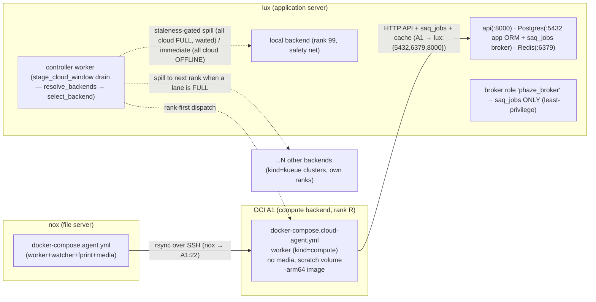

<!-- generated-by: gsd-doc-writer -->
# Cloud Burst — OCI A1 compute agent (v5.0)

**Cloud burst** offloads **long** audio sets to a free, always-on **OCI Ampere A1 (arm64)
compute agent** so they no longer time out on the local file server. The control plane routes
any file whose duration is at/above `PHAZE_CLOUD_ROUTE_THRESHOLD_SEC` to the compute agent: the
file server **pushes** it over **rsync-over-SSH across Tailscale** (Phase 50), the A1 worker
analyzes it, and results reconcile by `file_id`. There is **NO object storage** — the transport
is a direct rsync push to an ephemeral scratch volume that the agent deletes after analysis.

This document is the single home for deploying and operating cloud burst: the compose
walkthrough, the homelab provisioning runbook (OCI A1 + Tailscale ACL + Postgres broker role),
the deploy ordering, and the smoke test. For the canonical per-knob config reference, see
[configuration.md → Cloud-burst settings](configuration.md#cloud-burst-settings) — this page does
not duplicate that table.

> **Enable by declaring a `kind="compute"` backend.** There is **no** on/off boolean and **no**
> `PHAZE_CLOUD_TARGET` selector — both were **removed in Phase 67 (2026.7.1) with no shim**. Cloud
> burst is on iff the [backend registry](configuration.md#backend-registry-backendstoml)
> (`backends.toml`) declares any non-local backend; a `compute` backend is the OCI A1 lane this
> page documents. See *Enabling the compute backend & runtime-state semantics* below.

> **The feature ships OFF by default.** An **absent** `backends.toml` synthesizes an implicit
> single `kind="local"` backend, so a fresh deploy behaves **all-local** with zero cloud activity
> (`cloud_enabled` is derived `False`). Provision the infrastructure below first, then add a
> `kind="compute"` entry to `backends.toml` and restart the control plane (Step 6). For the
> Kubernetes (Kueue) lane declare a `kind="kueue"` backend instead — documented in its own
> runbook, [k8s-burst.md](k8s-burst.md).

> **Superseded in 2026.7.1 (Phase 67).** The single `PHAZE_CLOUD_TARGET` selector this page
> describes was **removed** in favor of the declarative **[backend registry](configuration.md#backend-registry-backendstoml)**
> (`backends.toml`): a `compute` backend is now one `[[backends]] kind="compute"` entry among
> N cost-ranked backends the scheduler drains across simultaneously. This page remains the A1
> host-provisioning + rsync-transport reference; for the config model and the trivial
> `cloud_target`→`backends` mapping, see
> [configuration.md → Cloud target](configuration.md#cloud-target-removed-in-phase-67).

## Architecture at a glance



_The compute (A1) backend is **one rank-tiered lane among N** the registry resolves simultaneously.
`cloud_enabled` derived `False` (no non-local backend) ⇒ long files route LOCAL, the drain no-ops,
backfill rejected, A1 idle (all-local). With a `kind="compute"` entry present, the tiered drain
routes each FIFO candidate rank-first, spilling to the next rank when a lane is at `cap` and to
local only under the staleness gate below._

Key invariants:

- **Worker-only compose.** The cloud-agent stack runs **only** the agent SAQ worker
  (`PHAZE_ROLE=agent`, `PHAZE_AGENT_KIND=compute`). No watcher, no `audfprint`/`panako`
  fingerprint sidecars, no media mount — a compute agent owns no scan roots.
- **arm64-only image.** The image is published as a **separate `-arm64` tag** (there is no
  multi-arch manifest); the `-arm64` suffix is mandatory or the pull resolves the x86 image,
  which will not run on the Ampere A1 (see [arm64-agent-image.md](arm64-agent-image.md)).
- **No `DATABASE_URL` (DIST-04).** The compute agent reaches Postgres **only** via
  `PHAZE_QUEUE_URL` for the `saq_jobs` broker, plus the application server's HTTP API. It never
  touches the app ORM tables.
- **Host Tailscale.** `tailscaled` runs on the **A1 host** (not a sidecar); the compose uses
  `network_mode: host` to inherit the host's tailnet connectivity + MagicDNS.

## Step 1 — Provision the OCI A1 (homelab OpenTofu)

The OCI A1 instance, its VCN/subnet/security-list, and the boot volume are authored as
**OpenTofu IaC in the homelab repo** (workspace boundary — phaze emits the spec, homelab applies
it). The full ready-to-paste change request is in
[`51-HOMELAB-CHANGE-PROMPT.md`](../.planning/milestones/v5.0-phases/51-deployment-config-docs/51-HOMELAB-CHANGE-PROMPT.md);
the reference spec is reproduced here.

> **⚠️ Capacity gotcha (load-bearing).** As of **June 2026** the OCI Always-Free Ampere A1 limit
> was reduced to **2 OCPU / 12 GB total** (previously 4 OCPU / 24 GB). Spec the A1 at **2 OCPU /
> 12 GB**; `docker-compose.cloud-agent.yml` already pins the compute agent's `analyze` lane to a
> single concurrent job via `PHAZE_LANE_ANALYZE_CONCURRENCY=1` (a single concurrent analysis is
> RAM-bound on 12 GB — `WORKER_MAX_JOBS` alone is only a ceiling in lane mode and does not by
> itself cap concurrency; see [agent-queue-lanes.md](agent-queue-lanes.md)).
> Always-Free A1 capacity is region-constrained — "Out of Capacity" is common; retry across
> availability domains / regions.

```hcl
# Provider: oracle/oci. Resources the homelab module must create:
resource "oci_core_instance" "phaze_compute_a1" {
  availability_domain = <pick an AD with A1 capacity>
  compartment_id      = var.compartment_id
  display_name        = "phaze-cloud-agent"
  shape               = "VM.Standard.A1.Flex"        # Always-Free eligible (Ampere arm64)
  shape_config {
    ocpus         = 2                                 # current Always-Free limit (June 2026)
    memory_in_gbs = 12
  }
  source_details {
    source_type = "image"
    source_id   = <Canonical Ubuntu 24.04 Minimal aarch64 image OCID for the region>
  }
  create_vnic_details {
    subnet_id        = oci_core_subnet.phaze_public.id
    assign_public_ip = true                           # for outbound + tailscale bootstrap
  }
  metadata = { ssh_authorized_keys = var.ssh_public_key }
}
# Plus: oci_core_vcn, oci_core_subnet, oci_core_internet_gateway, oci_core_route_table,
#       and a security list / NSG. Boot volume defaults are Always-Free within the 200GB total.
```

Tailscale (Step 2) is the real access control, so the OCI security list only needs to allow
**outbound** (for `tailscaled` to reach the tailnet relays/DERP) and may keep inbound tightly
closed except first-boot SSH bootstrap. Install `tailscaled` **and** `rsync` on the A1 (the host
must be able to receive rsync-over-SSH pushes):

```bash
# cloud-init (or manual on first boot):
apt-get update && apt-get install -y tailscale rsync
tailscale up --advertise-tags=tag:cloud-agent     # tag must match the ACL tagOwners (Step 2)
```

**Create the scratch dir on the host, owned by uid 1000.** `push_file` rsyncs each cloud-routed
file onto the **A1 host filesystem** at `${PHAZE_CLOUD_SCRATCH_DIR}/<file_id>.<ext>` (Step 5), and
the worker container **bind-mounts that same host path** (phaze-cri2 — it is NOT a docker-managed
named volume; a named volume put the container's `/scratch` on a docker-private dir disconnected
from the host `/scratch` sshd wrote into). The container runs as uid 1000 (`phaze`) and must be
able to **read AND delete** each pushed file (`process_file` verifies the sha256, analyzes, then
reaps it; the startup janitor `_sweep_scratch` also deletes stragglers). Provision the dir up front
with matching ownership so neither the rsync receive nor the container's read/delete is denied:

```bash
# On the A1 host — must match ${PHAZE_CLOUD_SCRATCH_DIR} (Step 5) and backends.toml scratch_dir (Step 6).
sudo mkdir -p /scratch
sudo chown 1000:1000 /scratch          # uid/gid 1000 = the container 'phaze' user (read + delete pushed files)
sudo chmod 700 /scratch                # only the phaze uid needs it; the pushed media is transient
```


## Step 2 — Apply the Tailscale grants ACL (homelab)

Apply this **default-deny** tailnet policy (Tailscale's current `grants` form). Once any policy
exists, the A1 (tagged `tag:cloud-agent`) gets **only** what is granted: `A1 → lux` on
`tcp:{5432,6379,8000}` and `nox → A1` on `tcp:22`, and nothing else. This is a reference copy;
homelab is the source of the live policy.

```jsonc
{
  // The A1 must come up tagged 'tag:cloud-agent' (tailscale up --advertise-tags=tag:cloud-agent,
  // or auth-key with the tag). 'hosts' map lux/nox to their tailnet IPs (or use tags if preferred).
  "tagOwners": {
    "tag:cloud-agent": ["autogroup:admin"]
  },
  "hosts": {
    "lux": "100.x.x.x",   // application server tailnet IP (Postgres queue + Redis cache + HTTP API)
    "nox": "100.y.y.y"    // file server tailnet IP (push initiator)
  },
  "grants": [
    // A1 compute agent -> lux: saq_jobs broker (5432), Redis cache (6379), app HTTP API (8000).
    {
      "src": ["tag:cloud-agent"],
      "dst": ["lux"],
      "ip": ["tcp:5432", "tcp:6379", "tcp:8000"]
    },
    // nox file server -> A1: SSH for the rsync-over-SSH push (Phase 50 push_file target).
    {
      "src": ["nox"],
      "dst": ["tag:cloud-agent"],
      "ip": ["tcp:22"]
    }
  ]
}
```

`tcp:5432` is required because the SAQ broker is **Postgres** (Phase 36); the A1 still has **no**
`DATABASE_URL` (DIST-04 — it touches only `saq_jobs`/`saq_stats`/`saq_versions`). Use placeholders
only here; the real lux/nox tailnet IPs live in the homelab repo, never in this spec.

## Step 3 — Create the least-privilege `phaze_broker` Postgres role (homelab, lux)

The compute agent connects to lux Postgres **only** as the SAQ broker. Create a dedicated
`phaze_broker` role with exactly the grants below and **zero** grants on any app-ORM table.

> **Prerequisite (load-bearing).** The **full `phaze` role** (the control plane) must boot
> **FIRST** so SAQ has already created and migrated `saq_jobs` / `saq_stats` / `saq_versions`.
> The broker role then never *owns* or *migrates* the SAQ schema — its `init_db()`
> short-circuits at the version check.

> **Why `CREATE ON SCHEMA public` is unavoidable (empirically verified, live Postgres 18,
> 2026-06-26).** SAQ's `init_db()` runs, on **every** `queue.connect()`, an **unconditional**
> `CREATE TABLE IF NOT EXISTS saq_versions` — and PostgreSQL checks the **schema-CREATE
> privilege _before_ the `IF NOT EXISTS` existence short-circuit**. A broker role lacking
> `CREATE ON SCHEMA public` fails with `ERROR: permission denied for schema public` **even when
> all SAQ tables already exist**. Pre-creating the tables and granting only table-DML therefore
> does **not** work; `CREATE ON SCHEMA public` is required regardless.

```sql
-- Run as the phaze owner / a superuser on the lux Postgres, in the phaze database.
-- The control plane (full 'phaze' role) must boot FIRST so SAQ has already created
-- saq_jobs/saq_stats/saq_versions and migrated them to the current version.

CREATE ROLE phaze_broker LOGIN PASSWORD '<strong-unique-password>';   -- use a secret/_FILE in deploy

-- USAGE to resolve objects; CREATE is REQUIRED by SAQ init_db's unconditional
-- `CREATE TABLE IF NOT EXISTS saq_versions` (PG checks schema-CREATE before IF-NOT-EXISTS).
GRANT USAGE, CREATE ON SCHEMA public TO phaze_broker;

-- Queue table DML (the broker dequeues, sweeps, writes stats).
GRANT SELECT, INSERT, UPDATE, DELETE ON saq_jobs, saq_stats, saq_versions TO phaze_broker;

-- saq_jobs.lock_key is SERIAL -> an INSERT assigns from this sequence.
GRANT USAGE, SELECT ON SEQUENCE saq_jobs_lock_key_seq TO phaze_broker;

-- DIST-04: grant NOTHING on the app ORM tables. Verify the role is blind to app data:
--   SET ROLE phaze_broker; SELECT * FROM files LIMIT 1;  -- must ERROR: permission denied
```

**Postgres-version note.** On PostgreSQL **15+**, the `public` schema no longer grants `CREATE`
to `PUBLIC` by default, so the explicit `GRANT … CREATE ON SCHEMA public` is genuinely required.
On PG **<15** it is redundant. Confirm the lux Postgres major version in the runbook.

**DIST-04 verification probe (run after creating the role).** The broker must be blind to all
app-ORM data:

```sql
SET ROLE phaze_broker;
SELECT * FROM files LIMIT 1;     -- MUST ERROR: permission denied for table files
RESET ROLE;
```

If that `SELECT` returns rows instead of erroring, the role is over-granted — stop and revoke.

**Optional stronger hardening (document, don't default).** A dedicated `saq` schema gives the
broker zero rights in `public` (`CREATE SCHEMA saq; ALTER TABLE … SET SCHEMA saq;` plus
`search_path` changes on both roles). It is tighter but relocates the **live** control-plane
`saq_jobs` table — a riskier homelab change. Defer unless strict public-schema lockdown is wanted.

## Step 4 — Release the `-arm64` image

Ship a CalVer release. The Phase 47 `build-arm64` CI job publishes the native arm64 image as a
separate `-arm64` tag — `ghcr.io/simplicityguy/phaze:2026.7.1-arm64` (and `:latest-arm64` on the
default branch). The cloud-agent compose pins it via `PHAZE_IMAGE_TAG` (see
[arm64-agent-image.md → Tag naming](arm64-agent-image.md)). There is no multi-arch manifest, so
the `-arm64` suffix is mandatory.

## Step 5 — Bring up the compute agent (`docker-compose.cloud-agent.yml`)

On the **A1 host**, the operator runs the standalone worker-only compose:

```bash
docker compose -f docker-compose.cloud-agent.yml up -d
```

The compose file is worker-only: a single `worker` service (no media-bound sidecars),
`network_mode: host`, the `-arm64` image, a **host bind** of `${PHAZE_CLOUD_SCRATCH_DIR}` to the
identical container path for scratch (phaze-cri2 — the pushed files land on the host filesystem, so
the container must bind that same host dir to read + reap them; provision it uid-1000-owned per
Step 1), the models mount `rw` (auto-download), and the CA cert mount `ro`. It declares no
`postgres`/`redis` service and no `DATABASE_URL` (DIST-04).

Populate the A1's `.env` with the compute-agent variables. The cloud-burst knobs are documented
in [configuration.md → Cloud-burst settings](configuration.md#cloud-burst-settings); secrets use
the `*_FILE` convention:

```bash
PHAZE_QUEUE_URL=postgresql://phaze_broker:<pw>@lux:5432/phaze   # libpq form; broker role (NOT phaze)
                                                               # prefer PHAZE_QUEUE_URL_FILE
PHAZE_REDIS_URL=redis://:<redis_pw>@lux:6379/0                  # production mode REQUIRES a password
PHAZE_AGENT_API_URL=https://lux:8000                           # production mode REQUIRES https://
PHAZE_AGENT_ENV=production
PHAZE_AGENT_KIND=compute                                       # relaxes the empty-scan-roots gate
PHAZE_AGENT_QUEUE=phaze-agent-<compute_agent_id>               # raw env, read at SAQ import time
PHAZE_AGENT_TOKEN_FILE=/run/secrets/agent_token                # _FILE secret
PHAZE_CLOUD_SCRATCH_DIR=/scratch                               # MUST match this backend's scratch_dir in backends.toml (Step 6)
# No WORKER_MAX_JOBS override needed: docker-compose.cloud-agent.yml already pins the analyze
# lane to a single RAM-bound job via PHAZE_LANE_ANALYZE_CONCURRENCY=1 (the knob that actually
# governs concurrency in lane mode; WORKER_MAX_JOBS alone is only a ceiling).
MODELS_PATH=/models
PHAZE_AGENT_CA_FILE=/certs/phaze-ca.crt
PHAZE_IMAGE_TAG=2026.7.1                                      # pulls 2026.7.1-arm64
# NO DATABASE_URL (DIST-04). NO SCAN_PATH / PHAZE_AGENT_SCAN_ROOTS (kind=compute relaxes it).
```

> **Two production guards WILL fire if violated** (`AgentSettings`, with
> `PHAZE_AGENT_ENV=production`): `agent_api_url` must be `https://` and `redis_url` must carry a
> password. Both are non-negotiable on the compute agent — set `PHAZE_AGENT_API_URL=https://lux:8000`
> and a passworded `PHAZE_REDIS_URL`.

**Scratch-dir match.** `PHAZE_CLOUD_SCRATCH_DIR` (A1) **must equal** this backend's `scratch_dir`
field in `backends.toml` (Step 6, lux control plane — the flat control-side `compute_scratch_dir` /
`PHAZE_COMPUTE_SCRATCH_DIR` was removed in Phase 67/73 with no shim) and the host-bind mount
path (Step 1) — a drift surfaces as a sha256/transfer failure, never silent corruption.

## Step 6 — Declare the compute backend and restart the control plane (lux)

On the **lux control plane**, add a `kind="compute"` entry to the
[backend registry](configuration.md#backend-registry-backendstoml) TOML file
(`PHAZE_BACKENDS_CONFIG_FILE`, default `/etc/phaze/backends.toml`) and restart so the registry is
re-read. There is **no** `PHAZE_CLOUD_TARGET` env var — on/off is **derived** from whether the
registry holds any non-local backend (`cloud_enabled`).

```toml
# /etc/phaze/backends.toml on lux. An absent file = implicit all-local; adding this compute
# entry is what turns cloud burst ON (cloud_enabled becomes True).

# The always-present local safety net (rank 99 = last-resort spill target).
[[backends]]
id   = "local"
kind = "local"
rank = 99
cap  = 1

# The OCI A1 compute lane this page provisions. rank < 99 so the drain prefers it over local.
[[backends]]
id          = "a1"
kind        = "compute"
rank        = 10                 # cost-tier ordering — lower runs sooner
cap         = 1                  # concurrency cap (RAM-bound single analysis on the 12 GB A1)
agent_ref   = "<compute_agent_id>"   # REQUIRED — the registered compute `Agent.id` this lane
                                     # dispatches to (an Agent id, NOT a queue name — resolved via
                                     # select_agent_by_id(..., kind="compute"))
push_host   = "<a1-host>"        # REQUIRED — the rsync/ssh destination host for this lane
scratch_dir = "/scratch"         # REQUIRED — remote scratch dir the push lands in; MUST match the A1's PHAZE_CLOUD_SCRATCH_DIR
ssh_user    = "phaze"            # optional — falls back to the file server's configured push user
```

> **`push_host` is required, not optional.** A `kind="compute"` entry without `agent_ref`,
> `push_host`, **and** `scratch_dir` fails **at construction** (`ComputeBackend._require_dispatch_fields`),
> so the control plane refuses to boot on the restart this step instructs. Do not omit it.

The registry is **startup-read** — editing `backends.toml` on a running controller does **nothing**
until the controller worker + api restart. Once the `compute` backend is declared, long files begin
routing to the A1 rank-first, and any files held from before the change (their `cloud_job` sidecar
sitting at `status='awaiting'`) are released by the tiered drain. For the Kubernetes lane declare a
`kind="kueue"` backend (with a
`[backends.kube]` submodel and a `[[buckets]]` staging entry) instead — see the dedicated
[k8s-burst.md](k8s-burst.md) runbook. Both lanes can be declared **simultaneously**; the scheduler
drains across all of them by rank. See *Enabling the compute backend & runtime-state semantics*
below.

## Step 7 — Smoke test

Confirm the end-to-end path with this checklist:

- [ ] **Agent registers.** The compute agent appears on `/admin/agents` and reaches **alive**
      within ~60s of `docker compose -f docker-compose.cloud-agent.yml up -d` (heartbeat OK).
- [ ] **A long file routes to cloud.** Trigger analysis on a set whose duration ≥
      `PHAZE_CLOUD_ROUTE_THRESHOLD_SEC`; confirm it is held for cloud rather than entering the local
      queue — the file gains a `cloud_job` sidecar row at `status='awaiting'` and the pipeline
      dashboard's **"Awaiting cloud"** card increments.
- [ ] **The file pushes.** The file server's `push_file` job transfers it via rsync-over-SSH to
      the A1 scratch dir and the sha256 verifies. The sidecar advances
      `awaiting` → `uploading` → `uploaded`, which the dashboard surfaces as
      **"Staged (pushing)"** then **"Analyzing (cloud)"**. (Phase 90 removed the `FileState` enum
      and the `files.state` column — there are no `AWAITING_CLOUD` / `PUSHING` / `PUSHED` file
      states to look for; stage/status is derived from the `cloud_job` sidecar and the output
      tables via `services/stage_status.py`.)
- [ ] **The compute agent drains a `process_file`.** The A1 worker reads the pushed file from
      scratch, analyzes it, and posts results that reconcile by `file_id`.
- [ ] **Scratch is cleaned.** The pushed file is deleted from the A1 scratch volume after
      analysis (no scratch leak).
- [ ] **Reverts cleanly (optional).** Engage the runtime **force-local** pill (no restart) — or
      drop the `kind="compute"` entry from `backends.toml` and restart — and confirm a new long file
      routes **local** and the drain no-ops.

## Enabling the compute backend & runtime-state semantics

> **Superseded in 2026.7.1 (Phase 67).** The old single on/off boolean **and** the
> `PHAZE_CLOUD_TARGET` (`local` \| `a1` \| `k8s`) selector that replaced it are **both removed with
> no shim**. On/off is now **derived** (`cloud_enabled`): the feature is on iff `backends.toml`
> declares any non-local backend. A stale `PHAZE_CLOUD_TARGET=…` left in a live `.env` is **silently
> dropped** (`model_config` is `extra="ignore"`) — it does **not** pin routing. Delete it.

The compute (A1) lane is a `[[backends]] kind="compute"` entry in the
[backend registry](configuration.md#backend-registry-backendstoml) — **one rank-tiered lane among
N** the registry resolves simultaneously (`resolve_backends`), not a single global target:

- **All-local (default) = no non-local backend.** With an absent `backends.toml` (or a registry of
  only `kind="local"`), `cloud_enabled` derives **`False`**: every file — short and long — routes
  to the local file-server queue exactly as before cloud burst existed. The routing seam never
  writes an `awaiting` `cloud_job` row, the drain no-ops, and backfill-to-cloud is rejected. Long
  files may then time out locally and fail cleanly (a FAILED analyze stage). A fresh deploy ships
  **dormant** this way until the operator declares a non-local backend and completes Steps 1–6.
- **`kind="compute"` = OCI A1 compute agent (this page).** Long files route to the A1 via
  rsync-over-SSH. Requires the backend's `agent_ref` and `scratch_dir` (the latter matched to the
  A1's `cloud_scratch_dir`). This is **one rank-tiered lane among N** — you may declare **more than
  one** `kind="compute"` backend (e.g. a free arm64 A1 plus a paid x86 spill box), each bound to its
  own `agent_ref` / `push_host` / `scratch_dir`. For that mixed arm64/x86 cost-tiered recipe see
  [multi-compute.md](multi-compute.md); this page stays the single-A1 provisioning walkthrough.
- **`kind="kueue"` = Kubernetes (Kueue).** Long files stage to S3 and the control plane submits a
  suspended Kueue Job. Requires the backend's `[backends.kube]` submodel and a `[[buckets]]` staging
  entry. Documented in its own runbook — [k8s-burst.md](k8s-burst.md). N Kueue clusters may be
  declared at once.
- **Changing the registry requires a control-plane restart** (startup-read — Pitfall 6). The
  controller worker + api must restart for a `backends.toml` edit to take effect. (For a
  *no-restart* incident revert, use the force-local pill — see *Reverting to local* below.)
- **In-flight work drains; dropping a cloud backend only stops NEW cloud work.** Files already
  mid-flight (`cloud_job.status` in `uploading` / `uploaded` / `submitted` / `running`) finish
  across a restart (the sidecar is durable in Postgres); no mid-transfer/mid-analysis abort, no
  scratch reclaim. Files held at `status='awaiting'` from before a backend is added release once a
  cloud backend is declared.
- **`nox`'s `PHAZE_PUSH_KNOWN_HOSTS` must be re-provisioned** with the A1's SSH **host key** after
  the A1 is up (Phase 50 strict known_hosts), or the rsync-over-SSH push fails host verification.

### Tiered drain & spillover (Phase 69, SCHED-01)

With N backends resolved, the controller's `stage_cloud_window` drain replaces the old
single-backend "stay one ahead" in-flight window with a **rank-first tiered drain**. Each tick it
snapshots every backend's `is_available()` and `remaining = cap - in_flight_count()` once, then
routes each FIFO awaiting-cloud candidate (a file carrying a `cloud_job` row at `status='awaiting'`)
through the pure `select_backend` policy:

- **Rank-first dispatch.** The available lowest-`rank` backend with a free slot wins; a lowest-rank
  backend that is at `cap` **spills to the next rank**, per candidate.
- **Staleness-gated spill to local.** Slow local (rank 99) becomes an eligible spill target only
  after the file has waited past `cloud_spill_to_local_after_seconds` (default 900s) while all
  higher-rank backends are **online-but-FULL** — but when every non-local backend is **OFFLINE**,
  local is eligible **immediately** (the gate guards the full→local path, not the offline→local
  path).
- **Attempt-exclusion (anti-thrash).** A file whose cloud attempt count has reached
  `cloud_submit_max_attempts` is excluded from cloud/Kueue candidates and routes to local only —
  local is never excluded, it is the guaranteed safety net.
- **Clean holds.** When nothing is eligible this tick, `select_backend` returns `None` and the file
  stays at `cloud_job.status='awaiting'` (a no-op hold, never a failure).

### Reverting to local

Two paths, matching the incident-vs-planned distinction:

- **Incident revert (no restart).** Engage the pipeline header **force-local** pill (BEUI-02): it
  writes a durable `route_control` row that gates both the drain and the duration router **live**.
  Files already held at `cloud_job.status='awaiting'` stay held (the drain no-ops); new long files
  route local.
  Reversible, no redeploy — see [runbook.md → Force-local incident revert](runbook.md#force-local-incident-revert).
- **Planned revert.** Drop the `kind="compute"` (and/or `kind="kueue"`) entry from `backends.toml`
  and restart the controller worker + api. `cloud_enabled` derives back to `False` and the deploy is
  all-local again.

### Declaring a `kind="kueue"` backend

The Kubernetes (Kueue) lane — the `[backends.kube]` + `[[buckets]]` config, the cluster-admin
runbook (ResourceFlavor / ClusterQueue / LocalQueue / RBAC / Secret), the apiVersion-lockstep rule,
the transport-agnostic endpoint notes, the deploy ordering, and the submit → reconcile lifecycle —
is documented in its own self-contained runbook:

> **➡ See [k8s-burst.md](k8s-burst.md)** for the full Kubernetes burst setup. This page stays
> A1-specific; the Kueue backend is **not** folded in here.

See also [configuration.md → Kube submit/reconcile settings](configuration.md#kube-submitreconcile-settings-phase-54-v60)
for the full per-knob reference (defaults, `_FILE` support).

## See also

- [configuration.md → Cloud-burst settings](configuration.md#cloud-burst-settings) — the canonical
  per-knob reference (env var, default, `_FILE` support, description).
- [k8s-burst.md](k8s-burst.md) — the **Kubernetes (Kueue)** burst lane (a `[[backends]] kind="kueue"`
  entry): the cluster-admin runbook, RBAC, and submit → reconcile lifecycle.
- [deployment.md](deployment.md) — the two-host base deployment the cloud agent extends.
- [arm64-agent-image.md](arm64-agent-image.md) — how the `-arm64` image is built and tagged.
- [`51-HOMELAB-CHANGE-PROMPT.md`](../.planning/milestones/v5.0-phases/51-deployment-config-docs/51-HOMELAB-CHANGE-PROMPT.md)
  — the ready-to-apply homelab infrastructure change request (OpenTofu + ACL + broker role).
