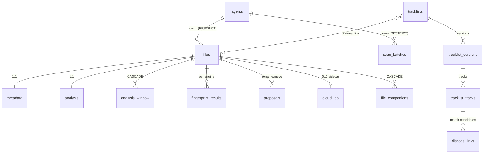
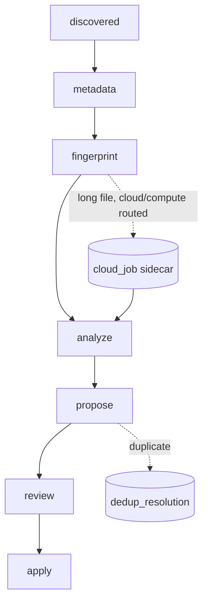

<!-- generated-by: gsd-doc-writer -->
# Database

phaze persists all state in PostgreSQL (18+) accessed asynchronously via SQLAlchemy 2.0
(`postgresql+asyncpg://`). Models live in `src/phaze/models/`; schema changes are managed
by Alembic using the async template (`alembic/`). All models inherit a `created_at` /
`updated_at` `TimestampMixin` and share a constraint naming convention defined in
`src/phaze/models/base.py`.

## Schema

| Table                 | Description                                                            |
|-----------------------|-----------------------------------------------------------------------|
| `agents`              | Distributed worker (file-server) identities that own files and scans  |
| `files`               | Central file records; per-stage status is derived on read (no `state` column) |
| `scan_batches`        | Scan operation progress and status (`ScanStatus`)                     |
| `metadata`            | Audio tag metadata (1:1 with `files`)                                  |
| `analysis`            | BPM, key, mood, style results (1:1 with `files`)                       |
| `analysis_window`     | Per-window time-series analysis rows (1:many with `files`, `ON DELETE CASCADE`) |
| `fingerprint_results` | Per-engine fingerprint results (one row per `file_id` + `engine`)     |
| `proposals`           | AI-generated rename/move proposals (`ProposalStatus`)                  |
| `execution_log`       | Append-only audit trail for file rename/move operations               |
| `tag_write_log`       | Append-only audit trail for tag write operations (before/after tags)  |
| `file_companions`     | Many-to-many: companion files to media files                          |
| `tracklists`          | Tracklist metadata (`1001tracklists` or `fingerprint` source)         |
| `tracklist_versions`  | Versioned tracklist snapshots                                         |
| `tracklist_tracks`    | Individual tracks within a version                                    |
| `discogs_links`       | Candidate/accepted Discogs release matches per tracklist track        |
| `cloud_job`           | Per-`file_id` sidecar for the S3 object-staging / cloud-burst leg (1:1 with `files`) |
| `pipeline_stage_control` | Durable per-stage pause/priority operator intent (one row per agent pipeline stage) |
| `scheduling_ledger`   | Durable "this stage was scheduled for this item" record (recovery source of truth)  |
| `route_control`       | Single-row (`id = 'global'`) force-local routing override switch       |

### Entity relationships

Foreign keys to `agents` are `ON DELETE RESTRICT` (an agent that owns files/scans cannot be
deleted); `analysis_window` and `file_companions` cascade with their `files` row
(`ON DELETE CASCADE`); the remaining per-file sidecars (`metadata`, `analysis`,
`fingerprint_results`, `proposals`, `cloud_job`) and the tracklist chain use the default
restricting FK (no cascade).



### Agent attribution

`files` and `scan_batches` each carry a non-null `agent_id` (`String(64)`) that foreign-keys
to `agents.id` with `ON DELETE RESTRICT`. New rows default to the seeded
`legacy-application-server` agent. Uniqueness on `files` is the composite
`(agent_id, original_path)` — the same path may exist under different agents. `scan_batches`
enforces a partial unique index allowing at most one `status = 'live'` watcher batch per agent.

### Proposal idempotency

`proposals` carries a partial UNIQUE index `uq_proposals_file_id_pending` on `file_id`
`WHERE status = 'pending'` (model `src/phaze/models/proposal.py`, migration `019`). It
structurally guarantees at most one PENDING proposal per file (D-04). This index is the
`ON CONFLICT` target for `services.proposal.store_proposals`' upsert
(`on_conflict_do_update` with `index_elements=["file_id"]` and
`index_where=status == 'pending'`): re-running proposal generation overwrites the single
pending row in place rather than accumulating duplicates. Because the index predicate is
scoped to `status = 'pending'`, rows in any other state (`approved`, `executed`, `rejected`,
`failed`) fall outside the index and are never a conflict target — human approvals are
structurally protected from being overwritten by a re-run.

### Derived per-stage status

There is **no `files.state` column and no file-level state enum** — Phase 90 dropped the
`state` column, the file-level state `StrEnum`, and the `ix_files_state` index (migration
`039_drop_files_state_column`). A file's status is instead **derived on read**, per stage,
from its output tables (`metadata`, `fingerprint_results`, `analysis`, `proposals`,
`execution_log`), the `cloud_job` sidecar, and the `dedup_resolution` marker.

- `Stage` (`src/phaze/enums/stage.py`, 7 stages): `metadata`, `fingerprint`, `analyze`,
  `tracklist`, `propose`, `review`, `apply`.
- `Status` (`src/phaze/enums/stage.py`, 5 states): `not_started`, `in_flight`, `done`,
  `skipped`, `failed`, resolved under the precedence ladder
  `in_flight ≻ done ≻ skipped ≻ failed ≻ not_started`. The durable `scheduling_ledger` is the
  authoritative `in_flight` source. The DB-free resolver `resolve_status` and its SQL twin
  `services/stage_status.py` (`stage_status_case`) are locked 1:1 by an equivalence test.
- `CloudJobStatus` (`cloud_job.py`): `awaiting`, `uploading`, `uploaded`, `submitted`,
  `running`, `succeeded`, `failed` — tracks the long-file cloud-burst / tiered-drain detour
  off `analyze` on the standalone `cloud_job` sidecar row (not a file state).
- `ScanStatus` (`scan_batch.py`): `running`, `completed`, `failed`, `live`.
- `ProposalStatus` (`proposal.py`): `pending`, `approved`, `rejected`, `executed`, `failed`.
- `TagWriteStatus` (`tag_write_log.py`): `completed`, `failed`, `discrepancy`.
- `ExecutionStatus` is defined in `src/phaze/enums/execution.py` and re-exported from
  `models/execution.py`.

The conceptual per-file stage progression (each node's status is derived, never stored):



### Full-text search

Migration 009 adds PostgreSQL `GENERATED ALWAYS ... STORED` `tsvector` columns
(`search_vector`) to `files`, `metadata`, and `tracklists`, each backed by a GIN index. It
also enables the `pg_trgm` extension and creates trigram GIN indexes for `ILIKE` partial
matching. `discogs_links` carries its own GIN FTS index on denormalized artist/title.

## Migrations

Schema is managed by Alembic with the async template (`alembic/env.py` overrides
`sqlalchemy.url` from application settings, so no URL is hard-coded in `alembic.ini`).
Migrations run sequentially from `001` through `031` in `alembic/versions/`;
`031_add_route_control` is the current head.

```bash
just db-upgrade              # Apply all pending migrations (alembic upgrade head)
just db-revision "message"   # Create new migration (alembic revision --autogenerate)
just db-current              # Show current migration (alembic current)
just db-downgrade            # Roll back one migration (alembic downgrade -1)
just db-history              # Show migration history (alembic history)
```

`db-revision` autogenerates from model changes — all models are imported in
`src/phaze/models/__init__.py` so Alembic can discover them.

### Recent migrations

| Rev | Summary                                                                                  |
|-----|------------------------------------------------------------------------------------------|
| 009 | Add `search_vector` GENERATED tsvector columns + GIN/trigram indexes; enable `pg_trgm`    |
| 010 | Create `discogs_links` table with status/track indexes and a GIN FTS index               |
| 011 | Create `tag_write_log` table (before/after JSONB tags) with file/status indexes          |
| 012 | Create `agents` table, seed legacy agent + LIVE sentinel batch, add nullable `agent_id` + FKs, backfill |
| 013 | Set `agent_id` NOT NULL; swap `files` uniqueness from `original_path` to `(agent_id, original_path)` |
| 014 | Add `agents.last_status` JSONB column + partial token-hash index (`WHERE revoked_at IS NULL`) |
| 015 | Add nullable tz-aware `scan_batches.completed_at` terminal-timestamp column               |
| 016 | Backfill `scan_batches.completed_at = updated_at` for terminal rows with a NULL value     |
| 017 | Add nullable `scan_batches.last_progress_at` heartbeat column + backfill from `updated_at` |
| 018 | Create `analysis_window` table (per-window time-series rows) with composite/partial/label indexes |
| 019 | Dedupe existing pending proposals, then add partial unique index `uq_proposals_file_id_pending` |
| 020 | Create `pipeline_stage_control` table (durable per-stage pause/priority intent)           |
| 021 | Add analysis coverage columns (windowed-analysis progress tracking)                       |
| 022 | Create `scheduling_ledger` table (durable per-item "stage scheduled" record)              |
| 023 | Add `scheduling_ledger` job-policy columns (routing/replay hints)                         |
| 024 | Add `agents.kind` (+ `ck_agents_kind_enum` CHECK `{'fileserver','compute'}`, default `fileserver`) |
| 025 | Create `cloud_job` table (per-`file_id` S3 object-staging sidecar)                        |
| 026 | Add `cloud_job` Kube columns (`kueue_workload`, `attempts`, `inadmissible`)               |
| 027 | Add `cloud_job.cloud_phase` column                                                        |
| 028 | Add `analysis.completed_at` column                                                       |
| 029 | Add `cloud_job.backend_id` column (multi-backend registry attribution)                    |
| 030 | Add `cloud_job.staging_bucket` column (multi-Kueue per-cluster bucket)                    |
| 031 | Create `route_control` table + seed the single `'global'` force-local override row        |

Migration 013's downgrade fails loudly if the same `original_path` now exists under multiple
agents — duplicates must be resolved manually before rolling back, since silent dedup is
forbidden for an irreplaceable personal collection.

Migration 019 runs two ordered ops in `upgrade()`: it first collapses pre-existing duplicate
PENDING proposals to one-per-file (keeping the most-recent `created_at`), then creates the
partial unique index — the dedupe MUST run first or `CREATE UNIQUE INDEX` aborts on the live
archive's duplicates. Its `downgrade()` only drops the index; the dedupe DELETE is not
reversible.
