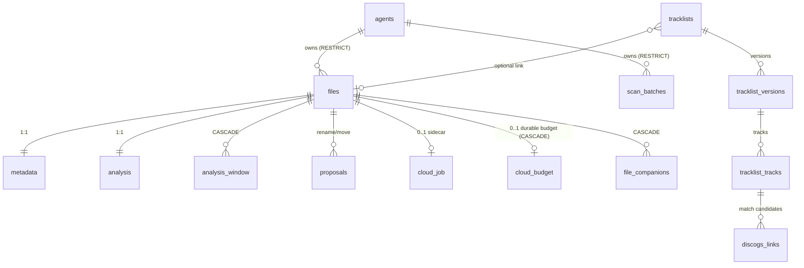
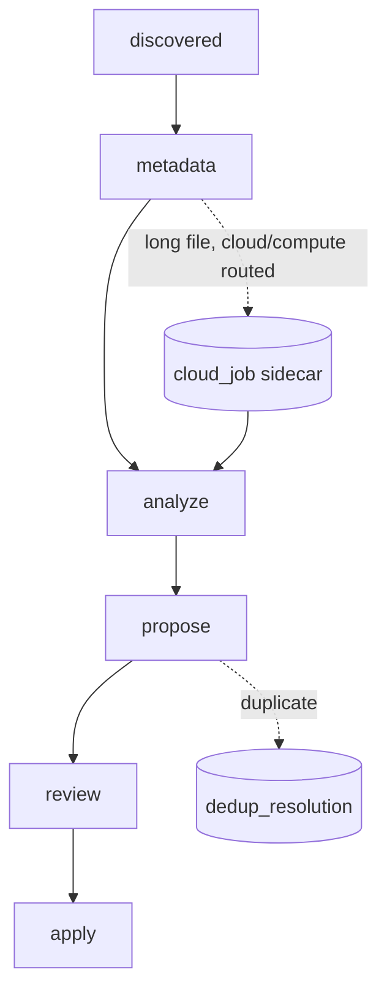

<!-- generated-by: gsd-doc-writer -->
# Database

phaze persists all state in PostgreSQL (18+) accessed asynchronously via SQLAlchemy 2.0
(`postgresql+asyncpg://`). Models live in `src/phaze/models/`; schema changes are managed
by Alembic using the async template (`alembic/`). All models inherit a `created_at` /
`updated_at` `TimestampMixin` and share a constraint naming convention defined in
`src/phaze/models/base.py`.

## Schema

| Table                 | Description                                                            |
|-----------------------|-----------------------------------------------------------------------|
| `agents`              | Distributed worker (file-server) identities that own files and scans  |
| `files`               | Central file records; per-stage status is derived on read (no `state` column) |
| `scan_batches`        | Scan operation progress and status (`ScanStatus`)                     |
| `metadata`            | Audio tag metadata (1:1 with `files`)                                  |
| `analysis`            | BPM, key, mood, style results (1:1 with `files`)                       |
| `analysis_window`     | Per-window time-series analysis rows (1:many with `files`, `ON DELETE CASCADE`) |
| `proposals`           | AI-generated rename/move proposals (`ProposalStatus`)                  |
| `execution_log`       | Append-only audit trail for file rename/move operations               |
| `tag_write_log`       | Append-only audit trail for tag write operations (before/after tags)  |
| `file_companions`     | Many-to-many: companion files to media files                          |
| `tracklists`          | Tracklist metadata (sourced from `1001tracklists`; audio-fingerprint sourcing was removed, phaze-0jpe) |
| `tracklist_versions`  | Versioned tracklist snapshots                                         |
| `tracklist_tracks`    | Individual tracks within a version                                    |
| `discogs_links`       | Candidate/accepted Discogs release matches per tracklist track        |
| `cloud_job`           | Per-`file_id` sidecar for the S3 object-staging / cloud-burst leg (1:1 with `files`) |
| `cloud_budget`        | Durable per-`file_id` cloud-budget ledger that **outlives** the `cloud_job` sidecar (1:1 with `files`, row exists only once a cloud chain has burned out) |
| `pipeline_stage_control` | Durable per-stage pause/priority operator intent (one row per agent pipeline stage) |
| `scheduling_ledger`   | Durable "this stage was scheduled for this item" record (recovery source of truth)  |
| `route_control`       | Single-row (`id = 'global'`) force-local routing override switch       |
| `dedup_resolution`    | Per-file 1:1 sidecar marking a duplicate resolved to a canonical file (marker-row existence = resolved) |
| `stage_skip`          | Per-`(file_id, stage)` sidecar marking an operator force-skip of an enrich stage      |
| `filename_convention` | Corpus-learned filename conventions (e.g. date order), keyed generically by `(scope, scope_value, convention_kind)` with a DB-derived confidence (phaze-5fta.2) |
| `tracklist_lookup_cache` | Persisted per-unique-set record of the last 1001Tracklists lookup outcome, so a drain restart never re-asks an already-answered question (phaze-fq9h.3) |
| `tracklist_priority_flags` | Persisted operator "answer this file's tracklist lookup next" flag consumed by the drain (phaze-fq9h.8) |

One further table shares the database but is **not** in the list above because it is not an
Alembic-managed model: **`saq_jobs`**. Since Phase 36 the SAQ broker is a `PostgresQueue`, and
SAQ creates and owns this table itself (`CREATE TABLE IF NOT EXISTS`, outside the migration
chain). phaze still reads and mutates it directly with raw parameterized SQL from
`services/stage_control.py` — the per-stage pause / resume / priority helpers reorder or park
the *existing* queued backlog that the `before_enqueue` hook can only stamp on new jobs. Because
`saq_jobs` has no `function` column (the name lives inside the serialized `job` BYTEA blob),
those helpers filter on the Phase-35 deterministic key prefix `key LIKE '<function>:%'`, always
guarded by `status = 'queued'`.

### Entity relationships

Foreign keys to `agents` are `ON DELETE RESTRICT` (an agent that owns files/scans cannot be
deleted); `analysis_window` and `file_companions` cascade with their `files` row
(`ON DELETE CASCADE`), as does `cloud_budget`; the remaining per-file sidecars (`metadata`,
`analysis`, `proposals`, `cloud_job`, `dedup_resolution`, `stage_skip`) and the
tracklist chain use the default restricting FK (no cascade).


```mermaid
erDiagram
    agents ||--o{ files : "owns (RESTRICT)"
    agents ||--o{ scan_batches : "owns (RESTRICT)"
    files ||--|| metadata : "1:1"
    files ||--|| analysis : "1:1"
    files ||--o{ analysis_window : "CASCADE"
    files ||--o{ proposals : "rename/move"
    files ||--o| cloud_job : "0..1 sidecar"
    files ||--o| cloud_budget : "0..1 durable budget (CASCADE)"
    files ||--o{ file_companions : "CASCADE"
    tracklists ||--o{ tracklist_versions : "versions"
    tracklist_versions ||--o{ tracklist_tracks : "tracks"
    tracklist_tracks ||--o{ discogs_links : "match candidates"
    tracklists }o--o| files : "optional link"
```

### Agent attribution

`files` and `scan_batches` each carry a non-null `agent_id` (`String(64)`) that foreign-keys
to `agents.id` with `ON DELETE RESTRICT`. New rows default to the seeded
`legacy-application-server` agent. Uniqueness on `files` is the composite
`(agent_id, original_path)` — the same path may exist under different agents. `scan_batches`
enforces a partial unique index allowing at most one `status = 'live'` watcher batch per agent.

### Proposal idempotency

`proposals` carries a partial UNIQUE index `uq_proposals_file_id_pending` on `file_id`
`WHERE status = 'pending'` (model `src/phaze/models/proposal.py`, migration `019`). It
structurally guarantees at most one PENDING proposal per file (D-04). This index is the
`ON CONFLICT` target for `services.proposal.store_proposals`' upsert
(`on_conflict_do_update` with `index_elements=["file_id"]` and
`index_where=status == 'pending'`): re-running proposal generation overwrites the single
pending row in place rather than accumulating duplicates. Because the index predicate is
scoped to `status = 'pending'`, rows in any other state (`approved`, `executed`, `rejected`,
`failed`) fall outside the index and are never a conflict target — human approvals are
structurally protected from being overwritten by a re-run.

### Derived per-stage status

There is **no `files.state` column and no file-level state enum** — Phase 90 dropped the
`state` column, the file-level state `StrEnum`, and the `ix_files_state` index (in the
pre-flatten chain's migration `039_drop_files_state_column`, now folded into the `039`
baseline schema). A file's status is instead **derived on read**, per stage,
from its output tables (`metadata`, `analysis`, `proposals`,
`execution_log`), the `cloud_job` sidecar, and the `dedup_resolution` marker.

- `Stage` (`src/phaze/enums/stage.py`, 6 stages): `metadata`, `analyze`,
  `tracklist`, `propose`, `review`, `apply`. Audio fingerprinting was removed as a stage
  (phaze-0jpe).
- `Status` (`src/phaze/enums/stage.py`, 5 states): `not_started`, `in_flight`, `done`,
  `skipped`, `failed`, resolved under the precedence ladder
  `in_flight ≻ done ≻ skipped ≻ failed ≻ not_started`. The durable `scheduling_ledger` is the
  authoritative `in_flight` source. The DB-free resolver `resolve_status` and its SQL twin
  `services/stage_status.py` (`stage_status_case`) are locked 1:1 by an equivalence test.
- `CloudJobStatus` (`cloud_job.py`): `awaiting`, `uploading`, `uploaded`, `submitted`,
  `running`, `succeeded`, `failed` — tracks the long-file cloud-burst / tiered-drain detour
  off `analyze` on the standalone `cloud_job` sidecar row (not a file state).
- `ScanStatus` (`scan_batch.py`): `running`, `completed`, `failed`, `live`.
- `ProposalStatus` (`proposal.py`): `pending`, `approved`, `rejected`, `executed`, `failed`.
- `TagWriteStatus` (`tag_write_log.py`, 5 members): `completed`, `failed`, `discrepancy`,
  `verify_failed` (phaze-vq3g — the on-disk write landed but the immediate verify re-read
  failed; distinct from `discrepancy`, where the write landed the *wrong* values, and from
  `failed`, where it never landed. Non-terminal, so the file resurfaces and a later submit
  self-heals to `completed`), and `no_op` (WR-01 — a *terminal* marker for a file whose
  server-computed proposal has zero changes; the idempotency anti-join evicts it from the
  candidate window so it can never starve qualifying files). The column is a plain
  `String(20)` (no PG enum / CHECK), so adding a member needs no migration.
- `ExecutionStatus` is defined in `src/phaze/enums/execution.py` and re-exported from
  `models/execution.py`.

The conceptual per-file stage progression (each node's status is derived, never stored):


```mermaid
flowchart TD
    discovered --> metadata
    metadata --> analyze
    metadata -.long file, cloud/compute routed.-> cloud_job[(cloud_job sidecar)]
    cloud_job --> analyze
    analyze --> propose
    propose --> review
    propose -.duplicate.-> dedup_resolution[(dedup_resolution)]
    review --> apply
```

### Full-text search

PostgreSQL `GENERATED ALWAYS ... STORED` `tsvector` columns (`search_vector`) exist on
`files`, `metadata`, and `tracklists`, each backed by a GIN index. The schema also enables the
`pg_trgm` extension and has trigram GIN indexes for `ILIKE` partial matching. `discogs_links`
carries its own GIN FTS index on denormalized artist/title. (Originated in the pre-flatten
chain's migration 009; now part of the `039` baseline schema.)

## Migrations

Schema is managed by Alembic with the async template (`alembic/env.py` overrides
`sqlalchemy.url` from application settings, so no URL is hard-coded in `alembic.ini`).

**As of Phase 102 (phaze-8hfu), the entire linear chain was flattened into a single baseline
file: `alembic/versions/039_baseline_schema.py`.** It reuses revision id `039` with
`down_revision = None` — so a production database already stamped `039` by the pre-flatten
chain treats the next `upgrade head` as a no-op, while a fresh (CI / test / new) database
builds the entire current schema, plus required seed rows (`pipeline_stage_control` per-stage
rows, the `route_control` `'global'` row), from this one file. The embedded DDL is a
normalized `pg_dump --schema-only` of the real pre-flatten chain's output
(`scripts/normalize_schema_dump.py`), so every non-metadata artifact the chain accreted
(partial indexes, CHECK constraints, generated `tsvector` columns + GIN/trigram indexes, the
`pg_trgm` extension) is preserved byte-faithfully. Fidelity is guarded going forward by
`tests/integration/test_migrations/test_baseline_schema.py`.

```bash
just db-upgrade              # Apply all pending migrations (alembic upgrade head)
just db-revision "message"   # Create new migration (alembic revision --autogenerate)
just db-current              # Show current migration (alembic current)
just db-downgrade            # Roll back one migration (alembic downgrade -1)
just db-history              # Show migration history (alembic history)
```

`db-revision` autogenerates from model changes — all models are imported in
`src/phaze/models/__init__.py` so Alembic can discover them. New migrations now build on top
of the `039` baseline rather than the retired `001`-`039` chain.

### Post-baseline chain (040-062)

`alembic/versions/` holds **24** files: the `039` baseline plus a linear chain to the current
head, **`062`**.

| Rev | Change |
|-----|--------|
| `040` | `tag_write_log` timestamps to `timestamptz` |
| `041` | `tracklist_version` unique constraint |
| `042` | `scheduling_ledger.redrive_attempt` |
| `043` | Discogs link: one accepted per track |
| `044` | `scan_batches` no-duplicate-running |
| `045` | `files.original_filename_repaired` |
| `046` | Drop the fingerprint schema (phaze-0jpe.4) |
| `047` | Drop `analysis.fingerprint` |
| `048` | `files (original_filename, id)` btree |
| `049` | Convert every remaining naive timestamp column to `timestamptz` (phaze-cz3m) |
| `050` | Create `tracklist_lookup_cache` — persisted positive/negative 1001TL lookup cache (phaze-fq9h.3) |
| `051` | Add tracklist propagation columns — one scraped tracklist propagated to a unique set's duplicates (phaze-fq9h.7) |
| `052` | Create `tracklist_priority_flags` — persisted operator lookup-priority flag (phaze-fq9h.8) |
| `053` | Create `filename_convention` — generic corpus-learned convention store (phaze-5fta.2) |
| `054` | Add `cloud_job.node_loss_redrives` — independent node-loss re-drive budget (phaze-1q4g) |
| `055` | Add the `cloud_budget` table — durable per-file cloud budget that outlives the `cloud_job` sidecar (phaze-2mwyo) |
| `056` | Rename five double-prefixed CHECK constraints to the names the ORM actually renders (phaze-x8tof) |
| `057` | Add `cloud_job.node_loss_pending` — durable carry for a verdict lost across the re-drive deferral (phaze-mwbz3) |
| `058` | `analysis (analysis_completed_at)` partial btree for the lane cards' PROCESSED counts (phaze-5c6i2) |
| `059` | Durable operator ARM/DISARM state for the tracklist drain |
| `060` | Drop the obsolete `analysis.sampled` column after exhaustive-window analysis shipped |
| `061` | Durable duplicate-review plans |
| `062` | Persist reviewed-before tags and review source versions — **head** |

**Three migrations in this chain (`048`, `050`, `058`) build an index `CREATE INDEX
CONCURRENTLY` on an autocommit connection rather than an ordinary `op.create_index`; each shares
the same three load-bearing properties:**

- **`CREATE INDEX CONCURRENTLY` on an autocommit connection.** The target table is large enough
  that a plain `CREATE INDEX` would hold a write lock across the whole build. `CONCURRENTLY`
  cannot run inside a transaction block and Alembic wraps every migration in one, so the
  statements run inside `op.get_context().autocommit_block()`.
- **Self-healing against an INVALID leftover.** An interrupted `CONCURRENTLY` build leaves an
  index that exists but is unusable, and `IF NOT EXISTS` would then skip it forever. `upgrade()`
  checks `pg_index.indisvalid` (resolved by name via `to_regclass`, so a first-ever run is
  correctly falsy rather than erroring) and drops the invalid remnant before rebuilding.
- **DDL held as static module-level literals.** The statements are constants, not f-strings —
  interpolating even a module-level constant trips semgrep's formatted-SQL-query rule.

**Production position drifts from `head` over time** — migrations land in the repo before they
are applied to the live deployment, so a fresh CI or test database (which always builds straight
to `head`) can be several revisions ahead of production. Check the live position with
`just db-current` before assuming either end matches `head`; do not assume the two are in sync.
