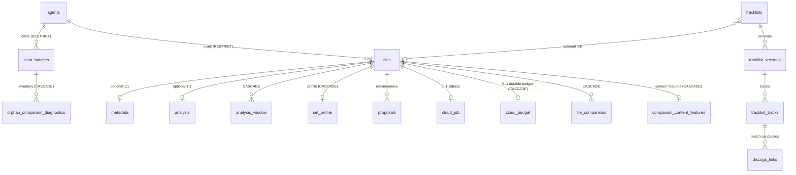
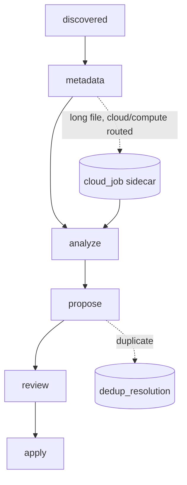

# Database

> Historical source-neutral record. External acquisition is retired; this document does not authorize requests or implementation. See `docs/design/0024-tracklist-source-retirement.md`. Source-identifying wording has been removed; use the cited beads for original operator statements.


phaze persists all state in PostgreSQL (18+) accessed asynchronously via SQLAlchemy 2.0
(`postgresql+asyncpg://`). Models live in `src/phaze/models/`; schema changes are managed
by Alembic using the async template (`alembic/`). All models inherit a `created_at` /
`updated_at` `TimestampMixin` and share a constraint naming convention defined in
`src/phaze/models/base.py`.

## Schema

| Table                 | Description                                                            |
|-----------------------|-----------------------------------------------------------------------|
| `agents`              | Distributed worker (file-server) identities that own files and scans  |
| `deployments`         | Host-observed Phaze container, package, and immutable running-image identity |
| `files`               | Central file records; per-stage status is derived on read (no `state` column) |
| `scan_batches`        | Scan operation progress and status (`ScanStatus`)                     |
| `orphan_companion_diagnostics` | Metadata-only accepted companion paths skipped because their directory had no media; owned by a scan batch |
| `metadata`            | Audio tag metadata (1:1 with `files`)                                  |
| `analysis`            | BPM, key, mood, ranked style scores and dominant style (1:1 with `files`) |
| `analysis_window`     | Per-window time series plus nullable energy and mood score projections (1:many with `files`, `ON DELETE CASCADE`) |
| `set_profile`         | Whole-set projection (`file_id` PK/FK, 1:1 with `files`, `ON DELETE CASCADE`) |
| `proposals`           | AI-generated rename/move proposals (`ProposalStatus`)                  |
| `execution_log`       | Append-only audit trail for file rename/move operations               |
| `tag_write_log`       | Append-only audit trail for tag write operations (before/after tags)  |
| `file_companions`     | Many-to-many: companion files to media files                          |
| `companion_junk_review` | The junk-companion review queue, audit trail and tombstone: one row per proposal to quarantine one companion, keyed on `(agent_id, original_path, sha256_hash)`, with no foreign key so it outlives the `files` row (phaze-bk5jp) |
| `companion_content_features` | What each companion file contains, read on its agent: encoding, media references, tracklist flag, junk class, content fingerprint (1:1 with `files`, `ON DELETE CASCADE`; phaze-osy6j) |
| `provider_source_objects` | Opaque provider/native identities and optional current source-file binding; source history survives file deletion |
| `provider_source_observations` | Immutable revisioned decoded text, parsed facts/tracks, read failures and provenance |
| `provider_recording_candidates` | Pending or accepted source observations associated with each recording |
| `provider_recording_selections` | Explicit current choices for tracklists and release metadata |
| `provider_selection_events` | Append-only reviewed choices with actor, target and observation |
| `provider_acquisition_attempts` | Immutable physical-read attempts with received order, separate from deduplicated source observations |
| `companion_import_runs` | Fixed inventory boundary and durable continuation for a per-agent import run |
| `companion_import_items` | Bounded resumable source work, lease and per-kind outcome checkpoints |
| `tracklists`          | Stored tracklist metadata and historical provenance; external acquisition is retired (phaze-7muoo) |
| `tracklist_versions`  | Versioned tracklist snapshots                                         |
| `tracklist_tracks`    | Individual tracks within a version                                    |
| `discogs_links`       | Candidate/accepted Discogs release matches per tracklist track        |
| `cloud_job`           | Per-`file_id` sidecar for the S3 object-staging / cloud-burst leg (1:1 with `files`) |
| `cloud_budget`        | Durable per-`file_id` cloud-budget ledger that **outlives** the `cloud_job` sidecar (1:1 with `files`, row exists only once a cloud chain has burned out) |
| `pipeline_stage_control` | Durable per-stage pause/priority operator intent (one row per agent pipeline stage) |
| `scheduling_ledger`   | Durable "this stage was scheduled for this item" record (recovery source of truth)  |
| `route_control`       | Single-row (`id = 'global'`) force-local routing override switch       |
| `backend_breaker`     | Per-backend control-plane-unreachable circuit breaker (`backend_id` PK; `tripped_at` NULL = closed). Tripped by reconcile, read by the drain to hold the backend, closed by the presign endpoint (phaze-j0ixx) |
| `dedup_resolution`    | Per-file 1:1 sidecar marking a duplicate resolved to a canonical file (marker-row existence = resolved) |
| `stage_skip`          | Per-`(file_id, stage)` sidecar marking an operator force-skip of an enrich stage      |
| `filename_convention` | Corpus-learned filename conventions (e.g. date order), keyed generically by `(scope, scope_value, convention_kind)` with a DB-derived confidence (phaze-5fta.2) |
| `dedup_review_plan` | Opaque, immutable keeper choice plus the complete reviewed membership snapshot (`group_hash`, `canonical_file_id`, `member_ids`), committed at most once via `committed_at` (migration `061`) |

One further table shares the database but is **not** in the list above because it is not an
Alembic-managed model: **`saq_jobs`**. Since Phase 36 the SAQ broker is a `PostgresQueue`, and
SAQ creates and owns this table itself (`CREATE TABLE IF NOT EXISTS`, outside the migration
chain). phaze still reads and mutates it directly with raw parameterized SQL from
`services/stage_control.py` — the per-stage pause / resume / priority helpers reorder or park
the *existing* queued backlog that the `before_enqueue` hook can only stamp on new jobs. Because
`saq_jobs` has no `function` column (the name lives inside the serialized `job` BYTEA blob),
those helpers filter on the Phase-35 deterministic key prefix `key LIKE '<function>:%'`, always
guarded by `status = 'queued'`.

### Style queries

`analysis.style` is a JSONB array of `{ "name": string, "score": number }` objects,
ranked by descending score. The scores are duration-weighted averages over coarse
analysis windows. A GIN index supports containment queries for any predicted style;
filter the matching object's score when a minimum is needed:

```sql
SELECT file_id
FROM analysis
WHERE style @> '[{"name":"Electronic/Psy-Trance"}]'::jsonb
  AND EXISTS (
    SELECT 1 FROM jsonb_array_elements(style) AS candidate
    WHERE candidate->>'name' = 'Electronic/Psy-Trance'
      AND (candidate->>'score')::double precision >= 0.6
  );
```

`analysis.dominant_style` is the separate duration-modal coarse-window label,
with a B-tree index for category filters and grouping. It can differ from the
highest averaged score; record views and similarity use that single label.

### Entity relationships

Foreign keys to `agents` are `ON DELETE RESTRICT` (an agent that owns files/scans cannot be
deleted); `analysis_window`, `set_profile`, and `file_companions` cascade with their `files` row
(`ON DELETE CASCADE`), as do `cloud_budget` and `companion_content_features`. `orphan_companion_diagnostics` cascades with its
`scan_batches` row; the remaining per-file sidecars (`metadata`,
`analysis`, `proposals`, `cloud_job`, `dedup_resolution`, `stage_skip`) and the
tracklist chain use the default restricting FK (no cascade). `companion_junk_review` carries no foreign
key at all, so neither scan nor file deletion can be blocked by it or erase it (phaze-bk5jp).


```mermaid
erDiagram
    %% evidence: src/phaze/models/agent.py; src/phaze/models/file.py
    agents ||--o{ files : "owns (RESTRICT)"
    %% evidence: src/phaze/models/agent.py; src/phaze/models/scan_batch.py
    agents ||--o{ scan_batches : "owns (RESTRICT)"
    %% evidence: src/phaze/models/scan_batch.py; src/phaze/models/orphan_companion_diagnostic.py
    scan_batches ||--o{ orphan_companion_diagnostics : "inventory (CASCADE)"
    %% evidence: src/phaze/models/file.py; src/phaze/models/metadata.py
    files ||--o| metadata : "optional 1:1"
    %% evidence: src/phaze/models/file.py; src/phaze/models/analysis.py
    files ||--o| analysis : "optional 1:1"
    %% evidence: src/phaze/models/analysis.py
    files ||--o{ analysis_window : "CASCADE"
    %% evidence: src/phaze/models/file.py; src/phaze/models/set_profile.py
    files ||--o| set_profile : "profile (CASCADE)"
    %% evidence: src/phaze/models/file.py; src/phaze/models/proposal.py
    files ||--o{ proposals : "rename/move"
    %% evidence: src/phaze/models/cloud_job.py
    files ||--o| cloud_job : "0..1 sidecar"
    %% evidence: src/phaze/models/cloud_budget.py
    files ||--o| cloud_budget : "0..1 durable budget (CASCADE)"
    %% evidence: src/phaze/models/file_companion.py
    files ||--o{ file_companions : "CASCADE"
    %% evidence: src/phaze/models/companion_content.py
    files ||--o| companion_content_features : "content features (CASCADE)"
    %% evidence: src/phaze/models/tracklist.py
    tracklists ||--o{ tracklist_versions : "versions"
    %% evidence: src/phaze/models/tracklist.py
    tracklist_versions ||--o{ tracklist_tracks : "tracks"
    %% evidence: src/phaze/models/tracklist.py; src/phaze/models/discogs_link.py
    tracklist_tracks ||--o{ discogs_links : "match candidates"
    %% evidence: src/phaze/models/tracklist.py; src/phaze/models/file.py
    tracklists }o--o| files : "optional link"
```

The `evidence:` comments are repo-relative citations. The docs integrity guard resolves every
cited path, and the focused Mermaid render verifies this ER syntax.

### Set projection

Migration `063` adds three nullable columns to `analysis_window`: `energy`, `camelot`, and
`mood_scores`. Migration `066` drops `camelot` again: it is a pure lookup of the same row's
`musical_key` through the 24-entry Camelot table, not a projection of the separate `features`
JSONB the way `energy`/`mood_scores` are, so the JSONB-scale argument that justifies persisting
those two does not apply to it. `AnalysisWindow.camelot` survives as a read-time `@property`
computed from `musical_key` via `services.set_projection.camelot_code` (operator decision
2026-09-16, bead `phaze-6r3eh`) — every reader still accesses `window.camelot` unchanged, with no
backfill. 063 also creates `set_profile`, whose `file_id` is both primary key and foreign key
to `files.id`. The FK uses `ON DELETE CASCADE`; `FileRecord.set_profile` is the matching optional,
one-to-one ORM relationship with `delete-orphan` plus `passive_deletes=True` so the database owns
the cascade.

`set_profile` stores the whole-file `mean_vector`, 64-point energy `arc`, cached `glyph`, modal
Camelot key, harmonic-discipline score, peak position, and `projection_version`. The live analysis
callback derives it through `services/set_projection_writer.py`; the resumable
`services/set_projection_backfill.py` derives the same values from stored `analysis_window`
JSONB without re-running Essentia. Projection math and its fixed 11-value mood ordering live in
`services/set_projection.py`.

### Agent attribution

`files` and `scan_batches` each carry a non-null `agent_id` (`String(64)`) that foreign-keys
to `agents.id` with `ON DELETE RESTRICT`. New rows default to the seeded
`legacy-application-server` agent. Uniqueness on `files` is the composite
`(agent_id, original_path)` — the same path may exist under different agents. `scan_batches`
enforces a partial unique index allowing at most one `status = 'live'` watcher batch per agent.
Its `configured_root` preserves the selected agent root separately from `scan_path` when an operator
requests a subpath; migration `064` conservatively backfills legacy rows from `scan_path`.

### Proposal idempotency

`proposals` carries a partial UNIQUE index `uq_proposals_file_id_pending` on `file_id`
`WHERE status = 'pending'` (model `src/phaze/models/proposal.py`, migration `019`). It
structurally guarantees at most one PENDING proposal per file (D-04). This index is the
`ON CONFLICT` target for `services.proposal.store_proposals`' upsert
(`on_conflict_do_update` with `index_elements=["file_id"]` and
`index_where=status == 'pending'`): re-running proposal generation overwrites the single
pending row in place rather than accumulating duplicates. Because the index predicate is
scoped to `status = 'pending'`, rows in any other state (`approved`, `executed`, `rejected`,
`failed`) fall outside the index and are never a conflict target — human approvals are
structurally protected from being overwritten by a re-run.

### Derived per-stage status

There is **no `files.state` column and no file-level state enum** — Phase 90 dropped the
`state` column, the file-level state `StrEnum`, and the `ix_files_state` index (in the
pre-flatten chain's migration `039_drop_files_state_column`, now folded into the `039`
baseline schema). A file's status is instead **derived on read**, per stage,
from its output tables (`metadata`, `analysis`, `proposals`,
`execution_log`), the `cloud_job` sidecar, and the `dedup_resolution` marker.

- `Stage` (`src/phaze/enums/stage.py`, 6 stages): `metadata`, `analyze`,
  `tracklist`, `propose`, `review`, `apply`. Audio fingerprinting was removed as a stage
  (phaze-0jpe).
- `Status` (`src/phaze/enums/stage.py`, 5 states): `not_started`, `in_flight`, `done`,
  `skipped`, `failed`, resolved under the precedence ladder
  `in_flight ≻ done ≻ skipped ≻ failed ≻ not_started`. The durable `scheduling_ledger` is the
  authoritative `in_flight` source. The DB-free resolver `resolve_status` and its SQL twin
  `services/stage_status.py` (`stage_status_case`) are locked 1:1 by an equivalence test.
  For `process_file` analysis attempts, the ledger's `enqueued_at` identifies the current
  attempt and nullable `terminal_at` records its acknowledged terminal outcome. A fresh
  enqueue clears that outcome. Recovery compares completion against the current enqueue
  time and retains terminal failures without replacing an older successful analysis;
  see [backfill attempt completion](design/0020-backfill-recovery-attempt-completion.md).
- `CloudJobStatus` (`cloud_job.py`): `awaiting`, `uploading`, `uploaded`, `submitted`,
  `running`, `succeeded`, `failed` — tracks the long-file cloud-burst / tiered-drain detour
  off `analyze` on the standalone `cloud_job` sidecar row (not a file state).
- `ScanStatus` (`scan_batch.py`): `running`, `completed`, `failed`, `live`.
- `ProposalStatus` (`proposal.py`): `pending`, `approved`, `rejected`, `executed`, `failed`.
- `TagWriteStatus` (`tag_write_log.py`, 5 members): `completed`, `failed`, `discrepancy`,
  `verify_failed` (phaze-vq3g — the on-disk write landed but the immediate verify re-read
  failed; distinct from `discrepancy`, where the write landed the *wrong* values, and from
  `failed`, where it never landed. Non-terminal, so the file resurfaces and a later submit
  self-heals to `completed`), and `no_op` (WR-01 — a *terminal* marker for a file whose
  server-computed proposal has zero changes; the idempotency anti-join evicts it from the
  candidate window so it can never starve qualifying files). The column is a plain
  `String(20)` (no PG enum / CHECK), so adding a member needs no migration.
- `ExecutionStatus` is defined in `src/phaze/enums/execution.py` and re-exported from
  `models/execution.py`.

The conceptual per-file stage progression (each node's status is derived, never stored):


```mermaid
flowchart TD
    discovered --> metadata
    metadata --> analyze
    metadata -.long file, cloud/compute routed.-> cloud_job[(cloud_job sidecar)]
    cloud_job --> analyze
    analyze --> propose
    propose --> review
    propose -.duplicate.-> dedup_resolution[(dedup_resolution)]
    review --> apply
```

### Full-text search

PostgreSQL `GENERATED ALWAYS ... STORED` `tsvector` columns (`search_vector`) exist on
`files`, `metadata`, and `tracklists`, each backed by a GIN index. The schema also enables the
`pg_trgm` extension and has trigram GIN indexes for `ILIKE` partial matching. `discogs_links`
carries its own GIN FTS index on denormalized artist/title. (Originated in the pre-flatten
chain's migration 009; now part of the `039` baseline schema.)

## Migrations

Schema is managed by Alembic with the async template (`alembic/env.py` overrides
`sqlalchemy.url` from application settings, so no URL is hard-coded in `alembic.ini`).

**As of Phase 102 (phaze-8hfu), the entire linear chain was flattened into a single baseline
file: `alembic/versions/039_baseline_schema.py`.** It reuses revision id `039` with
`down_revision = None` — so a production database already stamped `039` by the pre-flatten
chain treats the next `upgrade head` as a no-op, while a fresh (CI / test / new) database
builds the entire current schema, plus required seed rows (`pipeline_stage_control` per-stage
rows, the `route_control` `'global'` row), from this one file. The embedded DDL is a
normalized `pg_dump --schema-only` of the real pre-flatten chain's output
(`scripts/normalize_schema_dump.py`), so every non-metadata artifact the chain accreted
(partial indexes, CHECK constraints, generated `tsvector` columns + GIN/trigram indexes, the
`pg_trgm` extension) is preserved byte-faithfully. Fidelity is guarded going forward by
`tests/integration/test_migrations/test_baseline_schema.py`.

```bash
just db-upgrade              # Apply all pending migrations (alembic upgrade head)
just db-revision "message"   # Create new migration (alembic revision --autogenerate)
just db-current              # Show current migration (alembic current)
just db-downgrade            # Roll back one migration (alembic downgrade -1)
just db-history              # Show migration history (alembic history)
```

`db-revision` autogenerates from model changes — all models are imported in
`src/phaze/models/__init__.py` so Alembic can discover them. New migrations now build on top
of the `039` baseline rather than the retired `001`-`039` chain.

### Post-baseline chain (040-087)

`alembic/versions/` holds **48** files: the `039` baseline plus a linear chain to the current
head, **`087`**.

| Rev | Change |
|-----|--------|
| `040` | `tag_write_log` timestamps to `timestamptz` |
| `041` | `tracklist_version` unique constraint |
| `042` | `scheduling_ledger.redrive_attempt` |
| `043` | Discogs link: one accepted per track |
| `044` | `scan_batches` no-duplicate-running |
| `045` | `files.original_filename_repaired` |
| `046` | Drop the fingerprint schema (phaze-0jpe.4) |
| `047` | Drop `analysis.fingerprint` |
| `048` | `files (original_filename, id)` btree |
| `049` | Convert every remaining naive timestamp column to `timestamptz` (phaze-cz3m) |
| `050` | Create `tracklist_lookup_cache` — persisted positive/negative retired external source lookup cache (phaze-fq9h.3) |
| `051` | Add tracklist propagation columns — one scraped tracklist propagated to a unique set's duplicates (phaze-fq9h.7) |
| `052` | Create `tracklist_priority_flags` — persisted operator lookup-priority flag (phaze-fq9h.8) |
| `053` | Create `filename_convention` — generic corpus-learned convention store (phaze-5fta.2) |
| `054` | Add `cloud_job.node_loss_redrives` — independent node-loss re-drive budget (phaze-1q4g) |
| `055` | Add the `cloud_budget` table — durable per-file cloud budget that outlives the `cloud_job` sidecar (phaze-2mwyo) |
| `056` | Rename five double-prefixed CHECK constraints to the names the ORM actually renders (phaze-x8tof) |
| `057` | Add `cloud_job.node_loss_pending` — durable carry for a verdict lost across the re-drive deferral (phaze-mwbz3) |
| `058` | `analysis (analysis_completed_at)` partial btree for the lane cards' PROCESSED counts (phaze-5c6i2) |
| `059` | Durable operator ARM/DISARM state for the tracklist drain |
| `060` | Drop the obsolete `analysis.sampled` column after exhaustive-window analysis shipped |
| `061` | Durable duplicate-review plans |
| `062` | Persist reviewed-before tags and review source versions |
| `063` | Add `analysis_window` energy/Camelot/mood projections and the `set_profile` table |
| `064` | Add `scan_batches.configured_root` and scan-owned orphan companion diagnostics |
| `065` | Add `cloud_job.telemetry_slot` — the burst pod's controller-allocated bounded telemetry identity (phaze-w15ju) |
| `066` | Drop `analysis_window.camelot` — it becomes a read-time property of `musical_key` (phaze-6r3eh) |
| `067` | Rebuild ranked `analysis.style` score objects and `analysis.dominant_style` from coarse windows; index both query paths (phaze-z66hq) |
| `068` | `ANALYZE` `metadata` and `cloud_job` so filter columns added by `ALTER` without later writes (`metadata.failed_at`, `cloud_job.telemetry_slot`) carry planner statistics; data-free, downgrade is a no-op (phaze-3agnm) |
| `069` | Add `cloud_job.last_exit_code` / `last_failure_reason` / `last_failed_at` — the reconcile cron's record of why a cloud pod failed, kept after the Job is deleted (phaze-1xngw) |
| `070` | Create `tracklist_file_lookups` — the per-file tracklist drain outcome behind `Stage.TRACKLIST`'s status; no backfill, the next drain slice writes it (phaze-o71bf) |
| `071` | Add the `backend_breaker` table — the per-backend breaker that holds a backend whose pods cannot reach the control plane — and `ANALYZE` `cloud_job`, whose `last_exit_code` / `last_failed_at` its trip rule now filters on (phaze-j0ixx) |
| `072` | Add `cloud_job.redrive_after` — when a charged cloud re-drive may enqueue its fresh submit, the backoff deadline that also tells a waiting row from one whose resubmit is already queued; no backfill, NULL means not waiting (phaze-d28sn) |
| `073` | Create `runtime_config_override` — the DB-override layer for hot-reloadable config (phaze-mvq8z.6); pure additive DDL, downgrade drops the table |
| `074` | Create `deployments` — host-observed Phaze container and image versions; pure additive DDL, downgrade drops the table |
| `075` | Add nullable `analysis.coarse_work_percent` for in-flight model-sweep progress, separate from completed-window counts |
| `076` | Add nullable `cloud_job.started_at` for the current Kubernetes Job start time; reconcile fills it from `status.startTime`, and re-submit clears the prior attempt |
| `077` | Add nullable `scheduling_ledger.terminal_at` for the current analysis attempt's terminal outcome, preserving older successful analysis results |
| `078` | Add nullable `tracklist_lookup_cache.retry_url` — the detail-page URL a transient `BLOCKED` / `RENDER_FAILED` attempt chose, offered as a retry hint (never a result; cleared on success, any other outcome, and when the set parks) so the retry skips the search |
| `079` | Create `companion_content_features` — per-companion encoding, media references, tracklist flag, junk class and content fingerprint, read on the owning agent; pure additive DDL, no backfill (phaze-osy6j) |
| `080` | Create `companion_junk_review` — the FK-free junk-companion review queue keyed on `(agent_id, original_path, sha256_hash)`, unique among non-terminal rows; pure additive DDL (phaze-bk5jp) |
| `081` | Add `ix_files_agent_id_folder` on `(agent_id, regexp_replace(original_path, '/[^/]*$', ''))` — the files of one agent by folder, so the known-stamp grouping and the junk-review detector read a folder's media from `files` at decision time; index-only, built `CONCURRENTLY` (phaze-4x319.5) |
| `082` | Retire retired external source acquisition: drop lookup/outcome/priority/drain-state tables, preserve stored tracklists, and default new sources to manual (phaze-7muoo) |
| `083` | Add nullable `files.missing_at` — stamped by `phaze backfill reconcile-stale-rows` on a row whose content is nowhere under its agent's scan roots; the row is kept and leaves the enrich pending sets, and any upsert of its path clears it; catalog-only DDL plus `ANALYZE files`, since `missing_at IS NULL` filters every enrich pending set; no backfill (phaze-5rfev) |
| `084` | Add nullable `files.companion_ambiguous_at` — confirmed-absent companions with multiple verified destinations retain inventory and history, separately reported from readable extraction; cleared with `missing_at` on reappearance; catalog-only DDL plus `ANALYZE files`; no backfill (phaze-st1ty) |
| `085` | Add provider-scoped source identity, immutable content/read observations, recording candidates, explicit selections and retained selection events; preserve legacy tracklist UUIDs and pointers; refuse evidence-losing rollback (phaze-gq28d) |
| `086` | Add nullable fresh companion association derivation and target-specific source decision tokens/mappings; preserve unknown historical links and append-only review evidence (phaze-67q4e) |
| `087` | Add immutable acquisition attempts, resumable companion import progress and source-file lookup index (phaze-rbqca) — **head** |

**Four migrations in this chain (`048`, `050`, `058`, `081`) build an index `CREATE INDEX
CONCURRENTLY` on an autocommit connection rather than an ordinary `op.create_index`; each shares
the same three load-bearing properties:**

- **`CREATE INDEX CONCURRENTLY` on an autocommit connection.** The target table is large enough
  that a plain `CREATE INDEX` would hold a write lock across the whole build. `CONCURRENTLY`
  cannot run inside a transaction block and Alembic wraps every migration in one, so the
  statements run inside `op.get_context().autocommit_block()`.
- **Self-healing against an INVALID leftover.** An interrupted `CONCURRENTLY` build leaves an
  index that exists but is unusable, and `IF NOT EXISTS` would then skip it forever. `upgrade()`
  checks `pg_index.indisvalid` (resolved by name via `to_regclass`, so a first-ever run is
  correctly falsy rather than erroring) and drops the invalid remnant before rebuilding.
- **DDL held as static module-level literals.** The statements are constants, not f-strings —
  interpolating even a module-level constant trips semgrep's formatted-SQL-query rule.

**Production position drifts from `head` over time** — migrations land in the repo before they
are applied to the live deployment, so a fresh CI or test database (which always builds straight
to `head`) can be several revisions ahead of production. Check the live position with
`just db-current` before assuming either end matches `head`; do not assume the two are in sync.
