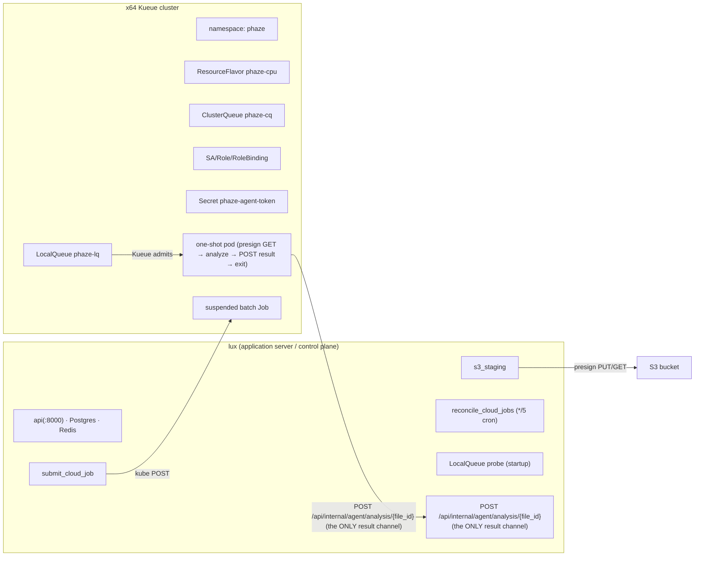

<!-- generated-by: gsd-doc-writer -->
# Kubernetes Burst — Kueue Job target (v6.0)

**Kubernetes burst** is the **third** `PHAZE_CLOUD_TARGET` (`local` | `a1` | `k8s`), alongside
the all-local default and the v5.0 [OCI A1 compute agent](cloud-burst.md). When
`PHAZE_CLOUD_TARGET=k8s`, the control plane offloads **long** audio sets (≥
`PHAZE_CLOUD_ROUTE_THRESHOLD_SEC`) to a remote **x64 Kubernetes cluster running
[Kueue](https://kueue.sigs.k8s.io/)**: it stages the file's bytes to an operator-provided
S3-compatible bucket, submits a **suspended one-shot Kueue `Job`**, and a pod analyzes the
file and POSTs the result back to `/api/internal/agent/*` — reconciled by `file_id`. The
object is deleted after analysis. There is **no persistent pod disk** and **no long-lived
compute host** — the execution unit is an ephemeral, quota-scheduled batch Job.

> **The feature ships OFF by default.** `PHAZE_CLOUD_TARGET=local` (the default) means a fresh
> deploy behaves **all-local** with zero cloud activity. Stand up the cluster objects in the
> **Cluster-admin runbook** below first, then set the target and restart the control plane.

> **Superseded in 2026.7.1 (Phase 67 / 70).** The single `PHAZE_CLOUD_TARGET=k8s` selector this
> page describes was **removed** in favor of the declarative **[backend registry](configuration.md#backend-registry-backendstoml)**
> (`backends.toml`): a Kueue cluster is now one `[[backends]] kind="kueue"` entry — and you can
> declare **several** at once, each staging to its own `[[buckets]]` set (REG-05), which the
> scheduler drains across by rank. This page remains the authoritative **cluster-admin object**
> spec (Kueue / RBAC / Secret); for the config model and the trivial `cloud_target`→`backends`
> mapping, see [configuration.md → Cloud target](configuration.md#cloud-target-removed-in-phase-67).

**phaze does NOT create any cluster objects.** Kueue admission, RBAC, and the bearer-token
Secret are **cluster-admin** responsibilities. phaze references a LocalQueue **by name**
(`PHAZE_KUBE_LOCAL_QUEUE`) and submits Jobs into it; it never authors quota, RBAC, or Secret
objects at runtime. This document is the **authoritative spec** for those operator-owned
objects (D-02); the live cluster is the operator's infrastructure. The ready-to-paste homelab
change request is [`56-HOMELAB-CHANGE-PROMPT.md`](../.planning/phases/56-deployment-runbook-config-docs/56-HOMELAB-CHANGE-PROMPT.md).

For the canonical per-knob config reference (env var, default, `_FILE` support), see
[configuration.md → Kube submit/reconcile settings](configuration.md#kube-submitreconcile-settings-phase-54-v60)
and [configuration.md → S3 object-staging settings](configuration.md#s3-object-staging-settings-phase-53-v60).
This page does not duplicate those tables.

## Architecture at a glance



_PHAZE_CLOUD_TARGET=local ⇒ long files route LOCAL, no kube submit, no S3 staging. (all-local)_

## Submit → reconcile lifecycle (Phase 54)

Instead of an rsync push to a long-lived agent, the control plane stages the file's bytes to S3
and submits a **suspended one-shot Kueue Job**; a pod runs the analysis and PUTs the result
back. Two control-plane pieces own this:

- **`submit_cloud_job`** (the fast producer, `phaze.tasks.submit_cloud_job`) — a
  controller-queue task that does ONE kube POST (a suspended `batch/v1` Job named
  `phaze-analyze-<file_id>`), upserts the `cloud_job` row to `SUBMITTED`, and returns in
  seconds. It never awaits analysis.
- **`reconcile_cloud_jobs`** (the safety net, `phaze.tasks.reconcile_cloud_jobs`) — a
  **cron-only** `*/5 * * * *` CronJob registered on the controller. There is **no live kube
  watch**: each tick it re-reads the in-flight Jobs/Workloads and reconciles them.

**The callback is the only result channel (KSUBMIT-03).** The one-shot pod PUTs its analysis
result to the existing `/api/internal/agent/analysis/{file_id}` callback — the SAME endpoint the
local/agent path uses, reconciled by `file_id`. `reconcile_cloud_jobs` **never** writes an
analysis result; it only drives cleanup, re-drive, and alerting. This is what makes "a
dropped/expired watch never loses or duplicates a result" true.

**What the reconcile cron does per tick:**

- **Iterates the `cloud_job` sidecar** — `SELECT cloud_job WHERE status IN (SUBMITTED, RUNNING)`
  is the in-flight registry. It reads each Job (succeeded/failed) and, when not yet terminal,
  the paired Kueue Workload for admission state.
- **Delete-after-record ordering** — on a terminal outcome it records the result in Postgres and
  **commits** *before* it deletes the Job, so the status read can never lose to GC.
  `JOB_TTL_SECONDS` (900s, `ttlSecondsAfterFinished`) is only the never-reconciled backstop.
- **S3 cleanup on a no-callback terminal** — a `Failed`/`Evicted`/lost Job (no callback landed)
  triggers `s3_staging.delete_staged_object(file_id)` before the Job delete. The **success**
  path does NOT delete S3 — the callback already deleted it inline.
- **Bounded re-drive then ANALYSIS_FAILED** — a no-callback terminal under
  `cloud_submit_max_attempts` (default 3) increments `cloud_job.attempts` and re-drives a fresh
  `submit_cloud_job`; at the cap the file is marked `ANALYSIS_FAILED` (no cross-target fallback).
- **Inadmissible vs Pending** — a Workload `Inadmissible` (operator misconfig — e.g. a
  missing/mis-sized LocalQueue) sets the `cloud_job.inadmissible` alert flag + a WARNING log and
  **holds indefinitely without consuming the re-drive cap**. A healthy `Pending` (queued behind
  quota) is **silent** and waits forever — never mistaken for a failure.

`reconcile_cloud_jobs` is **control-only** (kube creds live on the control plane, DIST-01) and
**cron-only** — never operator-enqueued.

## Cluster-admin runbook

Everything below is **copy-paste-ready** and **apply-ready**. The operator edits the
placeholder names/quota/namespace to match the cluster, then `kubectl apply`s each block in
order. The placeholder object names are DNS-1123-safe: `phaze-cpu` (ResourceFlavor),
`phaze-cq` (ClusterQueue), `phaze-lq` (LocalQueue), `phaze` (namespace), `phaze-submitter`
(ServiceAccount/Role/RoleBinding), `phaze-agent-token` (Secret).

> **⚠ apiVersion lockstep (read first — see *apiVersion lockstep* below).** Every Kueue
> manifest here is `kueue.x-k8s.io/v1beta1`, matching the phaze config default
> `PHAZE_KUBE_WORKLOAD_API_VERSION=kueue.x-k8s.io/v1beta1`. The manifest apiVersion, the
> cluster's served Kueue version, and `PHAZE_KUBE_WORKLOAD_API_VERSION` **must all agree**.

### 0 — Create the namespace

All phaze objects live in one namespace (`PHAZE_KUBE_NAMESPACE`, default `phaze`). The
namespaced RBAC below scopes every grant to exactly this namespace.

```bash
kubectl create namespace phaze
```

### 1 — CPU-only ResourceFlavor

essentia analysis is **CPU-bound** — wall-clock is dominated by audio decode + native DSP, not
TensorFlow inference — so the cluster nodes and Kueue requests target `cpu`/`memory` only (no
GPU/Coral; see [PROJECT.md Key Decisions](../.planning/PROJECT.md)). A "CPU-only" flavor is
simply a flavor with **no accelerator constraint**. An empty-spec flavor matches any node;
uncomment `nodeLabels` only to pin the burst to a specific CPU node pool.

```bash
kubectl apply -f resourceflavor.yaml
```

```yaml
# CITED: kueue.sigs.k8s.io/docs/concepts/resource_flavor
apiVersion: kueue.x-k8s.io/v1beta1
kind: ResourceFlavor
metadata:
  name: phaze-cpu           # operator edits
# spec: {}                  # CPU-only = no accelerator tag; matches any node.
# To pin the burst to a dedicated CPU node pool instead, set nodeLabels:
# spec:
#   nodeLabels:
#     node-pool: cpu-burst
```

### 2 — Single-CQ, no-preemption ClusterQueue (CPU + memory quota)

One ClusterQueue, **no preemption** (`reclaimWithinCohort: Never` + `withinClusterQueue:
Never`), covering `cpu` + `memory`. The operator sizes `nominalQuota` for the cluster. There is
**no `pods` covered resource and no `limits`** — this matches phaze's **requests-only** Job
manifest (`kube_staging.build_job_manifest` emits `resources.requests` cpu+memory, never
limits).

```bash
kubectl apply -f clusterqueue.yaml
```

```yaml
# CITED: kueue.sigs.k8s.io/docs/concepts/cluster_queue
apiVersion: kueue.x-k8s.io/v1beta1
kind: ClusterQueue
metadata:
  name: phaze-cq            # operator edits
spec:
  namespaceSelector: {}     # cluster-wide CQ; scope is enforced by the LocalQueue's namespace
  preemption:               # NO preemption (single-CQ, no cohort reclaim)
    reclaimWithinCohort: Never
    withinClusterQueue: Never
  resourceGroups:
  - coveredResources: ["cpu", "memory"]
    flavors:
    - name: phaze-cpu       # == the ResourceFlavor above
      resources:
      - name: "cpu"
        nominalQuota: "8"   # operator sizes for the cluster
      - name: "memory"
        nominalQuota: "32Gi"
```

### 3 — LocalQueue (the object phaze references by name)

This is the object `PHAZE_KUBE_LOCAL_QUEUE` names and the startup probe GETs.
`metadata.name` **must equal** `PHAZE_KUBE_LOCAL_QUEUE` and `metadata.namespace` **must equal**
`PHAZE_KUBE_NAMESPACE`. Submitted Jobs carry the `kueue.x-k8s.io/queue-name: phaze-lq` label so
Kueue admits them through this LocalQueue → `phaze-cq`.

```bash
kubectl apply -f localqueue.yaml
```

```yaml
# CITED: kueue.sigs.k8s.io/docs/concepts/local_queue
apiVersion: kueue.x-k8s.io/v1beta1
kind: LocalQueue
metadata:
  name: phaze-lq            # == PHAZE_KUBE_LOCAL_QUEUE
  namespace: phaze          # == PHAZE_KUBE_NAMESPACE
spec:
  clusterQueue: phaze-cq    # == the ClusterQueue above
```

### 4 — Namespaced least-privilege RBAC (ServiceAccount + Role + RoleBinding)

The control plane authenticates to the kube API as the `phaze-submitter` ServiceAccount. The
Role grants the **exact verb floor** derived from phaze's kr8s call graph — and **nothing
cluster-wide**:

| apiGroup | resource | verbs | why |
|----------|----------|-------|-----|
| `batch` | `jobs` | `create`, `get`, `delete` | `submit_job` / `get_job` / `delete_job` |
| `kueue.x-k8s.io` | `workloads` | `get`, `watch`, `list` | `get_workload_for` only `list`s today; `get`/`watch` are the conservative spec |
| `kueue.x-k8s.io` | `localqueues` | `get` | **the Phase 56 startup reachability probe** GETs the LocalQueue |

> **`localqueues: get` is load-bearing.** Without it the Phase 56 startup probe 403s and the
> dashboard falsely reports "K8s LocalQueue unreachable" forever, even on a healthy cluster.
> The `tests/test_deployment/test_k8s_runbook.py::test_rbac_covers_call_graph` guard asserts
> this verb floor is present so it can never be dropped.

The Role is **namespaced** (`kind: Role`, not `ClusterRole`) and the RoleBinding binds it in
the single `phaze` namespace — there are **no cluster-wide grants**.

```bash
kubectl apply -f rbac.yaml
```

```yaml
# ServiceAccount the control plane authenticates as.
apiVersion: v1
kind: ServiceAccount
metadata:
  name: phaze-submitter
  namespace: phaze
---
# Namespaced least-privilege Role — the exact kr8s call-graph verb floor, nothing cluster-wide.
apiVersion: rbac.authorization.k8s.io/v1
kind: Role
metadata:
  name: phaze-submitter
  namespace: phaze
rules:
- apiGroups: ["batch"]
  resources: ["jobs"]
  verbs: ["create", "get", "delete"]        # submit_job / get_job / delete_job
- apiGroups: ["kueue.x-k8s.io"]
  resources: ["workloads"]
  verbs: ["get", "watch", "list"]           # get_workload_for (.list); get/watch = conservative spec
- apiGroups: ["kueue.x-k8s.io"]
  resources: ["localqueues"]
  verbs: ["get"]                            # the Phase 56 startup reachability probe
---
apiVersion: rbac.authorization.k8s.io/v1
kind: RoleBinding
metadata:
  name: phaze-submitter
  namespace: phaze
subjects:
- kind: ServiceAccount
  name: phaze-submitter
  namespace: phaze
roleRef:
  kind: Role
  name: phaze-submitter
  apiGroup: rbac.authorization.k8s.io
```

> **API discovery note.** `kr8s` performs a version/discovery handshake (`/api`, `/apis`) when
> it opens a session. Those endpoints are normally readable by any authenticated principal; on
> an unusually locked-down cluster, confirm the ServiceAccount can reach API discovery or the
> session fails before any of the verbs above are exercised.

### 5 — Bearer-token Secret (the compute-agent callback token)

The one-shot pod authenticates its `/api/internal/agent/*` callback with a compute-agent bearer
token — the **same** mechanism as the v5.0 fileserver/compute agents. Mint it on the control
plane with `phaze agents add --kind compute` (this creates an `Agent` row so the callback
authenticates), then paste the token into the Secret. The pod consumes it via
`PHAZE_AGENT_TOKEN_FILE` (the `_FILE` convention — the token never rides a plain env var or a
log line).

```bash
# On the control plane: mint the compute-agent token, then paste it into secret.yaml below.
phaze agents add --kind compute
kubectl apply -f secret.yaml
```

```yaml
# core/v1 Secret carrying the minted compute-agent bearer token.
apiVersion: v1
kind: Secret
metadata:
  name: phaze-agent-token
  namespace: phaze
type: Opaque
stringData:
  PHAZE_AGENT_TOKEN: "phaze_agent_<paste-the-minted-token>"   # operator pastes the `agents add` output
```

> **Never log or commit the token.** It is a `SecretStr` on the phaze side and rides a cluster
> Secret on the kube side. Use the `*_FILE` convention end to end; do not inline it in plain
> env or compose files.

### 6 — Agent-env ConfigMap (the static pod env)

The one-shot pod needs more than the file id to run: its entrypoint builds the agent settings and
calls back to the control plane, so it must know its role, where the control-plane API lives, and
where the analysis models are on disk. phaze sources that **static, per-deployment** env into the
suspended Job's analyze container via `envFrom` from an operator-created `core/v1` ConfigMap —
named **by name only** (`PHAZE_KUBE_ENV_CONFIGMAP_NAME`, default `phaze-agent-env`); **phaze does
not create it**.

```bash
# On the control plane: create the agent-env ConfigMap. Use the reachable control-plane HTTPS URL
# the pod calls back to, and the in-image models path the Job image ships.
kubectl create configmap phaze-agent-env \
  --namespace phaze \
  --from-literal=PHAZE_ROLE=agent \
  --from-literal=PHAZE_AGENT_API_URL=https://<control-plane-host>:8000 \
  --from-literal=PHAZE_MODELS_DIR=/models
```

```yaml
# Equivalent declarative form (core/v1 ConfigMap carrying the static, non-secret agent env).
apiVersion: v1
kind: ConfigMap
metadata:
  name: phaze-agent-env
  namespace: phaze
data:
  PHAZE_ROLE: agent
  PHAZE_AGENT_API_URL: "https://<control-plane-host>:8000"   # reachable control-plane HTTPS URL
  PHAZE_MODELS_DIR: "/models"                                  # in-image models path the Job image ships
```

The analyze container declares `envFrom: [configMapRef(phaze-agent-env), secretRef(phaze-agent-token)]`:

- The **ConfigMap** above carries the non-secret env — `PHAZE_ROLE`, `PHAZE_AGENT_API_URL`,
  `PHAZE_MODELS_DIR`.
- `PHAZE_AGENT_TOKEN` is **not** a new object — it is sourced via `envFrom.secretRef` from the
  **existing bearer-token Secret** (§5, default `phaze-agent-token`). No additional Secret is
  needed; the same Secret that backs the callback token backs the pod env.
- `PHAZE_JOB_FILE_ID` is **not** in this ConfigMap and is **not** operator-managed — it varies per
  file, so phaze injects it **per-Job at submit time** into the container env directly.

> If you name the ConfigMap or the env Secret something other than the defaults, set
> `PHAZE_KUBE_ENV_CONFIGMAP_NAME` / `PHAZE_KUBE_ENV_SECRET_NAME` on the control plane to match
> (mirrors the `PHAZE_KUBE_CA_SECRET_NAME` note in §7).

### 7 — Internal-CA Secret (the control-plane TLS trust anchor)

The one-shot pod calls back to the control plane over HTTPS and verifies its TLS chain against the
**internal CA** — never `verify=False`. That CA is **not baked into the Job image** (Phase 56,
KDEPLOY-06, reversing the original KJOB-05 bake): the internal CA is generated **per deployment** at
runtime by `cert_bootstrap` on the app-server (the public `./certs/phaze-ca.crt`, mode 0644) and is
unique to your install, so there is no canonical CA a published image could carry. Instead, the
operator creates a `core/v1` Secret holding that public CA cert, and the suspended Job mounts it
**read-only** at `/certs`; the container's `PHAZE_AGENT_CA_FILE` points at `/certs/phaze-ca.crt`.
phaze references this Secret **by name only** (`PHAZE_KUBE_CA_SECRET_NAME`, default
`phaze-internal-ca`) — like the LocalQueue, RBAC, and bearer-token objects, **phaze does not create
it** (KDEPLOY-01).

```bash
# On the control plane: create the CA Secret from the public CA cert generated by
# cert_bootstrap (./certs/phaze-ca.crt). The key MUST be `phaze-ca.crt` — that is the
# filename build_job_manifest mounts at /certs/phaze-ca.crt.
kubectl create secret generic phaze-internal-ca \
  --namespace phaze \
  --from-file=phaze-ca.crt=./certs/phaze-ca.crt
```

```yaml
# Equivalent declarative form (core/v1 Secret carrying ONLY the PUBLIC CA cert — never the CA key).
apiVersion: v1
kind: Secret
metadata:
  name: phaze-internal-ca
  namespace: phaze
type: Opaque
stringData:
  phaze-ca.crt: |
    -----BEGIN CERTIFICATE-----
    <paste the contents of ./certs/phaze-ca.crt>
    -----END CERTIFICATE-----
```

> **Only the public CA cert rides this Secret — never `phaze-ca.key`.** The CA signing key stays on
> the app-server host (mode 0600) and never leaves it. The pod only needs the public cert to verify
> the control-plane chain. An empty/missing CA file fails the one-shot loud
> (`construct_agent_client`'s `st_size == 0` guard), never silently disabling verification.
>
> **CA rotation** is a Secret update + re-submit, **no image rebuild**: regenerate the CA on the
> app-server, re-create this Secret with the new `phaze-ca.crt`, and let in-flight Jobs re-submit.
> If you name the Secret something other than `phaze-internal-ca`, set `PHAZE_KUBE_CA_SECRET_NAME`
> on the control plane to match.

## apiVersion lockstep

There is **one rule** that prevents the single most likely failure:

> **The manifest apiVersion == the cluster's served Kueue version ==
> `PHAZE_KUBE_WORKLOAD_API_VERSION` — all three must agree.**

phaze defaults to `kueue.x-k8s.io/v1beta1` (`PHAZE_KUBE_WORKLOAD_API_VERSION`,
`config.py`), and every Kueue manifest in the runbook above is `v1beta1`. If these drift, the
symptoms are: `submit_job` 404s the Workload group, the reconcile cron's `get_workload_for`
always returns `None`, or the LocalQueue probe 404s a LocalQueue that exists under a different
version.

**v1beta2 upgrade note.** Kueue introduced **`v1beta2`** and **deprecated `v1beta1`** (still
served, with a deprecation warning on write). If your cluster's Kueue serves **`v1beta2` only**:

1. Set `PHAZE_KUBE_WORKLOAD_API_VERSION=kueue.x-k8s.io/v1beta2` on the control plane.
2. Change the `apiVersion:` on the ResourceFlavor, ClusterQueue, and LocalQueue manifests above
   to `kueue.x-k8s.io/v1beta2` and re-apply.
3. Confirm both agree with the installed Kueue release before restarting the control plane.

The fields phaze actually reads — Workload admission **conditions** and **LocalQueue
existence** — are unchanged between the two versions. The v1beta2 removals/renames
(`LocalQueueFlavorStatus`, `PriorityClassSource` → `PriorityClassRef`, etc.) are **not used by
phaze**, so the blast radius of an upgrade is small — but the three-way version match is still
mandatory. Re-check the operator's installed Kueue release at deploy time; Kueue is fast-moving.

## Transport-agnostic connectivity

Connectivity is **transport-agnostic** (KDEPLOY-03). phaze consumes **operator-provided
reachable endpoints only** — it has **zero mesh-specific code or assumptions**. Whether the
control plane reaches the cluster over **Tailscale**, **WireGuard**, a VPN, or a routed private
network is entirely the operator's choice; phaze just needs the endpoints below to resolve and
connect from the control-plane host:

| Endpoint | Consumed by | Config knob | Direction |
|----------|-------------|-------------|-----------|
| Kube API server | control plane (kr8s submit / reconcile / probe) | `PHAZE_KUBE_API_URL` | control plane → cluster |
| S3-compatible bucket | control plane (presign) + pod (GET) | `PHAZE_S3_ENDPOINT_URL` / `PHAZE_S3_BUCKET` | both → S3 |
| phaze HTTP API (`/api/internal/agent/*`) | one-shot pod (result callback) | `PHAZE_AGENT_API_URL` (in the Job env) | pod → control plane |

Reachable-endpoint expectations only:

- The control-plane host can reach `PHAZE_KUBE_API_URL` and the S3 endpoint.
- Cluster pods can reach the S3 endpoint and the phaze HTTP API (`https://`).
- No port-forwarding, mesh DNS, or specific overlay is assumed — supply whatever endpoints your
  mesh exposes. If you run Tailscale, MagicDNS names work; if you run WireGuard, peer IPs work;
  phaze treats them identically.

## Deploy ordering

Apply cluster objects **before** flipping the control plane to `k8s` (the LocalQueue must exist
before the startup probe runs and before any Job submits). The ready-to-paste homelab change
request — with `datum@nox` / `datum@lux` SSH steps — is
[`56-HOMELAB-CHANGE-PROMPT.md`](../.planning/phases/56-deployment-runbook-config-docs/56-HOMELAB-CHANGE-PROMPT.md).

1. **Cluster (operator):** create the namespace, then `kubectl apply` the ResourceFlavor →
   ClusterQueue → LocalQueue (runbook §1–§3).
2. **Cluster (operator):** `kubectl apply` the namespaced RBAC — ServiceAccount + Role +
   RoleBinding (runbook §4).
3. **Control plane:** mint the compute-agent token (`phaze agents add --kind compute`); paste
   it into the Secret and `kubectl apply` it (runbook §5). Then `kubectl apply` the agent-env
   ConfigMap and the internal-CA Secret (runbook §6–§7).
4. **Control plane (`datum@lux`):** set `PHAZE_CLOUD_TARGET=k8s` plus the kube + S3 knobs (see
   the configuration links above), then **restart** the controller worker + api — `cloud_target`
   is a startup-read; the running process will not pick up the change until it restarts.
5. **Smoke test:** run the checklist below.

> **Confirm the Kueue version first.** Before step 1, check the cluster's served Kueue version
> and keep the manifest apiVersion + `PHAZE_KUBE_WORKLOAD_API_VERSION` in lockstep with it (see
> *apiVersion lockstep*).

## Smoke test

No CI cluster exists — this checklist is the live apply verification on the operator-owned
cluster:

- [ ] **Manifests apply clean.** `kubectl apply` of the ResourceFlavor, ClusterQueue,
      LocalQueue, RBAC, agent-env ConfigMap, and Secrets returns no error (a `dry-run=server`
      apply is a good pre-check: `kubectl apply --dry-run=server -f <manifest>`).
- [ ] **Kueue admits the queues.** `kubectl get clusterqueue phaze-cq` and
      `kubectl get localqueue -n phaze phaze-lq` show the objects; the ClusterQueue reports
      `Active`.
- [ ] **The ServiceAccount can submit a Job.** Using the `phaze-submitter` SA, a test
      `batch/v1` Job labeled `kueue.x-k8s.io/queue-name: phaze-lq` is created and admitted by
      Kueue (`kubectl get workloads -n phaze` shows it `Admitted`).
- [ ] **The startup probe is happy.** With `PHAZE_CLOUD_TARGET=k8s` and the control plane
      restarted, the pipeline dashboard shows **no** "K8s LocalQueue unreachable" alert (the
      probe GETs the LocalQueue successfully — confirms `localqueues: get` is granted).
- [ ] **A long file routes through k8s.** Trigger analysis on a set whose duration ≥
      `PHAZE_CLOUD_ROUTE_THRESHOLD_SEC`; confirm the file stages to S3, a
      `phaze-analyze-<file_id>` Job is submitted, the pod analyzes it, and the result
      reconciles by `file_id` (the `/api/internal/agent/analysis/{file_id}` callback writes it).
- [ ] **`local` reverts cleanly.** With `PHAZE_CLOUD_TARGET=local` + a control-plane restart, a
      new long file routes **local** and no kube Job is submitted.

## See also

- [`56-HOMELAB-CHANGE-PROMPT.md`](../.planning/phases/56-deployment-runbook-config-docs/56-HOMELAB-CHANGE-PROMPT.md)
  — the ready-to-paste homelab apply steps + deploy ordering (D-02).
- [configuration.md → Kube submit/reconcile settings](configuration.md#kube-submitreconcile-settings-phase-54-v60)
  and [→ S3 object-staging settings](configuration.md#s3-object-staging-settings-phase-53-v60)
  — the canonical per-knob reference (`_FILE` support, defaults).
- [deployment.md](deployment.md) — the two-host base deployment + the single-`cloud_target`
  revert toggle.
- [cloud-burst.md](cloud-burst.md) — the v5.0 OCI A1 compute-agent target (the other
  `PHAZE_CLOUD_TARGET`).
