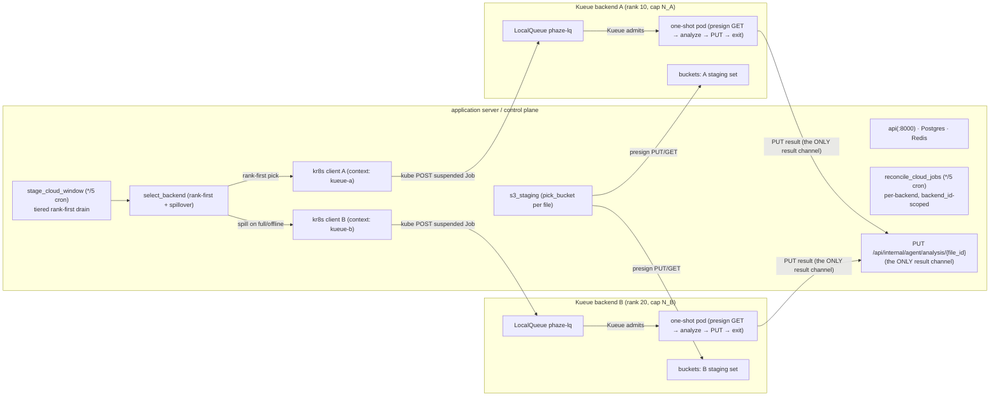
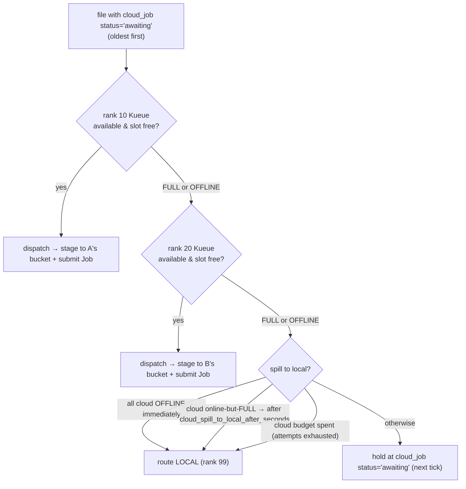

<!-- generated-by: gsd-doc-writer -->
# Kubernetes Burst — Kueue Job target (v6.0)

**Kubernetes burst** offloads analysis to **one or more** x64 Kubernetes clusters running
[Kueue](https://kueue.sigs.k8s.io/), alongside the all-local default and the v5.0
[OCI A1 compute agent](cloud-burst.md). A Kueue cluster is declared as a
`[[backends]] kind="kueue"` entry in [`backends.toml`](configuration.md#backend-registry-backendstoml)
(REG-01) — and you can declare **several at once**, each with its own cost-tier `rank`,
concurrency `cap`, `[backends.kube]` connection block, and `buckets` staging set. For every
**long** audio set (duration ≥ `PHAZE_CLOUD_ROUTE_THRESHOLD_SEC`) the tiered drain routes the
file rank-first to a Kueue backend: the control plane *orchestrates* staging into that backend's
S3-compatible staging bucket — it initiates the multipart upload, presigns the part URLs, and
completes the object, while the **file-server agent** (which owns the media mount) transfers the
bytes via the `io` lane's `s3_upload` task; the control plane never touches file bytes (DIST-01).
It then submits a **suspended one-shot Kueue `Job`**, and a pod analyzes
the file and PUTs the result back to `/api/internal/agent/*` — reconciled by `file_id`. The
object is deleted after analysis. There is **no persistent pod disk** and **no long-lived
compute host** — the execution unit is an ephemeral, quota-scheduled batch Job.

> **The feature ships OFF by default.** With **no** `kind="kueue"` (or `kind="compute"`) entry in
> `backends.toml` a fresh deploy behaves **all-local** with zero cloud activity — the zero-config
> default is an implicit single `kind="local"` backend. On/off is **derived**: `cloud_enabled` is
> True iff the registry holds a non-local backend (the old `PHAZE_CLOUD_TARGET=k8s` selector was
> **removed** in Phase 67). Stand up the cluster objects in the **Cluster-admin runbook** below
> first — in **each** cluster the registry targets — then add the `[[backends]] kind="kueue"`
> entry and restart the control plane.

> **Superseded in 2026.7.1 (Phase 67 / 70).** The single `PHAZE_CLOUD_TARGET=k8s` selector this
> page describes was **removed** in favor of the declarative **[backend registry](configuration.md#backend-registry-backendstoml)**
> (`backends.toml`): a Kueue cluster is now one `[[backends]] kind="kueue"` entry — and you can
> declare **several** at once, each staging to its own `[[buckets]]` set (REG-05), which the
> scheduler drains across by rank. This page remains the authoritative **cluster-admin object**
> spec (Kueue / RBAC / Secret); for the config model and the trivial `cloud_target`→`backends`
> mapping, see [configuration.md → Cloud target](configuration.md#cloud-target-removed-in-phase-67).

**phaze does NOT create any cluster objects.** Kueue admission, RBAC, and the bearer-token
Secret are **cluster-admin** responsibilities. Per Kueue backend, phaze references a LocalQueue
**by name** (its `[backends.kube].local_queue`) and submits Jobs into it; it never authors quota,
RBAC, or Secret objects at runtime. This document is the **authoritative spec** for those
operator-owned objects (D-02), applied **once per cluster** the registry targets; the live
clusters are the operator's infrastructure. The ready-to-paste homelab change request is
[`56-HOMELAB-CHANGE-PROMPT.md`](../.planning/milestones/v6.0-phases/56-deployment-runbook-config-docs/56-HOMELAB-CHANGE-PROMPT.md).

For the canonical per-field config reference (the `[[backends]]` / `[backends.kube]` / `[[buckets]]`
schema, defaults, inline `*_file` secret support), see
[configuration.md → Backend registry (`backends.toml`)](configuration.md#backend-registry-backendstoml).
The flat `PHAZE_KUBE_*` / `PHAZE_S3_*` env-knob tables it links from Phase 54/53 are **superseded**
by that registry (retained there only as a historical field reference). This page does not duplicate
those tables.

## Architecture at a glance

**Multi-Kueue topology** — one control plane, N Kueue backends. Each `[[backends]] kind="kueue"`
entry gets its own constructor-authed kr8s client (selected by its `[backends.kube].context`), its
own LocalQueue, and its own `buckets` staging set:



**Rank-tiered spillover** — per candidate file, `select_backend` prefers the lowest-`rank`
available Kueue lane with a free `cap` slot, spilling to the next rank when a lane is FULL or
OFFLINE, and finally to slow local (staleness-gated):



_A registry with no non-local backend (`cloud_enabled` False) ⇒ long files route LOCAL, no kube
submit, no S3 staging. (all-local)_

## Multiple clusters, ranks, caps & the tiered drain

Since 2026.7.1 (Phases 69/70) the control plane drives **N** Kueue clusters simultaneously. Each is
a `[[backends]] kind="kueue"` registry entry:

- **`rank`** — cost-tier ordering; **lower runs sooner**. The tiered drain (`stage_cloud_window`,
  `*/5` cron) and the pure `select_backend` policy prefer the lowest-rank **available** Kueue lane
  with free capacity, spilling to the next rank when a lane is FULL or OFFLINE, and finally
  staleness-gated to slow local (rank 99). Local becomes an eligible spill target **immediately**
  when every non-local backend is OFFLINE, **after `cloud_spill_to_local_after_seconds`** when they
  are online-but-FULL, or when a file's cloud budget is spent.
- **`cap`** — this backend's concurrency cap. The drain snapshots each backend's
  `in_flight_count` (a `cloud_job` COUNT scoped by `backend_id`) once per tick and tops it up to
  `cap`; a single advisory lock serializes overlapping ticks so no cap is ever overshot.
- **`[backends.kube].context`** — the **per-cluster kubeconfig context** that selects among N
  clusters. Each backend builds its **own** constructor-time-authed kr8s client from an in-memory
  kubeconfig (either the inline `kubeconfig` YAML + `context`, or a synthesized `api_url` + `sa_token`
  dict) — the module-global "active kube" read is retired, so one control plane authenticates against
  each file's target cluster independently. When `context` is omitted the client uses the kubeconfig's
  current-context.
- **Per-cluster failure isolation** — a flaky cluster whose availability probe raises or times out is
  caught in the drain snapshot and treated as **0 free slots** for that tick (logged by `backend_id`
  only, never a `KubeConfig`/`SecretStr`/exception payload); every healthy backend and local proceed
  normally. `reconcile_cloud_jobs` likewise iterates the registry and calls each backend's
  **`backend_id`-scoped** `reconcile` (`for b in resolve_backends(cfg): await b.reconcile(...)`), so
  one cluster's reconcile never touches another's `cloud_job` rows.

**Per-cluster staging buckets (REG-05, MKUE-02).** Each Kueue backend owns a `buckets` list of
`[[buckets]]` registry ids — there is no single shared bucket. Per file, `s3_staging.pick_bucket`
deterministically hashes the `file_id` bytes (sha256, restart-stable) across the backend's bound,
`sorted()` bucket set; the chosen id is recorded on `cloud_job.staging_bucket` and **read back**
(never re-derived) by presign and cleanup. A `[[buckets]]` entry's **`scope`** is a cardinality
invariant enforced at startup: `shared` (any number of Kueue backends may reference it) vs
`cluster-specific` (**at most one** Kueue backend may reference it).

**Example — two Kueue backends over three buckets.** Declared in `backends.toml` (path from
`PHAZE_BACKENDS_CONFIG_FILE`, default `/etc/phaze/backends.toml`):

```toml
# Cheapest cluster first (rank 10); its own staging buckets.
[[backends]]
kind = "kueue"
id = "kueue-a"
rank = 10
cap = 4
buckets = ["stage-a", "stage-shared"]
agent_ref = "k8s-kueue-a"   # OPTIONAL (phaze-ifcr) — the kind="compute" Agent.id whose bearer
                            # token this cluster's one-shot job_runner pods authenticate with.
                            # A kueue-backend agent row can never heartbeat (job_runner pods never
                            # call the heartbeat endpoint), so binding it structurally here is what
                            # lets the admin-agents dedupe filter key on it. Omit it and the dedupe
                            # falls back to id/name string-coincidence against the backend's own id
                            # — which silently misses when they differ (e.g. backend "vox" / agent
                            # "k8s-vox").

  [backends.kube]
  api_url = "https://kueue-a.mesh:6443"
  namespace = "phaze"
  local_queue = "phaze-lq"
  context = "kueue-a"                      # per-cluster kubeconfig context (MKUE-01)
  workload_api_version = "kueue.x-k8s.io/v1beta1"
  ca_secret_name = "phaze-internal-ca"     # operator-created §7 Secret name (cluster A)
  env_configmap_name = "phaze-agent-env"   # operator-created §6 ConfigMap name (cluster A)
  env_secret_name = "phaze-agent-token"    # operator-created §5 Secret name (cluster A)
  kubeconfig_file = "/run/secrets/kueue-a-kubeconfig"   # inline *_file secret pointer (control-plane only)

# Pricier fallback cluster (rank 20); drained only when rank 10 is full/offline.
[[backends]]
kind = "kueue"
id = "kueue-b"
rank = 20
cap = 2
buckets = ["stage-b"]
agent_ref = "k8s-kueue-b"   # optional; distinct per cluster

  [backends.kube]
  api_url = "https://kueue-b.mesh:6443"
  namespace = "phaze"
  local_queue = "phaze-lq"
  context = "kueue-b"
  sa_token_file = "/run/secrets/kueue-b-sa-token"

# Staging-bucket registry (REG-05). `id` is the registry key; `bucket` is the real S3 name.
[[buckets]]
id = "stage-a"
scope = "cluster-specific"                 # at most one kueue backend may reference it
bucket = "phaze-stage-a"
endpoint_url = "https://minio.mesh:9000"
access_key_id_file = "/run/secrets/s3-access-key"
secret_access_key_file = "/run/secrets/s3-secret-key"

[[buckets]]
id = "stage-b"
scope = "cluster-specific"
bucket = "phaze-stage-b"
endpoint_url = "https://minio.mesh:9000"
access_key_id_file = "/run/secrets/s3-access-key"
secret_access_key_file = "/run/secrets/s3-secret-key"

[[buckets]]
id = "stage-shared"
scope = "shared"                           # any number of kueue backends may reference it
bucket = "phaze-stage-shared"
endpoint_url = "https://minio.mesh:9000"
access_key_id_file = "/run/secrets/s3-access-key"
secret_access_key_file = "/run/secrets/s3-secret-key"
```

## Submit → reconcile lifecycle (Phase 54)

Instead of an rsync push to a long-lived agent, the file is staged into S3 (control plane initiates
+ presigns + completes; the file-server agent PUTs the bytes) and the control plane submits a
**suspended one-shot Kueue Job**; a pod runs the analysis and PUTs the result back. Two
control-plane pieces own this:

- **`submit_cloud_job`** (the fast producer, `phaze.tasks.submit_cloud_job`) — a
  controller-queue task that does ONE kube POST (a suspended `batch/v1` Job named
  `phaze-analyze-<file_id>`), upserts the `cloud_job` row to `SUBMITTED`, and returns in
  seconds. It never awaits analysis.
- **`reconcile_cloud_jobs`** (the safety net, `phaze.tasks.reconcile_cloud_jobs`) — a
  **cron-only** `*/5 * * * *` CronJob registered on the controller. There is **no live kube
  watch**: each tick it re-reads the in-flight Jobs/Workloads and reconciles them.

**The callback is the only result channel (KSUBMIT-03).** The one-shot pod `PUT`s its analysis
result to the existing `/api/internal/agent/analysis/{file_id}` callback — the SAME endpoint the
local/agent path uses, reconciled by `file_id`. `reconcile_cloud_jobs` **never** writes an
analysis result; it only drives cleanup, re-drive, and alerting. This is what makes "a
dropped/expired watch never loses or duplicates a result" true.

**What the reconcile cron does per tick:**

- **Iterates the `cloud_job` sidecar** — `SELECT cloud_job WHERE status IN (SUBMITTED, RUNNING)`
  is the *post-submit* half of the read. It reads each Job (succeeded/failed) and, when not yet
  terminal, the paired Kueue Workload for admission state.
- **Delete-after-record ordering** — on a terminal outcome it records the result in Postgres and
  **commits** *before* it deletes the Job, so the status read can never lose to GC.
  `JOB_TTL_SECONDS` (900s, `ttlSecondsAfterFinished`) is only the never-reconciled backstop.
- **S3 cleanup on a no-callback terminal** — a `Failed`/`Evicted`/lost Job (no callback landed)
  triggers `s3_staging.delete_staged_object(file_id)` before the Job delete. The **success**
  path does NOT delete S3 — the callback already deleted it inline.
- **Bounded re-drive then spill to local (SCHED-03)** — a no-callback terminal under
  `cloud_submit_max_attempts` (default 3) increments `cloud_job.attempts` and re-drives a fresh
  `submit_cloud_job`. **At the cap the file is NOT hard-failed.** The sidecar is re-stamped
  `status='awaiting'` with `attempts` already equal to the cap, so the next drain tick's
  `select_backend` excludes every cloud backend (`attempts >= cap`) and routes the file to the
  local safety net. A *local* failure — never cloud flakiness — is the only path into
  `ANALYSIS_FAILED` (D-04).
- **Inadmissible vs Pending** — a Workload `Inadmissible` (operator misconfig — e.g. a
  missing/mis-sized LocalQueue) sets the `cloud_job.inadmissible` alert flag + a WARNING log and
  **holds indefinitely without consuming the re-drive cap**. A healthy `Pending` (queued behind
  quota) is **silent** and waits forever — never mistaken for a failure.

**The in-flight registry is wider than the Kueue read (phaze-ul2v).** `in_flight_count` — what
consumes a backend's `cap` — counts `{UPLOADING, UPLOADED, SUBMITTED, RUNNING}`; only
`{SUCCEEDED, FAILED}` are terminal. The pre-submit `{UPLOADING, UPLOADED}` half has no Kueue object
to reconcile against and is normally terminalized *solely* by the agent's HTTP callbacks
(`/uploaded`, `/failed`), so a dead file-server agent or a lost `s3_upload` job would strand the row
— and its cap slot — forever. `KueueBackend._reap_stranded_staging` is the safety net: it runs
**first** on every reconcile tick (before the Job/Workload read), tallied as `staging_reaped`, and
spills age-stranded staging rows back to `status='awaiting'`. The bounds are
`PHAZE_CLOUD_UPLOADING_STALE_AFTER_SEC` (default `21600` — 6h, deliberately larger than the longest
legitimate multi-GB multipart upload) and `PHAZE_CLOUD_UPLOADED_STALE_AFTER_SEC` (default `900` —
15 min, because an `UPLOADED` row is expected to reach `SUBMITTED` within one controller hop). The
callback path stays primary: a row whose `s3_upload` job is still live in the broker is never
reaped, and each reap increments `attempts`, so a repeatedly-stranding file eventually spends its
cloud budget and routes local.

`reconcile_cloud_jobs` is **control-only** (kube creds live on the control plane, DIST-01) and
**cron-only** — never operator-enqueued.

## Cluster-admin runbook

Everything below is **copy-paste-ready** and **apply-ready**, and must be applied **once in each
cluster** the registry targets (a `[[backends]] kind="kueue"` entry per cluster). The operator
edits the placeholder names/quota/namespace to match the cluster, then `kubectl apply`s each block
in order **against that cluster's kubeconfig context** (the same context named in the backend's
`[backends.kube].context`). The placeholder object names are DNS-1123-safe: `phaze-cpu`
(ResourceFlavor), `phaze-cq` (ClusterQueue), `phaze-lq` (LocalQueue), `phaze` (namespace),
`phaze-submitter` (ServiceAccount/Role/RoleBinding), `phaze-agent-token` (Secret). The names may
differ per cluster — each backend's `[backends.kube]` block references them by name
(`local_queue`, `namespace`, `env_configmap_name`, `env_secret_name`, `ca_secret_name`).

> **⚠ apiVersion lockstep (read first — see *apiVersion lockstep* below).** Every Kueue
> manifest here is `kueue.x-k8s.io/v1beta1`, matching each backend's default
> `[backends.kube].workload_api_version = "kueue.x-k8s.io/v1beta1"`. The manifest apiVersion, the
> cluster's served Kueue version, and that backend's `workload_api_version` **must all agree** —
> per cluster.

### 0 — Create the namespace

All phaze objects for a cluster live in one namespace (the backend's `[backends.kube].namespace` —
**required**, no code-level default; this runbook's placeholder value is `phaze`). The namespaced
RBAC below scopes every grant to exactly this namespace.

```bash
kubectl create namespace phaze
```

### 1 — CPU-only ResourceFlavor

essentia analysis is **CPU-bound** — wall-clock is dominated by audio decode + native DSP, not
TensorFlow inference — so the cluster nodes and Kueue requests target `cpu`/`memory` only (no
GPU/Coral; see [PROJECT.md Key Decisions](../.planning/PROJECT.md)). A "CPU-only" flavor is
simply a flavor with **no accelerator constraint**. An empty-spec flavor matches any node;
uncomment `nodeLabels` only to pin the burst to a specific CPU node pool.

```bash
kubectl apply -f resourceflavor.yaml
```

```yaml
# CITED: kueue.sigs.k8s.io/docs/concepts/resource_flavor
apiVersion: kueue.x-k8s.io/v1beta1
kind: ResourceFlavor
metadata:
  name: phaze-cpu           # operator edits
# spec: {}                  # CPU-only = no accelerator tag; matches any node.
# To pin the burst to a dedicated CPU node pool instead, set nodeLabels:
# spec:
#   nodeLabels:
#     node-pool: cpu-burst
```

### 2 — Single-CQ, no-preemption ClusterQueue (CPU + memory quota)

One ClusterQueue, **no preemption** (`reclaimWithinCohort: Never` + `withinClusterQueue:
Never`), covering `cpu` + `memory`. The operator sizes `nominalQuota` for the cluster. There is
**no `pods` covered resource and no `limits`** — this matches phaze's **requests-only** Job
manifest (`kube_staging.build_job_manifest` emits `resources.requests` cpu+memory, never
limits).

```bash
kubectl apply -f clusterqueue.yaml
```

```yaml
# CITED: kueue.sigs.k8s.io/docs/concepts/cluster_queue
apiVersion: kueue.x-k8s.io/v1beta1
kind: ClusterQueue
metadata:
  name: phaze-cq            # operator edits
spec:
  namespaceSelector: {}     # cluster-wide CQ; scope is enforced by the LocalQueue's namespace
  preemption:               # NO preemption (single-CQ, no cohort reclaim)
    reclaimWithinCohort: Never
    withinClusterQueue: Never
  resourceGroups:
  - coveredResources: ["cpu", "memory"]
    flavors:
    - name: phaze-cpu       # == the ResourceFlavor above
      resources:
      - name: "cpu"
        nominalQuota: "8"   # operator sizes for the cluster
      - name: "memory"
        nominalQuota: "32Gi"
```

### 3 — LocalQueue (the object phaze references by name)

This is the object the backend's `[backends.kube].local_queue` names and the availability probe
GETs. `metadata.name` **must equal** `[backends.kube].local_queue` and `metadata.namespace` **must
equal** `[backends.kube].namespace`. Submitted Jobs carry the `kueue.x-k8s.io/queue-name: phaze-lq`
label so Kueue admits them through this LocalQueue → `phaze-cq`.

```bash
kubectl apply -f localqueue.yaml
```

```yaml
# CITED: kueue.sigs.k8s.io/docs/concepts/local_queue
apiVersion: kueue.x-k8s.io/v1beta1
kind: LocalQueue
metadata:
  name: phaze-lq            # == [backends.kube].local_queue
  namespace: phaze          # == [backends.kube].namespace
spec:
  clusterQueue: phaze-cq    # == the ClusterQueue above
```

### 4 — Namespaced least-privilege RBAC (ServiceAccount + Role + RoleBinding)

The control plane authenticates to the kube API as the `phaze-submitter` ServiceAccount. The
Role grants the **exact verb floor** derived from phaze's kr8s call graph — and **nothing
cluster-wide**:

| apiGroup | resource | verbs | why |
|----------|----------|-------|-----|
| `batch` | `jobs` | `create`, `get`, `delete` | `submit_job` / `get_job` / `delete_job` |
| `kueue.x-k8s.io` | `workloads` | `get`, `watch`, `list` | `get_workload_for` only `list`s today; `get`/`watch` are the conservative spec |
| `kueue.x-k8s.io` | `localqueues` | `get` | **the Phase 56 startup reachability probe** GETs the LocalQueue |

> **`localqueues: get` is load-bearing.** Without it the Phase 56 startup probe 403s and the
> dashboard falsely reports "K8s LocalQueue unreachable" forever, even on a healthy cluster.
> The `tests/agents/deployment/test_k8s_runbook.py::test_rbac_covers_call_graph` guard asserts
> this verb floor is present so it can never be dropped.

The Role is **namespaced** (`kind: Role`, not `ClusterRole`) and the RoleBinding binds it in
the single `phaze` namespace — there are **no cluster-wide grants**.

```bash
kubectl apply -f rbac.yaml
```

```yaml
# ServiceAccount the control plane authenticates as.
apiVersion: v1
kind: ServiceAccount
metadata:
  name: phaze-submitter
  namespace: phaze
---
# Namespaced least-privilege Role — the exact kr8s call-graph verb floor, nothing cluster-wide.
apiVersion: rbac.authorization.k8s.io/v1
kind: Role
metadata:
  name: phaze-submitter
  namespace: phaze
rules:
- apiGroups: ["batch"]
  resources: ["jobs"]
  verbs: ["create", "get", "delete"]        # submit_job / get_job / delete_job
- apiGroups: ["kueue.x-k8s.io"]
  resources: ["workloads"]
  verbs: ["get", "watch", "list"]           # get_workload_for (.list); get/watch = conservative spec
- apiGroups: ["kueue.x-k8s.io"]
  resources: ["localqueues"]
  verbs: ["get"]                            # the Phase 56 startup reachability probe
---
apiVersion: rbac.authorization.k8s.io/v1
kind: RoleBinding
metadata:
  name: phaze-submitter
  namespace: phaze
subjects:
- kind: ServiceAccount
  name: phaze-submitter
  namespace: phaze
roleRef:
  kind: Role
  name: phaze-submitter
  apiGroup: rbac.authorization.k8s.io
```

> **API discovery note.** `kr8s` performs a version/discovery handshake (`/api`, `/apis`) when
> it opens a session. Those endpoints are normally readable by any authenticated principal; on
> an unusually locked-down cluster, confirm the ServiceAccount can reach API discovery or the
> session fails before any of the verbs above are exercised.

### 5 — Bearer-token Secret (the compute-agent callback token)

The one-shot pod authenticates its `/api/internal/agent/*` callback with a compute-agent bearer
token — the **same** mechanism as the v5.0 fileserver/compute agents. Mint it on the control
plane with `phaze agents add --kind compute` (this creates an `Agent` row so the callback
authenticates), then paste the token into the Secret. The pod consumes it via
`PHAZE_AGENT_TOKEN_FILE` (the `_FILE` convention — the token never rides a plain env var or a
log line).

```bash
# On the control plane: mint the compute-agent token, then paste it into secret.yaml below.
phaze agents add --kind compute
kubectl apply -f secret.yaml
```

```yaml
# core/v1 Secret carrying the minted compute-agent bearer token.
apiVersion: v1
kind: Secret
metadata:
  name: phaze-agent-token
  namespace: phaze
type: Opaque
stringData:
  PHAZE_AGENT_TOKEN: "phaze_agent_<paste-the-minted-token>"   # operator pastes the `agents add` output
```

> **Never log or commit the token.** It is a `SecretStr` on the phaze side and rides a cluster
> Secret on the kube side. Use the `*_FILE` convention end to end; do not inline it in plain
> env or compose files.

### 6 — Agent-env ConfigMap (the static pod env)

The one-shot pod needs more than the file id to run: its entrypoint builds the agent settings and
calls back to the control plane, so it must know its role, where the control-plane API lives, and
where the analysis models are on disk. phaze sources that **static, per-deployment** env into the
suspended Job's analyze container via `envFrom` from an operator-created `core/v1` ConfigMap —
named **by name only** (the backend's `[backends.kube].env_configmap_name`, default
`phaze-agent-env`); **phaze does not create it**.

```bash
# On the control plane: create the agent-env ConfigMap. Use the reachable control-plane HTTPS URL
# the pod calls back to, and the in-image models path the Job image ships.
kubectl create configmap phaze-agent-env \
  --namespace phaze \
  --from-literal=PHAZE_ROLE=agent \
  --from-literal=PHAZE_AGENT_API_URL=https://<control-plane-host>:8000 \
  --from-literal=PHAZE_MODELS_DIR=/models
```

```yaml
# Equivalent declarative form (core/v1 ConfigMap carrying the static, non-secret agent env).
apiVersion: v1
kind: ConfigMap
metadata:
  name: phaze-agent-env
  namespace: phaze
data:
  PHAZE_ROLE: agent
  PHAZE_AGENT_API_URL: "https://<control-plane-host>:8000"   # reachable control-plane HTTPS URL
  PHAZE_MODELS_DIR: "/models"                                  # in-image models path the Job image ships
```

The analyze container declares `envFrom: [configMapRef(phaze-agent-env), secretRef(phaze-agent-token)]`:

- The **ConfigMap** above carries the non-secret env — `PHAZE_ROLE`, `PHAZE_AGENT_API_URL`,
  `PHAZE_MODELS_DIR`.
- `PHAZE_AGENT_TOKEN` is **not** a new object — it is sourced via `envFrom.secretRef` from the
  **existing bearer-token Secret** (§5, default `phaze-agent-token`). No additional Secret is
  needed; the same Secret that backs the callback token backs the pod env.
- `PHAZE_JOB_FILE_ID` is **not** in this ConfigMap and is **not** operator-managed — it varies per
  file, so phaze injects it **per-Job at submit time** into the container env directly.

> If you name the ConfigMap or the env Secret something other than the defaults, set this
> backend's `[backends.kube].env_configmap_name` / `env_secret_name` to match (mirrors the
> `[backends.kube].ca_secret_name` note in §7). These are per-backend, so different clusters may
> use different object names.

### 6.5 — Models provisioning (optional ReadOnlyMany PVC)

The analyze container reads its essentia weights from `PHAZE_MODELS_DIR` (`/models`, §6), but the
Job image ships **no weights** and the pod **never downloads** them at runtime (`Dockerfile.job` is
weights-free; `job_runner` never calls the model bootstrap — only the file-server agent worker does).
So an unmodified analyze pod finds an empty `/models` and analysis fails. Provision the weights on a
**pre-populated, `ReadOnlyMany` PersistentVolume**, then point the backend at its claim — no fat image,
no runtime download.

phaze **authors no PV or PVC** — exactly like the LocalQueue, RBAC, Secret, and ConfigMap objects
above, the operator creates the storage and phaze references the **claim by name only** via the
backend's `[backends.kube].models_pvc_name`. When set, `build_job_manifest` mounts that claim
**read-only** at `/models`, a **second volume entirely separate** from the `/certs` CA Secret mount
(§7). The PVC carries **only** model weights — never secrets, never certs.

**One-time populate Job.** Create the PVC and fill it once with a short RW Job that runs the same
downloader the agent uses, then leave the volume read-only forever after:

```yaml
# PVC the weights live on. Size for the essentia model set; the StorageClass must support
# ReadOnlyMany reads by the analyze pods (e.g. an NFS / CephFS / cloud-filestore class).
apiVersion: v1
kind: PersistentVolumeClaim
metadata:
  name: phaze-essentia-models
  namespace: phaze
spec:
  accessModes: ["ReadWriteOnce"]   # RWO is enough for the one-time populate below
  resources:
    requests:
      storage: 2Gi
---
# One-time populate Job: mount the SAME claim read-WRITE and run the downloader into /models.
# Delete this Job once it completes; the analyze pods mount the claim read-only thereafter.
apiVersion: batch/v1
kind: Job
metadata:
  name: phaze-models-populate
  namespace: phaze
spec:
  backoffLimit: 1
  template:
    spec:
      restartPolicy: Never
      containers:
        - name: populate
          image: <the same phaze api/job image>            # already carries the downloader
          command: ["uv", "run", "python", "-m", "phaze.scripts.download_models", "/models"]
          volumeMounts:
            - { name: models, mountPath: /models }          # read-write for the populate only
      volumes:
        - name: models
          persistentVolumeClaim:
            claimName: phaze-essentia-models
```

Then set the backend to reference the claim (a plain object name, **not** a secret):

```toml
[backends.kube]
# ... api_url / namespace / local_queue / job_image / requests as usual ...
models_pvc_name = "phaze-essentia-models"   # mounted read-only at /models on every analyze pod
```

> **Invariant:** the `/models` mount path is fixed in `build_job_manifest` and **must** equal the
> §6 ConfigMap's `PHAZE_MODELS_DIR`. If you relocate the models dir, change **both** together.
>
> Leave `models_pvc_name` unset and no models volume/mount is emitted (the Job manifest is
> byte-identical to the CA-only form) — use that only if you instead pin a **pre-baked weights image**
> as the `job_image` (the operator builds it; weights are never committed to the phaze repo).

### 7 — Internal-CA Secret (the control-plane TLS trust anchor)

The one-shot pod calls back to the control plane over HTTPS and verifies its TLS chain against the
**internal CA** — never `verify=False`. That CA is **not baked into the Job image** (Phase 56,
KDEPLOY-06, reversing the original KJOB-05 bake): the internal CA is generated **per deployment** at
runtime by `cert_bootstrap` on the app-server (the public `./certs/phaze-ca.crt`, mode 0644) and is
unique to your install, so there is no canonical CA a published image could carry. Instead, the
operator creates a `core/v1` Secret holding that public CA cert, and the suspended Job mounts it
**read-only** at `/certs`; the container's `PHAZE_AGENT_CA_FILE` points at `/certs/phaze-ca.crt`.
phaze references this Secret **by name only** (the backend's `[backends.kube].ca_secret_name`,
default `phaze-internal-ca`) — like the LocalQueue, RBAC, and bearer-token objects, **phaze does not
create it** (KDEPLOY-01).

```bash
# On the control plane: create the CA Secret from the public CA cert generated by
# cert_bootstrap (./certs/phaze-ca.crt). The key MUST be `phaze-ca.crt` — that is the
# filename build_job_manifest mounts at /certs/phaze-ca.crt.
kubectl create secret generic phaze-internal-ca \
  --namespace phaze \
  --from-file=phaze-ca.crt=./certs/phaze-ca.crt
```

```yaml
# Equivalent declarative form (core/v1 Secret carrying ONLY the PUBLIC CA cert — never the CA key).
apiVersion: v1
kind: Secret
metadata:
  name: phaze-internal-ca
  namespace: phaze
type: Opaque
stringData:
  phaze-ca.crt: |
    -----BEGIN CERTIFICATE-----
    <paste the contents of ./certs/phaze-ca.crt>
    -----END CERTIFICATE-----
```

> **Only the public CA cert rides this Secret — never `phaze-ca.key`.** The CA signing key stays on
> the app-server host (mode 0600) and never leaves it. The pod only needs the public cert to verify
> the control-plane chain. An empty/missing CA file fails the one-shot loud
> (`construct_agent_client`'s `st_size == 0` guard), never silently disabling verification.
>
> **CA rotation** is a Secret update + re-submit, **no image rebuild**: regenerate the CA on the
> app-server, re-create this Secret with the new `phaze-ca.crt`, and let in-flight Jobs re-submit.
> If you name the Secret something other than `phaze-internal-ca`, set this backend's
> `[backends.kube].ca_secret_name` to match.

## apiVersion lockstep

There is **one rule** that prevents the single most likely failure:

> **The manifest apiVersion == the cluster's served Kueue version ==
> the backend's `[backends.kube].workload_api_version` — all three must agree, per cluster.**

Each Kueue backend defaults `[backends.kube].workload_api_version` to `kueue.x-k8s.io/v1beta1`, and
every Kueue manifest in the runbook above is `v1beta1`. If these drift, the symptoms are:
`submit_job` 404s the Workload group, the reconcile cron's `get_workload_for` always returns
`None`, or the LocalQueue probe 404s a LocalQueue that exists under a different version. Because
`workload_api_version` is **per backend**, clusters on different Kueue versions each set their own.

**v1beta2 upgrade note.** Kueue introduced **`v1beta2`** and **deprecated `v1beta1`** (still
served, with a deprecation warning on write). If a cluster's Kueue serves **`v1beta2` only**:

1. Set `[backends.kube].workload_api_version = "kueue.x-k8s.io/v1beta2"` on **that** backend.
2. Change the `apiVersion:` on the ResourceFlavor, ClusterQueue, and LocalQueue manifests above
   to `kueue.x-k8s.io/v1beta2` and re-apply **in that cluster**.
3. Confirm both agree with the installed Kueue release before restarting the control plane.

The fields phaze actually reads — Workload admission **conditions** and **LocalQueue
existence** — are unchanged between the two versions. The v1beta2 removals/renames
(`LocalQueueFlavorStatus`, `PriorityClassSource` → `PriorityClassRef`, etc.) are **not used by
phaze**, so the blast radius of an upgrade is small — but the three-way version match is still
mandatory. Re-check the operator's installed Kueue release at deploy time; Kueue is fast-moving.

## Transport-agnostic connectivity

Connectivity is **transport-agnostic** (KDEPLOY-03). phaze consumes **operator-provided
reachable endpoints only** — it has **zero mesh-specific code or assumptions**. Whether the
control plane reaches the cluster over **Tailscale**, **WireGuard**, a VPN, or a routed private
network is entirely the operator's choice; phaze just needs the endpoints below to resolve and
connect from the control-plane host:

| Endpoint | Consumed by | Config field | Direction |
|----------|-------------|--------------|-----------|
| Kube API server | control plane (kr8s submit / reconcile / probe) | `[backends.kube].api_url` (or the inline `kubeconfig`'s server) | control plane → cluster |
| S3-compatible bucket | control plane (presign) + pod (GET) | `[[buckets]]` `endpoint_url` / `bucket` | both → S3 |
| phaze HTTP API (`/api/internal/agent/*`) | one-shot pod (result callback) | `PHAZE_AGENT_API_URL` (from the §6 ConfigMap, in the Job env) | pod → control plane |

Each field above is **per entry** — every Kueue backend names its own `[backends.kube].api_url`
(or inline `kubeconfig` + `context`) and its own `buckets` set, so the endpoints resolve per
cluster. Reachable-endpoint expectations only:

- The control-plane host can reach each backend's `[backends.kube].api_url` and each bucket's
  `endpoint_url`.
- Cluster pods can reach their staging bucket's endpoint and the phaze HTTP API (`https://`).
- No port-forwarding, mesh DNS, or specific overlay is assumed — supply whatever endpoints your
  mesh exposes. If you run Tailscale, MagicDNS names work; if you run WireGuard, peer IPs work;
  phaze treats them identically.

## Deploy ordering

Apply cluster objects **before** adding the `kind="kueue"` entry to `backends.toml` (the
LocalQueue must exist before the availability probe runs and before any Job submits). Repeat
steps 1–3 **in each cluster** the registry targets. The ready-to-paste homelab change request —
with `datum@nox` / `datum@lux` SSH steps — is
[`56-HOMELAB-CHANGE-PROMPT.md`](../.planning/milestones/v6.0-phases/56-deployment-runbook-config-docs/56-HOMELAB-CHANGE-PROMPT.md).

1. **Cluster (operator), per cluster:** create the namespace, then `kubectl apply` the
   ResourceFlavor → ClusterQueue → LocalQueue (runbook §1–§3), against that cluster's context.
2. **Cluster (operator), per cluster:** `kubectl apply` the namespaced RBAC — ServiceAccount +
   Role + RoleBinding (runbook §4).
3. **Control plane, per cluster:** mint the compute-agent token (`phaze agents add --kind
   compute`); paste it into the Secret and `kubectl apply` it (runbook §5). Then `kubectl apply`
   the agent-env ConfigMap and the internal-CA Secret (runbook §6–§7).
4. **Control plane (`datum@lux`):** add a `[[backends]] kind="kueue"` entry (with its
   `[backends.kube]` block + `buckets` list) and the referenced `[[buckets]]` entries to
   `backends.toml` (see the [Backend registry](configuration.md#backend-registry-backendstoml)),
   then **restart** the controller worker + api — the registry is a startup-read; the running
   process will not pick up the change until it restarts. `cloud_enabled` becomes True as soon as a
   non-local backend is present.
5. **Smoke test:** run the checklist below.

> **Confirm the Kueue version first.** Before step 1, check each cluster's served Kueue version
> and keep the manifest apiVersion + that backend's `[backends.kube].workload_api_version` in
> lockstep with it (see *apiVersion lockstep*).

## Smoke test

No CI cluster exists — this checklist is the live apply verification on the operator-owned
cluster:

- [ ] **Manifests apply clean.** `kubectl apply` of the ResourceFlavor, ClusterQueue,
      LocalQueue, RBAC, agent-env ConfigMap, and Secrets returns no error (a `dry-run=server`
      apply is a good pre-check: `kubectl apply --dry-run=server -f <manifest>`).
- [ ] **Kueue admits the queues.** `kubectl get clusterqueue phaze-cq` and
      `kubectl get localqueue -n phaze phaze-lq` show the objects; the ClusterQueue reports
      `Active`.
- [ ] **The ServiceAccount can submit a Job.** Using the `phaze-submitter` SA, a test
      `batch/v1` Job labeled `kueue.x-k8s.io/queue-name: phaze-lq` is created and admitted by
      Kueue (`kubectl get workloads -n phaze` shows it `Admitted`).
- [ ] **The availability probe is happy.** With the `kind="kueue"` entry added and the control
      plane restarted, the pipeline dashboard shows **no** "K8s LocalQueue unreachable" alert (the
      probe GETs the LocalQueue via each backend's `context` — confirms `localqueues: get` is
      granted). **The alert is aggregate, not per-backend:** the probe runs per cluster, but the
      surfaced flag is a single Redis key (`phaze:k8s:localqueue_unreachable`) set iff **any**
      configured cluster is unreachable, and it is written **once, at controller startup** — not on
      a poll. So one bad cluster lights the alert for the whole deploy, and clearing it means fixing
      the cluster **and restarting the control plane**. Read the controller's startup WARNING log
      lines to tell which cluster failed.
- [ ] **A long file routes through Kueue.** Trigger analysis on a set whose duration ≥
      `PHAZE_CLOUD_ROUTE_THRESHOLD_SEC`; confirm the tiered drain picks the lowest-rank available
      backend, the file stages to that backend's `pick_bucket` choice (recorded on
      `cloud_job.staging_bucket`), a `phaze-analyze-<file_id>` Job is submitted, the pod analyzes
      it, and the result reconciles by `file_id` (the `/api/internal/agent/analysis/{file_id}`
      callback writes it).
- [ ] **Spillover works.** Fill the rank-N backend (or take it offline) and confirm the next
      candidate spills to the next-rank Kueue lane, then staleness-gated to local after
      `cloud_spill_to_local_after_seconds` when every cloud lane is online-but-full.
- [ ] **All-local reverts cleanly.** Remove the non-local `[[backends]]` entries (or set the
      Phase 71 force-local override) + restart; `cloud_enabled` is False, a new long file routes
      **local**, and no kube Job is submitted.

## See also

- [`56-HOMELAB-CHANGE-PROMPT.md`](../.planning/milestones/v6.0-phases/56-deployment-runbook-config-docs/56-HOMELAB-CHANGE-PROMPT.md)
  — the ready-to-paste homelab apply steps + deploy ordering (D-02).
- [configuration.md → Backend registry (`backends.toml`)](configuration.md#backend-registry-backendstoml)
  — the canonical per-field reference for `[[backends]]` / `[backends.kube]` / `[[buckets]]`
  (inline `*_file` secrets, defaults, startup invariants). The flat `PHAZE_KUBE_*` / `PHAZE_S3_*`
  tables it retains from Phase 54/53 are a **historical** reference only, superseded by the registry.
- [deployment.md](deployment.md) — the two-host base deployment + the all-local revert
  (remove the non-local backends, or the Phase 71 force-local override).
- [cloud-burst.md](cloud-burst.md) — the v5.0 OCI A1 compute-agent target (a `kind="compute"`
  backend in the same registry).
