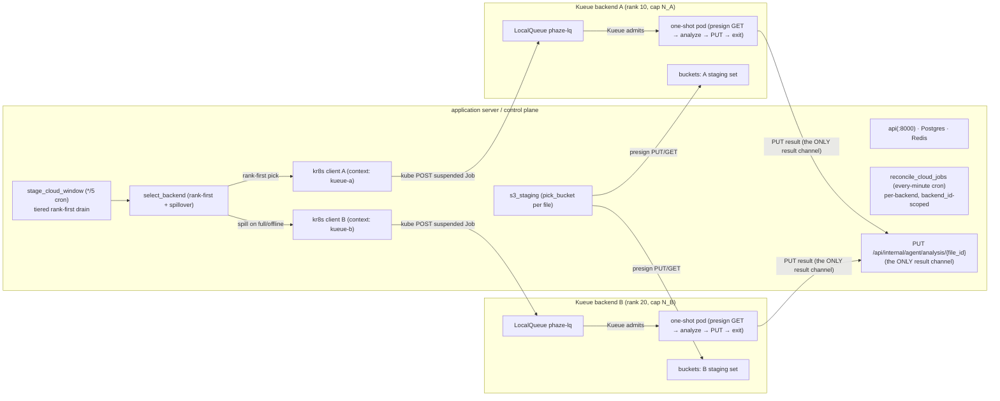
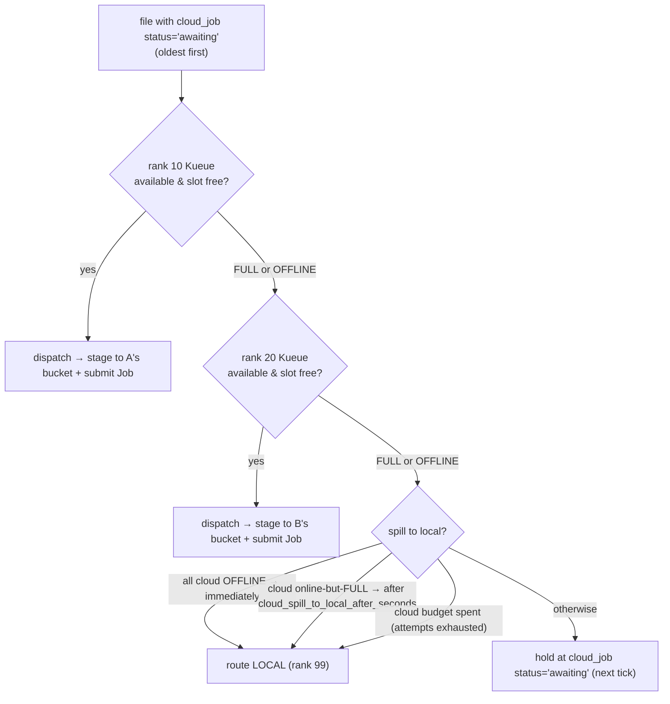

<!-- generated-by: gsd-doc-writer -->
# Kubernetes Burst — Kueue Job target (v6.0)

**Kubernetes burst** offloads analysis to **one or more** x64 Kubernetes clusters running
[Kueue](https://kueue.sigs.k8s.io/), alongside the all-local default and the v5.0
[OCI A1 compute agent](cloud-burst.md). A Kueue cluster is declared as a
`[[backends]] kind="kueue"` entry in [`backends.toml`](configuration.md#backend-registry-backendstoml)
(REG-01) — and you can declare **several at once**, each with its own cost-tier `rank`,
concurrency `cap`, `[backends.kube]` connection block, and `buckets` staging set. For every
**long** audio set (duration ≥ `PHAZE_CLOUD_ROUTE_THRESHOLD_SEC`) the tiered drain routes the
file rank-first to a Kueue backend: the control plane *orchestrates* staging into that backend's
S3-compatible staging bucket — it initiates the multipart upload, presigns the part URLs, and
completes the object, while the **file-server agent** (which owns the media mount) transfers the
bytes via the `io` lane's `s3_upload` task; the control plane never touches file bytes (DIST-01).
It then submits a **suspended one-shot Kueue `Job`**, and a pod analyzes
the file and PUTs the result back to `/api/internal/agent/*` — reconciled by `file_id`. The
object is deleted after analysis. There is **no persistent pod disk** and **no long-lived
compute host** — the execution unit is an ephemeral, quota-scheduled batch Job.

> **The feature ships OFF by default.** With **no** `kind="kueue"` (or `kind="compute"`) entry in
> `backends.toml` a fresh deploy behaves **all-local** with zero cloud activity — the zero-config
> default is an implicit single `kind="local"` backend. On/off is **derived**: `cloud_enabled` is
> True iff the registry holds a non-local backend (the old `PHAZE_CLOUD_TARGET=k8s` selector was
> **removed** in Phase 67). Stand up the cluster objects in the **Cluster-admin runbook** below
> first — in **each** cluster the registry targets — then add the `[[backends]] kind="kueue"`
> entry and restart the control plane.

> **Superseded in 2026.7.1 (Phase 67 / 70).** The single `PHAZE_CLOUD_TARGET=k8s` selector this
> page describes was **removed** in favor of the declarative **[backend registry](configuration.md#backend-registry-backendstoml)**
> (`backends.toml`): a Kueue cluster is now one `[[backends]] kind="kueue"` entry — and you can
> declare **several** at once, each staging to its own `[[buckets]]` set (REG-05), which the
> scheduler drains across by rank. This page remains the authoritative **cluster-admin object**
> spec (Kueue / RBAC / Secret); for the config model and the trivial `cloud_target`→`backends`
> mapping, see [configuration.md → Cloud target](configuration.md#cloud-target-removed-in-phase-67).

**phaze does NOT create any cluster objects.** Kueue admission, RBAC, and the bearer-token
Secret are **cluster-admin** responsibilities. Per Kueue backend, phaze references a LocalQueue
**by name** (its `[backends.kube].local_queue`) and submits Jobs into it; it never authors quota,
RBAC, or Secret objects at runtime. This document is the **authoritative spec** for those
operator-owned objects (D-02), applied **once per cluster** the registry targets; the live
clusters are the operator's infrastructure. The ready-to-paste homelab change request is
[`56-HOMELAB-CHANGE-PROMPT.md`](../.planning/milestones/v6.0-phases/56-deployment-runbook-config-docs/56-HOMELAB-CHANGE-PROMPT.md).

For the canonical per-field config reference (the `[[backends]]` / `[backends.kube]` / `[[buckets]]`
schema, defaults, inline `*_file` secret support), see
[configuration.md → Backend registry (`backends.toml`)](configuration.md#backend-registry-backendstoml).
The flat `PHAZE_KUBE_*` / `PHAZE_S3_*` env-knob tables it links from Phase 54/53 are **superseded**
by that registry (retained there only as a historical field reference). This page does not duplicate
those tables.

## Architecture at a glance

**Multi-Kueue topology** — one control plane, N Kueue backends. Each `[[backends]] kind="kueue"`
entry gets its own constructor-authed kr8s client (selected by its `[backends.kube].context`), its
own LocalQueue, and its own `buckets` staging set:


```mermaid
flowchart LR
  %% transport-agnostic mesh (Tailscale OR WireGuard)
  subgraph lux["application server / control plane"]
    luxsvc["api(:8000) · Postgres · Redis"]
    drain["stage_cloud_window (*/5 cron)<br/>tiered rank-first drain"]
    selbk["select_backend (rank-first + spillover)"]
    s3_staging["s3_staging (pick_bucket per file)"]
    reconcile["reconcile_cloud_jobs (every-minute cron)<br/>per-backend, backend_id-scoped"]
    kc_a["kr8s client A (context: kueue-a)"]
    kc_b["kr8s client B (context: kueue-b)"]
    callback["PUT /api/internal/agent/analysis/{file_id}<br/>(the ONLY result channel)"]
  end
  subgraph clusterA["Kueue backend A (rank 10, cap N_A)"]
    lqA["LocalQueue phaze-lq"]
    podA["one-shot pod (presign GET → analyze → PUT → exit)"]
    bktA["buckets: A staging set"]
  end
  subgraph clusterB["Kueue backend B (rank 20, cap N_B)"]
    lqB["LocalQueue phaze-lq"]
    podB["one-shot pod (presign GET → analyze → PUT → exit)"]
    bktB["buckets: B staging set"]
  end
  drain --> selbk
  selbk -->|"rank-first pick"| kc_a
  selbk -->|"spill on full/offline"| kc_b
  kc_a -->|"kube POST suspended Job"| lqA
  kc_b -->|"kube POST suspended Job"| lqB
  s3_staging -->|"presign PUT/GET"| bktA
  s3_staging -->|"presign PUT/GET"| bktB
  lqA -->|"Kueue admits"| podA
  lqB -->|"Kueue admits"| podB
  podA -->|"PUT result (the ONLY result channel)"| callback
  podB -->|"PUT result (the ONLY result channel)"| callback
```

**Rank-tiered spillover** — per candidate file, `select_backend` prefers the lowest-`rank`
available Kueue lane with a free `cap` slot, spilling to the next rank when a lane is FULL or
OFFLINE, and finally to slow local (staleness-gated):


```mermaid
flowchart TD
  f["file with cloud_job status='awaiting'<br/>(oldest first)"] --> r1{"rank 10 Kueue<br/>available & slot free?"}
  r1 -->|yes| d1["dispatch → stage to A's bucket + submit Job"]
  r1 -->|"FULL or OFFLINE"| r2{"rank 20 Kueue<br/>available & slot free?"}
  r2 -->|yes| d2["dispatch → stage to B's bucket + submit Job"]
  r2 -->|"FULL or OFFLINE"| loc{"spill to local?"}
  loc -->|"all cloud OFFLINE → immediately"| dl["route LOCAL (rank 99)"]
  loc -->|"cloud online-but-FULL → after cloud_spill_to_local_after_seconds"| dl
  loc -->|"cloud budget spent (attempts exhausted)"| dl
  loc -->|"otherwise"| hold["hold at cloud_job status='awaiting' (next tick)"]
```

_A registry with no non-local backend (`cloud_enabled` False) ⇒ long files route LOCAL, no kube
submit, no S3 staging. (all-local)_

## Multiple clusters, ranks, caps & the tiered drain

Since 2026.7.1 (Phases 69/70) the control plane drives **N** Kueue clusters simultaneously. Each is
a `[[backends]] kind="kueue"` registry entry:

- **`rank`** — cost-tier ordering; **lower runs sooner**. The tiered drain (`stage_cloud_window`,
  `*/5` cron) and the pure `select_backend` policy prefer the lowest-rank **available** Kueue lane
  with free capacity, spilling to the next rank when a lane is FULL or OFFLINE, and finally
  staleness-gated to slow local (rank 99). Local becomes an eligible spill target **immediately**
  when every non-local backend is OFFLINE, **after `cloud_spill_to_local_after_seconds`** when they
  are online-but-FULL, or when a file's cloud budget is spent.
- **`cap`** — this backend's concurrency cap. The drain snapshots each backend's
  `in_flight_count` (a `cloud_job` COUNT scoped by `backend_id`) once per tick and tops it up to
  `cap`; a single advisory lock serializes overlapping ticks so no cap is ever overshot.
- **`[backends.kube].context`** — the **per-cluster kubeconfig context** that selects among N
  clusters. Each backend builds its **own** constructor-time-authed kr8s client from an in-memory
  kubeconfig (either the inline `kubeconfig` YAML + `context`, or a synthesized `api_url` + `sa_token`
  dict) — the module-global "active kube" read is retired, so one control plane authenticates against
  each file's target cluster independently. When `context` is omitted the client uses the kubeconfig's
  current-context.
- **Per-cluster failure isolation** — a flaky cluster whose availability probe raises or times out is
  caught in the drain snapshot and treated as **0 free slots** for that tick (logged by `backend_id`
  only, never a `KubeConfig`/`SecretStr`/exception payload); every healthy backend and local proceed
  normally. `reconcile_cloud_jobs` likewise iterates the registry and calls each backend's
  **`backend_id`-scoped** `reconcile` (`for b in resolve_backends(cfg): await b.reconcile(...)`), so
  one cluster's reconcile never touches another's `cloud_job` rows.

**Per-cluster staging buckets (REG-05, MKUE-02).** Each Kueue backend owns a `buckets` list of
`[[buckets]]` registry ids — there is no single shared bucket. Per file, `s3_staging.pick_bucket`
deterministically hashes the `file_id` bytes (sha256, restart-stable) across the backend's bound,
`sorted()` bucket set; the chosen id is recorded on `cloud_job.staging_bucket` and **read back**
(never re-derived) by presign and cleanup. A `[[buckets]]` entry's **`scope`** is a cardinality
invariant enforced at startup: `shared` (any number of Kueue backends may reference it) vs
`cluster-specific` (**at most one** Kueue backend may reference it).

**Example — two Kueue backends over three buckets.** Declared in `backends.toml` (path from
`PHAZE_BACKENDS_CONFIG_FILE`, default `/etc/phaze/backends.toml`):

```toml
# Cheapest cluster first (rank 10); its own staging buckets.
[[backends]]
kind = "kueue"
id = "kueue-a"
rank = 10
cap = 4
buckets = ["stage-a", "stage-shared"]
# No agent_ref on a kueue backend. The bearer-token kind="compute" Agent row whose token this
# cluster's one-shot job_runner pods authenticate with needs no registry binding: that row can never
# heartbeat (job_runner pods never call the heartbeat endpoint), so /admin/agents keeps it out of the
# heartbeating table on the strength of its KIND alone and represents the cluster in the "Compute /
# burst lanes" panel instead (phaze-2u8v.4). A leftover `agent_ref` key here is ignored, not an error.

  [backends.kube]
  api_url = "https://kueue-a.mesh:6443"
  namespace = "phaze"
  local_queue = "phaze-lq"
  context = "kueue-a"                      # per-cluster kubeconfig context (MKUE-01)
  workload_api_version = "kueue.x-k8s.io/v1beta1"
  ca_secret_name = "phaze-internal-ca"     # operator-created §7 Secret name (cluster A)
  env_configmap_name = "phaze-agent-env"   # operator-created §6 ConfigMap name (cluster A)
  env_secret_name = "phaze-agent-token"    # operator-created §5 Secret name (cluster A)
  kubeconfig_file = "/run/secrets/kueue-a-kubeconfig"   # inline *_file secret pointer (control-plane only)

# Pricier fallback cluster (rank 20); drained only when rank 10 is full/offline.
[[backends]]
kind = "kueue"
id = "kueue-b"
rank = 20
cap = 2
buckets = ["stage-b"]

  [backends.kube]
  api_url = "https://kueue-b.mesh:6443"
  namespace = "phaze"
  local_queue = "phaze-lq"
  context = "kueue-b"
  sa_token_file = "/run/secrets/kueue-b-sa-token"

# Staging-bucket registry (REG-05). `id` is the registry key; `bucket` is the real S3 name.
[[buckets]]
id = "stage-a"
scope = "cluster-specific"                 # at most one kueue backend may reference it
bucket = "phaze-stage-a"
endpoint_url = "https://minio.mesh:9000"
access_key_id_file = "/run/secrets/s3-access-key"
secret_access_key_file = "/run/secrets/s3-secret-key"

[[buckets]]
id = "stage-b"
scope = "cluster-specific"
bucket = "phaze-stage-b"
endpoint_url = "https://minio.mesh:9000"
access_key_id_file = "/run/secrets/s3-access-key"
secret_access_key_file = "/run/secrets/s3-secret-key"

[[buckets]]
id = "stage-shared"
scope = "shared"                           # any number of kueue backends may reference it
bucket = "phaze-stage-shared"
endpoint_url = "https://minio.mesh:9000"
access_key_id_file = "/run/secrets/s3-access-key"
secret_access_key_file = "/run/secrets/s3-secret-key"
```

## Submit → reconcile lifecycle (Phase 54)

Instead of an rsync push to a long-lived agent, the file is staged into S3 (control plane initiates
+ presigns + completes; the file-server agent PUTs the bytes) and the control plane submits a
**suspended one-shot Kueue Job**; a pod runs the analysis and PUTs the result back. Two
control-plane pieces own this:

- **`submit_cloud_job`** (the fast producer, `phaze.tasks.submit_cloud_job`) — a
  controller-queue task that does ONE kube POST (a suspended `batch/v1` Job named
  `phaze-analyze-<file_id>`), upserts the `cloud_job` row to `SUBMITTED`, and returns in
  seconds. It never awaits analysis.
- **`reconcile_cloud_jobs`** (the safety net, `phaze.tasks.reconcile_cloud_jobs`) — a
  **cron-only** `*/5 * * * *` CronJob registered on the controller. There is **no live kube
  watch**: each tick it re-reads the in-flight Jobs/Workloads and reconciles them.

**The callback is the only result channel (KSUBMIT-03).** The one-shot pod `PUT`s its analysis
result to the existing `/api/internal/agent/analysis/{file_id}` callback — the SAME endpoint the
local/agent path uses, reconciled by `file_id`. `reconcile_cloud_jobs` **never** writes an
analysis result; it only drives cleanup, re-drive, and alerting. This is what makes "a
dropped/expired watch never loses or duplicates a result" true.

**What the reconcile cron does per tick:**

- **Iterates the `cloud_job` sidecar** — `SELECT cloud_job WHERE status IN (SUBMITTED, RUNNING)`
  is the *post-submit* half of the read. It reads each Job (succeeded/failed) and, when not yet
  terminal, the paired Kueue Workload for admission state.
- **Delete-after-record ordering** — on a terminal outcome it records the result in Postgres and
  **commits** *before* it deletes the Job, so the status read can never lose to GC.
  `JOB_TTL_SECONDS` (900s, `ttlSecondsAfterFinished`) is only the never-reconciled backstop.
- **S3 cleanup on a no-callback terminal** — a `Failed`/`Evicted`/lost Job (no callback landed)
  triggers `s3_staging.delete_staged_object(file_id)` before the Job delete. The **success**
  path does NOT delete S3 — the callback already deleted it inline.
- **Bounded re-drive then spill to local (SCHED-03)** — a no-callback terminal under
  `cloud_submit_max_attempts` (default 3) increments `cloud_job.attempts` and re-drives a fresh
  `submit_cloud_job`. **At the cap the file is NOT hard-failed.** The sidecar is re-stamped
  `status='awaiting'` with `attempts` already equal to the cap, so the next drain tick's
  `select_backend` excludes every cloud backend (`attempts >= cap`) and routes the file to the
  local safety net. A *local* failure — never cloud flakiness — is the only path into
  `ANALYSIS_FAILED` (D-04).
- **A node-loss re-drive has its OWN, tighter ceiling (phaze-1q4g)** — when the pod died *with its
  node* (`status.reason` of `NodeShutdown`/`NodeLost`/`Evicted`/…, or a `DisruptionTarget` pod
  condition) the re-drive charges `cloud_job.node_loss_redrives` against
  `cloud_node_loss_max_redrives` (default **1**) instead of `attempts`. The two causes stay
  distinguishable on the row — `attempts=3/node_loss_redrives=0` is a file that failed analysis three
  times, `attempts=0/node_loss_redrives=1` is a file that lost a node once — and both are bounded, so
  one row can produce at most `1 + cloud_submit_max_attempts + cloud_node_loss_max_redrives` pods. At
  the node-loss ceiling the row takes the **same** terminal as the attempts cap (spill to `'awaiting'`
  with `attempts` stamped to the cap → local). Before this, node loss charged nothing at all: one
  pathological file re-drove **8 times over 5 days**, crashing the burst node on every pod, while its
  `attempts` never left 3 (spike `phaze-wcrb` §5). The other half of that defect was in the Job
  manifest — `backoffLimit: 0` bounds *counted failures*, not *pod creations*, so the default
  `podReplacementPolicy: TerminatingOrFailed` silently minted replacement pods for a pod stuck
  Terminating on a dead node; phaze now submits `podReplacementPolicy: Failed`, which makes
  "one Job ⇒ one pod" actually true.
- **The budget now OUTLIVES the sidecar row (phaze-2mwyo)** — every budget above lives on the
  `cloud_job` row, and `routers/agent_analysis`'s D-14 reaper *deletes* that row
  (`DELETE FROM cloud_job WHERE file_id = … AND status = 'awaiting'`) at **both** analyze-terminal
  seams. So a file that spent its whole cloud budget, spilled to local, and then failed *locally* lost
  its entire history: the next re-analysis started a fresh chain at `attempts = 0` and could spend the
  whole budget again. That is what the forensics actually show — `713a368e`'s eight pods are **two
  chains of four** (07-24…07-25, then 07-29 after a four-day gap), not one runaway chain, while the
  other three affected files show exactly one chain each. The reaper is **unchanged** (retaining
  budget-spent rows re-creates the growing dead set `ix_cloud_job_awaiting` scans — the `phaze-9sqa`
  head-of-line poison it exists to prevent); the *budget* moved instead, to a durable per-file
  `cloud_budget` row the reaper cannot reach. `hold_awaiting_cloud` folds a chain into it exactly once,
  on the edge where `attempts` first crosses the cap, accumulating `attempts_spent` and
  `node_loss_spent` **separately** so the two causes stay legible across chains too. `select_backend`
  reads it alongside `cloud_job.attempts`.
- **The cross-chain policy is configuration, not schema** — `cloud_budget` stores *evidence*
  (chains burned, attempts spent, node losses, when the last chain ended), never a verdict.
  `cloud_budget_cooldown_days` (default **14**) bars cloud for a while after a burnout and is
  **self-clearing**, so a file grounded by one bad node is re-admitted on its own;
  `cloud_budget_max_chains` / `cloud_budget_max_node_loss` (default **3** each, `0` disables) are the
  intrinsic-cause backstop behind it. `phaze-6ck1` has not yet established whether the ~4 runaway files
  are intrinsically pathological or the victims of one bad node — when it does, the answer changes a
  **default**, not the schema. Local (rank-99) is never excluded by any of these, so a budget-grounded
  file is still routed every tick and still reaches a terminal analyze outcome.
- **Inadmissible vs Pending** — a Workload `Inadmissible` (operator misconfig — e.g. a
  missing/mis-sized LocalQueue) sets the `cloud_job.inadmissible` alert flag + a WARNING log and
  **holds indefinitely without consuming the re-drive cap**. A healthy `Pending` (queued behind
  quota) is **silent** and waits forever — never mistaken for a failure.

**The in-flight registry is wider than the Kueue read (phaze-ul2v).** `in_flight_count` — what
consumes a backend's `cap` — counts `{UPLOADING, UPLOADED, SUBMITTED, RUNNING}`; only
`{SUCCEEDED, FAILED}` are terminal. The pre-submit `{UPLOADING, UPLOADED}` half has no Kueue object
to reconcile against and is normally terminalized *solely* by the agent's HTTP callbacks
(`/uploaded`, `/failed`), so a dead file-server agent or a lost `s3_upload` job would strand the row
— and its cap slot — forever. `KueueBackend._reap_stranded_staging` is the safety net: it runs
**first** on every reconcile tick (before the Job/Workload read), tallied as `staging_reaped`, and
spills age-stranded staging rows back to `status='awaiting'`. The bounds are
`PHAZE_CLOUD_UPLOADING_STALE_AFTER_SEC` (default `21600` — 6h, deliberately larger than the longest
legitimate multi-GB multipart upload) and `PHAZE_CLOUD_UPLOADED_STALE_AFTER_SEC` (default `900` —
15 min, because an `UPLOADED` row is expected to reach `SUBMITTED` within one controller hop). The
callback path stays primary: a row whose `s3_upload` job is still live in the broker is never
reaped, and each reap increments `attempts`, so a repeatedly-stranding file eventually spends its
cloud budget and routes local.

`reconcile_cloud_jobs` is **control-only** (kube creds live on the control plane, DIST-01) and
**cron-only** — never operator-enqueued.

## Cluster-admin runbook

Everything below is **copy-paste-ready** and **apply-ready**, and must be applied **once in each
cluster** the registry targets (a `[[backends]] kind="kueue"` entry per cluster). The operator
edits the placeholder names/quota/namespace to match the cluster, then `kubectl apply`s each block
in order **against that cluster's kubeconfig context** (the same context named in the backend's
`[backends.kube].context`). The placeholder object names are DNS-1123-safe: `phaze-cpu`
(ResourceFlavor), `phaze-cq` (ClusterQueue), `phaze-lq` (LocalQueue), `phaze` (namespace),
`phaze-submitter` (ServiceAccount/Role/RoleBinding), `phaze-agent-token` (Secret). The names may
differ per cluster — each backend's `[backends.kube]` block references them by name
(`local_queue`, `namespace`, `env_configmap_name`, `env_secret_name`, `ca_secret_name`).

> **⚠ apiVersion lockstep (read first — see *apiVersion lockstep* below).** Every Kueue
> manifest here is `kueue.x-k8s.io/v1beta1`, matching each backend's default
> `[backends.kube].workload_api_version = "kueue.x-k8s.io/v1beta1"`. The manifest apiVersion, the
> cluster's served Kueue version, and that backend's `workload_api_version` **must all agree** —
> per cluster.

### 0 — Create the namespace

All phaze objects for a cluster live in one namespace (the backend's `[backends.kube].namespace` —
**required**, no code-level default; this runbook's placeholder value is `phaze`). The namespaced
RBAC below scopes every grant to exactly this namespace.

```bash
kubectl create namespace phaze
```

### 1 — CPU-only ResourceFlavor

essentia analysis is **CPU-bound** — wall-clock is dominated by audio decode + native DSP, not
TensorFlow inference — so the cluster nodes and Kueue requests target `cpu`/`memory` only (no
GPU/Coral; see [PROJECT.md Key Decisions](../.planning/PROJECT.md)). A "CPU-only" flavor is
simply a flavor with **no accelerator constraint**. An empty-spec flavor matches any node;
uncomment `nodeLabels` only to pin the burst to a specific CPU node pool.

```bash
kubectl apply -f resourceflavor.yaml
```

```yaml
# CITED: kueue.sigs.k8s.io/docs/concepts/resource_flavor
apiVersion: kueue.x-k8s.io/v1beta1
kind: ResourceFlavor
metadata:
  name: phaze-cpu           # operator edits
# spec: {}                  # CPU-only = no accelerator tag; matches any node.
# To pin the burst to a dedicated CPU node pool instead, set nodeLabels:
# spec:
#   nodeLabels:
#     node-pool: cpu-burst
```

### 2 — Single-CQ, no-preemption ClusterQueue (CPU + memory quota)

One ClusterQueue, **no preemption** (`reclaimWithinCohort: Never` + `withinClusterQueue:
Never`), covering `cpu` + `memory`. The operator sizes `nominalQuota` for the cluster. There is
**no `pods` covered resource**, and quota accounting reads `resources.requests` only —
`resources.limits`, when set (§2.5), is **invisible to Kueue's quota arithmetic** and changes no
scheduling decision (ADR-0005).

```bash
kubectl apply -f clusterqueue.yaml
```

```yaml
# CITED: kueue.sigs.k8s.io/docs/concepts/cluster_queue
apiVersion: kueue.x-k8s.io/v1beta1
kind: ClusterQueue
metadata:
  name: phaze-cq            # operator edits
spec:
  namespaceSelector: {}     # cluster-wide CQ; scope is enforced by the LocalQueue's namespace
  preemption:               # NO preemption (single-CQ, no cohort reclaim)
    reclaimWithinCohort: Never
    withinClusterQueue: Never
  resourceGroups:
  - coveredResources: ["cpu", "memory"]
    flavors:
    - name: phaze-cpu       # == the ResourceFlavor above
      resources:
      - name: "cpu"
        nominalQuota: "8"   # operator sizes for the cluster
      - name: "memory"
        nominalQuota: "32Gi"
```

> **These two numbers are in lockstep with that backend's `cap` and requests** —
> `cap` × `memory_request` ≤ memory `nominalQuota`, `cap` × `cpu_request` ≤ cpu `nominalQuota`.
> The placeholders above are illustrative; the measured values for the 4-physical-core burst node
> are `6` cpu / `12Gi` memory against `cap = 4`. See
> [The lockstep contract](#the-lockstep-contract).

### 2.5 — Memory limit (optional, bounds the pod — not the scheduler)

`build_job_manifest` emits `resources.requests` **and, opt-in, `resources.limits.memory`**. The
two are governed by two entirely different systems and answer two entirely different questions:

- `resources.requests.memory` (always emitted, from `[backends.kube].memory_request`) is what
  **Kueue** admits against — the ClusterQueue `nominalQuota` above is sized against requests
  summed across in-flight Workloads. This is the **scheduling** input.
- `resources.limits.memory` (opt-in, from `[backends.kube].memory_limit`, unset by default) is a
  **kernel cgroup bound on the pod** — it is never read by Kueue's quota accounting and changes
  no admission or scheduling decision. This is a **containment** knob, not a capacity knob.

Without a limit, a pod that exceeds its request is not cgroup-OOMKilled — because it carries no
memory ceiling of its own, the kernel treats the OOM as **global**
(`oom-kill:constraint=CONSTRAINT_NONE`) and can pick *any* process on the node by
`oom_score_adj`, including `coredns`, `metrics-server`, or `local-path-provisioner`. Setting
`memory_limit` converts that into a deterministic, pod-scoped OOMKill of the offending analyze
pod instead (ADR-0005 —
[`docs/design/0005-analyze-job-memory-limits.md`](design/0005-analyze-job-memory-limits.md)).
It does **not** reduce peak memory usage by one byte, and it does **not** change what Kueue
admits — it only changes which process the kernel kills when usage exceeds what the node has.

```toml
[backends.kube]
# ... api_url / namespace / local_queue / job_image as usual ...
memory_request = "3Gi"   # Kueue admits against this. 1.73x the measured 1.7383 GiB end-to-end peak (phaze-5lop).
memory_limit   = "4Gi"   # OPTIONAL, PROVISIONAL. Bounds the pod (kernel OOM); invisible to Kueue's quota math.
```

Both figures, their provenance, and the quota they must stay in lockstep with are in
[Sizing the burst lane](#sizing-the-burst-lane--what-to-set-who-owns-it-what-measured-it) below.

Set it **above** `memory_request`, not equal to it — equal values (on both cpu *and* memory)
would promote the pod's QoS class to `Guaranteed`, which this deployment deliberately avoids:
`build_job_manifest` never emits a CPU limit, so a memory-only limit leaves the pod `Burstable`
(confirmed by the `kubepods/burstable` cgroup path in production OOM records, and pinned by
`tests/analyze/services/test_kube_staging.py::test_build_job_manifest_memory_limit_keeps_qos_burstable`).

> Leave `memory_limit` unset (**the code default**) and no `limits` key is emitted at all — the
> manifest is byte-identical to the pre-ADR-0005, requests-only form (regression-guarded). There
> is deliberately **no code-computed default**
> ([ADR-0005](design/0005-analyze-job-memory-limits.md), point 1): the right value is a property
> of the operator's node, and a shipped default that silently starts OOMKilling somebody's
> cluster is the wrong direction for an opt-in knob. The `4Gi` above is a **published
> recommendation for that opt-in**, not a value the code imposes.

### Sizing the burst lane — what to set, who owns it, what measured it

This section is the **single current source** for the burst lane's sizing. Read it in order: the
ceilings, then the knobs, then the lockstep, then the provenance. If a number you found elsewhere
is not in the [provenance table](#provenance), check [Superseded values](#superseded-values) —
every dead figure is listed there with the reason it died, so a stale value found by `grep` is
identifiable as stale rather than quotable.

> **Every figure below is measured on ONE machine: `vox`, a Xeon E3-1271 v3 with 4 physical cores
> / 8 logical (SMT), 31.31 GiB RAM, Debian 13 + k0s.** `cap` is a **per-backend** setting and the
> ceilings are a property of that silicon, not of the workload. See
> [Validity: 4 physical cores](#validity-4-physical-cores) for what transfers to other hardware
> and what must be re-derived.

#### How many files can run at once?

This is the first question every operator asks, so here is the whole answer. There are **three
different ceilings** on concurrent analysis, they are far apart, and only one of them binds:

| ceiling | on vox (4 physical cores) | what sets it | measured by |
| --- | ---: | --- | --- |
| **Kueue admission** — the hard cap on concurrent analyze pods | **4** | `cap` in `backends.toml`, bounded by the ClusterQueue quota | operator-chosen; recommended in [`phaze-3j67` §9a](spikes/phaze-3j67-concurrent-extractor-capacity.md), re-confirmed against the shipping code in [`phaze-8r6t4` §10](spikes/phaze-8r6t4-concurrency-knee-recheck.md) |
| **Throughput knee** — where extra concurrency stops paying | **W=2** | 4 physical cores; node CPU is 85.4% busy at W=2 and ≥98.5% from W=4 | [`phaze-8r6t4` §3](spikes/phaze-8r6t4-concurrency-knee-recheck.md) — **63.7%** of everything concurrency buys arrives at W=2, **84.6%** by W=3 |
| **Memory wall** — where the node would actually run out | **W≈33** | node RSS grows **+0.880 GiB per worker** (R² 0.9965) on 31.31 GiB | [`phaze-8r6t4` §7](spikes/phaze-8r6t4-concurrency-knee-recheck.md) |

**CPU binds, and it binds sixteen times sooner than memory does.** Per-process peak RSS is flat at
**1.282–1.332 GiB across a 12× change in co-residency**, so adding pods does not make each one
dearer; it only adds cores' worth of demand to a node that has four. Sizing `cap` from "how much
does memory allow" is the wrong question — it allows about 33.

**So why is `cap` 4 and not 2, if the knee is at 2?** Because a burst lane exists to drain a
backlog, not to minimise any single file's turnaround, and past the knee the curve is flat rather
than falling. Priced from `phaze-8r6t4` §5/§10:

| cap | files/hour | % of the node's ceiling | per-file wall |
| ---: | ---: | ---: | ---: |
| 2 | 27.3 | 89% | 261 s |
| 3 | 29.2 | 95% | 366 s |
| **4** | **29.8** | **97%** | **478 s** |
| 8 | 30.5 | 100% | 936 s |
| 12 | 30.6 | 100% | 1 400 s |

`cap` should be **the smallest concurrency that reaches the node's throughput ceiling** — 4 buys
**97% of the ceiling at a third of cap 12's per-file latency**. Going to 6 buys +1.6% throughput
for +47.6% per-file wall; going to 8 buys +2.3% for +95.6%. Both are bad trades for a lane whose
purpose is to shorten the tail. `cap = 4` on a 4-physical-core node is **16 TF threads against 4
cores** — a *deliberately oversubscribed* operating point, priced at **+9.2% aggregate throughput
for +83.6% per-file latency** against W=2, taken knowingly, not free capacity.

**`cap = 4` is safe because the operator sets `memory_limit`, not because 4 is a small number**
([`phaze-8r6t4` §9b](spikes/phaze-8r6t4-concurrency-knee-recheck.md)). Four pods each bounded at
`4Gi` is 16 GiB against 31.21 GiB allocatable and ~2 GiB of k0s stack, so the node-scoped
`CONSTRAINT_NONE` OOM that [ADR-0005](design/0005-analyze-job-memory-limits.md) exists to prevent
is unreachable. On a deployment that leaves `memory_limit` unset (the code default), the same
reading caps safe concurrency at 3 and realistically at 2.

#### The knobs, and who owns each

Six knobs govern this lane and they live at **four different layers**. Four are operator-set; two
are derived by phaze at runtime and need no operator action at all:

| knob | layer | derived or operator-set | where it lives | value on the 4-core burst node |
| --- | --- | --- | --- | ---: |
| `cap` | **Kueue pod admission** — how many analyze *pods* run at once | **operator-set** | the consuming deployment's `backends.toml`, on the `[[backends]] kind="kueue"` entry | **4** |
| `memory_request` / `cpu_request` | **pod resources** — what Kueue admits against | **operator-set** | `backends.toml`, `[backends.kube]` | **`3Gi`** / **`1500m`** |
| `memory_limit` | **pod resources** — the kernel cgroup bound (§2.5) | **operator-set**, opt-in, no code default | `backends.toml`, `[backends.kube]` | **`4Gi`** |
| ClusterQueue `nominalQuota` (cpu + memory) | **Kueue cluster objects** | **operator-set** | the consuming deployment's ClusterQueue manifest (runbook §2) | **`6`** cpu / **`12Gi`** memory |
| **lane concurrency** — how many analyze tasks one phaze worker runs at once | **phaze internal** | **derived at runtime** (`physical_cores // intra_op`), env-overridable | `src/phaze/services/analysis_sizing.py::derive_sizing` | **1** |
| intra-op / inter-op / OMP thread counts | **TensorFlow thread pools** | **derived at runtime**, env-overridable | same function, applied by `apply_thread_env` at import | **4 / 1 / 4** |

**Do NOT set `TF_NUM_INTRAOP_THREADS` / `TF_NUM_INTEROP_THREADS` / `OMP_NUM_THREADS` in the
`phaze-agent-env` ConfigMap (§6).** `phaze-3j67` recommendation 2 originally asked for exactly
that; `phaze-rvcn` then moved the derivation into the code, and
[`phaze-8r6t4` §10 / recommendation 2](spikes/phaze-8r6t4-concurrency-knee-recheck.md) **retires
that recommendation**: all 222 analyze children in its sweep derived `4 / 1 / 4` from the host with
nothing set. Pinning the values would freeze vox's numbers onto every future burst node and undo
the portability the derivation exists to provide. phaze never overwrites an operator-set value, so
setting them is silent rather than loud — which is what makes it a trap.

#### `cap` is not lane concurrency

Two published numbers look like a contradiction and are not:

- [`phaze-3j67` §9a](spikes/phaze-3j67-concurrent-extractor-capacity.md) recommends **`cap = 4`**
  on the 4-physical-core node, and calls it a deliberately oversubscribed operating point.
- `phaze-rvcn` derives **concurrency = 1** on that same node: `physical_cores // intra_op` =
  `4 // 4` = 1.

**They are different knobs at different layers, and they compose rather than compete.** Worked
through on vox:

```
lane concurrency = 1   -> ONE analyze process inside ONE pod,
                          which asks for intra_op = 4 TF threads.
                          Derived by phaze. Nobody sets it.

cap              = 4   -> Kueue admits FOUR such pods at once.
                          Set by the operator, in backends.toml.

                          4 pods x 1 process x 4 threads = 16 threads on 4 physical cores.
```

The derivation answers *"how wide should one analyze process be on this host?"* — a
memory-and-portability question, where oversubscribing inside the process is a correctness-adjacent
risk (each TF pool thread carries allocation arena). `cap` answers *"how many such processes should
this cluster run at once?"* — a throughput-vs-latency question, where the oversubscription is
bounded, measured, and paid for in latency the operator has chosen to spend.

Raising `cap` does **not** raise lane concurrency, and phaze raising the derived concurrency on a
bigger host does **not** raise `cap`. The failure mode this paragraph exists to prevent is reading
`concurrency = 1` as "so `cap` must be 1" (stranding 89% of the lane's throughput) or reading
`cap = 4` as "so phaze runs 4 analyses per pod" (a 4× memory miscount per pod). Both readings are
wrong; neither is obvious from either number alone.

#### The lockstep contract

**`cap` × `memory_request` ≤ ClusterQueue memory `nominalQuota`. `cap` × `cpu_request` ≤
ClusterQueue cpu `nominalQuota`. Change one, change the other, in the same deploy.**

On vox the two land exactly, which is deliberate — the quota is the enforcement point for `cap`,
not a redundant copy of it:

```
memory:  cap 4 x memory_request 3Gi   = 12Gi  <= ClusterQueue memory quota 12Gi   (a 5th pod needs 15Gi   -> refused)
cpu:     cap 4 x cpu_request 1500m    = 6     <= ClusterQueue cpu    quota 6      (a 5th pod needs 7.5    -> refused)
```

Quota **below** the product silently strands capacity: the extra pods sit `Pending` forever
(healthy Kueue behaviour, and deliberately silent — see *Inadmissible vs Pending* above), so the
lane runs under its configured `cap` with nothing to alert on. Quota **above** the product removes
the second bound, and the lane's concurrency then rests on `cap` alone — recoverable, but it means
a `cap` typo is no longer caught by the cluster.

`memory_limit` is **not** in either equation. Kueue's quota accounting reads `resources.requests`
exclusively; a limit is invisible to scheduling and only bounds the pod
([ADR-0005](design/0005-analyze-job-memory-limits.md), §2.5 above). Sizing the quota against the
`4Gi` limit instead would need 16Gi to admit the same four pods — at 12Gi it admits three, and the
fourth waits forever on quota that was never the binding resource.

#### Provenance

Every number this page publishes, with what measured it, on what hardware, against what code
generation:

| figure | value | measured by | code generation |
| --- | ---: | --- | --- |
| **end-to-end peak RSS**, 60-minute file at saturated caps | **1.7383 GiB** | `phaze-5lop`, end to end through the real `analyze_file` on vox; `VmHWM` read once at process exit | the **shipped** pipeline — `phaze-0582` (batch 32), `phaze-rvcn` (host-derived threads), `phaze-ap8y`, and `phaze-5lop`'s streaming decode all present |
| `memory_request` | **`3Gi`** | derived from the row above — **1.73×** the measured peak | same |
| `memory_limit` | **`4Gi`** | derived from the row above — **2.30×**; opt-in, no code default (ADR-0005) | same |
| `cpu_request` | **`1500m`** | [`phaze-3j67` §9](spikes/phaze-3j67-concurrent-extractor-capacity.md), unchanged | post-`phaze-15sw` image; not re-litigated by `phaze-8r6t4` §10 |
| `cap` | **4** | [`phaze-3j67` §9a](spikes/phaze-3j67-concurrent-extractor-capacity.md), **re-measured and confirmed** by [`phaze-8r6t4` §10](spikes/phaze-8r6t4-concurrency-knee-recheck.md) (2026-08-07), 222 analyze processes, digest-gated | `release/2026.8.1-prep` overlaid on `job:2026.8.0` |
| throughput knee | **W=2** | [`phaze-8r6t4` §3](spikes/phaze-8r6t4-concurrency-knee-recheck.md); reproduces `phaze-3j67` §3 inside 2% | same |
| memory wall | **W≈33** | [`phaze-8r6t4` §7](spikes/phaze-8r6t4-concurrency-knee-recheck.md) | same |
| ClusterQueue quota | **`6`** cpu / **`12Gi`** memory | lockstep with `cap` × request — arithmetic, not measurement | — |
| intra-op / inter-op / OMP | **4 / 1 / 4** | `phaze-rvcn` — **derived at runtime**, never set | current; `analysis_sizing.py` |

Three things worth pulling out of that table:

- **`1.7383 GiB` is an END-TO-END peak, and that is what makes it comparable to what a pod needs.**
  Every superseded figure in the next section is a *stage* or *envelope* number. This one is
  `VmHWM` for a whole `analyze_file` — decode, both tiers, the 34-graph sweep, assembly — read once
  at process exit, the same quantity `analyze_file` itself logs (`_log_job_peak_rss`). The largest
  per-process peak measured anywhere in `phaze-8r6t4`'s 222-process sweep was **1.4522 GiB**,
  comfortably inside it.
- **Nothing about the file predicts peak memory — the model set does.** `phaze-5lop` measured
  **1.3381 GiB** at 10 minutes against **1.7383 GiB** at 60: a 6× duration span for a 1.30× peak,
  and the gap was the *cap*, not the duration, since the 60-minute file was the first to saturate
  `fine_cap`. **That conclusion survives phaze-w55w1 unchanged, for a re-derived reason:** the caps
  are gone (every file is now analyzed exhaustively, ADR-0007 §7), but the tiers process bounded
  CHUNKS whose sizes are exactly the old cap values, so the per-tier residency the figure above
  reflects (~317 MB fine / ~345 MB coarse) is identical and still independent of duration.
  **Do not size `memory_request` or `memory_limit` on file duration or file size** —
  duration-derived requests were considered and explicitly **rejected** in
  [ADR-0005](design/0005-analyze-job-memory-limits.md) (Decision, point 4).
- **`3Gi`/`4Gi` are PROVISIONAL, and deliberately not being tightened.** `phaze-7i0k` §6d found 20
  production kernel-OOM kills clustering at roughly **2×/3×/4×** a ~7.7 GiB pre-restructure working
  set, with a hard floor at 15.27 GiB — a real, unexplained, multiplicative population, tracked as
  bead `phaze-wcrb` (mechanism) and `phaze-6ck1` (growth). Those kills predate the 69% working-set
  reduction, so whether the mechanism recurs at a proportionally lower absolute floor is unknown.
  The margin is what a limit is for. Re-derive both figures — do not just re-read them — if
  production monitoring on the shipped image surfaces kills near either.

#### Validity: 4 physical cores

**The figures above are valid for 4 physical cores.** What transfers to other hardware, and what
does not:

| quantity | transfers? | why |
| --- | --- | --- |
| `memory_request` / `memory_limit` | **yes, on any host phaze's derivation runs on** | peak is decoupled from host core count **only because the pools are pinned**. `phaze-rvcn` measured derived peak flat at **1.1273–1.1527 GiB — a 2.3% spread with no trend** while the derived thread count moved 4 → 3 → 2 → 1 underneath it. An *unpinned* process does not have this property (see below) |
| `cap` | **no — re-derive per node** | the ceiling is 4 Haswell cores. A node with more real cores has a proportionally higher ceiling and a knee at a different W. `cap` is a **per-backend** setting; each cluster in the mesh is sized from its own hardware |
| ClusterQueue quota | **no** | it is `cap` × request, so it moves with `cap` |
| lane concurrency + thread counts | **n/a — computed on each host** | `derive_sizing` reads the host at import; nothing to transfer |

To size `cap` on other hardware, re-measure the knee on that node — the shape that transfers is
**CPU binds long before memory**, so size `cap` from *physical* cores and `memory_request` from the
measured peak. Re-measure **when the node changes, not when the code changes**: three changes that
between them cut long-file decode 17.9×, per-process memory 38%, and thread footprint 42% moved the
throughput plateau **+1.4%** and the knee **not at all**
([`phaze-8r6t4` §12](spikes/phaze-8r6t4-concurrency-knee-recheck.md)).

The pinning is load-bearing for the memory row. TensorFlow sizes both of its thread pools from the
machine's core count and each pool thread carries allocation arena, so an *unpinned* analyze process
peaks as a property of *the box*: on vox, halving the visible cores moved the unpinned peak
**1.3349 → 1.2936 GiB (−3.1%)** — the direction the mechanism predicts, and a magnitude that must
**not** be extrapolated to 32 or 64 cores, which vox cannot measure. phaze therefore pins the pools
from the host rather than inheriting the core count, which removes the extrapolation question
instead of answering it. See
[Thread sizing is derived, not configured](#thread-sizing-is-derived-not-configured) below for the
derivation, so a reader on other hardware can compute their own.

#### Superseded values

**This guidance has been wrong three times in eight days.** Each correction was honest — the
sizings were falsified by measurements that landed after they were written — but the corpses are
still greppable, in git history, in older spikes, and in deployment templates. They are listed here
so a stale value is identifiable **as** stale:

| pair (request / limit) | where it came from | why it died |
| --- | --- | --- |
| **`8Gi`** request, no limit | pre-investigation, the value production actually ran | **Wrong, not merely stale.** `phaze-esut` measured peak *above* it for **every** file tested, including a 3.3-minute one (9.73 GiB). With no limit, the overshoot became a node-scoped `CONSTRAINT_NONE` OOM that killed `coredns`, `metrics-server`, and `local-path-provisioner` — the failure that started this whole line of work ([ADR-0005](design/0005-analyze-job-memory-limits.md), Context) |
| **`12Gi` / `16Gi`** | interim, sized from `phaze-esut`'s **macOS** 8.5–10.5 GiB floor plus an assumed Linux allocator ratchet | **`phaze-7i0k` refuted the ratchet.** Linux measured 7.92–7.99 GiB — *cheaper* than macOS, not dearer. The pair was sized against a penalty that does not exist |
| **`9Gi` / `12Gi`** | `phaze-7i0k`, against an ~8.0 GiB Linux floor with all 34 graphs co-resident (window-major) | **Superseded by the code shape changing.** `phaze-15sw` made `_run_model_sets` iterate models-major, so exactly one TF graph is resident at a time instead of 34 — cutting the design peak **68.9%** (7.986 → 2.482 GiB). Predates `phaze-0582` (batch 32), `phaze-rvcn` and `phaze-5lop` as well |
| **`3Gi` / `4Gi`** against a **2.482–2.57 GiB** design peak | `phaze-7i0k` §7c / `phaze-3j67` §9b — the same pair, a different basis | **The pair is current; its stated basis is not.** These were envelope maxima on the pre-`phaze-5lop` pipeline. The pair survived re-derivation against `phaze-5lop`'s 1.7383 GiB end-to-end peak, so the ratio is now 1.73× rather than the ~1.17× originally quoted. If you find `3Gi` justified as "design peak × 1.13" or "× 1.17", the number is right and the sentence is one generation stale |
| **thread env in the ConfigMap** (`4 / 1 / 4`) | `phaze-3j67` recommendation 2 | **Retired by `phaze-8r6t4` recommendation 2.** `phaze-rvcn` made it a runtime derivation; pinning it now is a portability regression, not a memory win |

The superseded rows are not wrong measurements of what they measured — they are correct
measurements of code shapes that no longer exist. **The only pair you should set today is
`3Gi`/`4Gi`**, and only with the basis the [provenance table](#provenance) gives it; the last row
is a knob you should not set at all.

> `phaze-5lop` also **discharges `phaze-rc1q` recommendation 7**, which required a joint
> measurement of the batch-size and streaming-decode changes before anyone touched this sizing.
> The prediction it guarded against was real: `phaze-rc1q`'s own prototype measured **3.584 GiB**,
> which would have breached `3Gi`. The shipped implementation is 1.7383 GiB because it carries
> the two mitigations that prototype did not.

### Thread sizing is derived, not configured

**The problem this solves is a hardware upgrade.** TensorFlow sizes both of its thread pools
from the machine's core count and pool threads carry allocation arena, so an analyze process
that inherits those defaults has a peak that is a property of *the box* rather than of the
work. Every figure in the section above would then move on a bigger node — upward, silently,
toward the node-scoped OOM that [ADR-0005](design/0005-analyze-job-memory-limits.md) exists to
prevent — and an operator who bought more cores would have no reason to suspect they now need
to retune. phaze therefore computes the pools itself:

```
intra_op_threads = min(4, physical_cores)   # a CAP: the wall-clock knee, never below 2 by choice
inter_op_threads = 1                        # a CONSTANT: the memory term, host-independent
omp_threads      = intra_op_threads
concurrency      = physical_cores // intra_op_threads

                     intra_op_threads x concurrency  ~=  physical_cores
```

> **`concurrency` here is phaze's internal LANE concurrency — it is not `cap`.** It says how many
> analyze tasks one phaze worker runs at once *inside* a process, and phaze computes it; `cap` says
> how many analyze *pods* Kueue admits, and the operator sets it. On vox they read **1** and **4**
> respectively and both are correct. See
> [`cap` is not lane concurrency](#cap-is-not-lane-concurrency) above for the worked example.

`physical_cores` is the count of SMT sibling groups among the CPUs in this process's
`sched_getaffinity` mask, clamped by the cgroup v2 `cpu.max` quota — **physical, not `nproc`**
([`phaze-3j67` §4](spikes/phaze-3j67-concurrent-extractor-capacity.md): throughput per busy
logical core splits 2:1 at exactly the physical count, so SMT is not free capacity here).
Both knobs come out of one function (`services/analysis_sizing.py::derive_sizing`) because
they are not independent: capping intra-op moves the concurrency knee, so a concurrency chosen
anywhere else would be chosen against the wrong threading. To compute your own hardware's
sizing, run the four lines above; to override, set `PHAZE_ANALYSIS_PHYSICAL_CORES` (moves both
knobs together) or any individual variable (phaze never overwrites an operator value).

| host | physical | intra-op | concurrency |
| --- | ---: | ---: | ---: |
| a 2-core VM | 2 | 2 | 1 |
| **vox (Xeon E3-1271 v3)** — the node every figure above was measured on | **4** | **4** | **1** |
| nox (compose lanes) | 8 | 4 | 2 |
| a 32-core upgrade | 32 | 4 | 8 |

#### What was measured (`phaze-rvcn`, 2026-08-06)

Deployed image `job:2026.8.0` with `main`'s `services/analysis.py` (model-major +
`batchSize=32`) and the new `analysis_sizing.py` overlaid; deployed `phaze-models` PVC
read-only; synthetic 300 s ffmpeg sine pair; **one exec'd process per arm**; peak =
`/proc/self/status:VmHWM` read once at exit (a kernel high-water mark, not a sampled curve —
`phaze-7i0k` §9); node idle and out of the backend registry. Effective core count varied with
`sched_setaffinity` over the E3-1271 v3 sibling map `(0,4)(1,5)(2,6)(3,7)`, since a second
machine is not available. Repeatability: **0.17% on peak, 0.44% on wall** across a repeated
arm pair.

**1. Each variable's independent contribution** (4 physical cores, everything else at TF's
defaults). This **corrects** `phaze-7i0k` §5 and `phaze-3j67` §5, which set all three together
against essentia's default batch of 64 and attributed the saving to intra-op:

| set | peak (GiB) | Δ peak | wall (s) | Δ wall |
| --- | ---: | ---: | ---: | ---: |
| nothing (TF reads the core count for both pools) | 1.3349 | — | 160.8 | — |
| `TF_NUM_INTRAOP_THREADS=4` alone | 1.3375 | +0.2% | 165.6 | +3.0% |
| `OMP_NUM_THREADS=4` alone | 1.3419 | +0.5% | 160.8 | +0.0% |
| **`TF_NUM_INTEROP_THREADS=1` alone** | **1.1312** | **−15.3%** | 171.7 | +6.8% |
| all three (4 / 1 / 4) | 1.1509 | −13.8% | 174.4 | +8.5% |

**The memory belongs to the inter-op pool.** Intra-op and OpenMP are memory-neutral in the
1–8 range now that `phaze-0582` took the batch to 32 and removed the arena the pool was
multiplying. The +8.5% wall for the full set reproduces `phaze-7i0k` §5's +8.2%.

**2. The knee is a property of the derivation, not of vox** (inter-op pinned at 1, OMP =
intra-op). The wall-clock floor is reached at intra-op = physical cores at **both** core
counts, which is what `min(4, physical_cores)` derives:

| intra-op | 4 physical: peak / wall | 2 physical: peak / wall |
| ---: | ---: | ---: |
| 1 | 1.1449 / 475.8 s (**+172.8%**) | 1.1365 / 474.8 s (**+77.4%**) |
| 2 | 1.1303 / 268.0 s (+53.7%) | **1.1494 / 267.6 s ← derived** |
| 4 | **1.1509 / 174.4 s ← derived** | 1.1547 / 259.6 s (−3.0%) |
| 8 | 1.1286 / 171.5 s (−1.7%) | 1.1308 / 262.7 s (−1.8%) |

The 2 → 4 step is worth **−34.9%** wall at 4 physical cores and only **−3.0%** at 2 — the knee
moved with the effective core count, which is the whole claim. Going below the derived value
is steep at every size, so **1 thread is never derived** unless the host genuinely has one
physical core. Going above it buys under 2% and would put the thread count back on the host.

**3. The decoupling.** Peak with the derivation active, as the effective core count (and with
it the derived thread count) is varied:

| effective physical cores | unpinned — TF reads the core count | **derived** | Δ |
| ---: | ---: | ---: | ---: |
| 4 (8 logical) | 1.3349 GiB / 160.8 s | **1.1273 GiB / 174.3 s** (4/1/4) | −15.6% peak, +8.4% wall |
| 3 (6 logical) | 1.3371 GiB / 188.9 s | **1.1276 GiB / 204.4 s** (3/1/3) | −15.7% peak, +8.2% wall |
| 2 (4 logical) | 1.2936 GiB / 250.6 s | **1.1527 GiB / 267.6 s** (2/1/2) | −10.9% peak, +6.8% wall |
| 1 (2 logical) | — | **1.1454 GiB / 474.7 s** (1/1/1) | — |

**Derived peak is flat: 1.1273–1.1527 GiB, a 2.3% spread with no trend** (its minimum is at
the *largest* core count), while the derived thread count moved 4 → 3 → 2 → 1 underneath it.
Unpinned peak is 1.2936–1.3371 GiB and sits 10.9–15.7% higher at every core count.

#### What this does not show

- **It does not show what an unpinned process would do on a 32-core host.** vox can only be
  made smaller. Over the range it can span, the unpinned peak moves −3.1% for a 2× core
  reduction — the direction the per-thread-arena mechanism predicts, but a magnitude that must
  not be extrapolated eightfold. **That unmeasurability is the argument for pinning, not
  against it:** `inter_op = 1` is a constant and `intra_op ≤ 4` is a bound, so the question
  stops being a property of hardware nobody has yet.
- **It did not itself re-measure concurrency — `phaze-8r6t4` since has.** Every `phaze-rvcn` arm
  is one process, so the concurrency half of the relation was carried over from `phaze-3j67`
  §3–§5. [`phaze-8r6t4`](spikes/phaze-8r6t4-concurrency-knee-recheck.md) (2026-08-07) closed that
  gap on the shipping code: it swept concurrency 1 → 12 at four thread widths and found the knee
  **still at W=2**, the joint intra-op × pod-count surface **flat within 3.6%** at the W=4
  operating point, and `cap = 4` **confirmed**. The derivation is the non-oversubscribed default;
  `cap` in `backends.toml` stays operator-owned, is a deliberate oversubscription
  (+9.2% throughput for +83.6% per-file wall against W=2), and still wins.
- **Synthetic audio is inherited, not re-validated.** `phaze-7i0k` §6b established that peak
  is content-independent (real and sine agree to 0.9%) because it is a function of window
  *shape*. Wall-clock figures should be read as relative comparisons between arms.

### 3 — LocalQueue (the object phaze references by name)

This is the object the backend's `[backends.kube].local_queue` names and the availability probe
GETs. `metadata.name` **must equal** `[backends.kube].local_queue` and `metadata.namespace` **must
equal** `[backends.kube].namespace`. Submitted Jobs carry the `kueue.x-k8s.io/queue-name: phaze-lq`
label so Kueue admits them through this LocalQueue → `phaze-cq`.

```bash
kubectl apply -f localqueue.yaml
```

```yaml
# CITED: kueue.sigs.k8s.io/docs/concepts/local_queue
apiVersion: kueue.x-k8s.io/v1beta1
kind: LocalQueue
metadata:
  name: phaze-lq            # == [backends.kube].local_queue
  namespace: phaze          # == [backends.kube].namespace
spec:
  clusterQueue: phaze-cq    # == the ClusterQueue above
```

### 4 — Namespaced least-privilege RBAC (ServiceAccount + Role + RoleBinding)

The control plane authenticates to the kube API as the `phaze-submitter` ServiceAccount. The
Role grants the **exact verb floor** derived from phaze's kr8s call graph — and **nothing
cluster-wide**:

| apiGroup | resource | verbs | why |
|----------|----------|-------|-----|
| `batch` | `jobs` | `create`, `get`, `delete` | `submit_job` / `get_job` / `delete_job` |
| `kueue.x-k8s.io` | `workloads` | `get`, `watch`, `list` | `get_workload_for` only `list`s today; `get`/`watch` are the conservative spec |
| `kueue.x-k8s.io` | `localqueues` | `get` | **the Phase 56 startup reachability probe** GETs the LocalQueue |

> **`localqueues: get` is load-bearing.** Without it every live probe of that cluster's
> LocalQueue 403s -- both the Phase 56 controller startup probe (log-only since phaze-6r39) and
> the per-poll probe `get_backend_lane_snapshot` runs on every 5s `/pipeline/stats` tick -- and
> the dashboard reports "K8s LocalQueue unreachable" for as long as the 403 persists (phaze-6r39:
> no longer "forever" -- it is live-derived, so restoring the verb clears the banner on the next
> poll with no restart needed). The
> `tests/agents/deployment/test_k8s_runbook.py::test_rbac_covers_call_graph` guard asserts this
> verb floor is present so it can never be dropped.

The Role is **namespaced** (`kind: Role`, not `ClusterRole`) and the RoleBinding binds it in
the single `phaze` namespace — there are **no cluster-wide grants**.

```bash
kubectl apply -f rbac.yaml
```

```yaml
# ServiceAccount the control plane authenticates as.
apiVersion: v1
kind: ServiceAccount
metadata:
  name: phaze-submitter
  namespace: phaze
---
# Namespaced least-privilege Role — the exact kr8s call-graph verb floor, nothing cluster-wide.
apiVersion: rbac.authorization.k8s.io/v1
kind: Role
metadata:
  name: phaze-submitter
  namespace: phaze
rules:
- apiGroups: ["batch"]
  resources: ["jobs"]
  verbs: ["create", "get", "delete"]        # submit_job / get_job / delete_job
- apiGroups: ["kueue.x-k8s.io"]
  resources: ["workloads"]
  verbs: ["get", "watch", "list"]           # get_workload_for (.list); get/watch = conservative spec
- apiGroups: ["kueue.x-k8s.io"]
  resources: ["localqueues"]
  verbs: ["get"]                            # the Phase 56 startup reachability probe
---
apiVersion: rbac.authorization.k8s.io/v1
kind: RoleBinding
metadata:
  name: phaze-submitter
  namespace: phaze
subjects:
- kind: ServiceAccount
  name: phaze-submitter
  namespace: phaze
roleRef:
  kind: Role
  name: phaze-submitter
  apiGroup: rbac.authorization.k8s.io
```

> **API discovery note.** `kr8s` performs a version/discovery handshake (`/api`, `/apis`) when
> it opens a session. Those endpoints are normally readable by any authenticated principal; on
> an unusually locked-down cluster, confirm the ServiceAccount can reach API discovery or the
> session fails before any of the verbs above are exercised.

### 5 — Bearer-token Secret (the compute-agent callback token)

The one-shot pod authenticates its `/api/internal/agent/*` callback with a compute-agent bearer
token — the **same** mechanism as the v5.0 fileserver/compute agents. Mint it on the control
plane with `phaze agents add --kind compute` (this creates an `Agent` row so the callback
authenticates), then paste the token into the Secret. The pod consumes it via
`PHAZE_AGENT_TOKEN_FILE` (the `_FILE` convention — the token never rides a plain env var or a
log line).

```bash
# On the control plane: mint the compute-agent token, then paste it into secret.yaml below.
# `uv run` is required (phaze-u5k0d) — see docs/deployment.md Step 3 for why.
docker compose exec api uv run phaze agents add --kind compute
kubectl apply -f secret.yaml
```

```yaml
# core/v1 Secret carrying the minted compute-agent bearer token.
apiVersion: v1
kind: Secret
metadata:
  name: phaze-agent-token
  namespace: phaze
type: Opaque
stringData:
  PHAZE_AGENT_TOKEN: "phaze_agent_<paste-the-minted-token>"   # operator pastes the `agents add` output
```

> **Never log or commit the token.** It is a `SecretStr` on the phaze side and rides a cluster
> Secret on the kube side. Use the `*_FILE` convention end to end; do not inline it in plain
> env or compose files.

### 6 — Agent-env ConfigMap (the static pod env)

The one-shot pod needs more than the file id to run: its entrypoint builds the agent settings and
calls back to the control plane, so it must know its role, where the control-plane API lives, and
where the analysis models are on disk. (It also needs to know it is a `"compute"` agent — see the
`PHAZE_AGENT_KIND` bullet below; that value is code-injected, not part of this ConfigMap.) phaze
sources that **static, per-deployment** env into the
suspended Job's analyze container via `envFrom` from an operator-created `core/v1` ConfigMap —
named **by name only** (the backend's `[backends.kube].env_configmap_name`, default
`phaze-agent-env`); **phaze does not create it**.

```bash
# On the control plane: create the agent-env ConfigMap. Use the reachable control-plane HTTPS URL
# the pod calls back to, and the in-image models path the Job image ships.
kubectl create configmap phaze-agent-env \
  --namespace phaze \
  --from-literal=PHAZE_ROLE=agent \
  --from-literal=PHAZE_AGENT_API_URL=https://<control-plane-host>:8000 \
  --from-literal=PHAZE_MODELS_DIR=/models
```

```yaml
# Equivalent declarative form (core/v1 ConfigMap carrying the static, non-secret agent env).
apiVersion: v1
kind: ConfigMap
metadata:
  name: phaze-agent-env
  namespace: phaze
data:
  PHAZE_ROLE: agent
  PHAZE_AGENT_API_URL: "https://<control-plane-host>:8000"   # reachable control-plane HTTPS URL
  PHAZE_MODELS_DIR: "/models"                                  # in-image models path the Job image ships
```

The analyze container declares `envFrom: [configMapRef(phaze-agent-env), secretRef(phaze-agent-token)]`:

- The **ConfigMap** above carries the non-secret env — `PHAZE_ROLE`, `PHAZE_AGENT_API_URL`,
  `PHAZE_MODELS_DIR`.
- `PHAZE_AGENT_TOKEN` is **not** a new object — it is sourced via `envFrom.secretRef` from the
  **existing bearer-token Secret** (§5, default `phaze-agent-token`). No additional Secret is
  needed; the same Secret that backs the callback token backs the pod env.
- `PHAZE_JOB_FILE_ID` is **not** in this ConfigMap and is **not** operator-managed — it varies per
  file, so phaze injects it **per-Job at submit time** into the container env directly.
- `PHAZE_AGENT_KIND` is likewise **not** in this ConfigMap and needs **no operator action**. Every
  one-shot analyze pod is a `"compute"` agent (it owns no scan roots — it analyzes exactly the one
  file named by `PHAZE_JOB_FILE_ID` and calls back), and `AgentSettings.kind` defaults to
  `"fileserver"`; without `PHAZE_AGENT_KIND=compute` the pod fails settings validation before it can
  call back at all (phaze-4xks). `build_job_manifest` code-injects the literal `compute` value into
  the container `env` alongside `PHAZE_JOB_FILE_ID` and `PHAZE_AGENT_CA_FILE`, so it is present
  regardless of what this ConfigMap carries. Do **not** add `PHAZE_AGENT_KIND` to the ConfigMap
  above — the code-injected value always wins on conflict (`env` overrides `envFrom` of the same
  name), so a ConfigMap entry would be silent, confusing dead weight, not a second source of truth.
- **`TF_NUM_INTRAOP_THREADS` / `TF_NUM_INTEROP_THREADS` / `OMP_NUM_THREADS` do NOT belong in this
  ConfigMap either — and unlike `PHAZE_AGENT_KIND`, an entry here would take effect.** phaze
  derives all three from the host at import (`phaze-rvcn`, `apply_thread_env`) and **never
  overwrites an operator-set value**, so pinning them here silently replaces the derivation with
  vox's numbers on every burst node the ConfigMap is copied to. `phaze-3j67` recommendation 2
  originally asked for `4 / 1 / 4` here; [`phaze-8r6t4` recommendation
  2](spikes/phaze-8r6t4-concurrency-knee-recheck.md) **retires that** — all 222 of its analyze
  children derived `4 / 1 / 4` with nothing set. See
  [The knobs, and who owns each](#the-knobs-and-who-owns-each).

> If you name the ConfigMap or the env Secret something other than the defaults, set this
> backend's `[backends.kube].env_configmap_name` / `env_secret_name` to match (mirrors the
> `[backends.kube].ca_secret_name` note in §7). These are per-backend, so different clusters may
> use different object names.

### 6.5 — Models provisioning (optional ReadOnlyMany PVC)

The analyze container reads its essentia weights from `PHAZE_MODELS_DIR` (`/models`, §6), but the
Job image ships **no weights** and the pod **never downloads** them at runtime (`Dockerfile.job` is
weights-free; `job_runner` never calls the model bootstrap — only the file-server agent worker does).
So an unmodified analyze pod finds an empty `/models` and analysis fails. Provision the weights on a
**pre-populated, `ReadOnlyMany` PersistentVolume**, then point the backend at its claim — no fat image,
no runtime download.

phaze **authors no PV or PVC** — exactly like the LocalQueue, RBAC, Secret, and ConfigMap objects
above, the operator creates the storage and phaze references the **claim by name only** via the
backend's `[backends.kube].models_pvc_name`. When set, `build_job_manifest` mounts that claim
**read-only** at `/models`, a **second volume entirely separate** from the `/certs` CA Secret mount
(§7). The PVC carries **only** model weights — never secrets, never certs.

**One-time populate Job.** Create the PVC and fill it once with a short RW Job that runs the same
downloader the agent uses, then leave the volume read-only forever after:

```yaml
# PVC the weights live on. Size for the essentia model set; the StorageClass must support
# ReadOnlyMany reads by the analyze pods (e.g. an NFS / CephFS / cloud-filestore class).
apiVersion: v1
kind: PersistentVolumeClaim
metadata:
  name: phaze-essentia-models
  namespace: phaze
spec:
  accessModes: ["ReadWriteOnce"]   # RWO is enough for the one-time populate below
  resources:
    requests:
      storage: 2Gi
---
# One-time populate Job: mount the SAME claim read-WRITE and run the downloader into /models.
# Delete this Job once it completes; the analyze pods mount the claim read-only thereafter.
apiVersion: batch/v1
kind: Job
metadata:
  name: phaze-models-populate
  namespace: phaze
spec:
  backoffLimit: 1
  template:
    spec:
      restartPolicy: Never
      containers:
        - name: populate
          image: <the same phaze api/job image>            # already carries the downloader
          command: ["uv", "run", "python", "-m", "phaze.scripts.download_models", "/models"]
          volumeMounts:
            - { name: models, mountPath: /models }          # read-write for the populate only
      volumes:
        - name: models
          persistentVolumeClaim:
            claimName: phaze-essentia-models
```

Then set the backend to reference the claim (a plain object name, **not** a secret):

```toml
[backends.kube]
# ... api_url / namespace / local_queue / job_image / requests as usual ...
models_pvc_name = "phaze-essentia-models"   # mounted read-only at /models on every analyze pod
```

> **Invariant:** the `/models` mount path is fixed in `build_job_manifest` and **must** equal the
> §6 ConfigMap's `PHAZE_MODELS_DIR`. If you relocate the models dir, change **both** together.
>
> Leave `models_pvc_name` unset and no models volume/mount is emitted (the Job manifest is
> byte-identical to the CA-only form) — use that only if you instead pin a **pre-baked weights image**
> as the `job_image` (the operator builds it; weights are never committed to the phaze repo).

### 7 — Internal-CA Secret (the control-plane TLS trust anchor)

The one-shot pod calls back to the control plane over HTTPS and verifies its TLS chain against the
**internal CA** — never `verify=False`. That CA is **not baked into the Job image** (Phase 56,
KDEPLOY-06, reversing the original KJOB-05 bake): the internal CA is generated **per deployment** at
runtime by `cert_bootstrap` on the app-server (the public `./certs/phaze-ca.crt`, mode 0644) and is
unique to your install, so there is no canonical CA a published image could carry. Instead, the
operator creates a `core/v1` Secret holding that public CA cert, and the suspended Job mounts it
**read-only** at `/certs`; the container's `PHAZE_AGENT_CA_FILE` points at `/certs/phaze-ca.crt`.
phaze references this Secret **by name only** (the backend's `[backends.kube].ca_secret_name`,
default `phaze-internal-ca`) — like the LocalQueue, RBAC, and bearer-token objects, **phaze does not
create it** (KDEPLOY-01).

```bash
# On the control plane: create the CA Secret from the public CA cert generated by
# cert_bootstrap (./certs/phaze-ca.crt). The key MUST be `phaze-ca.crt` — that is the
# filename build_job_manifest mounts at /certs/phaze-ca.crt.
kubectl create secret generic phaze-internal-ca \
  --namespace phaze \
  --from-file=phaze-ca.crt=./certs/phaze-ca.crt
```

```yaml
# Equivalent declarative form (core/v1 Secret carrying ONLY the PUBLIC CA cert — never the CA key).
apiVersion: v1
kind: Secret
metadata:
  name: phaze-internal-ca
  namespace: phaze
type: Opaque
stringData:
  phaze-ca.crt: |
    -----BEGIN CERTIFICATE-----
    <paste the contents of ./certs/phaze-ca.crt>
    -----END CERTIFICATE-----
```

> **Only the public CA cert rides this Secret — never `phaze-ca.key`.** The CA signing key stays on
> the app-server host (mode 0600) and never leaves it. The pod only needs the public cert to verify
> the control-plane chain. An empty/missing CA file fails the one-shot loud
> (`construct_agent_client`'s `st_size == 0` guard), never silently disabling verification.
>
> **CA rotation** is a Secret update + re-submit, **no image rebuild**: regenerate the CA on the
> app-server, re-create this Secret with the new `phaze-ca.crt`, and let in-flight Jobs re-submit.
> If you name the Secret something other than `phaze-internal-ca`, set this backend's
> `[backends.kube].ca_secret_name` to match.

## apiVersion lockstep

There is **one rule** that prevents the single most likely failure:

> **The manifest apiVersion == the cluster's served Kueue version ==
> the backend's `[backends.kube].workload_api_version` — all three must agree, per cluster.**

Each Kueue backend defaults `[backends.kube].workload_api_version` to `kueue.x-k8s.io/v1beta1`, and
every Kueue manifest in the runbook above is `v1beta1`. If these drift, the symptoms are:
`submit_job` 404s the Workload group, the reconcile cron's `get_workload_for` always returns
`None`, or the LocalQueue probe 404s a LocalQueue that exists under a different version. Because
`workload_api_version` is **per backend**, clusters on different Kueue versions each set their own.

**v1beta2 upgrade note.** Kueue introduced **`v1beta2`** and **deprecated `v1beta1`** (still
served, with a deprecation warning on write). If a cluster's Kueue serves **`v1beta2` only**:

1. Set `[backends.kube].workload_api_version = "kueue.x-k8s.io/v1beta2"` on **that** backend.
2. Change the `apiVersion:` on the ResourceFlavor, ClusterQueue, and LocalQueue manifests above
   to `kueue.x-k8s.io/v1beta2` and re-apply **in that cluster**.
3. Confirm both agree with the installed Kueue release before restarting the control plane.

The fields phaze actually reads — Workload admission **conditions** and **LocalQueue
existence** — are unchanged between the two versions. The v1beta2 removals/renames
(`LocalQueueFlavorStatus`, `PriorityClassSource` → `PriorityClassRef`, etc.) are **not used by
phaze**, so the blast radius of an upgrade is small — but the three-way version match is still
mandatory. Re-check the operator's installed Kueue release at deploy time; Kueue is fast-moving.

## Transport-agnostic connectivity

Connectivity is **transport-agnostic** (KDEPLOY-03). phaze consumes **operator-provided
reachable endpoints only** — it has **zero mesh-specific code or assumptions**. Whether the
control plane reaches the cluster over **Tailscale**, **WireGuard**, a VPN, or a routed private
network is entirely the operator's choice; phaze just needs the endpoints below to resolve and
connect from the control-plane host:

| Endpoint | Consumed by | Config field | Direction |
|----------|-------------|--------------|-----------|
| Kube API server | control plane (kr8s submit / reconcile / probe) | `[backends.kube].api_url` (or the inline `kubeconfig`'s server) | control plane → cluster |
| S3-compatible bucket | control plane (presign) + pod (GET) | `[[buckets]]` `endpoint_url` / `bucket` | both → S3 |
| phaze HTTP API (`/api/internal/agent/*`) | one-shot pod (result callback) | `PHAZE_AGENT_API_URL` (from the §6 ConfigMap, in the Job env) | pod → control plane |

Each field above is **per entry** — every Kueue backend names its own `[backends.kube].api_url`
(or inline `kubeconfig` + `context`) and its own `buckets` set, so the endpoints resolve per
cluster. Reachable-endpoint expectations only:

- The control-plane host can reach each backend's `[backends.kube].api_url` and each bucket's
  `endpoint_url`.
- Cluster pods can reach their staging bucket's endpoint and the phaze HTTP API (`https://`).
- No port-forwarding, mesh DNS, or specific overlay is assumed — supply whatever endpoints your
  mesh exposes. If you run Tailscale, MagicDNS names work; if you run WireGuard, peer IPs work;
  phaze treats them identically.

## Deploy ordering

Apply cluster objects **before** adding the `kind="kueue"` entry to `backends.toml` (the
LocalQueue must exist before the availability probe runs and before any Job submits). Repeat
steps 1–3 **in each cluster** the registry targets. The ready-to-paste homelab change request —
with the per-host SSH steps for the worker host and the control-plane host — is
[`56-HOMELAB-CHANGE-PROMPT.md`](../.planning/milestones/v6.0-phases/56-deployment-runbook-config-docs/56-HOMELAB-CHANGE-PROMPT.md).

1. **Cluster (operator), per cluster:** create the namespace, then `kubectl apply` the
   ResourceFlavor → ClusterQueue → LocalQueue (runbook §1–§3), against that cluster's context.
2. **Cluster (operator), per cluster:** `kubectl apply` the namespaced RBAC — ServiceAccount +
   Role + RoleBinding (runbook §4).
3. **Control plane, per cluster:** mint the compute-agent token (`phaze agents add --kind
   compute`); paste it into the Secret and `kubectl apply` it (runbook §5). Then `kubectl apply`
   the agent-env ConfigMap and the internal-CA Secret (runbook §6–§7).
4. **Control plane (the control-plane host):** add a `[[backends]] kind="kueue"` entry (with its
   `[backends.kube]` block + `buckets` list) and the referenced `[[buckets]]` entries to
   `backends.toml` (see the [Backend registry](configuration.md#backend-registry-backendstoml)),
   then **restart** the controller worker + api — the registry is a startup-read; the running
   process will not pick up the change until it restarts. `cloud_enabled` becomes True as soon as a
   non-local backend is present.
5. **Smoke test:** run the checklist below.

> **Confirm the Kueue version first.** Before step 1, check each cluster's served Kueue version
> and keep the manifest apiVersion + that backend's `[backends.kube].workload_api_version` in
> lockstep with it (see *apiVersion lockstep*).

## Smoke test

No CI cluster exists — this checklist is the live apply verification on the operator-owned
cluster:

- [ ] **Manifests apply clean.** `kubectl apply` of the ResourceFlavor, ClusterQueue,
      LocalQueue, RBAC, agent-env ConfigMap, and Secrets returns no error (a `dry-run=server`
      apply is a good pre-check: `kubectl apply --dry-run=server -f <manifest>`).
- [ ] **Kueue admits the queues.** `kubectl get clusterqueue phaze-cq` and
      `kubectl get localqueue -n phaze phaze-lq` show the objects; the ClusterQueue reports
      `Active`.
- [ ] **The ServiceAccount can submit a Job.** Using the `phaze-submitter` SA, a test
      `batch/v1` Job labeled `kueue.x-k8s.io/queue-name: phaze-lq` is created and admitted by
      Kueue (`kubectl get workloads -n phaze` shows it `Admitted`).
- [ ] **The availability probe is happy.** With the `kind="kueue"` entry added and the control
      plane restarted, the pipeline dashboard shows **no** "K8s LocalQueue unreachable" alert (the
      probe GETs the LocalQueue via each backend's `context` — confirms `localqueues: get` is
      granted). **The alert is aggregate, not per-backend:** it lights when **any** configured
      cluster is unreachable. Since phaze-6r39 the flag is derived **live** from the same per-lane
      probe `get_backend_lane_snapshot` already runs on every 5s `/pipeline/stats` poll — not a
      Redis key written once at controller startup — so it tracks reality on every tick: one bad
      cluster lights the alert immediately, and fixing that cluster clears it on the next poll with
      **no control-plane restart needed**. The controller's own startup probe still runs and still
      logs a WARNING per unreachable cluster at boot (useful for naming which cluster failed early),
      but it no longer owns the dashboard's state.
- [ ] **A long file routes through Kueue.** Trigger analysis on a set whose duration ≥
      `PHAZE_CLOUD_ROUTE_THRESHOLD_SEC`; confirm the tiered drain picks the lowest-rank available
      backend, the file stages to that backend's `pick_bucket` choice (recorded on
      `cloud_job.staging_bucket`), a `phaze-analyze-<file_id>` Job is submitted, the pod analyzes
      it, and the result reconciles by `file_id` (the `/api/internal/agent/analysis/{file_id}`
      callback writes it).
- [ ] **Spillover works.** Fill the rank-N backend (or take it offline) and confirm the next
      candidate spills to the next-rank Kueue lane, then staleness-gated to local after
      `cloud_spill_to_local_after_seconds` when every cloud lane is online-but-full.
- [ ] **All-local reverts cleanly.** Remove the non-local `[[backends]]` entries (or set the
      Phase 71 force-local override) + restart; `cloud_enabled` is False, a new long file routes
      **local**, and no kube Job is submitted.

## See also

- [`56-HOMELAB-CHANGE-PROMPT.md`](../.planning/milestones/v6.0-phases/56-deployment-runbook-config-docs/56-HOMELAB-CHANGE-PROMPT.md)
  — the ready-to-paste homelab apply steps + deploy ordering (D-02).
- [configuration.md → Backend registry (`backends.toml`)](configuration.md#backend-registry-backendstoml)
  — the canonical per-field reference for `[[backends]]` / `[backends.kube]` / `[[buckets]]`
  (inline `*_file` secrets, defaults, startup invariants). The flat `PHAZE_KUBE_*` / `PHAZE_S3_*`
  tables it retains from Phase 54/53 are a **historical** reference only, superseded by the registry.
- [deployment.md](deployment.md) — the two-host base deployment + the all-local revert
  (remove the non-local backends, or the Phase 71 force-local override).
- [cloud-burst.md](cloud-burst.md) — the v5.0 OCI A1 compute-agent target (a `kind="compute"`
  backend in the same registry).
