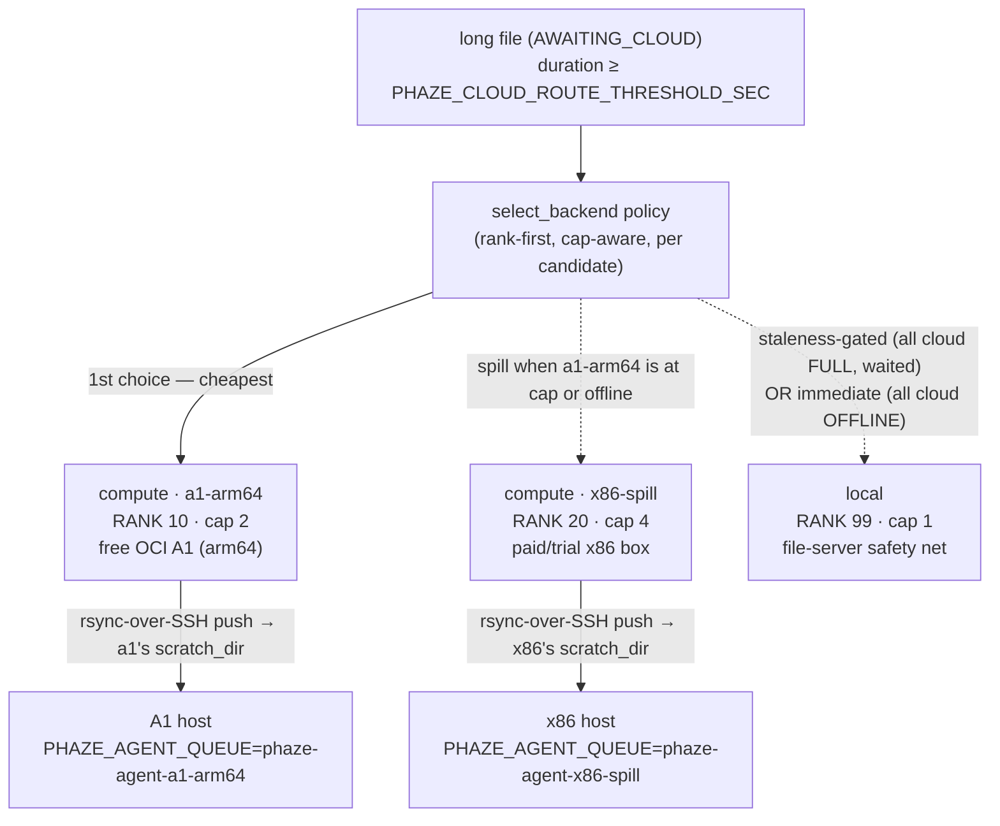

<!-- generated-by: gsd-doc-writer -->
# Multi-Compute Agents — mixed arm64/x86 cost-tiered lanes

This is the **"now add a 2nd+ compute agent, cost-tiered"** operator guide. Where
[cloud-burst.md](cloud-burst.md) walks through provisioning a **single** OCI A1 arm64 compute
agent end-to-end (host, Tailscale ACL, broker role, `-arm64` image, smoke test), this page is the
next step: declaring **two or more** `kind="compute"` backends at different cost tiers so the
scheduler prefers the cheap one and **spills** to the pricier one under load — a free arm64 A1 that
fills first, a paid/trial x86 box that only takes overflow, and local as the final safety net.

Everything here runs on the already-shipped Phase 72/73 machinery (per-entry `agent_ref` binding,
per-agent push/scratch destination, rank/cap load-spread, per-backend failure isolation). There is
**no new routing behavior** — this is the operator recipe for using it with N compute agents.

> **The `[[backends]]` field schema is not restated here.** For the canonical per-field reference
> (`id` / `kind` / `rank` / `cap` / `agent_ref` / `scratch_dir` / `push_host` / `ssh_user` and the
> startup validators), see
> [configuration.md → Backend registry](configuration.md#backend-registry-backendstoml). This page
> shows the *worked scenario*; that page is the field table.

## Architecture at a glance — the rank-tiered drain

Each long file drains **rank-first**: the lowest-`rank` compute lane with a free slot wins, spills
to the next rank when the preferred lane is at `cap` or offline, and only falls to local under the
staleness gate (or immediately when every cloud lane is offline).



_Two `compute` lanes at **distinct ranks** give you cost-tiering for free: the drain always tries
`rank 10` (free arm64) first and only reaches `rank 20` (paid x86) when the arm64 lane is full or
offline. `local` at `rank 99` is the last-resort catch — see
[runbook.md → Spillover behavior](runbook.md#spillover-behavior) for the exact staleness/attempt
gates._

## The worked mixed arm64/x86 `backends.toml`

Declare both compute agents in the registry TOML (`PHAZE_BACKENDS_CONFIG_FILE`, default
`/etc/phaze/backends.toml`) alongside the always-present `local` catch. Each compute entry binds to
its **own** registered agent (`agent_ref`), pushes to its **own** host (`push_host`), and lands in
its **own** scratch dir — the two lanes never share a destination.

```toml
# /etc/phaze/backends.toml on the control plane (lux).
# Two compute lanes at different cost tiers + the local safety net.

# --- Tier 1: free arm64 OCI A1 — preferred, fills first ---
[[backends]]
kind = "compute"
id = "a1-arm64"
rank = 10          # lowest rank = dispatched first (cheapest)
cap = 2            # 2 OCPU / 12 GB Ampere A1 (RAM-bound; keep small)
agent_ref = "a1-arm64"  # REQUIRED — names THIS lane's registered compute Agent.id
push_host = "a1-arm64"  # REQUIRED — rsync/ssh destination host for this lane
scratch_dir = "/var/lib/phaze/scratch"  # REQUIRED — ephemeral push landing dir
ssh_user = "phaze"      # optional — falls back to the fileserver's configured user

# --- Tier 2: paid/trial x86 — spill target, only fills after arm64 ---
[[backends]]
kind = "compute"
id = "x86-spill"
rank = 20          # only reached when a1-arm64 is at cap or offline
cap = 4            # a bigger x86 box can take more concurrent analyses
agent_ref = "x86-spill" # REQUIRED — MUST be distinct from a1-arm64 (dup agent_ref fails at boot)
push_host = "x86-spill" # distinct host from the A1
scratch_dir = "/var/lib/phaze/scratch"
ssh_user = "phaze"

# --- Final catch: local file server ---
[[backends]]
kind = "local"
id = "local"
rank = 99          # last-resort spill; never excluded
cap = 1
```

> **Distinct `agent_ref` per lane is load-bearing.** Two compute backends sharing an `agent_ref`
> **fail fast at boot** — each lane must bind to its own registered `Agent.id`. The registry is
> **startup-read**: edit the TOML, then restart the control-plane worker + api for it to take
> effect. An absent `backends.toml` synthesizes an implicit single `local` backend (all-local).

## Cost-tier rationale

Ranks encode your cost preference; the scheduler always drains lowest rank first and spills upward.

| Tier | Backend | Rank | Cap | Cost posture |
|------|---------|------|-----|--------------|
| 1 (preferred) | `a1-arm64` (free OCI Ampere A1) | `10` | `2` | **Always-free** — fill this first. Small cap because the 2 OCPU / 12 GB A1 is RAM-bound on long sets. |
| 2 (spill) | `x86-spill` (paid/trial x86 box) | `20` | `4` | **Paid or trial** — only takes overflow when the free lane is at cap or offline. Larger cap; costs money per running hour, so it idles unless tier 1 is saturated. |
| final catch | `local` (file server) | `99` | `1` | **No marginal cost, but slow** — the guaranteed safety net. Reached only under the staleness gate (all cloud full and the file has waited) or immediately when every cloud lane is offline. |

Raise a lane's `rank` to make it *less* preferred; lower it to make it *more* preferred. Two lanes
at the **same** rank tie-break deterministically by `id` (see
[runbook.md → Spillover behavior](runbook.md#spillover-behavior)).

## Running the compose once per compute agent

There is **one** compute-agent compose file — [`docker-compose.cloud-agent.yml`](../docker-compose.cloud-agent.yml).
You run it **once per compute agent**, on that agent's own host, with a distinct identity each time.
Follow the same per-agent env convention as [cloud-burst.md → Step 5](cloud-burst.md#step-5--bring-up-the-compute-agent-docker-composecloud-agentyml)
and [deployment.md → Step 4](deployment.md#step-4--populate-the-file-server-env): there is **no**
bare `AGENT_ID` compose variable — `PHAZE_AGENT_ID` is only the documentation mnemonic for the
`<id>` that feeds `PHAZE_AGENT_QUEUE=phaze-agent-<id>` (the SAQ queue the worker consumes) and the
backend's `agent_ref`.

Give each agent its own:

| Per-agent setting | `a1-arm64` example | `x86-spill` example |
|-------------------|--------------------|---------------------|
| `PHAZE_AGENT_QUEUE` | `phaze-agent-a1-arm64` | `phaze-agent-x86-spill` |
| backend `agent_ref` (in `backends.toml`) | `a1-arm64` | `x86-spill` |
| `PHAZE_CLOUD_SCRATCH_DIR` + scratch volume | `/var/lib/phaze/scratch` | `/var/lib/phaze/scratch` (separate host) |
| SSH push host (`push_host`) | `a1-arm64` | `x86-spill` |
| compose project name (`-p`) | `-p phaze-a1` | `-p phaze-x86` |

`PHAZE_AGENT_QUEUE` MUST equal `phaze-agent-<PHAZE_AGENT_ID>` — the worker derives the expected
queue name from its token's agent id and exits non-zero on mismatch.

### The arm64 → x86 image + command swap

The two agents run **different images with different launch commands** — the single most important
difference between an arm64 and an x86 compute agent:

| | arm64 A1 agent (default) | x86 spill agent (override) |
|---|--------------------------|----------------------------|
| Image | the `-arm64` tag (default) — e.g. `…/phaze:<tag>-arm64` | override `PHAZE_CLOUD_AGENT_IMAGE` to the **standard x86 tag** (NO `-arm64` suffix) |
| Command | `python3 -m saq phaze.tasks.agent_worker.settings` (arm64 image is Python 3.13 + `--system`, no `.venv`) | override `PHAZE_CLOUD_AGENT_CMD` to `uv run saq phaze.tasks.agent_worker.settings` (x86 image is Python 3.14 with a `.venv`) |

Do **not** copy `uv run …` onto the arm64 agent — that image has no `.venv` and `uv run`
re-validates `requires-python >=3.14`, so the container fails to boot. Conversely the x86 image
must **not** pull the `-arm64` tag (there is no multi-arch manifest). Set `PHAZE_CLOUD_AGENT_IMAGE`
+ `PHAZE_CLOUD_AGENT_CMD` on the x86 host and leave both at their arm64 defaults on the A1.

> **Co-located agents collide on scratch + project name.** In this worked example the two agents
> live on **different hosts** (a free A1 and a paid x86 box), so host isolation makes this a
> non-issue. If you ever run two compute agents **on one host**, give each a distinct `-p <project>`
> compose project name, a distinct `PHAZE_CLOUD_SCRATCH_DIR` / scratch volume, and a distinct
> `PHAZE_AGENT_QUEUE` — otherwise the second agent shares or steals the first's scratch volume.

### Secrets

Never inline a token, SSH key, or `DATABASE_URL` in any example. Use the existing `*_FILE`
pointers only (`PHAZE_QUEUE_URL_FILE`, `PHAZE_AGENT_TOKEN_FILE`, `PHAZE_PUSH_*_FILE`) read via
`env_file: .env` — exactly as [cloud-burst.md](cloud-burst.md) documents. The compute agent reaches
Postgres **only** via `PHAZE_QUEUE_URL` for the `saq_jobs` broker plus the HTTP API — never the app
ORM (DIST-04).

## Reading the lanes

Once both compute agents are declared and online, the **Analyze workspace** renders **one lane card
per backend** — you will see three cards: `COMPUTE · a1-arm64` (`RANK 10`), `COMPUTE · x86-spill`
(`RANK 20`), and `LOCAL · local` (`RANK 99`), sorted rank-ascending left-to-right so the top-left
lane is what the scheduler uses first. Each card shows its `{in_flight}/{cap}` capacity numeral and,
when a probe fails for a poll, a greyed glyph + the word `offline` (that lane only — a single
failing backend never stalls the rest of the grid).

For the full read-out vocabulary — `RANK {n}`, `{in_flight}/{cap}`, `offline`, and the Kueue
quota-wait/inadmissible distinction — see
[runbook.md → Reading the N lanes](runbook.md#reading-the-n-lanes). The lane grid and this doc use
the same words on purpose.

## See also

- [cloud-burst.md](cloud-burst.md) — provisioning a **single** OCI A1 compute agent end-to-end (the
  walkthrough this page builds on).
- [configuration.md → Backend registry](configuration.md#backend-registry-backendstoml) — the
  canonical `[[backends]]` field reference (not restated here).
- [runbook.md](runbook.md) — force-local revert, reading the N lanes, and spillover behavior.
- [k8s-burst.md](k8s-burst.md) — the Kubernetes (Kueue) lane, if you also declare `kind="kueue"`
  backends alongside your compute agents.
