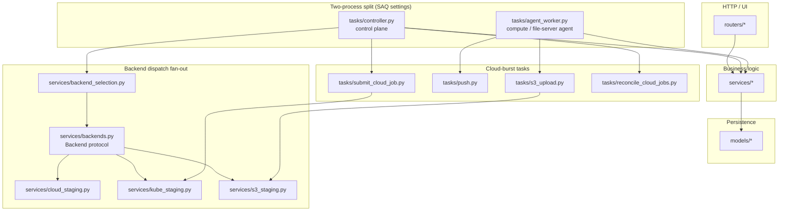

<!-- generated-by: gsd-doc-writer -->
# Project Structure

```
phaze/
├── src/phaze/                  # Application package
│   ├── config.py               # Pydantic settings (env vars, role split)
│   ├── config_backends.py      # Backend-registry schema (backends.toml: local + Kueue + cloud)
│   ├── constants.py            # File categories, extension map, tuning constants
│   ├── database.py             # Async SQLAlchemy engine + session factory
│   ├── main.py                 # FastAPI app factory with lifespan
│   ├── entrypoint.py           # Container entrypoint shim: runs cert bootstrap, then execvp's uvicorn
│   ├── cert_bootstrap.py       # Pre-uvicorn TLS/mTLS cert bootstrap for distributed agents (DB-free, idempotent)
│   ├── job_runner.py           # One-shot Kueue Job entrypoint (cloud compute-agent analysis)
│   ├── analysis_child.py       # `python -m phaze.analysis_child` CLI: runs analyze_file in a real child process
│   ├── logging_config.py       # Central structlog configuration for every Phaze process
│   ├── cli/                    # phaze management CLI (argparse): `agents add` mints token + agents row
│   │   └── __init__.py         #   Command groups + entry point
│   ├── web/                    # Web mount helpers
│   │   └── saq_mount.py        #   Testable mount for the SAQ monitoring dashboard (/saq)
│   ├── enums/                  # DB-free enums (importable without SQLAlchemy)
│   │   ├── execution.py        #   ExecutionStatus enum (re-exported by models/execution.py)
│   │   └── stage.py            #   Stage/status enums + DB-free per-row status resolver + eligibility DAG
│   ├── utils/                  # Pure helpers (no deps)
│   │   └── humanize.py         #   Relative-time formatter ("4m ago", "2h ago")
│   ├── scripts/                # Python-callable utility scripts
│   │   └── download_models.py  #   Fetch essentia weight files (shared by bash + agent bootstrap)
│   ├── static/                 # Static assets (favicons, web manifest, OG image)
│   ├── models/                 # SQLAlchemy ORM models
│   │   ├── base.py             #   DeclarativeBase + TimestampMixin
│   │   ├── file.py             #   FileRecord (no state column; per-stage status derived on read)
│   │   ├── scan_batch.py       #   ScanBatch progress tracking
│   │   ├── metadata.py         #   FileMetadata (audio tags)
│   │   ├── analysis.py         #   AnalysisResult (BPM, key, mood, style) + AnalysisWindow (per-window rows)
│   │   ├── fingerprint.py      #   FingerprintResult (per-engine)
│   │   ├── proposal.py         #   RenameProposal + ProposalStatus
│   │   ├── execution.py        #   ExecutionLog (audit trail)
│   │   ├── tracklist.py        #   Tracklist + TracklistVersion + TracklistTrack
│   │   ├── file_companion.py   #   FileCompanion (companion-media join)
│   │   ├── agent.py            #   Agent (file-server identity for distributed agents)
│   │   ├── discogs_link.py     #   DiscogsLink (candidate Discogs release matches per track)
│   │   ├── cloud_job.py        #   CloudJob (per-file S3 object-staging / cloud-burst sidecar)
│   │   ├── pipeline_stage_control.py # PipelineStageControl (durable per-stage pause/priority intent)
│   │   ├── scheduling_ledger.py #   SchedulingLedger (durable "stage scheduled" recovery record)
│   │   ├── route_control.py    #   RouteControl (single-row force-local routing override)
│   │   ├── dedup_resolution.py #   DedupResolution (per-file "resolved to canonical file" marker)
│   │   ├── stage_skip.py       #   StageSkip (per-(file, stage) force-skip marker for enrich stages)
│   │   └── tag_write_log.py    #   TagWriteLog (append-only tag-write audit trail)
│   ├── routers/                # API + UI endpoints
│   │   ├── health.py           #   GET /health
│   │   ├── shell.py            #   v7.0 console shell: GET / (Analyze default) + GET /s/<stage> workspace swaps
│   │   ├── pipeline.py         #   Stage triggers + /pipeline/stats poll (/pipeline/ 302-redirects to the shell)
│   │   ├── pipeline_scans.py   #   Admin scan trigger + HTMX scan-batch polling
│   │   ├── proposals.py        #   Proposal review + approval UI
│   │   ├── execution.py        #   Batch execution + SSE progress
│   │   ├── preview.py          #   `/preview/` legacy route: 302-redirect into the shell's Move workspace
│   │   ├── duplicates.py       #   Duplicate resolution UI
│   │   ├── tracklists.py       #   Tracklist management UI
│   │   ├── companion.py        #   Companion file association
│   │   ├── cue.py              #   CUE sheet management UI (generation + batch)
│   │   ├── search.py           #   Unified cross-entity search UI
│   │   ├── tags.py             #   Tag review UI (side-by-side compare, inline edit, write)
│   │   ├── admin_agents.py     #   Admin agents page + HTMX table partial
│   │   ├── pipeline_stages.py  #   Per-stage control plane: pause/resume/priority endpoints
│   │   ├── record.py           #   Per-file full-record read-only fragment route
│   │   ├── routing.py          #   Force-local master routing override (thin write endpoint)
│   │   └── agent_*.py          #   Distributed-agent internal API (14 routers under /api/internal/agent):
│   │       │                   #     auth, identity, heartbeat, files, metadata, fingerprint,
│   │       │                   #     analysis, proposals, execution, exec_batches,
│   │       │                   #     scan_batches, tracklists, push, s3
│   ├── schemas/                # Pydantic request/response models
│   │   ├── companion.py        #   Companion/duplicate schemas
│   │   ├── pipeline_scans.py   #   Pipeline scan-trigger schemas
│   │   ├── agent_tasks.py      #   Agent task-routing payload schemas
│   │   └── agent_*.py          #   Distributed-agent contract schemas (13, DB-free, loaded in agent worker):
│   │       │                   #     identity, heartbeat, files, metadata, fingerprint, analysis,
│   │       │                   #     proposals, execution, exec_batches, scan_batches, tracklists,
│   │       │                   #     push, s3
│   ├── services/               # Business logic
│   │   ├── hashing.py          #   Shared hashing utilities
│   │   ├── metadata.py         #   Tag extraction via mutagen
│   │   ├── pg_text.py          #   Sanitize free text for PostgreSQL UTF8 storage (NUL/surrogate stripping)
│   │   ├── analysis.py         #   BPM/key/mood via essentia
│   │   ├── analysis_enqueue.py #   FastAPI-free producer for process_file jobs (deterministic key + payload)
│   │   ├── analysis_exec.py    #   Shared async subprocess driver for essentia analysis (analysis_child)
│   │   ├── fingerprint.py      #   Multi-engine fingerprint orchestrator
│   │   ├── proposal.py         #   LLM calling + context building
│   │   ├── proposal_queries.py #   Proposal queries + pagination
│   │   ├── execution_queries.py#   Execution log queries + pagination
│   │   ├── execution_dispatch.py # Dispatch grouping, revoked-agent filter, chunking
│   │   ├── enqueue_router.py   #   Task-name → consumed-queue routing (avoids consumer-less default queue)
│   │   ├── companion.py        #   Companion file association
│   │   ├── dedup.py            #   Duplicate detection + resolution
│   │   ├── collision.py        #   Destination path collision detection
│   │   ├── pipeline.py         #   Pipeline stats, per-stage progress (get_stage_progress), file state queries
│   │   ├── pipeline_counters.py#   Maintained Redis per-job-type enqueued/completed counters (cache, not truth)
│   │   ├── stage_status.py     #   SQL ColumnElement per-stage predicate builders (done/failed/inflight/status CASE)
│   │   ├── scan_deletion.py    #   Ordered transactional cascade delete of a scan batch + dependent rows
│   │   ├── tracklist_scraper.py#   1001Tracklists web scraper
│   │   ├── tracklist_matcher.py#   Fuzzy match tracklists to files
│   │   ├── cue_generator.py    #   CUE sheet generation
│   │   ├── discogs_matcher.py  #   Discogsography API adapter + fuzzy Discogs matching
│   │   ├── search_queries.py   #   Cross-entity full-text search (files + tracklists)
│   │   ├── tag_proposal.py     #   Compute merged tags from multiple sources
│   │   ├── tag_writer.py       #   Format-aware tag writing with verify-after-write
│   │   ├── agent_bootstrap.py  #   Dev-agent seeding for the api lifespan
│   │   ├── agent_client.py     #   PhazeAgentClient (internal-agent HTTP wrapper)
│   │   ├── agent_liveness.py   #   Agent liveness classification (status pills)
│   │   ├── agent_task_router.py#   Controller-side per-agent SAQ enqueuer
│   │   ├── review.py           #   Degrade-safe read helpers for the Review diff workspaces
│   │   ├── stage_control.py    #   Raw saq_jobs backlog-mutation helpers for per-stage control
│   │   ├── scheduling_ledger.py#   Control-only scheduling-ledger service (recovery source of truth)
│   │   ├── route_control.py    #   Degrade-safe reader for the force-local routing override
│   │   ├── backends.py         #   Internal Backend protocol + its 3 implementations (local/kube/cloud)
│   │   ├── backend_selection.py#   Pure select_backend policy over the Backend substrate
│   │   ├── analysis_wire.py    #   Shared wire-format converters for essentia analysis features
│   │   ├── cloud_staging.py    #   Control-plane cloud-staging producer + re-drive helper
│   │   ├── s3_staging.py       #   Control-plane S3 object-staging service (presign/complete/abort)
│   │   └── kube_staging.py     #   Control-plane Kubernetes (Kueue) Job-staging service
│   ├── tasks/                  # SAQ async background jobs
│   │   ├── controller.py       #   SAQ controller settings (application-server entry point)
│   │   ├── agent_worker.py     #   SAQ agent_worker settings (agent process entry point)
│   │   ├── functions.py        #   process_file (full pipeline per file)
│   │   ├── metadata_extraction.py # extract_file_metadata
│   │   ├── fingerprint.py      #   fingerprint_file (multi-engine)
│   │   ├── proposal.py         #   generate_proposals (batch LLM)
│   │   ├── execution.py        #   execute_approved_batch
│   │   ├── scan.py             #   scan_directory (agent-side chunked file discovery) + scan_live_set (fingerprint matching)
│   │   ├── reenqueue.py        #   Control-side recover_orphaned_work: gated all-stages queue-loss recovery (Phase 42)
│   │   ├── scan_reaper.py      #   Control-side cron: reap stalled RUNNING scans (no-progress)
│   │   ├── tracklist.py        #   scrape/search/refresh tracklists
│   │   ├── discogs.py          #   match tracklist tracks to Discogs releases
│   │   ├── heartbeat.py        #   30s cron: POST agent heartbeat
│   │   ├── push.py             #   push_file: rsync-over-SSH push of media to compute scratch
│   │   ├── s3_upload.py        #   upload_file_s3: multipart-PUT upload to presigned URLs
│   │   ├── submit_cloud_job.py #   Control-plane fast Kube-submit producer
│   │   ├── reconcile_cloud_jobs.py # */5 cron: reconcile in-flight K8s cloud jobs
│   │   ├── release_awaiting_cloud.py # Control-side tiered multi-backend drain (route AWAITING_CLOUD)
│   │   └── _shared/            #   Cross-process startup helpers (DB-free where required)
│   │       ├── agent_bootstrap.py  # Shared agent-startup helpers
│   │       ├── deterministic_key.py # Central before_enqueue deterministic-key + after_process completion hooks
│   │       ├── model_bootstrap.py  # Auto-download essentia weights when /models empty
│   │       ├── queue_defaults.py   # Shared SAQ before_enqueue Job defaults
│   │       ├── queue_factory.py    # Single PostgresQueue construction seam for the pipeline
│   │       └── stage_control.py    # Canonical per-stage control constants (DB-free)
│   ├── agent_watcher/          # Filesystem watcher service (file-server role, not a SAQ worker)
│   │   ├── __main__.py         #   Entry point: asyncio.run(main())
│   │   ├── observer.py         #   watchdog observer over agent scan_roots
│   │   ├── debouncer.py        #   mtime-stability debouncer (settle period)
│   │   ├── poster.py           #   POSTs settled files to /api/internal/agent/files
│   │   └── README.md           #   Watcher service docs
│   ├── prompts/                # LLM prompt templates
│   │   └── naming.md           #   Filename/path proposal prompt
│   └── templates/              # Jinja2 HTML templates (HTMX + Tailwind)
│       ├── base.html           #   Base layout (SRI-pinned CDN assets)
│       ├── shell/              #   v7.0 console shell (three-column DAG-centric layout)
│       │   ├── shell.html      #     Three-column shell served by GET / (Analyze default)
│       │   └── partials/       #     rail.html (DAG rail nav), header.html (⌘K + status strip),
│       │       │               #     cmdk_modal.html (⌘K command palette), record_host.html (record slide-in)
│       ├── record/             #   Per-file record slide-in body
│       ├── pipeline/           #   /s/<stage> workspace partials (partials/<stage>_workspace.html) + stats_bar poll partial
│       ├── proposals/          #   Proposal approval UI
│       ├── execution/          #   Execution dashboard + audit log
│       ├── duplicates/         #   Duplicate resolution UI
│       ├── tracklists/         #   Tracklist management UI
│       ├── cue/                #   CUE sheet management UI
│       ├── search/             #   Cross-entity search UI
│       ├── tags/               #   Tag review UI
│       └── admin/              #   Admin agents UI
├── services/                   # Fingerprint microservices
│   ├── audfprint/              #   Landmark-based fingerprinting
│   └── panako/                 #   Tempo-robust fingerprinting
├── tests/                      # Test suite (90%+ coverage), reorganized into 9 CI-parallel
│   │                           # buckets (Phase 63-02); see tests/BUCKETS.md for the mapping
│   ├── conftest.py             #   Fixtures + test DB setup
│   ├── buckets.json            #   Source of truth for the 9 bucket names + file->bucket map
│   ├── discovery/               #   File-discovery, agent_watcher, and core routing tests
│   ├── metadata/                #   Tag-extraction (mutagen) tests
│   ├── fingerprint/              #   Multi-engine fingerprint tests
│   ├── analyze/                  #   Essentia analysis (BPM/key/mood) tests
│   ├── identify/                 #   Proposal/LLM-naming tests
│   ├── review/                   #   Execution + review-workflow tests
│   ├── agents/                   #   Distributed-agent (file-server/compute) tests
│   ├── integration/               #   End-to-end + Alembic migration tests (test_migrations/)
│   └── shared/                    #   Config, template-helper, utils, and cross-cutting tests
├── alembic/                    # Database migrations (async template)
│   └── versions/               #   Migration scripts (squashed to a single baseline: 039_baseline_schema.py)
├── .github/workflows/          # CI/CD pipelines
│   ├── ci.yml                  #   Main orchestrator
│   ├── code-quality.yml        #   Pre-commit hooks
│   ├── tests.yml               #   Pytest + Codecov
│   ├── security.yml            #   pip-audit, bandit, osv-scanner, Semgrep, TruffleHog, Trivy container scan
│   ├── docker-publish.yml      #   Build + publish container images
│   ├── docker-validate.yml     #   Validate Docker build/compose
│   ├── cleanup-cache.yml       #   Prune GitHub Actions caches
│   └── cleanup-images.yml      #   Prune published container images
├── scripts/                    # Utility, CI, and perf-tooling scripts
│   ├── download-models.sh      #   Download essentia ML models
│   ├── update-project.sh       #   Sync/update project tooling
│   ├── classify-changed-files.sh # Classify changed files as docs-only vs code (CI doc-only skip gate)
│   ├── coverage_floor.py       #   Enforce per-module coverage floor from `coverage json` output
│   ├── normalize_schema_dump.py #  Normalize a pg_dump schema-only file for migration-chain equivalence
│   ├── seed_perf_corpus.py     #   Seed a synthetic ~200K-file corpus for perf measurement
│   ├── perf_explain.py         #   EXPLAIN (ANALYZE, BUFFERS) hot queries + time /pipeline/stats
│   ├── perf_analyze_workspace.py # Baseline the Analyze-workspace slowdown at 200K scale
│   ├── analyze_browser_soak.py #   Real-browser verification of the Analyze workspace at 200K scale
│   └── parity/                 #   Fingerprint-engine parity fixtures (compare/dump analysis, reference.wav)
├── docker-compose.yml          # Service orchestration
├── docker-compose.override.yml # Local development overrides
├── docker-compose.agent.yml    # Distributed file-server agent stack
├── docker-compose.cloud-agent.yml # OCI A1 cloud compute-agent stack
├── Dockerfile                  # Single-stage image (shared by API, worker, agent, watcher)
├── justfile                    # Developer commands
├── pyproject.toml              # Project config + tool settings
└── uv.lock                     # Frozen dependency versions
```

## Shell templates & `/s/<stage>` routing

The v7.0 admin UI is a three-column DAG-centric console (see
[Architecture → User Interface](architecture.md#-user-interface--information-architecture-v70)).
Its structural templates live under `templates/shell/`, while each rail node's content is a
workspace partial under `templates/pipeline/partials/`:

| Template | Role |
| -------- | ---- |
| `templates/shell/shell.html` | The three-column shell served by `GET /` (Analyze selected by default) |
| `templates/shell/partials/rail.html` | The DAG rail — the navigation spine (stage nodes + live counts) |
| `templates/shell/partials/header.html` | Header: wave logo, ⌘K trigger, and the compute/agent status strip |
| `templates/shell/partials/cmdk_modal.html` | The ⌘K command palette (unified search + commands) |
| `templates/shell/partials/record_host.html` + `templates/record/record_body.html` | The per-file record slide-in overlay |

`src/phaze/routers/shell.py` maps rail-node ids to workspace partials through the static
`STAGE_PARTIALS` whitelist. A rail click issues `GET /s/<stage>`, which returns only that
stage's workspace fragment to swap into the `#stage-workspace` target:

| `/s/<stage>` | Workspace partial |
| ------------ | ----------------- |
| `/s/discover` | `pipeline/partials/discover_workspace.html` |
| `/s/metadata` · `/s/fingerprint` · `/s/analyze` | `pipeline/partials/{metadata,fingerprint,analyze}_workspace.html` |
| `/s/trackid` · `/s/tracklist` | `pipeline/partials/{trackid,tracklist}_workspace.html` |
| `/s/propose` | `pipeline/partials/propose_workspace.html` |
| `/s/rename` · `/s/tagwrite` · `/s/move` · `/s/dedupe` · `/s/cue` | `pipeline/partials/{rename,tagwrite,move,dedupe,cue}_workspace.html` |

`stage` is only ever matched against the `STAGE_PARTIALS` keys — it is never interpolated
into a template path (template-path-injection mitigation) — and an unknown stage returns
`404`. The legacy top-level page routes (`/proposals`, `/tracklists`, `/tags`, `/cue`,
`/duplicates`, `/preview`, `/pipeline`, `/search`) `302`-redirect into their corresponding
shell stage so existing bookmarks keep working.

## Module layering

The flat tree above lists *where* modules live; this graph shows *how they depend*. The core
rule is one-directional: `routers → services → models` (routers never touch the ORM directly,
models never import services). Two SAQ settings modules define the two-process split — the
control plane (`tasks/controller.py`) and the compute/file-server agent (`tasks/agent_worker.py`)
— which is why background jobs are grouped by which process registers them. The cloud-burst
dispatch fans out through the `Backend` protocol so the drain and the staging tasks never
hard-code a single backend.


