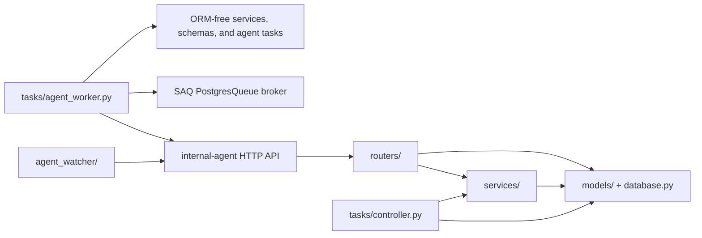

# Project Structure

This page is an inventory of maintained package boundaries, not a hand-maintained file tree.
Individual files are discoverable with `rg --files`; the tables below name the directories and
load-bearing modules whose roles matter architecturally.

## Generated package inventory

The Python-file counts are generated recursively with:

```bash
for area in agent_watcher cli enums models routers schemas services tasks telemetry utils web; do
  rg --files "src/phaze/$area" -g '*.py' | wc -l
done
```

`tests/shared/core/test_docs_ia_current.py` recomputes these values, so adding, moving, or deleting
a module makes the inventory fail until this page is reconciled.

| Package area | Python files | Responsibility |
| ------------ | -----------: | -------------- |
| `agent_watcher/` | 5 | Standalone filesystem observer and HTTP poster; no ORM imports |
| `cli/` | 1 | Operator commands, including agent management and projection backfill |
| `enums/` | 5 | DB-free shared stage, execution, tag-write, and tracklist vocabulary |
| `models/` | 26 | SQLAlchemy application schema, including migration-`063` `SetProfile` |
| `routers/` | 52 | FastAPI UI, public, and internal-agent endpoints; includes `pipeline/` and `shell/` packages |
| `schemas/` | 20 | Pydantic wire contracts; agent payloads remain ORM-free |
| `services/` | 122 | Business rules and infrastructure adapters; includes `backends/` and `pipeline/` packages |
| `tasks/` | 42 | SAQ controller/agent jobs and shared queue policy |
| `telemetry/` | 11 | OpenTelemetry bootstrap and HTTP, DB, SAQ, and pipeline instrumentation |
| `utils/` | 2 | Dependency-light general helpers |
| `web/` | 4 | Static/template globals and SAQ web mounting |

Fourteen Python modules live directly under `src/phaze/`. The main process boundaries are:

| Module | Role |
| ------ | ---- |
| `main.py` | FastAPI composition root and lifespan |
| `database.py` | Application SQLAlchemy engine/session construction |
| `config.py`, `config_*.py` | Public settings facade plus role-specific settings, secrets, Redis, and backend policy domains |
| `entrypoint.py`, `cert_bootstrap.py` | Container entry and TLS bootstrap |
| `job_runner.py` | One-shot Kueue analysis job |
| `analysis_child.py` | Killable per-file analysis subprocess entry point |
| `logging_config.py` | Shared structured logging setup |

Outside the package, `alembic/versions/` contains 25 migrations (`039` baseline through head
`063`), `src/phaze/templates/` contains the server-rendered UI, `scripts/` contains maintenance
and validation tools, and `tests/` is organized into the buckets documented in
`tests/BUCKETS.md`.

## Load-bearing module groups

| Concern | Live modules |
| ------- | ------------ |
| Shell routing | `routers/shell/__init__.py`, `stage_maps.py`, `stage_context.py`, `summary.py` |
| Pipeline routing | `routers/pipeline/` package plus `pipeline_scans.py`, `pipeline_stages.py`, and `scan.py` |
| Pipeline reads | `services/pipeline/` package; stage status remains centralized in `services/stage_status.py` |
| Backend lanes | `services/backends/`, `backend_selection.py`, `cloud_staging.py`, `kube_staging.py`, `s3_staging.py` |
| Queue policy | `tasks/_shared/queue_factory.py`, `queue_defaults.py`, `deterministic_key.py`, `stage_control.py`, `resilient_queue.py` |
| Set projection | `services/set_projection.py`, `set_projection_writer.py`, `set_projection_backfill.py` |
| Set views | `services/analysis_timeline.py`, `harmonic_journey.py`, `track_segments.py`, `record_facts.py`, `set_glyph_colors.py`, `set_similarity.py` |
| Record composition | `routers/record.py`, `templates/record/`, `templates/proposals/partials/analysis_timeline.html`, `templates/ui/set_marks.html` |

## Shell templates and `/s/<stage>` routing

The console's structural templates live under `templates/shell/`; rail-node content lives under
`templates/pipeline/partials/`:

| Template | Role |
| -------- | ---- |
| `templates/shell/shell.html` | Full console document served by `GET /` |
| `templates/shell/_stage_fragment.html` | Bare content response for an HTMX stage swap |
| `templates/shell/partials/rail.html` | Labelled navigation rail and live counts |
| `templates/shell/partials/header.html` | Command palette, agent status, theme, and routing state |
| `templates/shell/partials/record_host.html` | Host dialog for the per-file record drawer |
| `templates/shell/partials/summary_overview.html` | Actionable Summary landing |

`src/phaze/routers/shell/stage_maps.py` maps rail-node ids to templates through static
`STAGE_PARTIALS` and `UTILITY_PANES` dictionaries. No request value is interpolated into a
template path.

| `/s/<stage>` | Workspace partial |
| ------------ | ----------------- |
| `/s/summary` | `shell/partials/summary_overview.html` |
| `/s/files` | `pipeline/partials/files_workspace.html` |
| `/s/discover` | `pipeline/partials/discover_workspace.html` |
| `/s/metadata`, `/s/analyze` | `pipeline/partials/metadata_workspace.html`, `analyze_workspace.html` |
| `/s/tracklist` | `pipeline/partials/tracklist_workspace.html` |
| `/s/propose` | `pipeline/partials/propose_workspace.html` |
| `/s/rename`, `/s/tagwrite`, `/s/move` | Compatibility aliases for `pipeline/partials/changes_workspace.html` |
| `/s/dedupe`, `/s/cue` | `pipeline/partials/dedupe_workspace.html`, `cue_workspace.html` |
| `/s/apply` | `pipeline/partials/apply_workspace.html` |
| `/s/operations`, `/s/audit`, `/s/agents` | Utility panes under shell, execution, and admin templates |

The legacy top-level page routes redirect into these workspaces; the API and callback endpoints
documented in [API Reference](api.md) remain separate.

## Verified module layering

The application uses pragmatic layering rather than a strict `routers → services → models`
pipeline. Routers call services where a reusable seam exists, but many routers also import
SQLAlchemy models and `phaze.database.get_session` directly for request-scoped queries. That is
intentional and visible in `routers/record.py`, `routers/proposals.py`, and the internal-agent
callback routers. Models do not import routers or services.

The agent boundary is narrower and strict: agent workers and the watcher may use DB-free schemas,
services, and tasks, and the agent worker connects to the SAQ `PostgresQueue` broker, but neither
side imports the application ORM. Application-state reads and writes cross the authenticated
internal HTTP API.

Each dependency line below carries a repo-relative source citation in the preceding `evidence:`
comment. The docs guard resolves those paths and verifies the direct router-to-model import and
agent ORM exclusion.


```mermaid
flowchart LR
    %% evidence: src/phaze/routers/record.py; src/phaze/services/analysis_timeline.py
    routers["routers/"] --> services["services/"]
    %% evidence: src/phaze/routers/record.py; src/phaze/models/set_profile.py
    routers --> models["models/ + database.py"]
    %% evidence: src/phaze/services/set_projection_backfill.py; src/phaze/models/set_profile.py
    services --> models
    %% evidence: src/phaze/tasks/controller.py; src/phaze/services/agent_task_router.py
    controller["tasks/controller.py"] --> services
    %% evidence: src/phaze/tasks/controller.py; src/phaze/database.py
    controller --> models
    %% evidence: src/phaze/tasks/agent_worker.py; src/phaze/services/enqueue_router.py
    agent["tasks/agent_worker.py"] --> shared["ORM-free services, schemas, and agent tasks"]
    %% evidence: src/phaze/tasks/agent_worker.py; src/phaze/tasks/_shared/queue_factory.py
    agent --> broker["SAQ PostgresQueue broker"]
    %% evidence: src/phaze/tasks/functions.py; src/phaze/services/agent_client.py
    agent --> internal["internal-agent HTTP API"]
    %% evidence: src/phaze/agent_watcher/poster.py; src/phaze/services/agent_client.py
    watcher["agent_watcher/"] --> internal
    %% evidence: src/phaze/main.py; src/phaze/routers/agent_analysis.py
    internal --> routers
```

The broker boundary is deliberately separate from ORM transaction ownership. SAQ owns
`saq_jobs` through its psycopg pool; application rows use SQLAlchemy sessions. Control-side queue
construction may attach a SQLAlchemy `ledger_sessionmaker` for scheduling-ledger hooks, while
agent-side queue construction omits it and remains ORM-free (`tasks/_shared/queue_factory.py`).

---

**Related docs:** [Architecture](architecture.md) · [Database](database.md) ·
[API Reference](api.md) · [Essentia Analysis](essentia-analysis.md)
