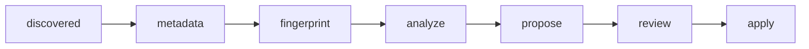

<!-- generated-by: gsd-doc-writer -->
# 🚀 Quick Start

Get Phaze running locally and walk a music file through the full pipeline — scan,
fingerprint, analyze, propose, review, execute. This is the fuller companion to the
short Setup block in the [README](../README.md).

Every command below is a real `just` recipe (see `just --list`) or a verified shell
command. Configuration details live in [Configuration](configuration.md).

## 📋 Prerequisites

| Tool | Version | Purpose | Install |
| ---- | ------- | ------- | ------- |
| **Docker + Docker Compose** | Compose v2 | Runs the Postgres, Redis, API, and worker containers | https://docs.docker.com/get-docker/ |
| **uv** | latest | Python package manager (replaces `pip`) | https://docs.astral.sh/uv/ |
| **just** | latest | Command runner for all project recipes | https://just.systems/ |
| **Python** | `>=3.14,<3.15` | Application runtime (managed by `uv`) | https://www.python.org/ |

The `requires-python = ">=3.14,<3.15"` constraint is enforced by `pyproject.toml`.
`uv sync` provisions a matching interpreter if one is not already on your machine.

> **macOS note:** essentia-tensorflow `>=2.1b6.dev1438` ships native wheels for macOS
> (both Apple Silicon `arm64` and Intel `x86_64`), in addition to Linux `x86_64`. The
> `pyproject.toml` platform marker only skips the dependency on **Linux non-x86_64**
> (e.g. `linux/arm64`, which has no wheel yet) — on macOS it installs and runs natively via
> `uv sync`, so local audio analysis works on the host, not just inside Docker.

## 🛠️ Installation

Run these steps from a terminal. Each `just` recipe is defined in the `justfile`.

1. **Clone the repository.**

   ```bash
   git clone https://github.com/SimplicityGuy/phaze.git
   cd phaze
   ```

2. **Install Python dependencies.**

   ```bash
   uv sync          # just install does this PLUS builds the Tailwind app.css
   ```

   > `just install` runs the `tailwind` recipe first (compiling `assets/src/app.css` →
   > `src/phaze/static/css/app.css` with the standalone Tailwind binary, no Node) and *then*
   > `uv sync`. Bare `uv sync` installs Python deps only and **skips the CSS build**, so prefer
   > `just install` (or run `just tailwind` once) if you are serving the Web UI locally.

3. **Create your environment file.**

   ```bash
   cp .env.example .env
   ```

   The defaults in `.env.example` work for single-host local development out of the box
   (the `DATABASE_URL` and `REDIS_URL` already point at the `postgres` and `redis`
   Docker service names; `PHAZE_QUEUE_URL` defaults to the Postgres DSN, since the SAQ task
   broker has run on Postgres — not Redis — since Phase 36). Before going further, review:

   - `SCAN_PATH` — the music directory mounted into the containers for scanning
     (default `/data/music`).
   - `MODELS_PATH` — host directory for essentia models (default `./models`,
     populated in the next step).
   - `REDIS_PASSWORD` — placeholder `changeme` is fine for dev; **set a strong value
     for any networked deployment.**

   See [Configuration](configuration.md) for every variable, its default, and whether
   it is required.

4. **Download the essentia audio-analysis models.**

   ```bash
   just download-models     # runs scripts/download-models.sh -> models/
   ```

   This is required before the analyze stage can run. Skipping it causes the analysis
   step to fail (see [Common setup issues](#-common-setup-issues)).

5. **Start the core services.**

   ```bash
   just up                  # rebuilds app.css (tailwind), then docker compose up -d
   ```

   `just up` depends on the `tailwind` recipe, so it recompiles `app.css` before starting the
   stack — you always serve fresh CSS. This launches four containers: `api` (FastAPI),
   `worker` (SAQ), `postgres`, and `redis`.

6. **Apply database migrations.**

   ```bash
   just db-upgrade          # uv run alembic upgrade head
   ```

   > The `api` container also runs migrations on startup by default
   > (`PHAZE_AUTO_MIGRATE=true`), so the schema is normally already at head after
   > `just up`. Running `just db-upgrade` is a safe, idempotent confirmation —
   > and the explicit command you use when auto-migrate is disabled.

## ✅ First Run / Verify

Confirm the API is healthy:

```bash
curl http://localhost:8000/health
```

Expected response (the endpoint checks the database with a `SELECT 1` before answering):

```json
{"status": "ok"}
```

If you get a connection error, the containers may still be starting — check
`just docker-ps` and `just logs`.

### 🌐 Service URLs

| Service | URL / Address | Stack | Notes |
| ------- | ------------- | ----- | ----- |
| 🖥️ **Web UI / API** | http://localhost:8000 | core (`just up`) | FastAPI app + HTMX admin UI |
| 🐘 **PostgreSQL** | `localhost:5432` | core (`just up`) | user/password `phaze` / `phaze` |
| 🔴 **Redis** | `localhost:6379` | core (`just up`) | bound to `127.0.0.1` in dev; password from `REDIS_PASSWORD` |
| 🎯 **audfprint** | `audfprint:8001` (internal) | agent (`just up-agent`) | landmark fingerprint sidecar |
| 🎼 **panako** | `panako:8002` (internal) | agent (`just up-agent`) | tempo-robust fingerprint sidecar |

> **About the fingerprint sidecars:** `audfprint` (8001) and `panako` (8002) live in
> `docker-compose.agent.yml`, not the core stack. They are reachable on the internal
> Docker network by service name (`http://audfprint:8001`, `http://panako:8002`) and do
> not publish host ports. To run them on the same host for development, use
> `just up-agent` (agent stack only) or `just up-all` (both stacks). Check their health
> with `just audfprint-health` and `just panako-health`.

## 🔄 Your First Workflow

A file advances through seven pipeline stages. There is no stored `files.state` column —
each stage's status (`not_started` / `in_flight` / `done` / `skipped` / `failed`) is derived
on read from that stage's own output table (see [Database → Derived per-stage
status](database.md#derived-per-stage-status)). The numbered steps below map 1:1 onto the
stages:



You drive each stage from either a `just` recipe (curl wrapper) or
the DAG-centric console in the Web UI (`/` + the DAG rail; ⌘K to jump; `/s/<stage>` per stage).

1. **Open the console.**

   Visit http://localhost:8000/ — the three-column DAG-centric console opens with the
   **Analyze** stage selected by default. The left DAG rail shows every pipeline stage with
   a live count; clicking a stage swaps the center workspace in place. Press **⌘K** at any
   time for the command palette (search files/tracklists/artists or jump to a stage).

2. **Start a scan** (file discovery, dispatched to a registered agent):

   The **Discover** stage of the DAG rail (`/s/discover`) is the primary way to trigger a
   scan: pick an agent + scan root (and optional subpath) and submit the form. Scans are
   agent-scoped — file discovery is dispatched to a registered agent's `scan_directory`
   job, not run in-process by the api server.

   ```bash
   # Equivalent HTMX form POST against the api host (agent_id must be a registered,
   # non-revoked agent id; scan_root must be one of that agent's configured scan_roots):
   API_HOST=http://localhost:8000
   curl -s -X POST "$API_HOST/pipeline/scans" \
     -d "agent_id=dev-agent" -d "scan_root=/data/music"
   ```

   The scan runs in the background as a `ScanBatch`. Check its progress with the returned
   batch ID (see the Recent Scans panel on the Discover workspace, or poll directly):

   ```bash
   curl -s "$API_HOST/pipeline/scans/<BATCH_ID>"     # HTMX progress-card fragment
   ```

3. **Run the pipeline stages.** From the DAG rail, open each stage workspace (`/s/<stage>`) and advance the discovered files through:

   - **Extract metadata** (mutagen) — `POST /pipeline/extract-metadata`
   - **Fingerprint** (audfprint + panako) — `POST /pipeline/fingerprint`
     (or `just fingerprint`; track progress with `just fingerprint-progress`)
   - **Analyze** (essentia: BPM, key, mood, style) — `POST /pipeline/analyze`
   - **Generate proposals** (LLM rename/path suggestions) — `POST /pipeline/proposals`

   Each button enqueues SAQ jobs handled by the `worker` container. Follow them with
   `just worker-logs`.

4. **Review proposals in the Web UI.**

   From the DAG rail, open the **Propose** / **Rename** stages (or press **⌘K**) to see each
   AI-generated rename/move as a before → after diff. Approve, edit, or skip individually, or
   use "approve all high-confidence". Nothing is moved on disk at this point — approval only
   marks a proposal as ready to execute.

   Duplicate groups surface under the **Dedupe** rail stage, and concert tracklist matches
   under the **Tracklist** stage.

5. **Execute the approved batch.**

   Approved proposals are committed to disk through the safe copy-verify-delete protocol
   from the execution view (`POST /execution/start`), with live progress at
   `GET /execution/progress/{batch_id}`. The audit trail of every operation is at
   http://localhost:8000/audit/.

## 🩹 Common Setup Issues

- **Analysis fails with missing essentia models.**
  The analyze stage needs the pre-trained TensorFlow models. If they were never
  downloaded (or `MODELS_PATH` points at an empty directory), run:

  ```bash
  just download-models
  ```

  Confirm files exist under the directory named by `MODELS_PATH` (default `./models`).

- **API returns 500s about missing tables / relations.**
  The schema has not been migrated. Apply migrations and confirm the current revision:

  ```bash
  just db-upgrade      # uv run alembic upgrade head
  just db-current      # uv run alembic current
  ```

- **`just up` fails with a port already in use (8000, 5432, or 6379).**
  Another process is bound to one of the published ports. Stop the conflicting service,
  or change the mapping — `API_PORT` and `REDIS_BIND_IP` are configurable in `.env`.
  Inspect what is running with `just docker-ps`.

- **Fingerprint health checks fail.**
  `audfprint`/`panako` live in the agent stack, not the core stack. If
  `just audfprint-health` or `just panako-health` errors, start the sidecars with
  `just up-agent` (or `just up-all`) first.

## ➡️ Next Steps

- [Architecture Overview](architecture.md) — services, data flow, and the approval pipeline.
- [Configuration](configuration.md) — every environment variable, default, and required setting.
- [Database Schema & Migrations](database.md) — PostgreSQL schema and Alembic workflow.
- [API Reference](api.md) — REST and HTMX endpoints for scan, pipeline, proposals, and execution.
- [Deployment Guide](deployment.md) — distributed two-host (control + agent) production setup.
- [Project Structure](project-structure.md) — codebase layout and module organization.
