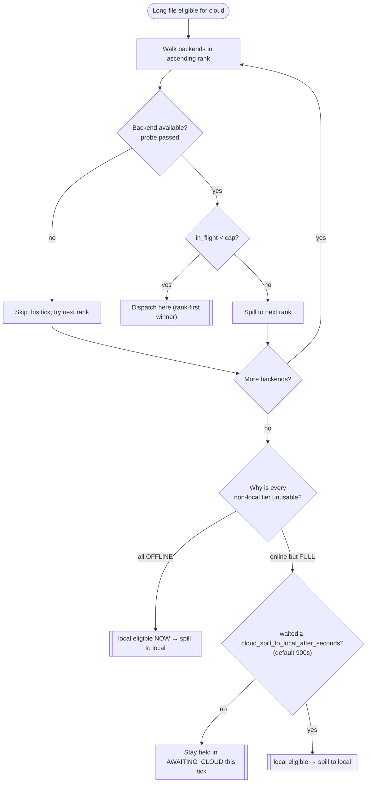

<!-- generated-by: gsd-doc-writer -->
# Operator Runbook — backend lanes, force-local revert & secrets

This is the day-to-day operator runbook for the multi-cloud backend registry (2026.7.1). It
covers the incident controls and read-outs an operator uses at the pipeline dashboard:

- **[Force-local incident revert](#force-local-incident-revert)** — the master toggle that pins
  all analysis to local, live, with no redeploy.
- **[Reading the N lanes](#reading-the-n-lanes)** — how to read the registry-derived lane grid on
  the Analyze workspace (rank order, in-flight/cap, offline, Kueue admission).
- **[Spillover behavior](#spillover-behavior)** — how the tiered scheduler drains long files across
  backends by rank and cap.
- **[Per-backend `_FILE` secrets](#per-backend-_file-secrets)** — where backend credentials live and
  the one rule: never print a secret value.

For the **config model** behind all of this — the `backends.toml` registry, the `[[backends]]` /
`[[buckets]]` schema, and the trivial `cloud_target`→`backends` mapping — see
[configuration.md → Backend registry](configuration.md#backend-registry-backendstoml) and
[configuration.md → Cloud target](configuration.md#cloud-target-removed-in-phase-67). For standing
up a cloud target, see [cloud-burst.md](cloud-burst.md) (OCI A1 compute agent) and
[k8s-burst.md](k8s-burst.md) (Kueue cluster). For adding a **2nd+ compute agent**, cost-tiered
across mixed arm64/x86 hosts, see [multi-compute.md](multi-compute.md).

## Force-local incident revert

When a cloud backend misbehaves (a Kueue cluster is wedged, a compute agent is unreachable, or a
staging bucket is throwing errors) and you want **all** analysis to run on the local file server
**right now**, use the **force-local master toggle** in the pipeline header. It is the incident
"pull everything back to local" switch — reversible, one click, and **no redeploy**.

**Where it is.** The pipeline header carries a single master pill:

| Pill state | Meaning |
|------------|---------|
| `CLOUD ROUTING` (neutral pill) | Normal operation — backends dispatch by rank across the registry (multi-backend routing active). |
| `FORCED LOCAL` (amber incident pill) | Engaged — all routing is pinned to local; no new cloud/Kueue dispatch happens. |

**Engaging it.** Click the pill to toggle `CLOUD ROUTING` → `FORCED LOCAL`. This writes a durable
`route_control` row (it survives a restart — the switch is state, not an env var) and takes effect
**live**, gating routing at two places at once:

- **The drain** — `stage_cloud_window` no-ops while forced, so no file is staged to S3 or pushed to
  a compute agent.
- **The duration router** — new long files (duration ≥ the route threshold) route to the **local**
  queue instead of being held for cloud.

```mermaid
stateDiagram-v2
    [*] --> CLOUD_ROUTING
    CLOUD_ROUTING: CLOUD ROUTING
    CLOUD_ROUTING: backends dispatch by rank (multi-backend)
    FORCED_LOCAL: FORCED LOCAL
    FORCED_LOCAL: durable route_control row · reversible · no redeploy
    CLOUD_ROUTING --> FORCED_LOCAL: click pill (engage)
    FORCED_LOCAL --> CLOUD_ROUTING: click pill (revert)

    state FORCED_LOCAL {
        [*] --> Gates
        Gates: Two gates fire at once
        Gates --> Drain: stage_cloud_window no-ops (no stage/push)
        Gates --> Router: duration router → local queue
        --
        Held: Files already held in AWAITING_CLOUD
        Held: stay held (drain no-ops — neither dispatched nor spilled)
    }
```

**Reverting it.** Click the pill again to toggle `FORCED LOCAL` → `CLOUD ROUTING`. You will see the
confirmation "Cloud routing restored — backends dispatch by rank." Normal rank-tiered dispatch
resumes on the next drain tick. Reverting is the **safe** direction — there is nothing destructive
about this toggle, so it is fine to flip it during an incident and flip it back once the backend
recovers.

> **Held-file note (read this before you engage it).** Engaging force-local does **not** yank work
> that is already in flight. Files **already held** in `AWAITING_CLOUD` when you engage force-local
> **stay held** — the drain no-ops, so it neither dispatches them nor spills them back to local. It
> is only **new** long files that route local while forced. Held files release and resume normal
> rank-tiered dispatch once you revert to `CLOUD ROUTING` (or, for a single file, once its backend
> comes back and the drain runs). If you need those held files analyzed **locally** during a long
> outage, that is a manual re-drive, not an automatic effect of the toggle.

This toggle replaces the old "set `PHAZE_CLOUD_TARGET=local` and restart the control plane" dance —
that flat selector was removed in Phase 67 (see
[configuration.md → Cloud target](configuration.md#cloud-target-removed-in-phase-67)).

## Reading the N lanes

The **Analyze workspace** renders one **lane card per registry backend** — a `local` lane plus one
card for each `compute` and `kueue` backend you declared in `backends.toml`. The grid is the primary
signal for "where is analysis running and is any backend in trouble."

**Rank order = dispatch preference.** Cards render **rank ascending, left-to-right / top-to-bottom**
— the **lowest rank is the most-preferred (cheapest) backend and is used first**, so the **top-left
lane is what gets used first**. The implicit `local` backend sorts last (rank 99). Reading the grid
left-to-right is therefore reading the scheduler's dispatch order.

**Each lane card shows:**

| Element | What it tells you |
|---------|-------------------|
| Title `{glyph} {KIND · ID}` + `RANK {n}` caption | Which backend this is and its cost-tier rank (dispatch preference). |
| Capacity numeral `{in_flight}/{cap}` | How many analyses this backend is running vs its concurrency cap. The capacity bar fills to `in_flight / cap`. |
| `available` sub-label | The lane is up and taking work (e.g. `short sets < 90 min` for local, `long sets ≥ 90 min` for a compute lane). |
| `offline` word (amber) + greyed glyph | The lane's availability probe failed **for this poll only** — it is isolated and never stalls the rest of the grid. |
| Kueue admission caption `{quota_wait} waiting · {inadmissible} inadmissible` | For `kueue` lanes only: how many workloads are waiting on quota vs how many are **Inadmissible**. |

**Quota-wait vs Inadmissible (the Kueue distinction that matters).** On a Kueue lane the caption
separates two very different conditions:

- **`{n} waiting`** — workloads are queued behind cluster **quota** and will admit when capacity
  frees up. This is **healthy back-pressure**; do nothing.
- **`{n} inadmissible`** — one or more workloads are **Inadmissible**: Kueue is refusing to admit
  them because of an **operator/cluster misconfiguration** (a missing or mis-sized LocalQueue /
  ClusterQueue). This segment turns **amber** and is word-labelled as an alert when it is > 0. An
  Inadmissible workload **waits indefinitely without consuming the re-drive budget** — so it will
  not fail on its own; you have to fix the cluster. See
  [k8s-burst.md → Cluster-admin runbook](k8s-burst.md#cluster-admin-runbook) for the LocalQueue /
  ClusterQueue objects to check, and the `localqueues: get` RBAC verb the startup probe needs.

Every lane state is shown with a **word and a glyph**, never color alone — an `offline` lane says
"offline", an Inadmissible count is labelled "inadmissible" — so the grid is readable without relying
on hue.

**If the whole grid is unavailable** you will see `Lane status unavailable` with the note that lane
status could not be read this cycle; it refreshes on the next update. A single failing backend
degrades to that **one** lane rendering `offline`, never a page error.

## Spillover behavior

The tiered scheduler drains long files across the registry **by rank, then spills on cap**:

1. For each long file eligible for cloud analysis, the scheduler considers backends in **ascending
   rank** — cheapest/most-preferred first.
2. A backend is **eligible** only if it is **available** (its probe passed) and its **in-flight count
   is below its `cap`**.
3. If the top-ranked backend is **at `cap`** (its lane shows `{cap}/{cap}`), the file **spills** to
   the next eligible backend down the rank order. If an entire tier is full or offline, work
   continues spilling to the next tier — and ultimately the `local` backend (rank 99) can be the
   final catch.
4. A backend that goes **offline** is simply skipped for that drain tick; its would-be work spills to
   the next eligible lane, and it re-enters the rotation automatically when its probe recovers.

**The full→local spill is staleness-gated; the offline→local spill is not.** The final catch to
`local` is **not** unconditional — the two ways a tier can be unusable are treated differently
(`services/backend_selection.py`):

- **Every non-local backend is `offline`** (probe failed) → `local` becomes eligible **immediately**;
  the file spills to local on that same drain tick.
- **Higher-rank backends are online but `FULL`** (`in_flight` at `cap`) → `local` is eligible **only
  after** the file has waited in `AWAITING_CLOUD` past `cloud_spill_to_local_after_seconds`
  (`PHAZE_CLOUD_SPILL_TO_LOCAL_AFTER_SECONDS`, default **900 s / 15 min**). Until that threshold the
  file **stays held** rather than spilling to slow local — this absorbs a transient full window so
  short cap spikes do not dump long sets onto the local file server. Once the wait elapses (or the
  file exhausts its cloud attempt budget), local becomes eligible and it spills.

Reading this off the grid: when you see the top-left lane sitting at `{cap}/{cap}` and the next lane
picking up new in-flight work, that is spillover working as designed — not a fault. If **every** cloud
tier is at cap and files are **not** yet spilling to `local`, that is the staleness gate holding them
for the 15-minute window, not a stall. Persistent spillover all the way to `local` for **long** files
usually means every cloud tier is either offline or has been at cap past the threshold; check the
offline lanes and any Inadmissible Kueue caption.



While **force-local** is engaged, none of this runs — the drain no-ops and new long files route
straight to local (see [Force-local incident revert](#force-local-incident-revert)).

## Per-backend `_FILE` secrets

Backend credentials follow the same **`_FILE` secret convention** used elsewhere in Phaze — the
secret value lives in a file (a Docker/Swarm secret, a Kubernetes secret mount, or a SOPS-decrypted
file), and the config points at the **path**, never the value.

- **Per-backend secrets live inline in `backends.toml`.** Each `kueue` backend's kubeconfig / SA
  token and each staging bucket's S3 access-key / secret-key are inline **`*_file` pointers** inside
  the registry (e.g. a bucket's `access_key_id_file` / `secret_access_key_file`, a Kueue backend's
  `kubeconfig_file` / `sa_token_file`). They are resolved by the shared secret-file helper and are
  **control-plane only** — they are never sent to the file-server agent or the Kueue pod.
- **Control-plane env secrets** (the LLM API keys and the `database_url` / `redis_url` / `queue_url`
  DSNs) still use the env `<VAR>_FILE` form (e.g. `ANTHROPIC_API_KEY_FILE`,
  `PHAZE_QUEUE_URL_FILE`).

For the exact field list, the `_FILE` resolution semantics (precedence, newline-stripping, fail-fast
on a missing file), and which fields are secret-bearing, see
[configuration.md → Secrets via files](configuration.md#secrets-via-files-_file-convention) and
[configuration.md → Backend registry](configuration.md#backend-registry-backendstoml). This runbook
does **not** restate the field table.

> **The one rule: never print a secret value.** When capturing logs, filing an incident note, or
> pasting a config into a ticket, reference a credential **by its field/pointer name only** (e.g.
> "`secret_access_key_file` for bucket `staging-a`") — never the token, key, or DSN value itself.
> Phaze masks `SecretStr` fields in logs and reprs and logs the resolved registry as a secret-free
> `{id, kind, rank, cap}` projection at boot; keep that discipline in everything you write down.

## See also

- [configuration.md → Backend registry](configuration.md#backend-registry-backendstoml) — the
  `backends.toml` schema (`[[backends]]` / `[[buckets]]`, ranks, caps, inline `*_file` secrets).
- [configuration.md → Cloud target](configuration.md#cloud-target-removed-in-phase-67) — the removed
  `cloud_target` selector and the 1:1 `cloud_target`→`backends` equivalence.
- [cloud-burst.md](cloud-burst.md) — provisioning an OCI A1 `compute` backend.
- [k8s-burst.md](k8s-burst.md) — provisioning a `kueue` backend + its cluster-admin objects.
