# phaze.agent_watcher

## Purpose

Always-on file watcher for the file-server agent role. Observes the agent's configured `scan_roots` with watchdog, debounces events by mtime-stability (default 10s settle period), and POSTs each settled file to the application server via the existing `/api/internal/agent/files` endpoint. Bound to the agent's sentinel LIVE `ScanBatch` (one per agent, seeded at registration time). NOT a SAQ worker -- entry point is `asyncio.run(main())`.

## Entry point

```
uv run python -m phaze.agent_watcher
```

The Dockerfile's same image runs both the SAQ agent worker (`uv run saq phaze.tasks.agent_worker.settings`) and the watcher; the compose service distinguishes by `command:`.

## Event pipeline

```mermaid
flowchart LR
    fs[("scan_roots<br/>(filesystem)")]
    obs["watchdog Observer<br/>/ PollingObserver"]
    handler["WatcherEventHandler<br/>(observer.py)"]
    deb["Debouncer.touch<br/>(debouncer.py)"]
    sweep["_sweep_loop<br/>(__main__.py)"]
    poster["Poster.post_one<br/>(poster.py)"]
    api["POST /api/internal/agent/files<br/>(application server)"]

    fs -- "fs events" --> obs
    obs -- "on_created / on_modified" --> handler
    handler -- "touch(path)" --> deb
    sweep -- "poll every<br/>sweep_interval_seconds" --> deb
    deb -- "mtime settled<br/>(settle_period)" --> sweep
    sweep -- "settled path" --> poster
    poster -- "HTTP POST" --> api
```



## Fresh Install Quickstart

The watcher requires a registered agent in the `agents` table. On a brand-new docker compose stack (empty database), use the dev-seeded agent path to get up and running:

1. `cp .env.example .env`
2. Open `.env`. The default DATABASE_URL and REDIS_URL use the docker-service hostnames (`postgres`, `redis`) — leave them as-is when running via `docker compose up`. If you instead run any service via `uv run` on the host, switch the hostnames to `localhost`.
3. Enable dev-agent seeding and pick a fixed token so you can paste it into the watcher config in one shot:
   ```
   PHAZE_DEV_SEED_AGENT=true
   PHAZE_DEV_AGENT_TOKEN=phaze_agent_<32 urlsafe-base64 bytes>
   ```
   If you leave `PHAZE_DEV_AGENT_TOKEN` empty, the api will generate a random one and log it at INFO — you can grab it from `docker compose logs api`.
4. Set the watcher's auth + scan roots in the same `.env`:
   ```
   PHAZE_AGENT_API_URL=http://api:8000
   PHAZE_AGENT_TOKEN=phaze_agent_<same token you set above>
   PHAZE_AGENT_SCAN_ROOTS=/data/music
   ```
5. Bring up the data plane:
   ```
   docker compose up -d postgres redis
   ```
6. Bring up the api + worker. The api lifespan runs `alembic upgrade head` and seeds the dev agent automatically:
   ```
   docker compose up -d api worker
   docker compose logs api  # look for: "seeded dev agent id=dev-agent ..."
   ```
7. Bring up the watcher (image is the same as `worker`, but the command is `python -m phaze.agent_watcher`):
   ```
   docker compose up -d watcher
   ```
8. Drop an MP3 into the scan path (mounted to `/data/music` inside the watcher container). After the 10s settle window, the watcher posts the file to the api:
   ```
   docker logs watcher --tail=20  # look for: POST /api/internal/agent/files -> 200
   ```
9. (Production checklist) Once the dev path is working, flip `PHAZE_DEV_SEED_AGENT=false`, provision real agents via the management CLI, and rotate `PHAZE_AGENT_TOKEN`.

## Required env vars

- `PHAZE_ROLE=agent` -- selects the agent settings module via `get_settings()`
- `PHAZE_AGENT_API_URL` -- base URL of the application server (e.g., `http://api:8000`)
- `PHAZE_AGENT_TOKEN` -- bearer token issued by the operator at agent registration (format: `phaze_agent_<32 urlsafe-base64>`)
- `PHAZE_AGENT_SCAN_ROOTS` -- comma-separated list of absolute paths to watch (read from `/whoami` if omitted, but recommended to set explicitly)

## Optional tunable env vars

- `PHAZE_WATCHER_SETTLE_SECONDS=10` -- seconds of mtime stability before posting (D-01)
- `PHAZE_WATCHER_MAX_PENDING_SECONDS=3600` -- stuck-file cap; entries older than this are evicted without posting (D-02)
- `PHAZE_WATCHER_SWEEP_INTERVAL_SECONDS=2` -- sweep task cadence
- `PHAZE_WATCHER_POLLING_MODE=false` -- when `true`, use watchdog's `PollingObserver` instead of the native inotify `Observer`. Required for macOS docker bind mounts (rancher-desktop / Docker Desktop) where inotify events do not propagate through 9p/virtiofs. Adds modest CPU overhead (polls each `watcher_sweep_interval_seconds`) but works on any filesystem.
- `PHAZE_SCAN_CHUNK_SIZE=500` -- used by `scan_directory` task (not the watcher itself, but shared AgentSettings field)
- `PHAZE_LOG_LEVEL=INFO` -- root log level (`DEBUG`|`INFO`|`WARNING`|`ERROR`); set `DEBUG` to see each settled-file post in detail
- `PHAZE_LOG_JSON` -- `true`=JSON, `false`=console, unset=auto (JSON when stdout is not a TTY)

## Logging

The watcher now logs through the central structlog pipeline
(`phaze.logging_config.configure_logging`), which replaces the old ad-hoc stdout
`StreamHandler`. It is configured **first** in `main()` — bare/env-driven, before
`get_settings()` — so even a misconfiguration `ValidationError` (e.g. a missing
`PHAZE_AGENT_*` var) is reported through the pipeline and reaches `docker logs watcher`.
Output respects `PHAZE_LOG_LEVEL` / `PHAZE_LOG_JSON` (above): JSON when stdout is not a TTY
(the container default), console otherwise. See
[docs/configuration.md → Logging / observability](../../../docs/configuration.md#logging--observability-all-roles).

## Import-boundary invariant

This module MUST NOT import `phaze.database`, `phaze.tasks.session`, `sqlalchemy.ext.asyncio`, or `phaze.tasks.agent_worker`. Enforced by `tests/test_task_split.py::test_agent_watcher_does_not_import_phaze_database`. The watcher reaches the database only via the HTTP boundary (DIST-04).

## Compose layout (post-Phase-29)

Phase 27 originally landed the watcher in the root `docker-compose.yml` alongside `worker`, `audfprint`, and `panako`. Phase 29 moved all four to `docker-compose.agent.yml` and stripped them from the root compose (which is now application-server-only). The watcher module itself did not change.

## Operational notes

- Container restart count climbing in `docker compose ps`: usually transient API boot (~63s budget absorbed by `whoami_with_retry`). If persistent, check `docker compose logs watcher` for `AgentApiAuthError` (RESEARCH Pitfall 7 -- bad PHAZE_AGENT_TOKEN).
- Inotify fallback for NFS/FUSE (or macOS docker bind mounts): set `PHAZE_WATCHER_POLLING_MODE=true`. `main()` branches on `cfg.watcher_polling_mode` to construct a `PollingObserver(timeout=watcher_sweep_interval_seconds)` instead of the native `Observer()`. No code edit required — it is a runtime env toggle.
- Catch-up on startup is intentionally NOT performed (D-04). Operator runs a manual `/pipeline/` scan trigger after a watcher restart if they want to backfill files that landed during downtime.
